# LVIS Architecture Document v0.4.1 (Current)

> **Version**: 0.4.1 (base) · v5 덧붙이기 (2026-04-19) — Appendix D-v5 참조
> **Date**: 2026-04-16 (base) · 2026-04-19 (v5 additive)
> **Status**: Architecture Currentized Draft (대화 루프/도구 표시/자동 컴팩트 구현 기준 반영) · v5 = Marketplace 승인/카나리, Approval 강화, Telemetry, Contract CI, Trace Logger, File Lock, Tool Versioning 반영
> **Authors**: LVIS Architecture Team
> **Base Reference**: [구현 철학](../vision/philosophy.md) · [claw-code harness](https://github.com/ultraworkers/claw-code)

---

## Table of Contents

1. [Design Philosophy — 철학에서 구조로](#1-design-philosophy--철학에서-구조로)
2. [High-Level Design (HLD)](#2-high-level-design-hld)
   - 2.1 System Overview · 2.2 Five Pillars
3. [System Layer Map — 5-Layer Architecture](#3-system-layer-map--5-layer-architecture)
4. [Low-Level Design (LLD)](#4-low-level-design-lld)
   - 4.1 Client Architecture · 4.2 Boot Sequence · 4.3 Input Classification & Routing · **4.4 Local Index Engine** · **4.5 Conversation Query Loop** · **4.5.10 Tool Call Presentation** · **4.6 Source Tree Layout**
5. [Memory — 경량 기억 구조](#5-memory--경량-기억-구조)
   - 5.1 설계 원칙 · 5.2 Memory 파일 구조
6. [Client Core Engines](#6-client-core-engines)
   - 6.1 Keyword Detecting Engine · 6.2 Agent Route Engine · **6.3 Tool Permission Model** · **6.4 Tool Registry & Taxonomy** · **6.5 Command Safety**
7. [Proactive Engine — Daily Briefing (Core)](#7-proactive-engine--daily-briefing-core)
8. [Agent Approval System — 에이전트 요청 승인](#8-agent-approval-system--에이전트-요청-승인)
9. [Plugin System & UI Extension](#9-plugin-system--ui-extension)
   - 9.1 Plugin Architecture · 9.2 Manifest · 9.3 UI Slot · 9.4 Scenario · **9.5 MCP Protocol Architecture** · **9.6 Deployment Model**
10. [Agent Hub — 사원 레플리카 메시지 보드](#10-agent-hub--사원-레플리카-메시지-보드)
11. [Marketplace Hub — 사업부 플러그인 생태계](#11-marketplace-hub--사업부-플러그인-생태계)
12. [Use Case → Architecture Mapping](#12-use-case--architecture-mapping)
13. [Data Flow](#13-data-flow)
    - 13.1 End-to-End · 13.2 Local + Server Indexing · **13.3 Audit Data Flow**
14. [Deployment & Governance](#14-deployment--governance)
    - 14.1 Deployment Topology · 14.2 Governance Layer · 14.3 Technology Stack · **14.4 Feature Flag & Gradual Rollout**
15. [Appendix](#appendix)

---

## 1. Design Philosophy — 철학에서 구조로

> _"직원은 판단과 소통에 집중하고, 절차·탐색·정리는 Lvis·LGenie가 맡는 회사."_
> — philosophy.md 비전 문장

LVIS의 모든 설계 결정은 아래 네 가지 철학 원칙에서 출발한다. 각 원칙이 아키텍처의 어떤 구조로 구현되는지를 함께 표기한다.

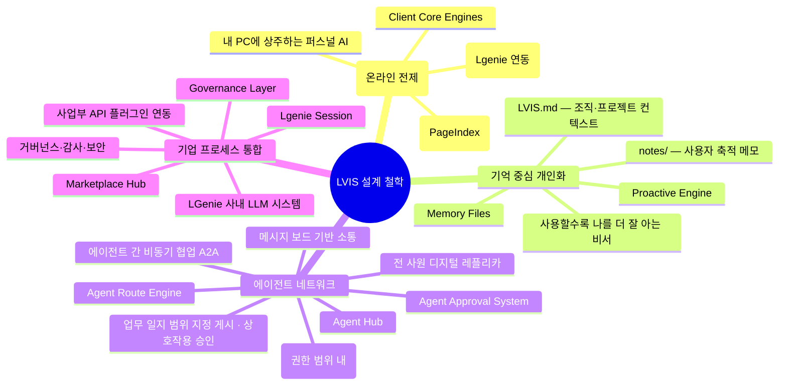

| 철학 원칙              | 아키텍처 구현체                                    | 철학이 구조가 되는 이유                                                      |
| ---------------------- | -------------------------------------------------- | ---------------------------------------------------------------------------- |
| **설치형·로컬 기반**   | Client Core Engines + Local Index                  | J.A.R.V.I.S.처럼 내 PC에 상주. 선배 5명에게 물어보던 것을 로컬에서 즉시 검색 |
| **기억 중심 개인화**   | Memory Files (LVIS.md + notes/) + Proactive Engine | 출근하면 "오늘 뭐부터?" 대신 AI가 먼저 브리핑. 메모가 쌓일수록 맞춤도 ↑      |
| **에이전트 네트워크**  | Agent Hub (Message Board) + A2A                    | "이영희님 이거 확인해주세요" → 본인 부재 중에도 레플리카가 대응              |
| **기업 프로세스 통합** | Lgenie + Marketplace + Governance                  | 50~60장 문서 대신 "필수 조항·승인 단계"만 추출. 회사 허용 경로만 사용        |

---

## 2. High-Level Design (HLD)

### 2.1 System Overview — 전체 조감도

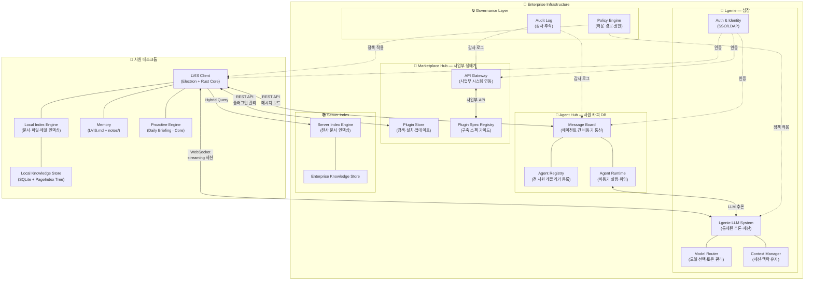

### 2.2 Five Pillars

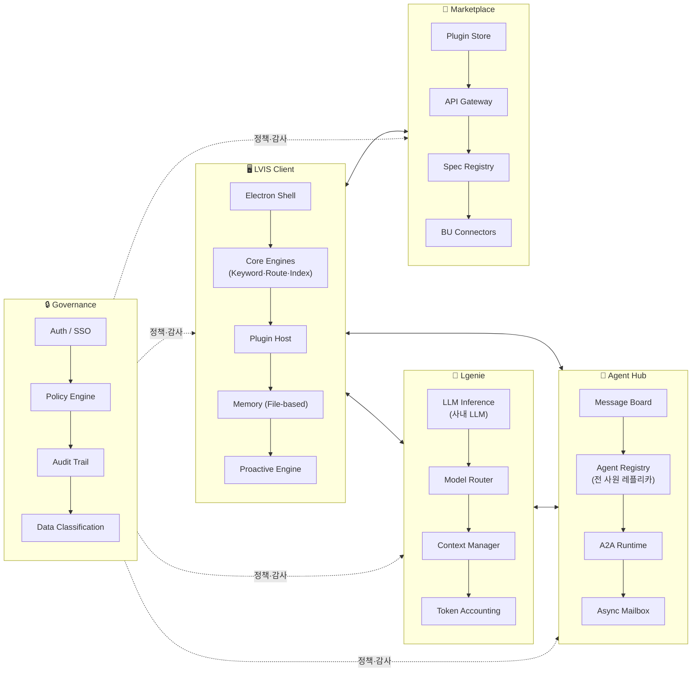

---

## 3. System Layer Map — 5-Layer Architecture

philosophy.md에서 제안한 4개 층(사용자·단말 / 실행·추론 / 연동 / 거버넌스)을 기반으로, 클라이언트 인텔리전스 레이어를 분리하여 5개 레이어로 구성한다.

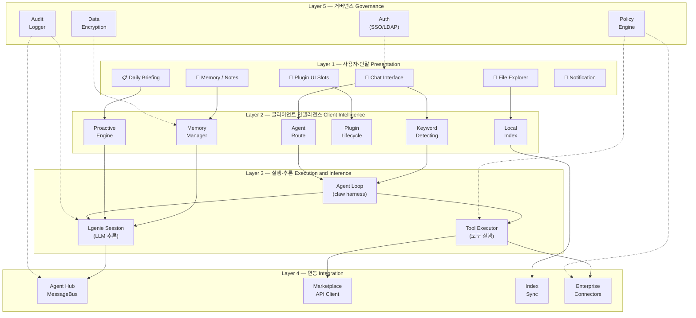

### Layer 역할 요약

| Layer  | 이름                  | philosophy.md 대응 | 핵심 역할                                                                     |
| ------ | --------------------- | ------------------ | ----------------------------------------------------------------------------- |
| **L1** | 사용자·단말           | 사용자·단말 층     | Electron UI + Plugin Slots. 사용자가 보고 만지는 모든 것                      |
| **L2** | 클라이언트 인텔리전스 | 사용자·단말 내부   | 로컬에서 돌아가는 지능. 키워드 감지, 에이전트 라우팅, 인덱싱, 기억, Proactive |
| **L3** | 실행·추론             | 실행·추론 층       | **Lgenie(사내 LLM)** 세션 + claw harness 기반 Agent Loop + Tool 실행          |
| **L4** | 연동                  | 연동 층            | Agent Hub, Marketplace, 서버 인덱스, 사내 시스템 커넥터                       |
| **L5** | 거버넌스              | 거버넌스 층        | 인증, 정책, 감사, 암호화. 회사가 허용한 경로만 사용                           |

---

## 4. Low-Level Design (LLD)

### 4.1 Client Architecture (Electron + Rust Native)

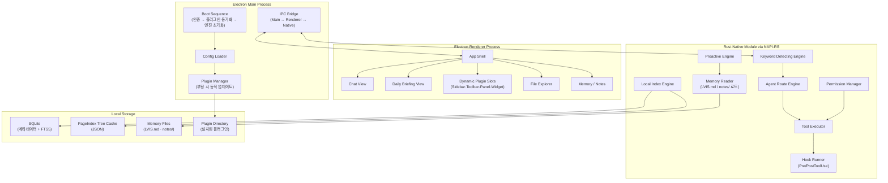

### 4.2 Boot Sequence — 부팅 시 동적 업데이트

> **Phase 1 갱신 (2026-04-13)**: Step 0 (Python Runtime Bootstrap) 추가. `SettingsService` 초기화 이전 맨 첫 단계로 실행된다.
> **Wave B/C 갱신 (2026-04-19)**: 세부 로직은 `src/boot/*.ts` 모듈로 분리 완료 (`services.ts`, `plugins.ts`, `proactive.ts`, `conversation.ts`, `tools.ts`, `types.ts`). Step 7은 `createProactiveTriggerCoordinator()` — **5개 신호** (idle / schedule / meeting / task-deadline / **post-turn**) 를 평가하는 coordinator를 구성한다 (`src/boot/proactive.ts`). PostTurnHookChain은 **6단계** (compact → saveSession → extractMemory → auditLog → idle-poke → **proactive-notify**) 를 순차 실행한다 (`src/hooks/post-turn-hook-chain.ts`).

**부팅 소요 시간 (Phase 1 실측 추정):**

| 시나리오 | 소요 시간 | 비고 |
| --- | --- | --- |
| 첫 부팅 (cold) | ~40-50초 | `uv` Python 3.12 설치 + venv 생성 + deps 설치 |
| 두 번째 이후 부팅 (warm) | <1.5초 | `.ready` sentinel 통과 → 즉시 skip |

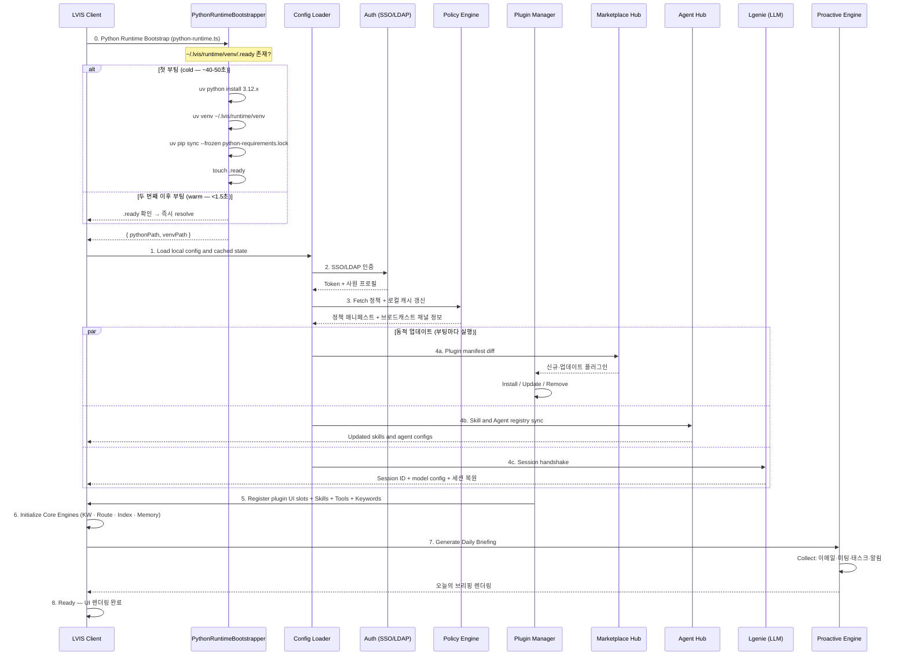

### 4.3 Input Classification & Routing — 대화 루프 진입 전 단계

이 섹션은 **사용자 입력을 어떤 실행 경로로 보낼지**를 다룬다. Keyword Detecting은 대화가 루프 본문에 들어가기 전에 수행되는 가장 빠른 사전 판단 단계이며, 빌트인 규칙과 플러그인 키워드 그룹을 함께 본다. 실제 턴 내부의 reasoning → tool → assistant 핑퐁은 **§4.5 Conversation Query Loop**를 단일 canonical 경로로 삼는다.

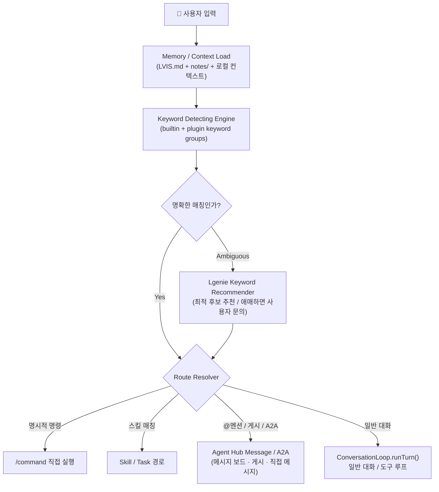

| 분류 결과 | 진입 지점 | 설명 |
| --- | --- | --- |
| **명령 실행** | Command executor | `/new`, `/compact`, `/load` 같은 즉시 명령 |
| **스킬/태스크** | Skill / orchestrator | 플러그인 키워드 그룹과 워크플로우를 기준으로 실행 경로 선택 |
| **에이전트 상호작용** | Agent Hub message board / A2A | 다른 에이전트에게 메시지·게시물·요청을 전달하는 경로. 백그라운드 자율 수행 서버를 뜻하지 않음 |
| **일반 대화** | `ConversationLoop.runTurn()` | 본 문서의 상세 턴 사이클은 §4.5에 정의 |

**설계 메모**

- 플러그인은 설치/활성화 시 **키워드 그룹**을 동적으로 등록한다.
- 동일 입력이 여러 그룹에 걸리면 Lgenie가 가장 적합한 후보를 추천하고, 확신이 낮으면 사용자에게 확인을 요청한다.
- Agent Hub는 paperclip의 board와 유사한 **비동기 메시지 보드**이며, 에이전트가 백그라운드에서 자율 실행되는 서버를 의미하지 않는다.

### 4.4 Local Index Engine — 로컬 검색 엔진 LLD

로컬 PC의 데이터를 최대한 활용하는 핵심 엔진. Lgenie와 상시 연동하여 LLM 추론 기반 인덱싱·검색을 수행한다.

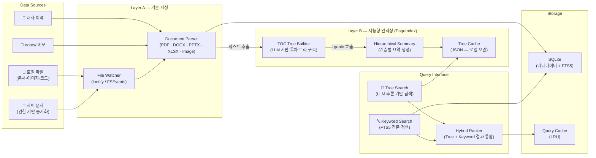

**2계층 인덱싱 아키텍처:**

```
Layer A — 기본 파싱 (텍스트 추출)
  File Watcher → Document Parser → 원문 텍스트 + 메타데이터

Layer B — 지능형 인덱싱 (PageIndex)
  원문 텍스트 → LLM 기반 목차 트리 구축 → 계층적 요약 → 추론 기반 검색
```

> [PageIndex](https://github.com/ken-jo/PageIndex.git)는 전통적 벡터 임베딩 대신 **LLM 추론 기반 트리 검색**을 채택한 인덱싱 엔진이다. 문서를 목차(TOC) 트리로 구조화한 뒤, 에이전트가 트리를 탐색하며 관련 페이지를 추론으로 찾는다. 벡터 유사도가 놓치는 문맥적 관련성을 잡아낼 수 있어 장문 문서(규정집, 보고서 등)에 강점이 있다.

| 구성 요소 | 기술 (Phase 1) | 설명 |
|-----------|------|------|
| **File Watcher** | chokidar (FSEvents / inotify / ReadDirectoryChanges) | 파일 변경 실시간 감지 → FolderAutoIndexer → IdleScheduler P0 enqueue |
| **Document Parser** | PDF: `pymupdf4llm` · DOCX/PPTX/XLSX/HTML: Microsoft `markitdown` · TXT/MD: 직접 읽기 | 포맷별 텍스트 추출 + 마크다운 변환. `kiwipiepy` 기반 한국어 형태소 토큰화 보강 |
| **PageIndex 트리 인덱서** | `pageindex==0.2.8` | TOC 트리 구조화. `search()` 메서드가 없으므로 LVIS가 `document_structure` / `document_page_content` 도구로 agentic 트리 탐색 수행 |
| **SQLite + FTS5** | SQLite FTS5 `unicode61` + `kiwipiepy` 사전 토큰화 (`content_ko`) | 한국어 BM25 (패턴 B): 형태소 추출 → 공백 결합 → FTS5 MATCH |
| **Vector Store** | OpenAI `text-embedding-3-small` (1536 dim) + `lancedb` 로컬 ANN | 100 chunks / batch, 400 RPM throttle, 지수 백오프 |
| **Hybrid Ranker** | `HybridRetriever` (TypeScript) — RRF `k=60`, `{bm25:0.5, vec:0.5, cloud:0.0}` | BM25 + vector + cloud adapter 결과를 가중 융합 |
| **Cloud Adapter** | `MockCloudIndexAdapter` | Phase 1은 빈 결과 반환, Phase 2에서 사내 Elasticsearch + Milvus/Qdrant 실연결 |
| **Query Cache** | LRU Cache (in-memory, structure/content) | 재인덱싱 시 자동 무효화 |

**PageIndex 활용 시 고려사항 (Phase 1):**

| 항목 | Phase 1 현황 | 대응 방안 |
|------|------|-----------|
| 지원 포맷 | PDF · DOCX · PPTX · XLSX · HTML · MD · TXT | `pymupdf4llm`(PDF) + `markitdown`(Office / HTML) + 직접 읽기(텍스트). PPTX / XLSX 이미지 OCR은 Phase 2 Vision |
| LLM 의존성 | 임베딩은 OpenAI `text-embedding-3-small` 사용 | Phase 1은 OpenAI API key 필요. Phase 2는 BAAI / bge-m3 또는 LGenie 후속 경로 검토 |
| 온라인 전제 | 인덱싱 시 임베딩 API 호출 필요 | Phase 1은 외부 임베딩 경로, Phase 2는 로컬 / 사내 임베딩으로 오프라인화 목표 |
| Python 런타임 | `uv` + venv 자동 셋업 (Step 0) | 첫 부팅 ~40-50초, 이후 <1.5초. 사용자 PC에 Python 수동 설치 불필요 |

#### 4.4.1 Phase 1 Production Upgrade — 완료 (2026-04-13)

Phase 1에서 §4.4 Layer A·B 명세를 production 수준으로 끌어올리는 구현이 완료되었다. 핵심 보강은 아래와 같다.

| 항목 | Phase 1 변경 |
| --- | --- |
| **Python 런타임 자동 셋업** | `uv` standalone binary 번들 후 첫 부팅에 `uv python install 3.12` + `uv venv` + `uv pip sync --frozen` 수행. 이후 warm boot는 `.ready` sentinel로 즉시 skip |
| **Layer A 파서** | PDF는 `pymupdf4llm`, DOCX / PPTX / XLSX / HTML은 Microsoft `markitdown` 단일 API 사용 |
| **PageIndex 통합** | `pageindex==0.2.8`은 검색 메서드가 없으므로 LVIS가 function calling으로 `document_structure` + `document_page_content`를 도구 노출해 agentic 탐색을 직접 구현 |
| **한국어 BM25** | `kiwipiepy 0.23.1` 형태소 추출 → `content_ko` 컬럼 → SQLite FTS5 `unicode61` 패턴으로 한국어 recall 보강 |
| **벡터 검색** | OpenAI `text-embedding-3-small` → `lancedb` 로컬 ANN. 100 chunks / request, 400 RPM throttle, 지수 백오프 |
| **Hybrid Ranker** | `lvis-app/src/main/hybrid-retriever.ts`가 worker BM25 / vector / cloud adapter 결과를 RRF(k=60)로 결합 |
| **Idle-aware 인덱싱** | `lvis-app/src/main/idle-scheduler.ts` 5-state 머신으로 유휴 시점에 우선순위 큐 처리 |
| **Cloud 어댑터** | `lvis-app/src/main/cloud-index-adapter.ts`는 Phase 1에서 mock 인터페이스만 제공 |
| **검색 도구** | builtin tool 4종 — `knowledge_search`, `document_list`, `document_structure`, `document_page_content` |
| **거버넌스 보강** | `lvis-app/src/tools/executor.ts` Step 2.5 Bash AST pre-validator, `lvis-app/src/main/audit-service.ts`, `lvis-app/src/hooks/post-turn-hook-chain.ts` 연계 |
| **Out-of-Scope** | LightRAG knowledge graph, 로컬 임베딩, LGenie 기반 인덱싱, 사내 cloud index 실연결, PPTX / XLSX OCR은 후속 단계 |

**Phase 1 완료 메트릭 (lvis-app 기준):**

| 지표 | 결과 |
| --- | --- |
| 신규 파일 | 25개 (TS 14 + Python 7 + 기타 4) |
| 변경 파일 | 11개 |
| TypeScript TSC | 0 errors |
| 회귀 테스트 | 86 / 86 PASS |
| 한국어 BM25 recall | 8 / 8 hit |

#### 4.4.2 Korean BM25 — 패턴 B (`kiwipiepy` + FTS5 `unicode61`)

한국어 형태소 분석을 FTS5에 연결하는 우회 패턴이다. FTS5 `unicode61` 단독은 한국어 recall이 급격히 낮아질 수 있으므로, 색인과 검색 양쪽에 동일한 형태소 파이프라인을 적용한다.

```
인덱싱:
  원문 텍스트
    → kiwipiepy.tokenize() — 형태소 + POS 필터 (N, V, MA, SL)
    → 공백 결합 → content_ko 컬럼에 저장
    → FTS5 unicode61 인덱스 (content_ko)

검색:
  쿼리 문자열
    → kiwipiepy.tokenize() — 동일 파이프라인
    → FTS5 MATCH 'tok1 tok2 ...'
    → BM25(FTS5) score 반환
```

**검증 결과 (R4):**

| 쿼리 | 기대 | 결과 |
| --- | --- | --- |
| `regulation` | hit | PASS |
| `규정` | hit | PASS |
| `규정집` | hit | PASS |
| `규정은` | hit | PASS |
| `규정한다` | hit | PASS |
| `support` | hit | PASS |
| `지원` | hit | PASS |
| `품의` | hit | PASS |

구현 위치: `lvis-plugin-pageindex/worker/korean_tokenizer.py`

#### 4.4.3 HybridRetriever — RRF `k=60`

TypeScript 구현은 `lvis-app/src/main/hybrid-retriever.ts`에 있다. Python worker의 `/search/bm25`, `/search/vector`와 `MockCloudIndexAdapter` 결과를 Reciprocal Rank Fusion으로 통합한다.

**RRF 공식:**

```
score(d) = Σ_r weight_r × (1 / (k + rank_r + 1))
```

- `k = 60` — 순위 격차 완화 상수
- `rank_r` — 0-based rank (최상위 = 0)
- `+1` — 0-based rank 보정

**Phase 1 가중치:**

| Retriever | Weight | 비고 |
| --- | --- | --- |
| BM25 (FTS5) | 0.5 | Python worker `/search/bm25` |
| Vector (`lancedb`) | 0.5 | Python worker `/search/vector` |
| Cloud (Mock) | 0.0 | Phase 2에서 실연결 시 `{bm25:0.35, vec:0.35, cloud:0.3}` 재정규화 |

Phase 1.5에서 LightRAG를 도입하면 `{bm25:0.35, vec:0.35, lightrag:0.3}` 재조정 가능하다.

#### 4.4.4 IdleScheduler — 5-state 머신

`lvis-app/src/main/idle-scheduler.ts`는 사용자 PC 유휴 상태를 감지해 백그라운드 인덱싱을 스케줄링한다. Electron `powerMonitor` 추상화를 사용해 테스트 환경에서도 동일하게 검증 가능하다.

```
RUNNING ──── idle≥60s + CPU<40% + battery>50% OR AC ──→ IDLE_SCAN
IDLE_SCAN ─── keystroke ──→ THROTTLED (500ms 이내 반응)
IDLE_SCAN ─── suspend/thermal-critical ──→ PAUSED
THROTTLED ─── 2000ms cooldown ──→ RUNNING
PAUSED ──── resume ──→ RESUME_DELAY (90초 대기)
RESUME_DELAY ──── 90s elapsed ──→ RUNNING
```

**IDLE_SCAN 진입 조건 (모두 충족):**

| 조건 | 값 |
| --- | --- |
| 시스템 유휴 시간 | ≥ 60초 |
| CPU 5분 EMA | < 40% |
| 마지막 대화 경과 | ≥ 30초 |
| 전원 | AC 연결 OR 배터리 > 50% |

**우선순위 큐:**

| Priority | 용도 | 처리 모드 |
| --- | --- | --- |
| P0 | 방금 열린 파일 | real-time |
| P1 | 최근 7일 접근 | real-time |
| P2 | 중요 태그 / 변경 감지 | 기본 |
| P3 | 배경 변경 감지 | 배경 |
| P4 | orphan cleanup | batch |

#### 4.4.5 LLM Agentic 검색 — function calling (depth ≤ 3)

`pageindex==0.2.8`에 `search()` 메서드가 없으므로 LVIS는 4개 builtin 도구를 노출해 LLM이 트리를 직접 탐색하도록 한다. 현재 구현 도구 정의는 `lvis-app/src/tools/knowledge-search.ts`, depth cap enforcement는 `lvis-app/src/engine/conversation-loop.ts`에 있다.

| Tool | 동작 |
| --- | --- |
| `knowledge_search(query, topK?)` | `HybridRetriever` 호출 → RRF top 결과 반환 |
| `document_list()` | 인덱싱된 문서 목록 (`docId`, `docName`, `type`, `pageCount`) |
| `document_structure(docId)` | PageIndex TOC 트리 (agentic 탐색용) |
| `document_page_content(docId, pages)` | 특정 페이지 범위 본문 (`5`, `5-7`, `1,3,5-7`) |

`KNOWLEDGE_DEPTH_CAP = 3` 규칙으로 한 턴 내 `knowledge_search` 도구 호출 횟수를 제한해 agentic 루프의 토큰 폭주를 방지한다.

#### 4.4.6 CloudIndexAdapter — Mock 인터페이스 (Phase 1)

`lvis-app/src/main/cloud-index-adapter.ts`는 Phase 1에서 항상 빈 결과를 반환하는 mock 구현만 제공한다. 따라서 HybridRetriever의 cloud weight는 `0.0`이며 현재 결과 순위에는 영향을 주지 않는다.

**Phase 2 마이그레이션 경로:**

1. `CloudIndexAdapter` 인터페이스를 구현하는 실제 클라이언트 작성
2. 사내 Elasticsearch (BM25) + Milvus / Qdrant (벡터) 연결
3. weights를 `{bm25:0.35, vec:0.35, cloud:0.3}`으로 재정규화
4. `settings.indexing.cloudEnabled` feature flag로 제어

---

### 4.5 Conversation Query Loop — 대화 처리 핵심 사이클

> **Reference**: [Claude Code Query Loop](https://ccleaks.com/architecture) §03 "The Core Cycle" 패턴을 LVIS 환경에 맞게 재설계.
> §4.3 Input Classification & Routing이 **입력 분류·라우팅** 구조라면, 이 섹션은 **한 턴(turn)이 내부에서 어떻게 실행되는지** — 메시지 생성부터 스트리밍 렌더링, 도구 실행, 컨텍스트 관리까지 — 상세 사이클을 기술한다.

#### 4.5.1 Core Cycle 개요

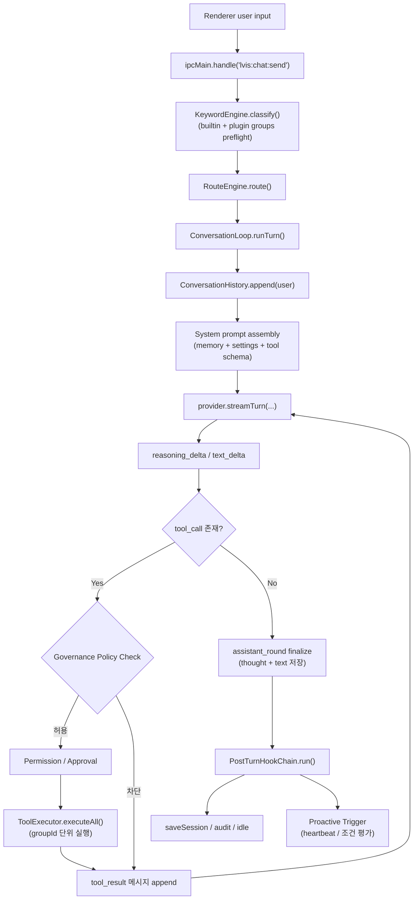

> **문서 원칙**: 이 섹션은 `ConversationLoop`의 현재 구현을 기준으로 설명하되, 아직 미구현인 목표 설계(Keyword disambiguation, Governance sync, Proactive heartbeat, richer session history)도 함께 유지한다.
> `GovernancePolicy`는 도구 호출이 생길 때마다 **루프 내부에서 반드시 통과하는 필수 게이트**이며, 바깥에서 한 번만 거르는 보조 체크가 아니다.

#### 4.5.2 메시지 라이프사이클 — 한 턴의 상세 단계

| 단계 | 함수 / 컴포넌트 | 설명 | 비고 |
| --- | --- | --- | --- |
| **1. 요청 진입** | `window.lvis.chat.send()` → `ipcMain.handle("lvis:chat:send")` | renderer 입력을 main process로 전달 | 채팅 UI의 단일 진입점 |
| **2. 조기 키워드 감지** | `KeywordEngine.classify()` | 대화 루프 본문에 들어가기 전에 명령/스킬/@멘션/일반 대화를 판단 | 플러그인 keyword group 동적 등록 지원. 다중 후보일 때 LGenie 추천/사용자 확인은 목표 설계 |
| **3. 실행 경로 결정** | `RouteEngine.route()` | `command` / `skill` / `agent-hub` / `llm` 중 하나로 경로 확정 | Agent Hub 경로는 메시지 보드/A2A 상호작용 경로 |
| **4. 턴 오케스트레이션** | `ConversationLoop.runTurn()` | 한 턴 전체를 관리하고 provider/tool/post-turn 훅을 묶는다 | 턴 경계의 canonical 구현 |
| **5. 히스토리 적재** | `ConversationHistory.append()` | user 메시지를 인메모리 히스토리에 추가 | assistant/tool_result도 동일 히스토리에 누적 |
| **6. 프롬프트 조립** | system prompt assembly | LVIS.md, notes/, 설정, 도구 스키마, 환경 정보를 합쳐 provider 입력 생성 | 매 턴 재조립 |
| **7. LLM 스트리밍** | `provider.streamTurn(...)` | provider가 `text_delta`, `reasoning_delta`, `tool_call`, `done` 이벤트를 순차 발생 | Claude / Gemini / OpenAI 공통 인터페이스 |
| **8. reasoning 누적** | `reasoning_delta` | 중간 생각은 별도 스트림 이벤트로 누적되고, assistant round와 분리해 UI에 표시 | OpenAI reasoning 모델도 replay 지원 |
| **9. 거버넌스/도구 실행** | `GovernancePolicy` → `PermissionManager` → `ToolExecutor.executeAll()` | 도구 호출 전 정책 차단, 승인 판단, 실행을 순서대로 수행 | GovernancePolicy는 로컬 정책 캐시를 보고, 상위 동기화 서버 broadcast로 갱신되는 설계를 유지 |
| **10. 라운드 확정** | `onAssistantRound` callback | tool 호출 전후의 assistant 텍스트/생각을 라운드 단위로 확정 | `thought` 필드로 세션에 저장 |
| **11. 렌더링 반영** | `ipc-bridge.ts` → `ui/renderer/App.tsx` (composition root) | reasoning, tool_start/tool_end, assistant_round를 UI 타임라인으로 변환 | 도구 묶음은 시각적으로만 병합 가능 |
| **12. 턴 후처리** | `PostTurnHookChain.run()` | auto-compact, saveSession, memory extraction, audit, idle-poke, proactive-notify 6단계 조율 | **B4**: `runTurn(input, callbacks, abortSignal?)` — Ctrl/Cmd+C IPC → AbortSignal 전파로 스트리밍 중단 지원 (PR #129). **B1**: `manualCompact()` / `resetAndResume(sessionId)` IPC 구현 (PR #125). |

#### 4.5.3 스트리밍 아키텍처

사용자는 전체 응답 완료를 기다리지 않고 **keyword preflight → reasoning → tool group → reasoning → assistant** 순서를 스트림으로 확인한다. provider별 내부 transport는 다를 수 있지만, renderer가 받는 표준 이벤트는 `reasoning_delta`, `text_delta`, `tool_start`, `tool_end`, `assistant_round`, `done`이다.

```mermaid
sequenceDiagram
    participant UI as Renderer
    participant IPC as IPC Bridge
    participant KW as Keyword Engine
    participant ROUTE as Route Engine
    participant LOOP as ConversationLoop
    participant GOV as GovernancePolicy
    participant LLM as Provider
    participant TOOLS as ToolExecutor

    UI->>IPC: send(input)
    IPC->>KW: classify(input)
    KW-->>ROUTE: classification
    ROUTE-->>LOOP: route
    LOOP->>LLM: streamTurn(messages, systemPrompt)

    loop provider stream
        LLM-->>LOOP: reasoning_delta / text_delta
        LOOP-->>IPC: stream event
        IPC-->>UI: timeline update
    end

    alt tool_call detected
        LLM-->>LOOP: tool_call[]
        LOOP->>GOV: policyCheck(toolName, args)
        alt policy allow
            GOV-->>LOOP: allow / policy snapshot
            LOOP->>TOOLS: executeAll(toolUses)
            TOOLS-->>IPC: tool_start / tool_end
            IPC-->>UI: grouped tool card update
            TOOLS-->>LOOP: tool_result[]
            LOOP->>LLM: streamTurn(...tool results...)
        else policy deny
            GOV-->>LOOP: deny + reason
            LOOP->>LLM: blocked tool_result / error
        end
    else assistant round completed
        LOOP-->>IPC: assistant_round
        IPC-->>UI: finalize reasoning/tool/assistant entries
    end

    LOOP->>LOOP: PostTurnHookChain.run()
    IPC-->>UI: done
```

**핵심 구현 포인트**

| 항목 | 설명 |
| --- | --- |
| **초기 사전판단** | Keyword Detecting은 `runTurn()` 초입에서 수행되며, plugin keyword group도 함께 반영된다. |
| **First-class reasoning** | reasoning은 `text_delta`의 부가 플래그가 아니라 별도 이벤트다. 그래서 도구 묶음 사이에 중간 생각을 독립 카드로 배치할 수 있다. |
| **Round boundary 보존** | `assistant_round` 이벤트로 tool 호출 전/후의 assistant 응답을 안정적으로 끊는다. |
| **시각적 도구 병합** | renderer는 assistant 텍스트가 끼지 않은 인접 tool round만 한 묶음으로 합친다. query loop ID를 억지로 재사용하지 않는다. |
| **오류 국소화** | 실패는 개별 tool item에만 귀속되고, 같은 group의 다른 도구와 다음 assistant round는 계속 진행될 수 있다. |
| **지속성** | assistant `thought`는 히스토리에 저장되어 tool round-trip 후에도 reasoning 모델의 문맥이 유지된다. |
| **거버넌스 동기화** | 대화 루프는 로컬 GovernancePolicy를 조회하고, 상위 정책 동기화 서버의 broadcast로 갱신되는 설계를 전제로 한다. |

#### 4.5.4 컨텍스트 관리 — Auto-Compact (2-stage)

LVIS는 OpenHarness 레퍼런스를 따라 **2-stage compact** 를 채택한다:

- **Stage 1a — Microcompact (preventive, LLM-free)**: 매 post-turn마다 실행. `microcompactMessages()` 가 오래된 `tool_result` 메시지 body를 stub(`[tool_result stripped: tool=X, origLen=N]`)으로 교체해 토큰을 낮춘다. `MessageMeta.stripped=true` 로 표시되어 **idempotent** 이며, 최근 N개(기본 4)는 원본 유지, `toolUseId` 참조 무결성은 그대로 보존된다.
- **Stage 1b — Full compact (threshold-gated, LLM-free 요약)**: `shouldCompact()` 가 사용률 임계치(기본 80%) 초과를 감지하면 `compactMessages()` 가 보존 구간을 제외한 이전 메시지를 요약으로 교체. 생성된 summary user 메시지는 `MessageMeta.compactBoundary=true` 로 마킹되어 **double-compact 를 방지** 한다 (marker 이후만 재요약 대상).

목표 설계와 현재 구현 모두 사용률 기준 자동 트리거(20% 단위 조정 20/40/60/80%)를 따른다. 즉, Stage 1b는 고정 `inputTokens` 비교가 아니라 `shouldCompact(cumulativeUsage, contextWindow)` 로 계산되며, 누적 사용량이 `contextWindow × thresholdPct`(기본 80%) 를 넘으면 발동한다. Stage 1a는 **항상 실행** 되므로 threshold와 독립적으로 토큰 압력을 완화한다.

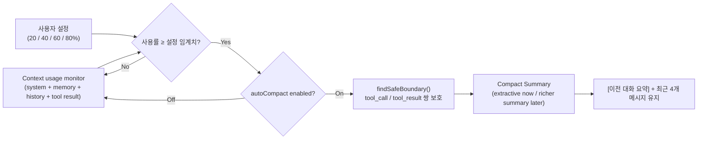

| 항목 | 목표 설계 | 현재 구현 단계 |
| --- | --- | --- |
| 임계치 | 컨텍스트 사용률 **40% 기본값** | `inputTokens >= 80_000` |
| 사용자 설정 | **20% 단위**로 20/40/60/80% 선택 가능 | `chat.autoCompact` on/off 토글 |
| 압축 방식 | compact boundary 보존 + 더 풍부한 요약 전략 | 로컬 추출 기반 요약 (`generateSummary`) |
| 공간 회수 | 약 40~60% 확보 목표 | 요약 내용과 메시지 길이에 따라 가변 |
| 보존 규칙 | 최근 대화와 tool round 경계를 함께 보존 | 최근 4개 메시지 유지 + tool_call/tool_result 안전 경계 보존 |
| 수동 트리거 | `/compact` 명령어로 수동 실행 가능 | 동일 |
| 적용 위치 | post-turn + 세션 재개 전후 컨텍스트 관리까지 확장 | `PostTurnHookChain`와 `ConversationLoop` fallback 경로 사용 |

#### 4.5.5 Post-Turn Hooks

매 assistant 턴 완료 후 실행되는 후처리 파이프라인이다. **B5 이후 현재 구현은 6단계 순차 chain** 이고, 목표 설계는 여기에 **Plugin PostTurn** 을 포함한 coordinator를 유지한다.

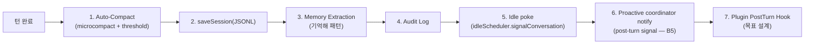

| Hook | 목표 설계 | 현재 구현 단계 |
| --- | --- | --- |
| **Auto-Compact** | 사용률 40% 기본값 + 20% 단위 설정 기반 자동 압축 | `chat.autoCompact` + 80k token threshold. microcompact(항상) + full compact(임계치) 2-stage 구현 |
| **saveSession** | 매 턴 세션 히스토리 저장 및 복구 포인트 생성 | `~/.lvis/sessions/<id>.jsonl`에 저장 |
| **Memory Extraction** | 대화/도구 결과에서 기억할 내용을 구조화 저장 | `"기억해"`류 요청을 notes/로 자동 저장 |
| **Audit Log** | 대화·도구·정책 차단·승인 이력을 기록 | 구현됨 |
| **Idle poke** | 다음 입력 대기 전 상태 갱신과 조용한 heartbeat 보조 신호 | idle scheduler 신호 전달 구현 |
| **Proactive notify (B5)** | post-turn 후 ProactiveTriggerCoordinator에 신호 전달 | `coordinator.notify("post-turn")` — 10분 cooldown. PR #134 (B5) |
| **Plugin PostTurn** | 활성 플러그인의 후처리 훅 실행 | 문서상 목표 설계 유지 |

#### 4.5.6 도구 실행 파이프라인 상세

`ToolExecutor`는 모든 도구 호출의 single choke point다. 상세 보안 모델은 `tool-governance.md`를 따르며, 여기서는 **현재 구현 순서**와 **유지되어야 할 Governance 정책 경계**를 함께 요약한다.

```mermaid
sequenceDiagram
    participant LOOP as ConversationLoop
    participant REG as ToolRegistry
    participant HOOK as HookRunner
    participant AST as BashAstValidator
    participant GOV as GovernancePolicy
    participant PERM as PermissionManager
    participant APPROVAL as ApprovalGate
    participant LIMIT as RateLimiter
    participant EXEC as ToolExecutor
    participant AUDIT as AuditLogger

    LOOP->>REG: findByName(toolName)
    REG-->>LOOP: tool
    LOOP->>HOOK: runPreHooks(input)
    LOOP->>AST: validate(bash input)
    LOOP->>GOV: policyCheck(name, source, args)

    alt policy deny
        GOV-->>LOOP: deny + reason
        LOOP->>AUDIT: log(BLOCKED, reason)
    else policy allow
        GOV-->>PERM: allow / policy snapshot
        LOOP->>PERM: checkDetailed(name, source, category)

        alt ask decision
            PERM-->>APPROVAL: requestAndWait(...)
            APPROVAL-->>LOOP: allow / deny
        end

        LOOP->>LIMIT: check(name, trust)
        LOOP->>EXEC: tool.execute(finalInput)
        EXEC-->>LOOP: result / error
        LOOP->>HOOK: runPostHooks(result)
        LOOP->>AUDIT: logToolCall(...)
    end
```

| 순서 | 단계 | 설명 |
| --- | --- | --- |
| **1** | Lookup | `ToolRegistry.findByName()` + source/trust 계산 |
| **2** | PreToolUse Hook | 외부 훅이 입력을 차단/수정할 수 있음 |
| **2.5** | Bash AST Validator | bash 입력은 별도 AST 검증을 거침 |
| **3** | Governance Policy Check | 로컬 정책 캐시 기준으로 도구 차단/허용을 먼저 판단 |
| **4** | Permission / Approval | `deny` / `ask` / `allow` 결정 후 필요 시 UI 승인 |
| **5** | Hook override 반영 | 수정된 입력을 최종 실행 인자로 확정 |
| **6** | Rate limit | trust 수준별 호출 빈도 제한 |
| **7** | Execute | 실제 도구 실행 |
| **8** | PostToolUse Hook | 결과 후처리 및 차단 |
| **9** | Audit + tool_result | 감사 로그 기록 후 LLM loop에 결과 반환 |

> **Governance 설계 메모**: `GovernancePolicy`는 로컬 정책 캐시에서 평가되고, 상위 **거버넌스 정책 동기화 서버**가 브로드캐스팅하는 delta를 받아 갱신되는 구조를 목표로 한다. 따라서 대화 루프는 매 호출마다 네트워크 왕복이 아니라 **최신 로컬 정책 스냅샷**을 조회한다.

#### 4.5.7 대화 세션 관리

| 항목 | 목표 설계 | 현재 구현 단계 |
| --- | --- | --- |
| **세션 생성** | 앱 실행 시 또는 `/new` 명령 시 새 세션 생성 | 구현됨 (세션 ID = UUID v4) |
| **세션 히스토리 보관** | 타 채팅 앱처럼 최근 대화 목록·복구 가능해야 함 | `MemoryManager.saveSession()`이 JSONL 파일로 저장 |
| **세션 조회** | 최근 세션 목록 + 제목/미리보기/검색까지 확장 | `listSessions()`와 IPC `lvis:chat:sessions`가 최근 목록 제공 |
| **세션 이어가기** | UI에서 이전 세션 선택 → 히스토리 복원 → 컨텍스트 재조립 | `loadSession(sessionId)`, `/load`, `lvis:chat:load-session` 지원 |
| **멀티 세션 UX** | 채팅 히스토리 패널/최근 세션 전환 UX | 현재는 단일 active session + persisted history |
| **세션 삭제/정리** | 보존 정책과 사용자 삭제 UI 확장 | 현재는 JSONL 파일 삭제 수준 |
| **메시지 스키마** | `user` / `assistant` / `tool_result` + assistant `thought` 유지, 추후 preview 메타데이터 확장 | reasoning을 별도 persistent message type으로 늘리지는 않음 |

#### 4.5.8 claw-code 패턴 매핑

| ccleaks.com Query Loop 단계 | LVIS 대응 구현 | LVIS 차별점 |
| --- | --- | --- |
| `createUserMessage()` | renderer input → `ipcMain.handle("lvis:chat:send")` | Electron IPC + 조기 keyword preflight |
| Append to conversation history | `ConversationHistory.append()` | + assistant `thought` 보존 |
| Build system prompt | system prompt assembly | + LVIS.md · notes/ · 조직 컨텍스트 · tool schema · proactive context |
| Stream to Claude API | `provider.streamTurn(...)` | provider 공통 인터페이스로 Claude/Gemini/OpenAI 수용 |
| `findToolByName()` | `ToolRegistry.findByName()` | + Plugin · MCP 동적 등록 통합 레지스트리 |
| `canUseTool()` | `GovernancePolicy` + `PermissionManager.checkDetailed()` | + source/trust aware approval gate + 정책 동기화 전제 |
| `StreamingToolExecutor` | `ToolExecutor.executeAll()` | + groupId, displayOrder, bash validator, rate limit |
| Post-sampling hooks | `PostTurnHookChain.run()` | 현재: compact(2-stage) + saveSession + memory extraction + audit + idle-poke + proactive-notify(B5). 목표: plugin post-turn 확장 |
| Auto-compact | `AutoCompact` | 목표: 40% 기본값/20% 단위 설정, 현재: 80k token threshold + on/off |
| Wait for next input | renderer idle state | + reasoning/tool/assistant 타임라인 유지 + proactive heartbeat 예정 |

#### 4.5.9 System Prompt 조립 상세 — 12개 소스

> **Reference**: ccleaks.com §02 "System prompt built — Assembled from 10+ component sources"
> Lgenie에 전송되는 시스템 프롬프트는 매 턴마다 아래 12개 소스에서 조립된다.

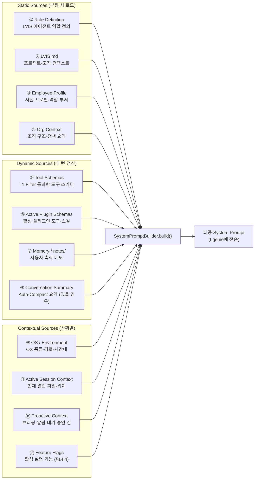

| # | 소스 | 갱신 주기 | 토큰 예상 | 설명 |
| --- | --- | --- | --- | --- |
| ① | Role Definition | 부팅 시 (정적) | 1~2K | LVIS 에이전트의 기본 역할·행동 원칙 정의 |
| ② | LVIS.md | 파일 변경 시 | 2~5K | 프로젝트·조직 레벨 컨텍스트 (사용자 편집 가능) |
| ③ | Employee Profile | 부팅 시 | 0.5~1K | 사원 이름·직급·부서·역할 |
| ④ | Org Context | 부팅 시 | 1~2K | 조직 구조 요약, 팀원 목록, 보고 라인 |
| ⑤ | Tool Schemas | 매 턴 | 3~8K | L1 Filter 통과 후 Lgenie에 노출할 도구 JSON 스키마 |
| ⑥ | Plugin Schemas | 플러그인 변경 시 | 1~5K | 활성 플러그인의 도구·스킬 스키마 |
| ⑦ | Memory / notes/ | 파일 변경 시 | 1~3K | 사용자 축적 메모 — 선호, 루틴, 프로젝트 정보 |
| ⑧ | Compact Summary | Compact 후 | 2~5K | 이전 대화 요약 (Auto-Compact 실행 시에만) |
| ⑨ | OS / Environment | 부팅 시 | 0.3~0.5K | OS 종류, 홈 디렉터리, 시간대, 현재 시각 |
| ⑩ | Session Context | 매 턴 | 0.5~1K | 현재 열린 파일, 작업 디렉터리 등 |
| ⑪ | Proactive Context | 매 턴 (조건부) | 0.5~2K | 대기 중인 승인 건수, 임박 일정, 브리핑 요약 |
| ⑫ | Feature Flags | 부팅 시 | 0.2~0.5K | 활성 실험 기능 목록 (§14.4 Feature Flag 참조) |

**총 토큰 예산**: 약 15~35K tokens (Lgenie 컨텍스트 윈도우의 3~7%)

---

#### 4.5.10 Tool Call Presentation — grouped card + drill-down

도구 호출은 **한 번의 tool round = 하나의 group card**로 먼저 보여주고, 사용자가 펼칠 때만 하위 도구와 입력/결과를 드러낸다. renderer는 assistant 텍스트가 끼지 않은 인접 group만 시각적으로 병합해, 사용자가 자연스러운 `생각 → 도구 → 생각 → 도구 → 응답` 흐름을 볼 수 있게 한다.

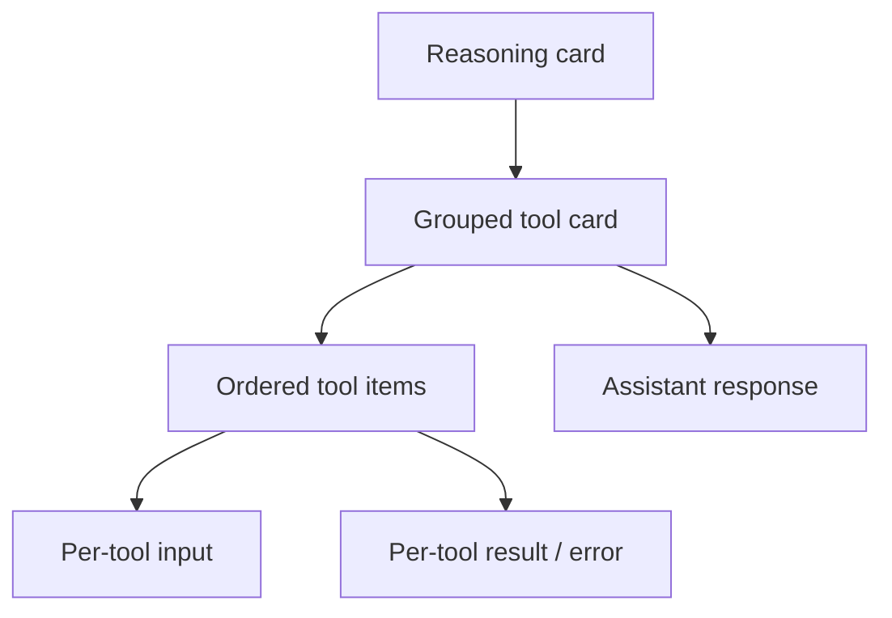

**표현 규칙**

| 레벨 | 표시 방식 | 클릭 시 |
| --- | --- | --- |
| **Reasoning** | 진행 중 생각/정리 카드를 별도 entry로 표시 | 도구 묶음 사이에도 독립적으로 남음 |
| **Tool group** | 사용된 도구 개수와 상태를 요약한 접힘 카드 | 하위 tool item 목록을 펼침 |
| **Tool item** | 도구명 + 실행 순서 + 성공/실패 | 입력/결과 상세를 각각 펼침 |
| **Input panel** | tool input JSON/raw input | 필요할 때만 노출 |
| **Result panel** | 도구 결과 또는 오류 메시지 | 실패는 해당 item에만 국한 |

**현재 구현 상태 규칙**

- `tool_start`가 오면 group card가 먼저 생성되고, assistant 본문보다 앞에 보일 수 있다.
- 각 도구는 `toolUseId`, `displayOrder`를 가지므로 하위 목록 순서가 안정적이다.
- 인접한 tool round라도 그 사이에 `assistant_round`가 있으면 별도 묶음으로 유지한다.
- 완료된 도구 묶음은 접힘 상태로 유지되고, 필요 시에만 펼친다.
- `spawn sh ENOENT` 같은 실행 실패는 그룹 전체가 아니라 해당 tool item 실패로만 표시한다.

**레퍼런스 처리 방식**

| 시스템 | 관찰된 처리 방식 | LVIS 반영 |
| --- | --- | --- |
| **claw-code** | tool_use / tool_result를 순서 있는 스트림 이벤트로 유지 | group card는 UI 표현 계층에서만 형성 |
| **OpenHarness** | 실행 run 단위를 구조화해 추적 | LVIS도 tool round를 `groupId` 단위로 추적 |
| **Paperclip / PaperclipAI** | thinking, tool call, tool result, assistant를 분리 기록 | reasoning card와 assistant round를 분리 유지 |

---

### 4.6 Source Tree Layout & Module Boundaries — Phase 3

Phase 3 리팩터 기준 `lvis-app/src/` 모듈 경계다. Phase 1~2의 `src/agent/` / `src/core/` 과부하를 해소하고, OpenHarness 비교 연구 결과를 반영한 **단일 관심사 디렉터리** 원칙을 적용한다.

#### 4.6.1 Canonical Directory Map

```
lvis-app/src/
├── main.ts, boot.ts, preload.ts, ipc-bridge.ts,
│   plugin-ui-host.tsx, taskService.ts                        # 엔트리 / 브릿지
│   # NOTE(tasks-plugin-split, Phase 0): taskService.ts 는 lvis-plugin-tasks 로 이전
│   # 예정. Phase 2 cutover 이후 이 줄에서 제거되고, addTask 는 plugin tool RPC 로
│   # 위임된다 (§9.4a 참조).
│
├── renderer.tsx   # minimal entry — mounts ui/renderer/App.tsx
├── ui/renderer/   # Renderer composition root (Phase 1~4.6 split 완료)
│   ├── App.tsx                  # composition root
│   ├── ChatView.tsx, Sidebar.tsx, SettingsDialog.tsx, MainToolbar.tsx
│   ├── context/                 # ChatContext (state provider for ChatView subtree)
│   ├── hooks/                   # 14 domain hooks (settings, chat-state, briefing,
│   │                            #  approval, search, context-budget, cost-estimate,
│   │                            #  sessions, starred, plugin-marketplace, role-presets,
│   │                            #  app-bootstrap, indexed-docs, marketplace-updates)
│   ├── components/              # BriefingCard, AssistantCard, UserMessageEditor,
│   │                            #  ReasoningCard, ToolApprovalDialog, ToolGroupCard,
│   │                            #  ChatSearchOverlay, Sparkline, UsageDashboard,
│   │                            #  HtmlPreview, TaskView, StarredView,
│   │                            #  MarketplaceUpdateBanner
│   ├── dialogs/                 # ApprovalDialog, PluginInstallDialog,
│   │                            #  PluginUninstallDialog, CommandPaletteDialog
│   ├── tabs/                    # RolesTab, PermissionsTab, AuditTab,
│   │                            #  PluginPerfTab, PrivacyTab
│   ├── utils/                   # cost-format, html-preview, history, compose
│   └── types.ts, constants.ts, api-client.ts
│
├── engine/        # 에이전트 루프 + LLM 프로바이더
│   ├── conversation-loop.ts, conversation-history.ts, auto-compact.ts
│   └── llm/       # claude / openai / gemini provider + factory
│
├── tools/         # 1-file-per-tool
│   ├── base.ts
│   ├── executor.ts
│   ├── knowledge-search.ts
│   ├── bash.ts
│   └── untrusted-banner.ts
│
├── prompts/       # 시스템 프롬프트 조립
│
├── hooks/         # PreTool / PostTool 인터셉트
│   ├── hook-runner.ts
│   ├── post-turn-hook-chain.ts
│   ├── types.ts / schemas.ts
│   ├── external-executor.ts
│   └── config-loader.ts
│
├── permissions/   # 권한 스택
│   ├── permission-manager.ts, permissions-store.ts, policy-store.ts,
│   │   approval-gate.ts, agent-action-requester.ts,
│   │   sensitive-paths.ts
│
├── sandbox/       # 파일 경계 강제
│   └── path-validator.ts
│
├── memory/        # §5 파일 기반 기억
│
├── audit/         # 감사 로그 / DLP 필터
│   └── audit-logger.ts, dlp-filter.ts
│
├── core/          # 남은 cross-cutting
│   ├── keyword-engine.ts, route-engine.ts, proactive-engine.ts,
│   │   tool-registry.ts
│   └── network-guard.ts
│
├── mcp/           # Model Context Protocol 클라이언트
│
├── plugins/       # 플러그인 런타임
│   └── runtime.ts, registry.ts, marketplace.ts, deployment-guard.ts, types.ts
│
├── data/, main/, lib/, components/ui/, ui/, __tests__/
```

#### 4.6.2 Module Boundary Rules

| 디렉터리 | 허용되는 의존 | 금지 |
| --- | --- | --- |
| `engine/` | `permissions/`, `hooks/`, `prompts/`, `tools/`, `audit/`, `memory/`, `mcp/`, `core/`, `plugins/`, `engine/llm/` | DOM, `renderer.tsx`, `components/` |
| `tools/` | `permissions/`, `sandbox/`, `core/network-guard.ts`, `hooks/` | `engine/`, `renderer.tsx` |
| `prompts/` | `memory/`, `data/` | `engine/`, `renderer.tsx` |
| `hooks/` | `permissions/`, `audit/`, `core/network-guard.ts` | `engine/` (hooks are called by engine) |
| `permissions/` | `data/settings-store.ts`, `audit/` | `engine/`, `tools/`, `renderer.tsx` |
| `sandbox/` | Node stdlib only (leaf) | 모든 상위 |
| `memory/` | `data/` | `engine/`, `tools/` |
| `audit/` | `data/` | `engine/`, `tools/` |
| `core/` | `permissions/`, `memory/`, `tools/`, `plugins/` | `engine/`, `renderer.tsx` |
| `plugins/` | `permissions/`, `hooks/`, `data/`, `mcp/` | `engine/` 직접 호출 (HostApi 경유) |
| `main/` | Node stdlib + Electron main API | renderer 프로세스 코드 |
| `mcp/` | `permissions/`, `core/network-guard.ts` | `renderer.tsx` |

**원칙**

1. **하향 의존만** — 각 모듈은 더 작은 책임 방향으로만 의존한다.
2. **`engine/` 는 조립자** — tools / prompts / hooks / permissions를 호출하되, 그 반대는 금지한다.
3. **`sandbox/`, `permissions/`, `memory/`, `audit/` 는 leaf 성격** — business 모듈 import를 받지 않는다.
4. **`renderer.tsx` 는 IPC만 사용** — main-process 모듈 직접 import 금지.

#### 4.6.3 관련 청사진

- `docs/blueprints/openharness-selective-borrow-plan.md` — Tier S / A 차용 근거
- `docs/blueprints/phase3-folder-refactor-plan.md` — file-by-file migration map

#### 4.6.4 불변 사항 (리팩터가 바꾸지 않는 것)

- 모든 public API / 함수 시그니처
- Tool 이름 (underscore 규약)
- IPC 채널
- 플러그인 manifest 형식 (`plugin.json`)
- 파일 기반 상태 (`~/.lvis/*`)
- 기존 테스트 통과 수

---

## 5. Memory — 경량 기억 구조

Claude Code / Copilot이 채택한 **파일 기반 경량 메모리** 모델을 따른다. 복잡한 다계층 기억 관리가 아니라, 사용자가 직접 읽고 편집할 수 있는 투명한 구조로 유지한다.

### 5.1 설계 원칙

- **단순함 우선** — 기억은 마크다운 파일과 세션 컨텍스트로 충분하다. 별도의 기억 엔진·승격·만료 로직을 두지 않는다.
- **사용자 제어** — 기억은 사용자가 직접 확인·편집·삭제할 수 있어야 한다.
- **세션 독립** — 세션 간 공유되는 기억은 파일로, 세션 내 휘발성 맥락은 인메모리로 분리한다.

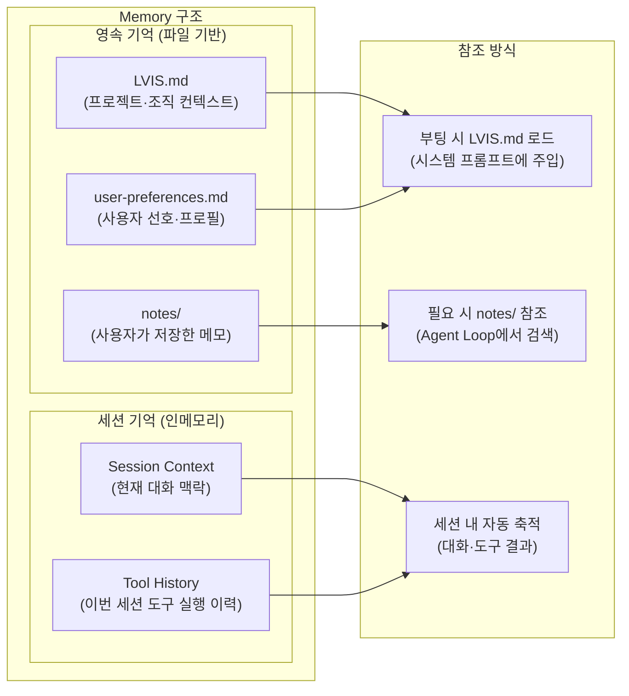

### 5.2 Memory 파일 구조

`~/.lvis/` 가 사용자 제어 데이터의 단일 root 다. 호스트 모듈은 각 topic 폴더로
분리되고, 플러그인은 `~/.lvis/plugins/<id>/` 자기 디렉토리 안에서 install
artifact 와 save data 를 함께 보관한다 (호스트 root 에 끼어들지 않음).

```
~/.lvis/
├── LVIS.md              # 프로젝트·팀·조직 컨텍스트 (관리자 배포 가능)
├── user-preferences.md  # 사용자 개인 선호 (보고 스타일, 자주 쓰는 도구 등)
├── notes/               # 호스트 메모 ("이거 기억해" 명령 — 플러그인 자체 메모는
│   ├── 출장-절차.md     # 각 플러그인의 ~/.lvis/plugins/<id>/notes/ 안에 둔다)
│   └── Q1-보고서-템플릿.md
├── sessions/            # 세션 이력 (claw Session 패턴)
│   └── <session-id>.jsonl
├── audit/               # AuditLogger (회전·retention)
├── traces/              # FileTracer 디버그 trace
├── certs/               # 사내 CA 캐시
├── governance/          # MCP / 플러그인 admin 정책
├── tasks/               # SQLite task DB (lvis-tasks.db)
├── mcp/                 # MCP servers config + install dir
│   ├── servers.json
│   └── <slug>/          # marketplace install
└── plugins/             # 모든 플러그인 (user / managed 구분 없이 flat)
    ├── registry.json
    └── <plugin-id>/     # install artifact + plugin save data
```

| 구분                    | 저장소    | 수명             | 제어 주체                |
| ----------------------- | --------- | ---------------- | ------------------------ |
| **LVIS.md**             | 로컬 파일 | 영구 (수동 관리) | 관리자 + 사용자          |
| **user-preferences.md** | 로컬 파일 | 영구 (수동 관리) | 사용자                   |
| **notes/**              | 로컬 파일 | 영구 (수동 관리) | 사용자 ("기억해" 명령)   |
| **Session Context**     | In-memory | 현재 세션        | 자동 (대화 종료 시 소멸) |

> **v2 대비 변경 이유**: v2의 4계층 기억(Session→Working→Episodic→Semantic)과 자동 승격·만료·연결 로직은 현 단계에서 과도한 복잡도를 유발한다. Copilot의 `.github/copilot-instructions.md`, Claude Code의 `CLAUDE.md` 패턴처럼 파일 기반으로 시작하고, 필요가 검증되면 점진적으로 확장한다.

---

## 6. Client Core Engines

### 6.1 Keyword Detecting Engine

사용자 입력에서 의도·키워드·엔티티를 감지하는 첫 번째 관문. **Conversation Loop 본문보다 먼저** 실행되며, 빌트인 규칙과 플러그인이 등록한 keyword group을 함께 본다.

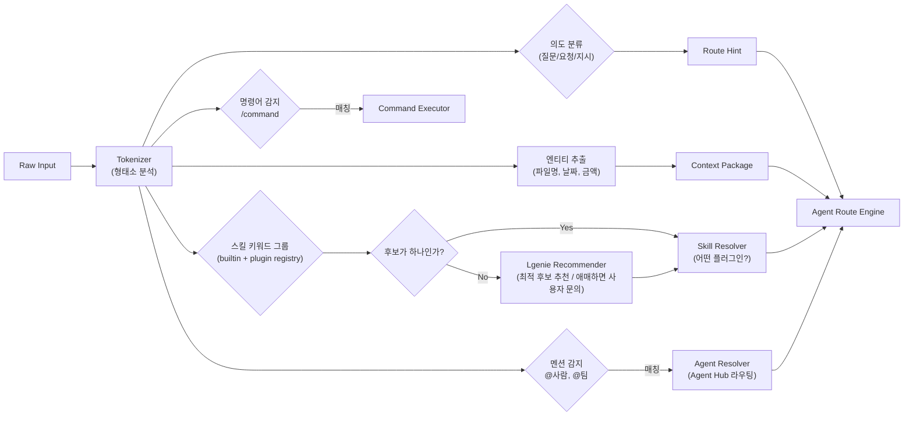

**감지 우선순위:**

| 순위 | 유형          | 예시 입력               | 처리                              |
| ---- | ------------- | ----------------------- | --------------------------------- |
| 1    | 명시적 명령어 | `/meeting start`        | Command Executor 직접 실행        |
| 2    | 스킬 키워드   | "회의록 작성해줘"       | Skill Resolver → 플러그인 활성화  |
| 3    | 에이전트 멘션 | "@이영희 이거 확인해줘" | Agent Hub 메시지 라우팅           |
| 4    | 의도 + 엔티티 | "출장 품의 작성해줘"    | Route Engine → Lgenie + 관련 도구 |
| 5    | 일반 대화     | "안녕하세요"            | Lgenie 직접 세션                  |

**확장 설계 메모**

- 플러그인은 manifest/skill 등록 시 **keyword group** 을 동적으로 추가한다.
- 동일 입력이 여러 스킬 그룹에 걸리면 Lgenie가 가장 적합한 후보를 추천한다.
- 추천 confidence가 낮으면 사용자가 명시적으로 선택하도록 묻는다.

### 6.2 Agent Route Engine

감지된 의도를 올바른 실행 경로로 전달하는 라우터.

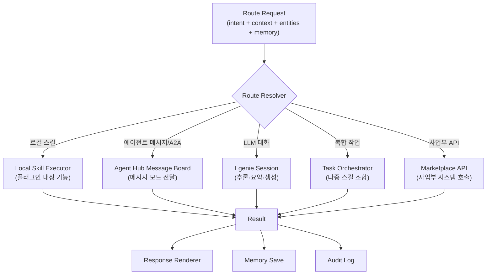

**Route Resolution 우선순위:**

```
1. Governance Policy Check   → 거버넌스 정책 위반 시 즉시 차단
2. Permission Check          → 사원 권한 확인
3. Local Skill Match         → 설치된 플러그인 스킬 매칭
4. Agent Hub Routing         → @멘션 또는 메시지 보드/A2A 상호작용
5. Marketplace API           → 사업부 API 호출 필요 시
6. Lgenie Fallback           → 위 모두 해당 없으면 LLM 직접 대화
```

### 6.3 Tool Permission Model — 3계층 도구 권한

> **Reference**: ccleaks.com §05 "Permission System — 3-layer permission model"
> §8 Agent Approval System이 **에이전트 행위 승인**을 다룬다면, 이 섹션은 **개별 도구 호출 시점의 권한 제어**를 3계층으로 정의한다.

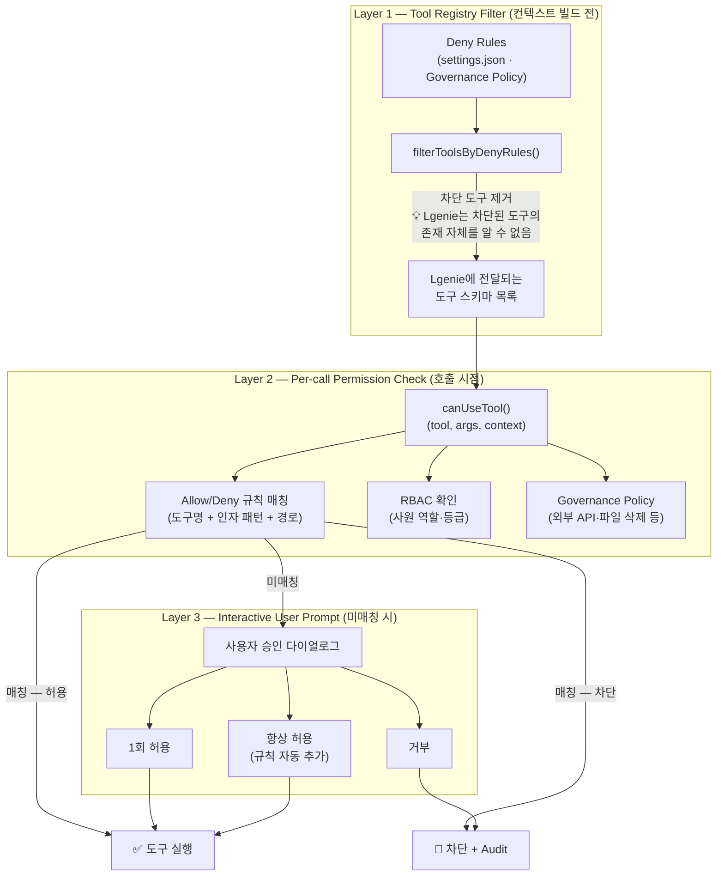

**Layer별 역할과 설계 근거:**

| Layer | 시점 | 역할 | 보안 효과 |
| --- | --- | --- | --- |
| **L1 — Registry Filter** | System Prompt 빌드 전 | Governance deny 규칙으로 차단 도구를 LLM 컨텍스트에서 **제거** | Lgenie가 존재를 모르므로 할루시네이션 호출 원천 차단 |
| **L2 — Per-call Check** | 도구 호출 시점 | allow/deny 패턴 + RBAC + Governance 정책 확인 | 인자·경로 수준의 세밀한 제어 (예: `Bash(git *)` 허용, `Bash(rm *)` 차단) |
| **L3 — User Prompt** | L2 미매칭 시 | 사용자에게 1회/항상/거부 선택 | 새로운 도구·인자 조합에 대한 사용자 주도 정책 학습 |

**실행 모드:**

| 모드 | 설명 | 적용 상황 |
| --- | --- | --- |
| **Default** | 위험 도구만 승인 요청, 나머지 자동 허용 | 일반 업무 |
| **Strict (Plan Mode)** | 모든 도구 실행 전 승인 필요 | 민감 업무·신규 플러그인 테스트 |
| **Auto Mode** | 에이전트가 판단하여 실행 (L1·L2는 여전히 적용) | 반복 업무 자동화 |

**규칙 설정 예시:**

```json
{
  "permissions": {
    "allow": [
      "FileRead(*)",
      "Search(*)",
      "Bash(git *)",
      "Calendar(read)"
    ],
    "deny": [
      "Bash(rm *)",
      "Bash(sudo *)",
      "FileWrite(/etc/*)",
      "Email(send)",
      "AgentHub(post scope:company)"
    ]
  }
}
```

**Wave C 보안 강화 (PR #130–#133):**

| 항목 | 구현 | PR |
| --- | --- | --- |
| **D1 — DLP filter on approval args** | `webContents.send` 전 `redactForLLM()` 로 승인 요청 args를 DLP 필터링. 기밀 데이터가 renderer payload 로 노출되지 않도록 차단. | #130 |
| **D2 — HMAC nonce on approval response** | 승인 응답에 HMAC nonce 첨부. renderer → main IPC 경로의 confused-deputy 공격 방어. | #132 |
| **D3 — Approval queue cap** | `pending.size` 상한 초과 시 신규 요청 deny-once 처리. LLM 대량 tool_use 발행 시 리소스 보호. renderer 큐 깊이 UI 표시. | #131 |
| **D4 — Parallel tool execution + bulk approval** | `ToolExecutor.executeAll()` 병렬 실행 활성화 + `ToolApprovalDialog` 다중 승인 UI (bulk approve/deny). | #133 |

### 6.4 Tool Registry & Taxonomy — 빌트인 도구 카탈로그

> Lgenie가 호출할 수 있는 **빌트인 도구**와 **플러그인 도구**를 구분하고, 카테고리별로 분류한다.

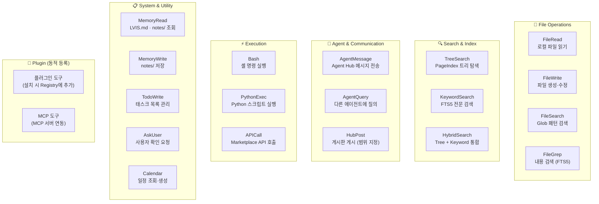

| 카테고리 | 빌트인 도구 | 설명 | Permission 기본값 |
| --- | --- | --- | --- |
| **File Operations** | FileRead, FileWrite, FileSearch, FileGrep | 로컬 파일 CRUD + 검색 | FileRead: allow / FileWrite: ask |
| **Search & Index** | TreeSearch, KeywordSearch, HybridSearch | PageIndex + FTS5 검색 | allow (읽기 전용) |
| **Agent & Comm** | AgentMessage, AgentQuery, HubPost | Agent Hub 통신 | AgentQuery: allow / HubPost: ask (§8 승인) |
| **Execution** | Bash, PythonExec, APICall | 명령·스크립트·API 실행 | Bash: ask / APICall: ask |
| **System & Utility** | MemoryRead/Write, TodoWrite, AskUser, Calendar | 메모리·태스크·일정 | MemoryRead: allow / MemoryWrite: allow |
| **Plugin (동적)** | 플러그인·MCP 설치 시 추가 | 매니페스트 기반 동적 등록 | 플러그인별 매니페스트에 정의 |
| **Feature-gated** | (Feature Flag로 제어) | 실험적 도구 — §14.4 참조 | Feature Flag 활성 시에만 Registry에 등록 |

**Tool Registry 동작:**

| 시점 | 동작 |
| --- | --- |
| **부팅 시** | 빌트인 도구 등록 → Plugin 도구 등록 → MCP 도구 등록 → Feature Flag 평가 |
| **플러그인 설치/제거** | Registry 동적 업데이트 (Hot-reload) |
| **매 턴** | L1 Registry Filter 적용 → Lgenie에 전달할 도구 스키마 확정 |

### 6.5 Command Safety — 명령어 안전 분석

> **Reference**: ccleaks.com §05 "Bash safety — AST-level analysis"
> LVIS 에이전트가 사용자 PC에서 셸 명령을 실행할 수 있으므로, **실행 전 AST 레벨 안전 분석**이 필수다.

```mermaid
flowchart LR
    CMD_IN["Bash 도구 호출<br/>(명령어 문자열)"]

    CMD_IN --> AST_PARSE["Shell AST Parser<br/>(명령어 구문 분석)"]

    AST_PARSE --> PATTERN_CHK{"위험 패턴<br/>감지?"}

    PATTERN_CHK -->|"감지"| BLOCK["🚫 즉시 차단<br/>+ Audit Log"]
    PATTERN_CHK -->|"안전"| PERM_CHK["Permission Check<br/>(Layer 2)"]

    PERM_CHK --> EXEC["명령 실행"]

    subgraph "감지 대상 위험 패턴"
        P1["rm -rf / (재귀 삭제)"]
        P2["Fork bomb :()\u007b :|:& \u007d;:"]
        P3["curl|bash (원격 실행)"]
        P4["sudo escalation"]
        P5["tty injection"]
        P6["history manipulation"]
        P7["chmod 777 (과도한 권한)"]
        P8["> /dev/sda (디스크 덮어쓰기)"]
    end
```

| 위험 등급 | 패턴 예시 | 조치 |
| --- | --- | --- |
| **Critical** | `rm -rf /`, Fork bomb, `> /dev/sda`, `mkfs` | 즉시 차단 — 사용자 승인 불가 |
| **High** | `sudo *`, `curl\|bash`, `chmod 777`, `chown root` | 차단 + 사유 표시. 사용자가 명시적으로 해제 가능 |
| **Medium** | `rm -rf (상대경로)`, `kill -9`, pipe to `sh` | 사용자 승인 필요 (L3 Prompt) |
| **Low** | `git push --force`, `npm install -g` | 기본 허용, 설정에서 승인 요구 가능 |

**Phase 1 구현: `BashAstValidator` (`lvis-app/src/main/bash-ast-validator.ts`)**

7개 차단 패턴과 `warn` / `deny` 모드를 분리해 `lvis-app/src/tools/executor.ts` Step 2.5에서 실행한다.

| Pattern ID | 정규식 패턴 | 차단 사유 |
| --- | --- | --- |
| `rm-rf-root` | `\brm\s+(-[rfRF]+\s+)+(\/\|~\|\$HOME\|\*)` | `rm -rf` 위험 경로 (`/`, `~`, `$HOME`, `*`) |
| `curl-pipe-sh` | `\b(curl\|wget\|fetch)\b[^|]*\|\s*(sh\|bash\|zsh\|fish)` | 원격 스크립트 직접 실행 |
| `sudo-escalation` | `\b(sudo\|su\|doas)\b` | 권한 상승 시도 |
| `fork-bomb` | `:\(\)\s*\{\s*:\|:\s*&\s*\}\s*;\s*:` | fork bomb |
| `eval-untrusted` | `\beval\s+\$?\{?[^}]*\}?` | `eval` 기반 위험 실행 |
| `tty-injection` | `echo\s+-[ne]+\s+["'].*\\033` | TTY escape sequence injection |
| `subst-pipe-shell` | `\$\([^)]+\)\s*\|\s*(sh\|bash)` | command substitution → shell pipe |

**warn / deny 모드**

| 모드 | 동작 | 설정 |
| --- | --- | --- |
| `deny` (기본) | 패턴 매칭 시 실행 차단, `ValidationResult.decision = "deny"` | `settings.governance.bashValidationMode: "deny"` |
| `warn` | 패턴 매칭 시 경고만 남기고 실행은 허용 | `settings.governance.bashValidationMode: "warn"` |

**AST 분석이 L2 Permission Check보다 먼저 실행되는 이유**: Permission 규칙에 `allow: ["Bash(*)"]`로 전체 허용이 설정되어 있더라도, Critical/High 패턴은 AST 분석에서 차단한다. 이 계층은 Governance Policy와 동급의 불변 안전 경계이다.

**Windows shell 주의사항**: `Bash` 도구는 내부적으로 POSIX shell을 기대하므로, Windows에서 `sh` shim이 없으면 `spawn sh ENOENT`가 발생할 수 있다. 이 경우 전체 대화를 실패로 만들지 말고, 해당 tool item만 실패 처리하고 플랫폼 불일치 힌트를 함께 노출한다.

---

## 6.6 Observability & Audit — 운영 가시성

Observability Sprint X-D (PR #113–#116) 에서 추가된 4개의 운영 가시성 컴포넌트를 정의한다. 모두 `src/ui/renderer/` Settings 탭 체계로 노출되며, 데이터는 로컬 파일(`~/.lvis/audit/audit.ndjson`, 인메모리 stats)에서 읽는다.

### 6.6.1 Audit Log Search UI (PR #113)

**진입**: Settings → 감사 탭 (`AuditTab.tsx`)

| 기능 | 구현 |
| --- | --- |
| 날짜 범위 필터 | `dateFrom` / `dateTo` ISO 문자열 → `AuditLogger.search()` |
| 타입 필터 | `tool_call` / `permission_decision` / `bash_validation` / `compact` / `error` / `dlp` |
| 텍스트 검색 | NDJSON 라인 스캔 — toolName · result · message 필드 포함 |
| 결과 테이블 | 클릭 시 raw JSON 드릴다운, 페이지네이션 |
| 상단 통계 바 | 전체 건수 · 차단 건수 · DLP 히트 수 |

**IPC 채널**: `lvis:audit:search` (query params → `AuditEntry[]`) · `lvis:audit:stats` (집계 수치)

**데이터 소스**: `src/audit/audit-logger.ts` — append-only NDJSON, 동기 write. §13.3 Audit Data Flow 참조.

### 6.6.2 Plugin Performance Dashboard (PR #114)

**진입**: Settings → 플러그인 성능 탭 (`PluginPerfTab.tsx`)

인메모리 stats — 앱 재시작 시 초기화된다. 장기 추이가 필요한 경우 별도 영속화 설계 필요.

| 컬럼 | 의미 |
| --- | --- |
| startup (ms) | 플러그인 첫 로드 소요 시간 |
| calls | 세션 내 도구 호출 총 횟수 |
| errors | 호출 중 예외 발생 횟수 |
| avg (ms) | `totalDuration / calls` |
| last call | 마지막 호출 UTC timestamp |
| error rate | `errors / calls` — 녹색 <1% · 황색 1–5% · 적색 >5% |

SVG 바 차트로 플러그인별 avg exec time 비교.

**수집 위치**: `src/plugins/runtime.ts` `PluginRuntime.call()` — 호출 전후 `Date.now()` 차분.

**IPC 채널**: `lvis:plugins:perf-stats` → `Record<pluginId, PluginPerfStats>`

### 6.6.3 LLM Cost Monitor (PR #116)

**진입**: Settings → 사용량 탭 (`UsageDashboard.tsx` — 기존 컴포넌트 확장)

| 기능 | 구현 |
| --- | --- |
| 날짜 범위 프리셋 | 7d / 30d / 90d / all / custom |
| 세션 breakdown | Top-5 세션 비용 테이블 |
| 월간 추정 | `computeMonthlyProjection(usedDays, totalCost)` — 당월 남은 일수 비례 외삽 |
| CSV 내보내기 | `lvis:usage:export-csv` IPC — 브라우저 download 트리거 |

**요금 출처**: `src/engine/usage-stats.ts` 내 vendor별 단가 상수. 모델 요금 변경 시 이 파일만 업데이트한다.

**IPC 채널**: `lvis:usage:range` (dateFrom · dateTo → `UsageEntry[]`) · `lvis:usage:export-csv`

### 6.6.4 DLP Hit Statistics (PR #115)

**진입**: Settings → 개인정보 탭 (`PrivacyTab.tsx`) — DLP 토글 + 통계 패널

DLP 통계는 audit NDJSON에서 `type = "dlp"` 엔트리만 집계한다.

| 필드 | 의미 |
| --- | --- |
| `totalHits` | N일 내 DLP 차단 총 건수 |
| `byKind` | 패턴 종류별 히트 수 (예: `pii`, `secret`, `credential`) |
| `byDay` | 일별 히트 수 — sparkline 렌더링용 |
| `topPatterns` | 상위 5개 정규식 패턴 + 히트 수 |

**집계 로직**: `src/audit/dlp-stats.ts` `getDlpStats(days)` — NDJSON 스트림 순회, `days` 파라미터로 집계 기간 제어.

**DLP 감사 주입**: `src/audit/dlp-filter.ts` `redactForLLM()` — 리댁션 발생 시 `auditLogger.log({ type: "dlp", ... })` 호출. `initDlpAudit(auditLogger)` 로 주입 (boot.ts).

**IPC 채널**: `lvis:dlp:stats` (days → `DlpStats`)

### 6.6.5 HtmlPreview 보안 — partition 격리 (A5 PR #124)

`HtmlPreview` 컴포넌트(`src/ui/renderer/components/HtmlPreview.tsx`)는 플러그인이 생성한 HTML을 `<webview>` 로 렌더링한다. A5 에서 실제 네트워크 차단이 구현되었다:

- **파티션**: `<webview partition="lvis-render-html">` — 전용 세션 컨텍스트로 격리.
- **webRequest 블록**: `installHtmlPreviewPartitionBlock()` (`src/main/html-preview-partition.ts`) 가 앱 `ready` 후 `session.fromPartition("lvis-render-html").webRequest.onBeforeRequest()` 로 **모든 http/https/ftp 요청을 차단** 한다. `file://` 및 `blob://` 만 허용.
- **효과**: 악성 플러그인 HTML 이 외부 서버로 데이터를 유출하거나 원격 스크립트를 로드하는 것을 OS 네트워크 계층에서 차단한다.

### 6.6.6 Playwright-Electron E2E 테스트 인프라 (E4 PR #135)

`e2e/` 디렉터리(프로젝트 루트 기준)에 Playwright-electron 기반 UI E2E 인프라가 추가되었다. Electron 프로세스를 실제로 실행해 preload 로드 경로, IPC 라운드트립, renderer 마운트를 물리적으로 검증한다. CI workflow 는 opt-in (`E2E=1`) 으로 실행한다.

### 6.6.7 공통 설계 원칙

- **로컬 우선**: 모든 통계는 `~/.lvis/` 로컬 파일 기반. 서버 전송 없음.
- **탭 분리**: `src/ui/renderer/tabs/` 아래 각 탭이 독립 컴포넌트. `SettingsDialog.tsx`는 탭 등록만 담당.
- **IPC 명명**: `lvis:<domain>:<action>` 패턴 (예: `lvis:audit:search`, `lvis:dlp:stats`).
- **인메모리 stats 한계**: Plugin Perf stats는 세션 범위. 히스토리 추이가 필요하면 `~/.lvis/perf/` 영속화를 별도 스프린트에서 설계한다.

---

## 7. Proactive Engine — Daily Briefing (Core)

philosophy.md: _"플러그인이 아니라 코어에 가까운 기능으로 두는 것이 맞을 수 있습니다."_

Proactive Engine은 플러그인이 아닌 **클라이언트 코어**에 위치한다. 목표 설계는 단순 아침 브리핑을 넘어, **설정 값 기반 heartbeat** 와 **조건 기반 heartbeat** 로 브리핑/알림을 발생시키는 것이다. 현재 구현 단계는 `generateBriefing()` 중심의 브리핑 생성과 관련 데이터 수집 경로를 갖고 있다.

```mermaid
flowchart TB
    subgraph "Data Collection from Plugin Events"
        EMAIL["📧 이메일 플러그인<br/>(미처리 메일, 액션 필요)"]
        CALENDAR["📅 캘린더 플러그인<br/>(오늘 미팅, 일정)"]
        TASK["✅ 태스크 매니저<br/>(기한 임박, 진행 중)"]
        AGENT_MSG["🤖 Agent Hub<br/>(내 에이전트 수신 메시지)"]
        MEMORY_CTX["🧠 Memory<br/>(어제 마무리 못한 일)"]
    end

    subgraph "Proactive Engine Core"
        COLLECTOR["Event Collector<br/>(플러그인 이벤트 수집)"]
        PRIORITIZER["Priority Ranker<br/>(긴급도·중요도 판단)"]
        LGENIE_SUM["Lgenie 요약<br/>(자연어 브리핑 생성)"]
        ACTION_SUGGEST["Action Suggester<br/>(다음 행동 제안)"]
    end

    subgraph "Output"
        BRIEFING["📋 Daily Briefing UI"]
        NOTIFICATION["🔔 알림"]
        TASK_CREATE["✅ 자동 태스크 생성"]
    end

    EMAIL --> COLLECTOR
    CALENDAR --> COLLECTOR
    TASK --> COLLECTOR
    AGENT_MSG --> COLLECTOR
    MEMORY_CTX --> COLLECTOR

    COLLECTOR --> PRIORITIZER
    PRIORITIZER --> LGENIE_SUM
    LGENIE_SUM --> ACTION_SUGGEST

    ACTION_SUGGEST --> BRIEFING
    ACTION_SUGGEST --> NOTIFICATION
    ACTION_SUGGEST --> TASK_CREATE
```

**트리거 모델 — ProactiveTriggerCoordinator (Wave B/C 완료)**

`ProactiveTriggerCoordinator` (`src/core/proactive-trigger-coordinator.ts`) 가 60s tick + 외부 이벤트 poke 로 아래 **5개 신호**를 평가해 `generateDailyBriefing()` 를 발동한다. 30분 debounce 내장.

```mermaid
flowchart LR
    SETTINGS["사용자 설정<br/>(출근 시각 · heartbeat 간격 · quiet hours)"]
    EVENTS["이메일 · 캘린더 · 태스크 · Agent Hub · Approval Queue"]
    SCHEDULED["설정 값 기반 heartbeat"]
    CONDITIONAL["조건 기반 heartbeat"]
    TRIGGER["ProactiveTriggerCoordinator"]
    OUTPUT["Briefing / Notification / Reminder"]

    SETTINGS --> SCHEDULED
    EVENTS --> CONDITIONAL
    SCHEDULED --> TRIGGER
    CONDITIONAL --> TRIGGER
    TRIGGER --> OUTPUT
```

| 신호 | 팩토리 함수 | 동작 |
| --- | --- | --- |
| **idle** | `createIdleSignal()` | IdleScheduler 가 IDLE_SCAN 상태일 때 fire |
| **schedule** | `createScheduleSignal()` | KST 08:30 (기본) 5분 윈도우 내 1일 1회 fire |
| **meeting** | `createMeetingSignal()` | calendar-source capability 플러그인 이벤트 — 미팅 10분 전 fire |
| **task-deadline** | _(예정)_ `lvis-plugin-tasks` 의 `task.deadline.approaching` 이벤트 구독 | pending 태스크 dueAt 2시간 내 fire. **Phase 0 갱신 (2026-04-26)**: 호스트의 `createTaskDeadlineSignal()` 은 만들지 않는다. 데드라인 폴링·이벤트 발행은 `lvis-plugin-tasks` 가 owner 로 가져가고, brain 은 이벤트를 구독해 `triggerConversation()` 을 호출한다. 현재 코드에는 미구현 — 플러그인 split (Phase 3) 이후 brain 의 `task-deadline-detector` 와 함께 들어온다. |
| **post-turn** ✅ | `createPostTurnSignal()` | 대화 턴 완료 후 `PostTurnHookChain` → `coordinator.notify("post-turn")`. 10분 cooldown. (B5 PR #134) |

| 트리거 유형 | 예시 | 의도 |
| --- | --- | --- |
| **설정 값 기반 heartbeat** | 출근 직후, 30분 간격, 점심 이후 재알림 | 사용자가 기대하는 리듬으로 브리핑/리마인드 제공 |
| **조건 기반 heartbeat** | 승인 대기 증가, 마감 임박, 긴급 메일, Agent Hub 중요 게시물 | 이벤트가 생겼을 때만 필요한 알림 발생 |

**브리핑 예시:**

> 「오늘 미팅 3건 (10:00 디자인리뷰, 14:00 스프린트, 16:00 1:1), 미처리 이메일 5통 중 2통은 액션 필요 (파트너사 계약서 검토, 출장비 정산 확인), 기한 임박 태스크 1건 (Q2 보고서 초안 — 내일 마감), **에이전트 요청 승인 2건** (이영희 Agent → Q1 보고서 공유 요청, 박민수 Agent → 코드리뷰 결과 전달 요청)」

---

## 8. Agent Approval System — 에이전트 요청 승인

### 8.1 설계 원칙

> **기본값: 승인 필요.** 에이전트가 외부와 상호작용하는 대부분의 행위는 사원의 명시적 승인을 거친다. 내 에이전트가 내 이름으로 무언가를 건네거나 응답하기 전에, 나의 허락을 받는 것이 원칙이다.

**업무 일지 — 공개 범위 승인 후 게시.** 업무 일지는 에이전트가 자동 생성하되, 게시 전에 **공개 범위를 사원이 승인**한다. 전사 공개가 기본이 아니라, 팀 레벨부터 시작하여 사원이 범위를 결정한다.

```
기본 원칙:
  에이전트 행위         → 대부분 승인 필요 (파일 전송, 상호작용, 문서 공유 등)
  업무 일지 게시        → 내용 공개 범위 승인 후 게시 (개인/팀/상위조직/전체)
  상태 업데이트(온라인) → 자율 (메타정보 수준)
```

**업무 일지 공개 범위:**

| 레벨 | 범위 | 열람 가능 에이전트 | 예시 |
|------|------|-------------------|------|
| 🔒 **개인 보관** | 나만 | 없음 (내 에이전트만) | 개인 메모 성격의 일지 |
| 👥 **팀 레벨** (기본값) | 소속 팀 | 같은 팀 에이전트 | 일상 업무 보고 |
| 🏢 **상위 조직** | 실/본부 단위 | 상위 조직 소속 에이전트 | 크로스팀 프로젝트 공유 |
| 🌐 **전체 공개** | 전사 | 모든 에이전트 | 전사 차원 인사이트·팁 |

| 구분 | 품의 결재 | 에이전트 요청 승인 |
|------|----------|-------------------|
| **주체** | 사원 본인 → 상위 결재자 | 에이전트 → 에이전트 소유자(사원) |
| **대상** | 예산·인사·구매 등 공식 프로세스 | **파일 전송** · **상호작용 허용** · **문서 공유** · **일지 공개 범위** 등 |
| **시스템** | 전자결재 시스템 (기존 사내) | LVIS Agent Approval (클라이언트 내장) |
| **흐름** | 사원 → 팀장 → 실장 → ... | 타인 에이전트 → 내 에이전트 → **나에게 승인 요청** → 승인/거부 |

### 8.2 자율 행위 vs 승인 필요 행위

> 기본값이 "승인 필요"이므로, 자율 행위 목록은 **최소한으로 제한**한다.

```mermaid
flowchart LR
    subgraph AUTO["자율 (메타정보 수준만)"]
        STATUS_UPDATE["🟢 상태 업데이트<br/>(온라인·작업중 등)"]
    end

    subgraph SCOPE_APPROVAL["공개 범위 승인 후 게시"]
        WORK_LOG["📋 업무 일지<br/>(공개 범위 선택:<br/>개인/팀/상위조직/전체)"]
        TIP_SHARE["💡 팁·인사이트<br/>(공개 범위 선택)"]
    end

    subgraph APPROVAL["승인 필요 (기본값)"]
        FILE_SEND["📄 파일 전송<br/>(내 문서를 타인 에이전트에게)"]
        INTERACTION["🤝 상호작용 허용<br/>(타 에이전트 요청에 응답)"]
        DOC_SHARE["📑 문서 공유<br/>(1:1 또는 채널로 공유)"]
        TASK_ACCEPT["✋ 위임 수락<br/>(타 에이전트 업무 대행)"]
        EXTERNAL_API["🌐 외부 API 호출<br/>(Marketplace 플러그인 실행)"]
    end

    style AUTO fill:#e8f5e9,stroke:#4caf50
    style SCOPE_APPROVAL fill:#e3f2fd,stroke:#2196f3
    style APPROVAL fill:#fff3e0,stroke:#ff9800
```

Agent Hub에 게시된 정보는 **설정된 공개 범위 내의 에이전트**만 열람할 수 있다. 팀 레벨로 게시된 일지는 같은 팀 에이전트가, 전체 공개 팁은 모든 에이전트가 수시로 열람하며 인사이트를 수집한다.

**업무 일지 게시 흐름:**

```mermaid
sequenceDiagram
    participant Agent as 내 에이전트
    participant User as 사원 (나)
    participant Hub as Agent Hub

    Agent->>Agent: 오늘의 업무 이력 자동 수집·정리
    Agent->>User: 📋 업무 일지 초안 + 공개 범위 승인 요청
    Note over User: 내용 검토 + 공개 범위 선택<br/>(🔒개인 / 👥팀 / 🏢상위조직 / 🌐전체)
    User->>Agent: ✅ "팀 레벨로 게시"
    Agent->>Hub: 업무 일지 게시 (scope: team)
    Hub->>Hub: 같은 팀 에이전트만 열람 가능
```

### 8.3 승인 흐름

```mermaid
sequenceDiagram
    participant AgentB as 이영희 Agent
    participant Hub as Agent Hub
    participant AgentA as 김철수 Agent
    participant Approval as Approval Queue
    participant UserA as 김철수 (사원)
    participant Briefing as Daily Briefing

    AgentB->>Hub: "김철수님 Q1 보고서 공유 요청"
    Hub->>AgentA: Direct Message 수신

    AgentA->>AgentA: 승인 필요 행위 판단<br/>(파일 공유 = 승인 대상)
    AgentA->>Approval: 승인 요청 생성

    alt 김철수 온라인 (클라이언트 활성)
        Approval->>UserA: 🔔 실시간 알림<br/>"이영희 Agent가 Q1 보고서 공유를 요청합니다"
        UserA->>Approval: ✅ 승인 (또는 ❌ 거부)
    else 김철수 오프라인
        Approval->>Approval: 대기열에 보관
        Note over Briefing: 다음 출근 시
        Approval->>Briefing: 대기 중인 승인 건수 집계
        Briefing->>UserA: Daily Briefing에 표시
        UserA->>Approval: ✅ 승인 (또는 ❌ 거부)
    end

    alt 승인됨
        Approval->>AgentA: 승인 확인
        AgentA->>Hub: Q1 보고서 파일 전달
        Hub->>AgentB: 파일 수신 완료
    else 거부됨
        Approval->>AgentA: 거부 사유
        AgentA->>Hub: "공유가 거부되었습니다"
        Hub->>AgentB: 거부 응답
    end
```

### 8.4 승인 큐 UI

에이전트 요청 승인은 Daily Briefing과 별도의 **Approval Queue** UI에서 관리된다.

```mermaid
graph TB
    subgraph "Approval Queue 화면 구조"
        HEADER["에이전트 요청 승인 (2건 대기)"]

        subgraph "요청 1"
            REQ1_FROM["요청자: 이영희 Agent"]
            REQ1_ACTION["행위: 📄 파일 공유"]
            REQ1_TARGET["대상: Q1-마케팅-보고서.pptx"]
            REQ1_REASON["사유: 김철수님이 요청한 보고서입니다"]
            REQ1_BTN["✅ 승인  |  ❌ 거부  |  👁️ 미리보기"]
        end

        subgraph "요청 2"
            REQ2_FROM["요청자: 박민수 Agent"]
            REQ2_ACTION["행위: 🤝 상호작용 허용"]
            REQ2_TARGET["대상: 코드리뷰 결과 요약 전달 요청에 응답"]
            REQ2_REASON["사유: PR #342에 대한 리뷰 완료 — 결과 공유 승인 필요"]
            REQ2_BTN["✅ 승인  |  ❌ 거부  |  👁️ 미리보기"]
        end
    end
```

### 8.5 자동 승인 정책 (선택적)

반복되는 승인 패턴에 대해 사용자가 자동 승인 규칙을 설정할 수 있다. 이 규칙 자체도 사용자가 명시적으로 생성해야 한다.

| 규칙 예시                                           | 설명                       |
| --------------------------------------------------- | -------------------------- |
| "이영희 Agent의 파일 공유 요청은 자동 승인"         | 특정 에이전트에 대한 신뢰  |
| "같은 팀 에이전트의 상호작용 요청은 자동 승인"      | 팀 내 협업 간소화          |
| "기밀 등급 문서 관련 요청은 항상 수동 승인"         | 보안 정책 강제             |
| "외부 API(Marketplace) 호출은 자동 승인 불가"       | 외부 연동 엄격 통제        |
| "업무 일지 기본 공개 범위를 👥팀으로 자동 설정"      | 매번 범위 선택 생략 가능   |

> ⚠️ 자동 승인 정책은 **기본값을 미리 설정**하는 것이지, 승인 절차 자체를 건너뛰는 것이 아니다. 예: "업무 일지는 항상 팀 레벨로 게시" 설정 시, 범위가 👥팀으로 **자동 선택**되어 게시되지만, 사원은 언제든 개별 일지의 범위를 변경하거나 게시를 보류할 수 있다.

---

## 9. Plugin System & UI Extension

### 9.1 Plugin Architecture

```mermaid
graph TB
    subgraph "Plugin Package .lvis-plugin"
        MANIFEST["manifest.json<br/>(메타·의존성·권한·키워드)"]
        SKILLS["skills/<br/>(스킬 정의)"]
        UI_COMP["ui/<br/>(React 컴포넌트)"]
        TOOLS["tools/<br/>(도구 실행 스크립트)"]
        HOOKS["hooks/<br/>(Pre/PostToolUse)"]
        ASSETS["assets/<br/>(아이콘·리소스)"]
    end

    subgraph "Plugin Lifecycle 부팅 시 자동"
        DISCOVER["Discover<br/>(Marketplace 조회)"]
        DIFF["Version Diff<br/>(신규·업데이트 판별)"]
        DOWNLOAD["Download"]
        VALIDATE["Validate<br/>(서명·권한·정책 확인)"]
        INSTALL["Install<br/>(파일 배치·의존성 해결)"]
        ACTIVATE["Activate<br/>(스킬·도구·UI·Hook·키워드 등록)"]

        DISCOVER --> DIFF --> DOWNLOAD --> VALIDATE --> INSTALL --> ACTIVATE
    end

    subgraph "Runtime Registration"
        SKILL_REG["Skill Registry"]
        TOOL_REG["Tool Registry<br/>(GlobalToolRegistry)"]
        UI_MOUNT["UI Slot Mount"]
        HOOK_REG["Hook Runner"]
        KW_REG["Keyword Registry"]
        EVENT_REG["Event Emitter<br/>(Proactive Engine 연동)"]
    end

    ACTIVATE --> SKILL_REG
    ACTIVATE --> TOOL_REG
    ACTIVATE --> UI_MOUNT
    ACTIVATE --> HOOK_REG
    ACTIVATE --> KW_REG
    ACTIVATE --> EVENT_REG
```

### 9.2 Plugin Manifest Spec

현행 매니페스트 스키마는 `schemas/plugin.schema.json` (AJV strict, `additionalProperties: false`) 이 단일 진실 소스다. 검증 플로우·에러 포맷·capability taxonomy·uiCallable 보안 경계 등 상세 규격은 `docs/references/plugin-tool-schema-design.md` (v4) 에 정의되어 있으며, 아래는 호스트-측 구조와 필드 관계 요약이다.

```json
{
  "id": "lvis-plugin-meeting",
  "name": "회의록 녹음",
  "version": "1.3.0",
  "description": "마이크 입력을 실시간으로 전사하고 요약해 회의록을 자동 생성합니다.",
  "entry": "dist/index.js",
  "publisher": "LG Electronics DX Platform Team",
  "deployment": "managed",
  "startupTimeoutMs": 8000,

  "tools": ["meeting_start", "meeting_push_chunk", "meeting_stop", "meeting_transcript", "meeting_sessions"],
  "uiCallable": ["meeting_transcript", "meeting_sessions"],
  "startupTools": [],
  "capabilities": ["meeting-recorder"],

  "eventSubscriptions": ["calendar.event.started"],
  "notificationEvents": [
    { "event": "meeting.summary.created", "titleField": "title", "bodyField": "summary" }
  ],

  "keywords": [
    { "keyword": "회의록", "skillId": "meeting" },
    { "keyword": "녹음",   "skillId": "meeting" }
  ],

  "toolSchemas": {
    "meeting_push_chunk": {
      "description": "PCM16LE 오디오 청크를 세션에 추가. STT는 비동기 처리.",
      "inputSchema": {
        "type": "object",
        "required": ["sessionId", "chunk"],
        "properties": {
          "sessionId": { "type": "string" },
          "chunk": { "type": "object" }
        }
      }
    }
  },

  "ui": [
    { "id": "meeting-sidebar", "slot": "sidebar", "kind": "embedded-module",
      "title": "회의록", "entry": "ui/sidebar.js", "exportName": "MeetingSidebar" }
  ]
}
```

**필드 요약:**

| 필드 | 타입 | 역할 |
|------|------|------|
| `id` | string (`^[a-zA-Z][a-zA-Z0-9._-]*$`, 3~128자) | 플러그인 식별자. **flat form 권장** (번들 플러그인은 모두 flat); dot form 허용. |
| `name`, `version`, `entry`, `description` | string | 메타데이터. `description` ≤ 280자, `version` anchored semver. |
| `tools` | **`string[]` (flat 이름 배열, snake_case 강제)** | LLM 에 노출되는 tool name. `^[a-zA-Z_][a-zA-Z0-9_]*$` — 도트·하이픈 금지. 호스트는 이 배열을 그대로 Tool Registry 에 등록한다 (런타임 변환 없음). |
| `toolSchemas` | **`Record<string, { description, inputSchema, $schema? }>` (map form)** | LLM 파라미터 추론용 JSON Schema draft-07. `description` minLength 10, `inputSchema.type` const `"object"` 필수. 런타임 payload 재검증은 수행하지 않는다. |
| `uiCallable` | `string[]` (subset of `tools[]`) | Renderer `lvis:plugins:call` IPC 허용 allowlist. 구조적 `⊂ tools[]` 제약만 런타임에서 강제되며, 도구 이름 접미사에 의한 차단은 없다. 파괴적 동작의 사용자 확인 UX 는 플러그인이 자체 UI 로 구현하고, 보안은 코드 리뷰·마켓플레이스 심사·서명 검증으로 보장한다. |
| `capabilities` | **closed enum** (`src/plugins/capabilities.ts`) | `ms-graph-consumer` (MS Graph HostApi 게이트), `mail-source` / `calendar-source` / `meeting-recorder` / `knowledge-index` (emit namespace 게이트) — 이상 5종 **enforced**. `background-watcher`, `worker-client` — advisory. |
| `deployment` | `"managed" \| "user"` | managed 는 ed25519 서명 필수 (fail-closed); user 는 warn-on-missing. |
| `startupTimeoutMs` | integer (1~60000) | `Promise.race` 기반 start() 하드 타임아웃. 초과 시 fail-soft drop. |
| `startupTools` | `string[]` (subset of `tools[]`) | boot 시 자동 호출되는 tool 이름 (백그라운드 watcher 등). |
| `eventSubscriptions` | `string[]` | 호스트 이벤트 구독 대상. `memory.private.*` / `settings.apiKey.*` / `audit.*` / `dlp.*` (`PLUGIN_PRIVATE_NAMESPACES`) 는 **거부**. public namespace (`meeting` / `calendar` / `email` / `index` / `task` / `briefing`) 는 허용, 그 외는 warn. |
| `notificationEvents` | `Array<{ event, titleField?, bodyField? }>` | `registerPluginNotifications()` 가 manifest 만 읽어 OS 알림 핸들러를 자동 배선. |
| `keywords` | `Array<{ keyword, skillId }>` | boot 시 KeywordEngine 에 등록. |
| `ui` | `PluginUiExtension[]` | UI slot 마운트 명세. slot 현재 `"sidebar"` 만 지원. |
| `publisher` | string | 감사 로그·마켓플레이스 표시. |

> **Deprecated (현재 스키마에서 제거됨):** 아래 legacy 셰이프는 AJV `additionalProperties: false` 이므로 매니페스트에 포함하면 로드 거부된다: top-level `permissions[]` 문자열 배열, nested 객체 형태의 `tools[{ name, entry, description }]`, `skills[]`, 객체 형태의 `ui`, `hooks`, `events`, `dependencies`, `lgenie`, `python`. 이전 설계 초안은 git history (pre-Sprint-3-B) 에서만 확인 가능하다.

**서명 검증 (Sprint 3-B §9.6):** managed 플러그인은 `plugin.json.sig` (ed25519, base64) 필수. 서명 도구: `scripts/sign-manifest.mjs`. 검증: `src/plugins/signature-verifier.ts` + `src/plugins/publisher-keys.ts`.

**검증 플로우:** JSON.parse → AJV (`schemas/plugin.schema.json`) → cross-field (tool-name regex, `startupTools ⊂ tools`, `uiCallable ⊂ tools`, `startupTimeoutMs > 0`) → ed25519 signature → capability enforcement → entry import. 각 단계 실패 시 해당 플러그인 fail-soft drop. 에러 포맷 상세는 `docs/references/plugin-tool-schema-design.md` §2.4.

규칙:
- top-level `"type": "object"` 필수 (OpenAI / Claude / Gemini 공통 요구사항)
- JSON Schema draft-07
- 플러그인 저자가 수기 작성 — zod 자동추출 금지
- 호스트는 이 스키마를 LLM system prompt의 tool schema로 삽입. 런타임 검증은 수행하지 않음.
- 상세 작성 가이드: `docs/references/plugin-tool-schema-design.md` §3

**`toolSchemas` 도입 경위 — LLM 파라미터 추론 관찰**

번들 플러그인 4개를 운영하면서 두 가지 패턴에서 LLM 파라미터 추론 실패가 반복 관찰되었다:

1. **바이너리/배열 데이터** (`meeting_push_chunk.chunk.pcm16leMono`): LLM이 `number[]` 대신 base64 string을 시도.
2. **nested required + 배열 항목** (`calendar_create.attendees`): LLM이 `string[]` 대신 단일 문자열 전달.

기존 generic schema(`{ payload: object }`)는 LLM에 파라미터 구조를 전달하지 않아 이 문제를 해결할 수 없었다. `toolSchemas`를 선택적 필드로 도입하면 기존 플러그인에 하위 호환성을 유지하면서 필요한 메서드만 점진적으로 명세를 추가할 수 있다.

### 9.3 UI Slot System

```mermaid
graph TB
    subgraph "LVIS Client UI Layout"
        subgraph "Title Bar"
            TOOLBAR_SLOT["🧩 Toolbar Slot<br/>(플러그인 버튼)"]
        end

        subgraph "Main Area"
            direction LR
            subgraph "Left Sidebar"
                NAV["Navigation"]
                SIDEBAR_SLOT["🧩 Sidebar Slot"]
            end
            subgraph "Center Content"
                BRIEFING_AREA["📋 Daily Briefing"]
                CHAT_AREA["💬 Chat Area"]
                CHAT_WIDGET_SLOT["🧩 Chat Widget Slot"]
            end
            subgraph "Right Panel"
                PANEL_SLOT["🧩 Panel Slot"]
            end
        end

        subgraph "Bottom"
            STATUS_SLOT["🧩 Status Bar Slot"]
        end
    end

    subgraph "회의록 플러그인 설치 후"
        MEETING_TOOLBAR["🎙️ Recording 버튼<br/>→ Toolbar Slot"]
        MEETING_SIDEBAR["📝 회의록 목록<br/>→ Sidebar Slot"]
        MEETING_WIDGET["실시간 자막<br/>→ Chat Widget Slot"]
    end

    MEETING_TOOLBAR -.-> TOOLBAR_SLOT
    MEETING_SIDEBAR -.-> SIDEBAR_SLOT
    MEETING_WIDGET -.-> CHAT_WIDGET_SLOT
```

### 9.3a Plugin Runtime — Startup 정책 (현행)

boot 시 `PluginRuntime.startAll()`은 로드된 플러그인을 순차 `await`하며 개별 실패를 try/catch로 격리한다. 실패한 플러그인은 `toolMap`에서 제거되고 나머지는 정상 동작한다. 타임아웃/병렬화는 아직 없다.

**현행 (Sprint 1-A 이후):** `PluginRuntime.startAll`은 `Promise.allSettled` 병렬 실행, 5초 초과 시 slow-plugin warn 로깅, `manifest.startupTimeoutMs` 선언 시 `Promise.race` 기반 하드 타임아웃 적용(실제 플러그인 작업은 cancellation되지 않으며, 호스트가 해당 플러그인을 drop하고 계속 진행한다). 실패한 플러그인은 fail-soft로 drop되며 나머지는 계속 로드된다.

### 9.4 Plugin Scenario — 회의록 플러그인

```mermaid
stateDiagram-v2
    state "설치 전: 기본 클라이언트" as BEFORE {
        [*] --> Chat
        Chat --> Lgenie_Chat: 메시지 전송
        Lgenie_Chat --> Chat: 응답
        Chat --> FileExplorer: 파일 탐색
        Chat --> MemoryVault: 기억 조회
    }

    state "설치 후: 회의록 기능 추가" as AFTER {
        [*] --> Chat2

        state "채팅 트리거" as ChatTrigger {
            Chat2 --> KWDetect: 회의록 작성해줘
            KWDetect --> SkillActivate: 키워드 매칭
        }

        state "UI 트리거" as UITrigger {
            Chat2 --> RecordBtn: 🎙️ 버튼 클릭
        }

        state "회의록 모드" as MeetingMode {
            [*] --> STT_Recording: 녹음 시작
            STT_Recording --> RealTimeCaption: 실시간 STT
            RealTimeCaption --> MidSummary: 중간 요약 via Lgenie
            MidSummary --> STT_Recording: 계속 녹음
            MidSummary --> FinalSummary: 회의 종료
        }

        SkillActivate --> MeetingMode
        RecordBtn --> MeetingMode

        FinalSummary --> TranslationCheck: 번역 필요?
        TranslationCheck --> Translate: 번역 플러그인 호출
        TranslationCheck --> ShareToHub: 완료
        Translate --> ShareToHub

        ShareToHub --> AgentHub: 참석자 에이전트에 공유
        ShareToHub --> ProactiveEvent: 태스크 이벤트 발행
    end

    BEFORE --> AFTER: 플러그인 설치
```

### 9.4a HostApi — 플러그인 ↔ 호스트 계약

`PluginHostApi` 인터페이스 (`src/plugins/types.ts`). 플러그인이 호스트 서비스에 접근하는 유일한 경로이며, 이 인터페이스 자체가 capability gate 역할을 한다.

| 메서드 | 설명 | 소비 플러그인 |
|--------|------|--------------|
| `registerKeywords(keywords)` | KeywordEngine에 트리거 키워드 등록 (boot 시 1회) | 전체 |
| `emitEvent(name, payload)` | 다른 플러그인·ProactiveEngine에 이벤트 발행 | 전체 |
| `onEvent(name, handler)` | 이벤트 구독 | 전체 |
| `addTask(task)` | LVIS 태스크 생성. **Phase 0 (2026-04-26)**: 현재는 호스트 `taskService.ts` 가 SQLite 에 직접 기록. Phase 2 cutover 이후 이 메서드는 `hostApi.callTool("task_add", …)` 로 위임되는 thin shim 으로 바뀐다 (`lvis-plugin-tasks` 가 owner). 호출자(meeting/email) API 는 그대로 유지. | meeting, email |
| `saveNote(title, content)` | 플러그인 자기 dir 안에 메모 저장 (`~/.lvis/plugins/<id>/notes/`) | meeting |
| `getSecret(key)` | 암호화된 API 키 조회 | meeting, email, calendar |
| `getMsGraphToken()` | Microsoft Graph Bearer 토큰 획득 | email, calendar |
| `startMsGraphAuth(openBrowser)` | OAuth 2.0 브라우저 플로우 개시 | email, calendar |
| `isMsGraphAuthenticated()` | 현재 인증 상태 조회 | email, calendar |
| `getMsGraphAccount()` | 로그인 계정 이메일 반환 | email, calendar |
| `onMsGraphAuthChange(handler)` | 인증 상태 변화 구독 | email, calendar |
| `logEvent(level, message, data?)` | **[Phase 2]** 호스트 감사 로그에 플러그인 이벤트 기록. `level`: `"info"\|"warn"\|"error"` | 전체 |
| `onShutdown(handler)` | **[Phase 2]** Electron `before-quit` 체인에 정리 핸들러 등록. 5s timeout. | 전체 |
| `triggerConversation(spec)` | **[Brain P0]** 관찰 신호로부터 ConversationLoop 능동 발사 ("먼저 말 거는 비서" 차별화). `conversation-trigger` capability gated — 일반 plugin 차단. 자세한 사양: [`conversation-trigger.md`](../references/conversation-trigger.md). Brain track 은 §7 Proactive Engine 의 sub-phase 로 P0~P5 진행. | proactive (work-proactive) |

**Microsoft Graph 공유 인증 (`ms-graph-consumer` capability gated):**

| 메서드 | 설명 | 소비 플러그인 |
|--------|------|--------------|
| `getMsGraphToken()` | 현재 세션의 Microsoft Graph Bearer 토큰을 반환(미인증 시 `null`). 각 플러그인이 직접 MSAL 인스턴스를 운영하지 않고 호스트의 단일 토큰 캐시를 공유. | email, calendar |
| `startMsGraphAuth(openBrowser)` | OAuth 2.0 브라우저 플로우 개시. `openBrowser(url)` 콜백으로 시스템 브라우저를 열고, 호스트가 리다이렉트 URI 를 수신해 토큰을 교환한다. | email, calendar |
| `isMsGraphAuthenticated()` | 현재 인증 상태 (동기). 툴 호출 전 가드에 사용. | email, calendar |
| `getMsGraphAccount()` | 로그인된 계정 이메일(UPN) 반환. 미인증 시 `null`. | email, calendar |
| `onMsGraphAuthChange(handler)` | 토큰 갱신·로그아웃 이벤트 구독. UI 상태 뱃지 동기화에 사용. | email, calendar |

이 5개 메서드는 `capabilities: ["ms-graph-consumer"]` 매니페스트 선언을 요구한다 (§9.6 deployment guard 가 정책상 게이팅). `ms-graph-consumer` 는 kebab-case capability 네이밍 컨벤션을 따르며, 동일 컨벤션으로 `mail-source`, `calendar-source`, `meeting-recorder`, `background-watcher`, `worker-client`, `knowledge-index`, `conversation-trigger` 가 사용된다.

**Proactive Brain — `conversation-trigger` capability:** read-only "두뇌" plugin 이 신호 관찰 후 ConversationLoop 를 *능동적*으로 시작하는 surface. 이 capability 가 부여된 plugin 만 `hostApi.triggerConversation()` 호출 가능. 일반 plugin 에 부여하지 말 것 — 사용자가 입력하지 않은 prompt 를 LLM 에 흘리는 권한이므로. 안전 계약 / spec / gate 는 [`conversation-trigger.md`](../references/conversation-trigger.md) 참조.

**HostApi 확장 원칙 ("3+ 플러그인 규칙"):** 새 메서드는 3개 이상의 플러그인이 동일 기능을 필요로 하거나, 보안·감사 제어가 필요한 경우에만 추가한다. 상세: `docs/references/plugin-tool-schema-design.md` §6

### 9.4b IPC/RPC 범위 — 플러그인 통신 경계

> **상세:** `docs/references/plugin-tool-schema-design.md` §4.5

LVIS는 IPC/RPC를 **시스템 레벨 전용**으로 확정한다. 플러그인은 IPC/RPC 개념을 알 필요가 없다.

**시스템 레벨 IPC (호스트만 사용):**

| 영역 | 채널/프로토콜 | 용도 |
|------|---------------|------|
| Host ↔ Renderer | Electron `ipcMain.handle()` (`lvis:settings:*`, `lvis:chat:*` 등) | UI ↔ 메인 프로세스 상태 동기화 |
| Marketplace / Governance | HTTPS REST | 플러그인 카탈로그·정책·감사 업로드 |
| MCP | stdio/HTTP | 외부 MCP 서버 통신 |

**플러그인 통신 경계 (tool 레벨만):**

- LLM → plugin tool: `ToolRegistry` 경유. IPC 채널 없음.
- Renderer UI → plugin tool: 호스트 generic 핸들러 `lvis:plugins:call(toolName, payload)` 단 하나. 플러그인이 채널 직접 선언 불가.
- Plugin → host service: `PluginHostApi` 메서드 직접 호출 (in-process). IPC 미사용.
- Plugin → plugin: 이벤트 버스(`emitEvent` / `onEvent`)만. 직접 호출 불가.

매니페스트에 IPC 바인딩 필드는 없으며, 플러그인 번들에서 `ipcRenderer`/`ipcMain` 직접 사용은 금지된다.
모든 플러그인 tool 호출은 **ToolRegistry → PermissionManager → ApprovalGate** 단일 경로로 흐른다.

### 9.5 MCP Protocol Architecture — 외부 도구 연동 프로토콜

> **Reference**: ccleaks.com §07 "MCP architecture in depth"
> MCP(Model Context Protocol)는 외부 도구·리소스를 LVIS에 연결하는 표준 프로토콜이다. 플러그인이 **UI 확장**이라면 MCP는 **도구·데이터 확장**이다.

```mermaid
graph TB
    subgraph "LVIS Client"
        MCP_CLIENT["MCP Client<br/>(프로토콜 핸들러)"]
        TRANSPORT_MGR["Transport Manager<br/>(멀티 프로토콜)"]
        CAPABILITY["Capability Negotiator<br/>(서버 기능 협상)"]
        TOOL_MERGE["Tool Schema Merger<br/>(→ Tool Registry 통합)"]
    end

    subgraph "Transport Layer"
        STDIO["stdio<br/>(로컬 subprocess)"]
        SSE["SSE<br/>(HTTP 스트리밍)"]
        WS["WebSocket<br/>(양방향)"]
    end

    subgraph "MCP Servers (외부)"
        FS_SERVER["Filesystem Server<br/>(파일 접근)"]
        DB_SERVER["Database Server<br/>(사내 DB 조회)"]
        API_SERVER["API Server<br/>(사업부 REST API)"]
        CUSTOM["Custom Server<br/>(사내 시스템)"]
    end

    MCP_CLIENT --> TRANSPORT_MGR
    TRANSPORT_MGR --> STDIO
    TRANSPORT_MGR --> SSE
    TRANSPORT_MGR --> WS

    STDIO --> FS_SERVER
    SSE --> API_SERVER
    WS --> DB_SERVER
    WS --> CUSTOM

    MCP_CLIENT --> CAPABILITY
    CAPABILITY --> TOOL_MERGE
    TOOL_MERGE -->|"동적 등록"| REGISTRY["Tool Registry<br/>(§6.4)"]
```

**MCP 기능 세 축:**

| Capability | 설명 | LVIS 활용 |
| --- | --- | --- |
| **Tools** | 서버가 제공하는 도구 (함수) | Lgenie가 호출 가능한 도구로 Tool Registry에 등록 |
| **Resources** | 서버가 제공하는 데이터 소스 | 파일 목록, DB 스키마, API 응답 등을 컨텍스트로 활용 |
| **Prompts** | 서버가 제공하는 프롬프트 템플릿 | 특정 작업에 최적화된 시스템 프롬프트 확장 |

**Transport 선택 기준:**

| Transport | 프로토콜 | 적합 시나리오 | 비고 |
| --- | --- | --- | --- |
| **stdio** | subprocess stdin/stdout | 로컬 도구 (파일 시스템, git 등) | 가장 단순·안정적 |
| **http (Streamable HTTP 2025-03-26)** | 단일 POST → `application/json` 또는 `text/event-stream` | 원격 MCP 서버 (사내 API, SaaS) | 현행 권장 원격 transport. NetworkGuard(Tier A2) + `fetchPublicHttpResponse` 경유 — DNS rebinding/SSRF 방어, 매 요청·매 redirect hop DNS 재검증. `redirect: "manual"`, `allowPrivateNetworks` 옵트인은 거버넌스 admin 플래그(`globalRules.allowPrivateNetworks` 또는 승인 레벨) 동의 필수. |
| **sse** | HTTP Server-Sent Events (legacy dual-endpoint) | — | **governance-only, legacy** — 런타임 client 미구현. 신규 서버는 `http` 로 이전. |
| **websocket** | 양방향 소켓 | — | **governance-only, legacy** — 런타임 client 미구현. 실시간 요구 사항은 `http` SSE response 로 우선 검토. |

**MCP 서버 설정 예시:**

```json
{
  "mcpServers": {
    "filesystem": {
      "command": "lvis-mcp-fs",
      "args": ["--root", "/home/user/projects"],
      "transport": "stdio"
    },
    "hr-system": {
      "url": "https://hr-api.lge.com/mcp",
      "transport": "sse",
      "auth": "sso"
    },
    "erp-realtime": {
      "url": "wss://erp.lge.com/mcp",
      "transport": "websocket",
      "auth": "sso"
    }
  }
}
```

**MCP 연결 라이프사이클:**

```mermaid
sequenceDiagram
    participant CLIENT as LVIS MCP Client
    participant SERVER as MCP Server

    CLIENT->>SERVER: initialize (protocol version, capabilities)
    SERVER-->>CLIENT: initialize response (server capabilities)

    CLIENT->>SERVER: tools/list
    SERVER-->>CLIENT: 도구 스키마 목록

    CLIENT->>SERVER: resources/list (optional)
    SERVER-->>CLIENT: 리소스 목록

    Note over CLIENT: Tool Registry에 도구 등록<br/>System Prompt에 스키마 반영

    loop 대화 중 도구 호출
        CLIENT->>SERVER: tools/call (toolName, args)
        SERVER-->>CLIENT: tool result
    end

    CLIENT->>SERVER: shutdown (세션 종료)
```

### 9.6 Plugin Deployment Model — Managed vs User-Installed

상세 설계는 `docs/architecture/plugin-deployment-model.md`를 따른다. 동일한 Plugin System 위에서 동작하지만 **lifecycle, 권한, UI, 감사**가 모두 다른 두 deployment 모드를 구분한다.

```mermaid
graph TB
    subgraph "managed (회사 배포)"
        M1["IT Admin API<br/>(사내 marketplace)"]
        M2["Managed Policy<br/>(서명된 JSON)"]
        M3["ensureManagedInstalled<br/>(boot 시 auto-sync)"]
        M4["~/.lvis/plugins/&lt;id&gt;/<br/>(installedBy=admin, 사용자 삭제 불가)"]
        M1 --> M2 --> M3 --> M4
    end

    subgraph "user (자율 설치)"
        U1["User 명시 액션<br/>(설치 UI / URL)"]
        U2["Policy allowlist<br/>/ denylist 검증"]
        U3["PluginMarketplaceService<br/>(수동 install)"]
        U4["~/.lvis/plugins/&lt;id&gt;/<br/>(installedBy=user, 사용자 자유 관리)"]
        U1 --> U2 --> U3 --> U4
    end

    subgraph "PluginRuntime"
        GUARD["PluginDeploymentGuard<br/>(uninstall / disable 정책 체크)"]
    end

    M4 --> GUARD
    U4 --> GUARD
    GUARD --> RUN["공통 runtime<br/>(HostApi 동일)"]
```

**핵심 구분**

| 항목 | managed | user |
| --- | --- | --- |
| **소스** | 사내 marketplace API (mTLS + SSO) | 사용자 직접 (URL, local file, 사내 store의 자율 항목) |
| **설치 시점** | LVIS boot 시 Managed Policy Sync에서 자동 | 사용자 명시 액션 |
| **삭제 권한** | 회사만 (`PluginDeploymentGuard.canUninstall()` = false) | 사용자 자유 |
| **업데이트** | 정책 push 시 강제 | 사용자 opt-in |
| **서명 검증** | **[Phase 3 계획]** LG Internal Root CA 필수 (실패 시 load 거부). 현 스키마는 서명 필드 미지원. | **[Phase 3 계획]** 정책에 따라 `warn` / `require` / `off` |
| **Directory** | `~/.lvis/plugins/<id>/` (단일 root, `installedBy=admin` 메타데이터로 분류) | `~/.lvis/plugins/<id>/` (단일 root, `installedBy=user` 메타데이터로 분류) |
| **Manifest 필드** | `deployment: "managed"`, `publisher` | `deployment: "user"` |
| **Settings UI** | lock icon + "회사 배포" 표시, 제거 / 비활성화 버튼 잠금 | 정상 토글 |
| **차단 시나리오** | 정책 `deny_list` 발행 → 다음 boot 시 자동 제거 | 정책 매치 시 즉시 비활성화 |
| **감사 로깅** | managed sync 이벤트는 사내 감사 endpoint push 대상 | 로컬 audit log 중심 |
| **오프라인** | 최근 정책 cache (TTL 7일), 30일 초과 시 보수 모드 | 항상 사용 가능 |

**Manifest 확장 (§9.2 보강)**

```json
{
  "id": "lvis-plugin-pageindex",
  "name": "LVIS PageIndex",
  "version": "0.2.0",
  "entry": "dist/index.js",
  "tools": ["index_scan", "chat_preview", "..."],
  "deployment": "managed",
  "publisher": "LG Electronics IT"
}
```

> `tools[]` 는 lower snake_case LLM tool name이며 (`calendar_today`, `email_start_watcher` 등), boot/runtime/keyword registration 경로에서도 동일한 이름이 그대로 전달된다. dotted form은 이벤트 이름에만 사용한다.

**Phase 3 계획 (미구현):** managed 매니페스트에 서명/게시 메타데이터를 추가한다. 구체적으로는 `publisherId`, `publishedAt` (ISO 8601), `signature` (base64 ECDSA-P256-SHA256), `signatureAlgorithm`, `minAppVersion`/`maxAppVersion`. 현재 스키마는 이 필드를 수용하지 않으며, runtime이 서명을 검증하지도 않는다.

**Boot Sequence 확장 (§4.2 보강)**

```
Step 0:    Python Runtime Bootstrap                       [Phase 1 완료]
Step 0.5:  Managed Policy Sync                            [Phase 1.5 설계]
           ├─ ssoToken 확보 (§14.2 Auth)
           ├─ fetchPolicy(sso) from IT Admin API
           ├─ verifyPolicySignature() — LG CA 공개키
           ├─ policy cache 갱신 (7일 TTL)
           └─ offline fallback: last-valid cache
Step 0.6:  Managed Plugin Installer                       [Phase 1.5 설계]
           ├─ diff: installed/managed vs policy.enforcements
           ├─ install / update / remove
           ├─ hash + signature 검증 → 파일 무결성
           └─ 실패 시 기존 버전 유지 + 사용자 알림
Step 1-8:  기존 boot sequence
```

**Runtime 제약**: `PluginRuntime.uninstall(id)` 및 `disable(id)`는 `PluginDeploymentGuard` 통과 후만 실행된다. managed 플러그인은 기본적으로 uninstall / disable 요청을 거부한다.

**User Install Policy**는 다섯 가지 중 하나를 선언한다.

- `allow` — 모든 user 설치 허용
- `deny` — 모든 user 설치 차단 (kiosk 모드)
- `allowlist` — 지정 id만 허용
- `denylist` — 지정 id 제외 모두 허용
- `ask` — 사용자 승인 + IT 알림

**정책 파일 구조** (`~/.lvis/governance/managed-policy.json`)

```json
{
  "version": "2026-04-13T21:00:00Z",
  "signer": "lge-it-root-ca",
  "signature": "base64(ECDSA(policy_body))",
  "enforcements": {
    "managedPlugins": [
      {
        "id": "lvis-plugin-pageindex",
        "version": "0.2.0",
        "source": "https://internal.lge.com/lvis/marketplace/api/v1/plugins/lvis-plugin-pageindex/0.2.0",
        "sha256": "...",
        "forceInstall": true,
        "autoUpdate": true
      }
    ],
    "userInstallPolicy": "allowlist",
    "userAllowlist": ["mcp-notion", "mcp-jira", "personal-habit-tracker"],
    "requireUserSignature": false
  },
  "denyList": [
    { "id": "compromised-plugin", "reason": "CVE-2026-xxxx", "revokedAt": "2026-04-13T20:00:00Z" }
  ],
  "nextCheckAt": "2026-04-14T21:00:00Z"
}
```

**Phase 분리**

- **Phase 1.5**: deployment mode 타입 + manifest 확장 + `PluginDeploymentGuard` 경량 구현 + UI 잠금 표시
- **Phase 2**: Managed Policy Sync + Installer + IT Admin API 실연결 + SSO 토큰 경로
- **Phase 3**: ECDSA 서명 검증 + LG CA 체인 + 오프라인 cache TTL + 사내 감사 endpoint 연동

---

## 10. Agent Hub — 사원 레플리카 메시지 보드

Agent Hub는 모든 사원 레플리카 에이전트가 모인 비동기 메시지 보드이다. 두 가지 축으로 작동한다:

1. **범위 지정 게시** — 업무 일지·팁·인사이트는 사원이 **공개 범위를 승인**한 뒤 게시된다 (개인 보관 / 팀 / 상위 조직 / 전체). 기본값은 팀 레벨이다.
2. **수시 열람** — 에이전트는 자기 권한 범위 내의 게시물(팀 채널, Knowledge Board 등)을 **수시로 탐색**하며, 자기 사원에게 유용한 인사이트를 능동적으로 수집한다. Daily Briefing에 "오늘 우리 팀에서 이런 일이 있었습니다"가 포함되는 근거이기도 하다.

> 1:1 Direct Message, 파일 첨부, 위임 수락 등 **특정 대상과의 상호작용**은 Section 8의 승인 체계를 따른다.

### 10.1 Architecture

```mermaid
graph TB
    subgraph "Agent Hub Server"
        MSG_BOARD["📋 Message Board<br/>(비동기 메시지 보드)"]

        subgraph "Agent Registry 사원 카피 DB"
            REG["에이전트 등록/관리"]
            PROFILE_DB["Agent Profile<br/>(사원 정보·역할·전문분야·기억)"]
            STATUS["Agent Status<br/>(온라인/오프라인/작업중)"]
            CAPABILITY["Capability Map<br/>(각 에이전트가 할 수 있는 일)"]
        end

        subgraph "Message Routing"
            DIRECT["1:1 Direct Message<br/>(1:1 에이전트 간)"]
            CHANNEL["Team/Dept Channel<br/>(팀/부서 단위)"]
            BOARD["Knowledge Board<br/>(전사 지식 공유 - 어떤 작업을 했다던가, 이런 팁이 있다던가, 타 에이전트가 참고해서 인사이트를 뽑아낼 수 있도록 함)"]
            BROADCAST["전사 Broadcast<br/>(전사 공지)"]
        end

        subgraph "A2A Runtime"
            TASK_DELEGATE["Task Delegation<br/>(업무 위임)"]
            CONSENSUS["Consensus Protocol<br/>(합의·확인)"]
            RESULT_RELAY["Result Relay<br/>(결과 전달)"]
        end
    end

    subgraph "Employee Replica Agents"
        A1["🧑 김철수 Agent<br/>(마케팅·출장 전문)"]
        A2["👩 이영희 Agent<br/>(재무·보고서 전문)"]
        A3["🧑 박민수 Agent<br/>(IT·개발 전문)"]
        AN["... 전 사원 레플리카"]
    end

    A1 <-->|"비동기 메시지"| MSG_BOARD
    A2 <-->|"비동기 메시지"| MSG_BOARD
    A3 <-->|"비동기 메시지"| MSG_BOARD

    MSG_BOARD --> DIRECT
    MSG_BOARD --> CHANNEL
    MSG_BOARD --> BOARD
    MSG_BOARD --> BROADCAST

    DIRECT --> TASK_DELEGATE
    TASK_DELEGATE --> CONSENSUS
    CONSENSUS --> RESULT_RELAY
```

### 10.2 A2A Communication Flow (에이전트 승인 포함)

```mermaid
sequenceDiagram
    participant UserA as 김철수 (Client)
    participant AgentA as 김철수 Agent
    participant Hub as Message Board
    participant AgentB as 이영희 Agent
    participant ApprovalB as 이영희 Approval Queue
    participant UserB as 이영희 (Client)
    participant Briefing as Daily Briefing

    UserA->>AgentA: @이영희 Q1 마케팅 보고서 공유 가능?
    AgentA->>Hub: Direct Message → 이영희 Agent
    Hub->>AgentB: 메시지 전달

    AgentB->>AgentB: 승인 필요 행위 판단<br/>(파일 공유 = 승인 대상)
    AgentB->>ApprovalB: 승인 요청 생성<br/>"김철수 Agent가 Q1 보고서 공유 요청"

    alt 이영희 온라인
        ApprovalB->>UserB: 🔔 실시간 알림
        UserB->>ApprovalB: ✅ 승인
        ApprovalB->>AgentB: 승인 확인
        AgentB->>Hub: 파일 첨부 응답
    else 이영희 오프라인
        ApprovalB->>ApprovalB: 대기열 보관
        Note over Briefing: 이영희 다음 출근 시
        ApprovalB->>Briefing: "에이전트 요청 승인 1건"
        Briefing->>UserB: Daily Briefing에 표시
        UserB->>ApprovalB: ✅ 승인
        ApprovalB->>AgentB: 승인 확인
        AgentB->>Hub: 파일 첨부 응답
    end

    Hub->>AgentA: 응답 전달
    AgentA->>UserA: 이영희님이 Q1 보고서를 공유했습니다
```

> 에이전트는 사원을 대리하되, 민감한 행위는 사원이 최종 결정한다.

### 10.3 Board Types

| 보드 유형            | 용도                       | 접근        | 게시/열람                    | 예시                |
| -------------------- | -------------------------- | ----------- | ---------------------------- | ------------------- |
| **Personal Mailbox** | 1:1 에이전트 비동기 메시지 | 발신·수신자 | **승인 필요**                | "이 문서 검토해줘"  |
| **Team Channel**     | 팀/부서 단위 에이전트 협업 | 팀 소속     | 일지 👥팀 게시 · 열람 자율 · 응답 승인 | "이번 주 이슈 정리" |
| **Project Board**    | 프로젝트별 작업·위임·추적  | 프로젝트원  | 열람 자율 · 위임수락 승인    | "Sprint #12 태스크" |
| **Knowledge Board**  | 전사 지식 공유·Q&A         | 전 사원     | 🌐전체 범위 게시물 열람 자율 | "출장 절차 가이드"  |
| **Work Log Board**   | 업무 일지 (범위 지정 게시) | 범위별 상이 | **공개 범위 승인 후 게시** (🔒/👥/🏢/🌐) | "오늘 한 일 요약"   |
| **Broadcast**        | 전사 공지·긴급 알림        | 관리자→전체 | **자율 열람**                | "시스템 점검 안내"  |

---

## 11. Marketplace Hub — 사업부 플러그인 생태계

### 11.1 Architecture

```mermaid
graph TB
    subgraph "Marketplace Hub Server"
        STORE["Plugin Store<br/>(검색·설치·버전 관리)"]
        SPEC_REG["Plugin Spec Registry<br/>(구축 가이드·API 문서)"]
        REVIEW["Security Review<br/>(보안 심사·정책 검증)"]
        ANALYTICS["Usage Analytics<br/>(사용 통계·피드백)"]
    end

    subgraph "사업부 플러그인 예시"
        BU_HR["HR Portal Plugin<br/>(인사·출장·품의)"]
        BU_IT["IT Helpdesk Plugin<br/>(IT 지원·SW 도입)"]
        BU_FIN["Finance Plugin<br/>(회계·정산·예산)"]
        BU_MKT["Marketing Plugin<br/>(캠페인·보고)"]
        BU_LEGAL["Legal Plugin<br/>(계약·규정·컴플라이언스)"]
    end

    subgraph "Plugin Development Kit PDK"
        SDK["LVIS Plugin SDK"]
        CLI_TOOL["lvis-plugin-cli<br/>(scaffold·build·test·publish)"]
        TEMPLATE["Project Templates"]
        SANDBOX["Sandbox Environment"]
        DOC["API Reference + 구축 스펙"]
    end

    BU_HR --> REVIEW
    BU_IT --> REVIEW
    BU_FIN --> REVIEW
    BU_MKT --> REVIEW
    BU_LEGAL --> REVIEW
    REVIEW --> STORE

    SDK --> CLI_TOOL --> TEMPLATE
    SPEC_REG --> DOC --> SDK
```

### 11.2 Plugin Build Spec (사업부 가이드)

```mermaid
flowchart LR
    subgraph "사업부 플러그인 구축 프로세스"
        direction TB
        S1["1. 스펙 확인<br/>(Plugin Spec Registry 참고)"]
        S2["2. Scaffold<br/>(lvis-plugin-cli init)"]
        S3["3. API Connector 구현<br/>(사업부 시스템 REST/gRPC)"]
        S4["4. Skill 정의<br/>(트리거 키워드 + 실행 로직)"]
        S5["5. UI 컴포넌트<br/>(React, Slot 기반 — 선택)"]
        S6["6. Event 연동<br/>(Proactive Engine 이벤트 — 선택)"]
        S7["7. Sandbox 테스트"]
        S8["8. 보안 심사 제출"]
        S9["9. Marketplace 배포"]

        S1 --> S2 --> S3 --> S4 --> S5 --> S6 --> S7 --> S8 --> S9
    end
```

### 11.3 API Gateway Pattern

```mermaid
graph LR
    CLIENT["LVIS Client<br/>(Plugin Tool Call)"] -->|"HTTPS"| GW["API Gateway"]

    GW -->|"Auth + Rate Limit"| AUTH_MW["Auth Middleware<br/>(SSO Token 검증)"]
    AUTH_MW --> POLICY_MW["Policy Middleware<br/>(거버넌스 정책 적용)"]
    POLICY_MW --> ROUTER["Service Router"]

    ROUTER -->|"/hr/*"| HR["HR System"]
    ROUTER -->|"/it/*"| IT["IT Helpdesk"]
    ROUTER -->|"/finance/*"| FIN["Finance System"]
    ROUTER -->|"/legal/*"| LEGAL["Legal System"]

    HR --> AUDIT_LOG["Audit Logger"]
    IT --> AUDIT_LOG
    FIN --> AUDIT_LOG
    LEGAL --> AUDIT_LOG

    AUDIT_LOG --> TRANSFORM["Response Transformer<br/>(Unified JSON)"]
    TRANSFORM --> CLIENT
```

---

## 12. Use Case → Architecture Mapping

philosophy.md에서 제시한 실제 업무 시나리오가 아키텍처의 어떤 경로로 처리되는지 매핑한다.

### 12.1 시나리오 흐름도

```mermaid
flowchart TB
    subgraph "예시 1: 처음 떠나는 출장"
        U1["출장 품의 작성해줘"]
        U1 --> KW1["KW: 출장, 품의"]
        KW1 --> SK1["Skill: HR Plugin<br/>(출장 에이전트)"]
        SK1 --> MEM1["Memory: 사원 프로필·부서"]
        MEM1 --> IDX1["Local/Server Index:<br/>출장 규정·양식 검색"]
        IDX1 --> LG1["Lgenie: 품의서 초안 생성"]
        LG1 --> RESULT1["✅ 품의서 초안 + 체크리스트 + 다음 스텝"]
    end

    subgraph "예시 2: 소프트웨어 도구 도입"
        U2["Figma 구매 절차 알려줘"]
        U2 --> KW2["KW: Figma, 구매, 절차"]
        KW2 --> SK2["Skill: IT Plugin<br/>(SW 도입)"]
        SK2 --> IDX2["Index: 50~60장 가이드 검색"]
        IDX2 --> LG2["Lgenie: 필수 조항·승인 단계 추출"]
        LG2 --> AG2["Agent Hub: 담당자 에이전트 연결"]
        AG2 --> RESULT2["✅ 요약 + 담당자 + 다음 액션"]
    end

    subgraph "예시 3: 조직 관리와 보고"
        U3["이번 달 팀 업무 현황 정리해줘"]
        U3 --> KW3["KW: 팀, 업무, 현황, 정리"]
        KW3 --> MEM3["Memory: 팀원 태스크·진행상황"]
        MEM3 --> HUB3["Agent Hub: 팀원 에이전트 데이터 수집"]
        HUB3 --> LG3["Lgenie: 보고서 포맷 생성"]
        LG3 --> RESULT3["✅ 업무 현황 보고서 + 시너지 후보 제안"]
    end

    subgraph "예시 4~6: 메일·태스크·브리핑"
        U4["출근 → 클라이언트 부팅"]
        U4 --> PROACTIVE["Proactive Engine Core"]
        PROACTIVE --> COLLECT["이메일·캘린더·태스크·Agent Hub 수집"]
        COLLECT --> LG4["Lgenie: 우선순위 판단 + 자연어 브리핑"]
        LG4 --> RESULT4["✅ Daily Briefing<br/>미팅 3건·액션 이메일 2통·기한 임박 태스크 1건"]
    end
```

### 12.2 시나리오 → 컴포넌트 매핑 테이블

| 시나리오       | KW Engine | Notes | Local Index | Server Index |   Lgenie    | Agent Hub |    Plugin     |  Proactive  |   Agent Approval    |
| -------------- | :-------: | :---: | :---------: | :----------: | :---------: | :-------: | :-----------: | :---------: | :-----------------: |
| 출장 품의      |    ✅     |  ✅   |   ✅ 양식   |   ✅ 규정    |   ✅ 초안   |     -     |   HR Plugin   |      -      |          -          |
| SW 도입        |    ✅     |   -   |  ✅ 가이드  |  ✅ 가이드   |   ✅ 요약   | ✅ 담당자 |   IT Plugin   |      -      |          -          |
| 팀 보고        |    ✅     |   -   |      -      |      -       |  ✅ 보고서  |  ✅ 팀원  |       -       |      -      | ✅ 데이터 수집 승인 |
| 이메일 처리    |    ✅     |  ✅   |   ✅ 문서   |      -       |   ✅ 답장   |     -     | Email Plugin  |  ✅ 태스크  |          -          |
| 태스크 관리    |     -     |  ✅   |      -      |      -       | ✅ 우선순위 |     -     |       -       | ✅ 리마인더 |          -          |
| Daily Briefing |     -     |  ✅   |      -      |      -       |   ✅ 요약   |  ✅ 수신  |  이벤트 수집  |   ✅ 코어   |   ✅ 대기 건 표시   |
| 회의록         |    ✅     |  ✅   | ✅ 관련문서 |      -       |   ✅ 요약   |  ✅ 공유  | 회의록 Plugin |  ✅ 태스크  |    ✅ 공유 승인     |

---

## 13. Data Flow

### 13.1 End-to-End: 출장 품의 작성해줘

```mermaid
flowchart TB
    USER["👤 출장 품의 작성해줘<br/>다음주 화요일 도쿄"]

    subgraph "Layer 2 — Client Intelligence"
        KW["① Keyword Engine<br/>출장 + 품의 감지"]
        ROUTE["② Route Engine<br/>HR Plugin 매칭"]
        MEM["③ Memory Recall<br/>사원 프로필·과거 출장"]
        IDX["④ Local + Server Index<br/>출장 규정·양식 검색"]
    end

    subgraph "Layer 3 — Execution"
        TOOL["⑤ Tool: HR API Connector<br/>양식 데이터 준비"]
        LGENIE_CALL["⑥ Lgenie 추론<br/>품의서 초안 생성"]
    end

    subgraph "Layer 5 — Governance"
        POLICY_CHECK["⑦ Policy Check<br/>출장 한도·규정 확인"]
        AUDIT_WRITE["⑧ Audit Log<br/>품의 이력 기록"]
    end

    subgraph "Layer 1 — Presentation"
        RENDER["⑨ UI 렌더링<br/>품의서 초안 + 체크리스트"]
        ACTION["⑩ 사용자 확인 → 결재 제출"]
    end

    USER --> KW --> ROUTE --> MEM --> IDX
    IDX --> TOOL --> LGENIE_CALL
    LGENIE_CALL --> POLICY_CHECK --> AUDIT_WRITE
    AUDIT_WRITE --> RENDER --> ACTION
```

### 13.2 Local + Server Indexing

```mermaid
flowchart LR
    subgraph "Local Sources"
        L1["로컬 파일<br/>(문서·이미지·코드)"]
        L2["대화 이력"]
        L3["기억 저장소"]
    end

    subgraph "Server Sources"
        S1["전사 문서 서버"]
        S2["지식 베이스<br/>(사내 위키)"]
        S3["이메일 아카이브"]
    end

    subgraph "Local Index Engine (PageIndex 기반)"
        L_WATCH["File Watcher"]
        L_PARSE["Parser<br/>(PDF·DOCX·PPTX·XLSX·Image)"]
        L_TREE["PageIndex Tree Builder<br/>(Lgenie 연동)"]
        L_STORE["SQLite FTS5 + Tree Cache (JSON)"]
    end

    subgraph "Server Index Engine"
        S_CRAWL["Crawler"]
        S_PARSE["Parser"]
        S_EMBED["Embedder"]
        S_STORE["Elasticsearch<br/>+ Milvus/Qdrant"]
    end

    subgraph "Unified Query"
        HYBRID["Hybrid Search<br/>(Tree Search + FTS5 + Server)"]
        RANKER["Hybrid Ranker"]
        RESULT["검색 결과"]
    end

    L1 --> L_WATCH
    L2 --> L_WATCH
    L3 --> L_WATCH
    L_WATCH --> L_PARSE --> L_TREE --> L_STORE

    S1 --> S_CRAWL
    S2 --> S_CRAWL
    S3 --> S_CRAWL
    S_CRAWL --> S_PARSE --> S_EMBED --> S_STORE

    L_STORE --> HYBRID
    S_STORE --> HYBRID
    HYBRID --> RANKER --> RESULT
```

### 13.3 Audit Data Flow — Phase 1

Phase 1 감사 로깅은 두 컴포넌트가 병렬로 운용된다.

| 컴포넌트 | 파일 | 방식 | 용도 |
| --- | --- | --- | --- |
| `AuditLogger` (sync) | `lvis-app/src/audit/audit-logger.ts` | 동기 write — tool execution 경로에서 즉시 기록 | 도구 실행 / 정책 차단 즉시 감사 |
| `AuditService` (async) | `lvis-app/src/main/audit-service.ts` | 비동기 큐 → 주기 flush | 대용량 이벤트 수집, I/O 부담 분리 |

**AuditService 상세**

- append-only NDJSON (`~/.lvis/audit/audit.ndjson`)
- 1초 주기 flush
- 50MB rotation (파일 크기 초과 시 `.YYYYMMDD-HHMMSS.ndjson`으로 rename)
- 큐 최대 10,000 이벤트 — 초과 시 oldest drop
- 이벤트 타입: `tool_call` | `permission_decision` | `bash_validation` | `compact` | `error`

`AuditLogger`와 `AuditService`는 대체 관계가 아니다. 전자는 동기 경로에서 즉시 기록하고, 후자는 post-turn / background 감사 이벤트를 비동기로 수집한다.

---

## 14. Deployment & Governance

### 14.1 Deployment Topology

```mermaid
graph TB
    subgraph "사원 PC"
        ELECTRON["LVIS Client (Electron)"]
        RUST_CORE["Rust Native Module<br/>(Core Engines)"]
        LOCAL_DATA["Local Store<br/>(SQLite + PageIndex Tree + Memory Files)"]
        PLUGINS["Installed Plugins"]

        ELECTRON --- RUST_CORE --- LOCAL_DATA
        ELECTRON --- PLUGINS
    end

    subgraph "On-Premise / Private Cloud"
        subgraph "Lgenie Cluster"
            LLM_LB["LB"] --> LLM_1["Node 1"]
            LLM_LB --> LLM_2["Node 2"]
            LLM_LB --> LLM_N["Node N"]
        end

        subgraph "Agent Hub Cluster"
            AH_LB["LB"] --> AH_APP["App Server"]
            AH_APP --> AH_DB["PostgreSQL"]
            AH_APP --> AH_MQ["Redis/NATS"]
        end

        subgraph "Marketplace Cluster"
            MK_LB["LB"] --> MK_APP["App Server"]
            MK_APP --> MK_STORE["Object Storage"]
            MK_APP --> MK_DB["PostgreSQL"]
        end

        subgraph "Server Index Cluster"
            IDX_APP["Index Service"]
            IDX_APP --> IDX_VEC["Milvus/Qdrant"]
            IDX_APP --> IDX_ES["Elasticsearch"]
        end

        subgraph "Governance Services"
            GOV_AUTH["Auth (SSO/LDAP)"]
            GOV_POLICY["Policy Engine"]
            GOV_AUDIT["Audit Service"]
        end
    end

    ELECTRON <-->|"WSS"| LLM_LB
    ELECTRON <-->|"HTTPS"| AH_LB
    ELECTRON <-->|"HTTPS"| MK_LB
    RUST_CORE <-->|"HTTPS"| IDX_APP
    GOV_AUTH -.-> ELECTRON
    GOV_POLICY -.-> AH_APP
    GOV_POLICY -.-> MK_APP
    GOV_AUDIT -.-> AH_APP
    GOV_AUDIT -.-> MK_APP
    GOV_AUDIT -.-> LLM_LB
```

### 14.2 Governance Layer 상세

```mermaid
graph TB
    subgraph "Governance Layer"
        AUTH["Authentication<br/>(SSO/LDAP 통합 인증)"]
        AUTHZ["Authorization<br/>(역할 기반 접근 제어 RBAC)"]
        POLICY_ENG["Policy Engine<br/>(허용 API·도구·데이터 범위)"]
        AUDIT_SVC["Audit Trail<br/>(전체 행위 감사 로그)"]
        DLP["Data Loss Prevention<br/>(기밀 데이터 유출 방지)"]
        ENCRYPT["Encryption<br/>(저장·전송 암호화)"]
    end

    subgraph "적용 대상"
        C_CLIENT["Client<br/>(인증·정책·암호화)"]
        C_LGENIE["Lgenie<br/>(세션 감사·DLP)"]
        C_HUB["Agent Hub<br/>(RBAC·감사)"]
        C_MARKET["Marketplace<br/>(플러그인 보안 심사)"]
    end

    AUTH --> C_CLIENT
    AUTH --> C_HUB
    AUTH --> C_MARKET
    AUTHZ --> C_CLIENT
    AUTHZ --> C_HUB
    POLICY_ENG --> C_CLIENT
    POLICY_ENG --> C_LGENIE
    POLICY_ENG --> C_MARKET
    AUDIT_SVC --> C_LGENIE
    AUDIT_SVC --> C_HUB
    AUDIT_SVC --> C_MARKET
    DLP --> C_LGENIE
    DLP --> C_CLIENT
    ENCRYPT --> C_CLIENT
```

### 14.3 Technology Stack

| Layer          | Component        | Technology                  | 선정 이유                         |
| -------------- | ---------------- | --------------------------- | --------------------------------- |
| **Client**     | App Shell        | Electron + React            | 크로스 플랫폼 + 웹 기반 UI 확장   |
| **Client**     | Core Engines     | Rust (NAPI-RS)              | KW 감지·인덱싱 성능 + 메모리 안전 |
| **Client**     | Local Store      | SQLite + FTS5               | 로컬 경량 DB + 전문 검색          |
| **Client**     | Tree Indexer     | [PageIndex](https://github.com/ken-jo/PageIndex.git) | LLM 추론 기반 목차 트리 인덱싱    |
| **Client**     | Query Cache      | In-memory LRU               | 반복 쿼리 응답 속도 최적화        |
| **Client**     | Memory Files     | Markdown (.md)              | 투명·편집 가능한 사용자 기억 저장 |
| **Client**     | Plugin Sandbox   | V8 Isolate / WASM           | 플러그인 격리 보안                |
| **Client**     | Doc Parser       | PDF(PyMUPDF)·DOCX·PPTX·XLSX·Image(OCR) | MS Office + 이미지 계열 사내 문서 커버 |
| **Server**     | Lgenie           | 사내 LLM 인프라             | 통제된 추론 환경                  |
| **Server**     | Agent Hub        | Go/Rust + PostgreSQL + NATS | 고성능 메시지 라우팅              |
| **Server**     | Marketplace      | Node.js/Go + S3             | 플러그인 스토어                   |
| **Server**     | Server Index     | Elasticsearch + Milvus      | 전사 문서 하이브리드 검색         |
| **Comm**       | Streaming        | WebSocket (WSS)             | Lgenie 실시간 스트리밍            |
| **Comm**       | Structured       | gRPC / REST                 | 구조화된 API 호출                 |
| **Governance** | Auth             | SSO/LDAP                    | 기존 사내 인증 통합               |
| **Governance** | Policy Engine    | OPA / Custom Rules          | 선언적 정책 평가                  |
| **Governance** | Audit            | Elasticsearch + Kibana      | 감사 로그 검색·시각화             |
| **Governance** | Encryption       | AES-256 (rest) + TLS 1.3    | 저장·전송 데이터 암호화           |
| **Governance** | Feature Flag     | 원격 Feature Flag 서비스     | 부서별·사업부별 점진 롤아웃       |

### 14.4 Feature Flag & Gradual Rollout — 점진적 기능 배포

> **Reference**: ccleaks.com §02 "GrowthBook initialized — Remote feature flags fetched asynchronously"
> 기업 환경에서 모든 사원에게 동시에 새 기능을 배포하는 것은 리스크가 크다. Feature Flag 시스템으로 부서별·사업부별·역할별 점진 롤아웃을 제어한다.

```mermaid
flowchart TB
    subgraph "Feature Flag Service (Server)"
        FLAG_DB["Flag Database<br/>(기능별 활성 규칙)"]
        TARGETING["Targeting Engine<br/>(부서·사업부·역할·%비율)"]
        API["Flag API<br/>(/v1/flags)"]
    end

    subgraph "LVIS Client (부팅 시)"
        FETCH["Flag Fetch<br/>(비동기 요청)"]
        EVALUATE["Flag Evaluator<br/>(로컬 평가)"]
        CACHE["Flag Cache<br/>(오프라인 폴백)"]
    end

    subgraph "적용 대상"
        TOOL_REG["Tool Registry<br/>(Feature-gated 도구 활성/비활성)"]
        UI_FEATURE["UI Feature<br/>(실험 UI 요소 토글)"]
        ENGINE_BEHAVIOR["Engine Behavior<br/>(엔진 동작 변경)"]
        PLUGIN_GATE["Plugin Gate<br/>(특정 플러그인 활성 제한)"]
    end

    FLAG_DB --> TARGETING
    TARGETING --> API
    API --> FETCH
    FETCH --> EVALUATE
    FETCH --> CACHE
    EVALUATE --> TOOL_REG
    EVALUATE --> UI_FEATURE
    EVALUATE --> ENGINE_BEHAVIOR
    EVALUATE --> PLUGIN_GATE
```

**Feature Flag 활용 시나리오:**

| 시나리오 | Flag 규칙 | 효과 |
| --- | --- | --- |
| **신규 도구 베타 테스트** | `tool.python_exec: enabled for 부서=AI연구소` | Python 실행 도구를 AI연구소만 먼저 사용 |
| **플러그인 점진 롤아웃** | `plugin.erp_connector: 10% → 50% → 100%` | 비율 기반 점진 확대 |
| **위험 기능 킬 스위치** | `feature.auto_email: enabled=false` | 문제 발생 시 즉시 전사 비활성화 |
| **A/B 테스트** | `ui.briefing_layout: variant A (50%) / B (50%)` | 브리핑 UI 레이아웃 실험 |
| **사업부별 기능 차별화** | `feature.marketplace_v2: enabled for 사업부=TV` | TV 사업부만 신규 마켓 기능 |

**Flag 평가 흐름:**

| 단계 | 시점 | 동작 |
| --- | --- | --- |
| **1. Fetch** | 부팅 시 (비동기) | Flag Service에서 최신 규칙 다운로드. 실패 시 로컬 캐시 사용 |
| **2. Evaluate** | 부팅 시 + 매 턴 (변경 감지 시) | 사원 프로필(부서·역할·ID)을 기준으로 각 flag 평가 |
| **3. Apply** | Tool Registry 빌드 시 | Feature-gated 도구는 flag가 true일 때만 Registry에 등록 |
| **4. Sync** | 주기적 (30분) | 백그라운드에서 flag 변경 확인 → Hot-reload |

**Governance 연동**: Feature Flag 변경 이력은 Audit Log에 기록된다. 누가 어떤 flag를 언제 변경했는지 추적 가능하다.

---

## 15. Security Hardening — 구현 완료 항목

### 15.1 SDK 기반 퍼블리셔 키 관리 (AP-1 FU)

플러그인 매니페스트 서명 검증에 사용되는 Ed25519 공개 키는 `@lvis/plugin-sdk/keys` (v1.0.1+)를 단일 소스로 삼는다. 호스트 앱이 직접 키 배열을 관리하지 않으며, SDK 서브모듈 버전 범프로 키 로테이션이 이루어진다.

**파일**: `src/plugins/publisher-keys.ts`

| 항목 | 내용 |
|------|------|
| 키 형식 | Ed25519 원시 32바이트 (base64) → PEM SPKI 변환 후 `PluginSignatureVerifier`에 전달 |
| 소스 | `MARKETPLACE_PUBLIC_KEYS` from `@lvis/plugin-sdk/keys` |
| 실패 정책 | Managed 플러그인은 서명 불일치 시 로드 거부 (fail-closed). `LVIS_DEV_SKIP_SIG=1`로 개발 우회 가능. User 플러그인은 서명 없을 경우 경고만 출력. |
| 로테이션 | SDK 서브모듈 버전 범프 → `getBundledPublicKeys()` / `BUNDLED_PUBLISHER_PUBLIC_KEYS` 자동 갱신 |

```typescript
// src/plugins/publisher-keys.ts (요약)
import { MARKETPLACE_PUBLIC_KEYS } from "@lvis/plugin-sdk/keys";

export function getBundledPublicKeys(): Record<string, Buffer>  // raw ed25519 키
export const BUNDLED_PUBLISHER_PUBLIC_KEYS: string[]            // PEM SPKI (PluginSignatureVerifier용)
```

---

### 15.2 Marketplace Admin CSRF 보호 (F3)

Marketplace FastAPI 서버는 Bearer 토큰 기반 REST API에 대해 `CSRFOriginMiddleware`를 적용한다. 쿠키 세션이 아닌 API 키 인증 환경에서 크로스-오리진 폼/fetch 제출을 차단한다.

**파일**: `lvis-marketplace/server/src/lvis_marketplace/csrf.py`

**설계 원칙**:
- 안전 메서드(GET, HEAD, OPTIONS)는 무조건 통과
- 상태 변경 메서드(POST, PUT, DELETE 등): `Origin` 헤더가 허용 목록에 없으면 **403 거부** (fail-closed)
- `Origin`이 없거나 `"null"`인 경우: `Sec-Fetch-Site`를 폴백으로 확인. `same-origin` / `same-site` / `none`이 아니면 거부
- `cors_origins`가 비어 있으면 미들웨어 등록 자체를 금지 (`ValueError` 발생) — 설정 오류를 시작 시점에 포착

```python
# 등록 조건: cors_origins가 비어 있지 않을 때만
if settings.cors_origins:
    app.add_middleware(CSRFOriginMiddleware, allowed_origins=settings.cors_origins)
```

| 케이스 | 결과 |
|--------|------|
| GET + 임의 Origin | 허용 |
| POST + 허용된 Origin | 허용 |
| POST + 미허용 Origin | 403 |
| POST + Origin 없음 + Sec-Fetch-Site=same-origin | 허용 |
| POST + Origin="null" + Sec-Fetch-Site 없음 | 403 |

---

### 15.3 D6 — 어시스턴트 메시지 피드백 (ThumbsUp/Down)

사용자가 어시스턴트 응답에 엄지 위/아래로 평가할 수 있는 UI. 평가 결과는 감사 로그와 FeedbackStore에 분리 기록된다.

**구현 컴포넌트**:

| 컴포넌트 | 역할 |
|----------|------|
| `AssistantCard.tsx` | 카드 푸터에 ThumbsUp/ThumbsDown 아이콘 버튼. 👍 클릭 시 filled 전환, 👎 클릭 시 최대 200자 이유 입력란 표시 |
| `src/ipc-bridge.ts` | `lvis:feedback:submit` IPC 채널 — sender 검증 후 AuditLogger에 `type="info"` 항목 기록, 👍 시 starredStore 자동 연동 |
| `src/preload.ts` | `submitFeedback()` 브리지 메서드 |
| `src/data/feedback-store.ts` | JSONL 영속 저장소 (§15.4 참조) |

**감사 로그 형식**: `feedback:<rating>:<sessionId>:<messageIndex>[:<reason>]`

**개인정보 분리**: 자유 텍스트 `reason`은 FeedbackStore에만 저장되며 감사 로그에는 포함되지 않음 (GDPR §17).

---

### 15.4 FeedbackStore — JSONL 피드백 영속화 (F2)

**파일**: `src/data/feedback-store.ts`

어시스턴트 메시지에 대한 사용자 평가를 `~/.lvis/feedback.jsonl`에 JSONL 형식으로 저장한다. StarredStore 패턴을 따르며, PII(자유 텍스트 이유)를 감사 인프라와 분리한다.

```typescript
interface FeedbackEntry {
  id: string;          // uuid
  sessionId: string;
  messageIndex: number;
  rating: "up" | "down";
  reason?: string;     // 이 필드만 FeedbackStore에 저장 — 감사 로그 미포함
  timestamp: string;   // ISO
}
```

**보안 특성**:

| 항목 | 내용 |
|------|------|
| 경로 제한 | `resolve(path)` → `~/.lvis/` 외부 경로 시 `Error` 발생 (path confinement) |
| 심링크 방어 | 저장 디렉터리 `lstatSync` 확인 — 심링크이면 `Error` 발생 |
| 파일 권한 | `appendFileSync(..., { mode: 0o600 })` — 소유자 읽기/쓰기 전용 |
| 보존 기간 | 기본 90일. `prune()` 호출(앱 부팅 시)로 오래된 항목 자동 정리 |
| 부팅 연동 | `boot.ts`에서 `FeedbackStore` 인스턴스 생성 후 IPC 브리지에 주입 |

---

### 15.5 D7 — 드래그 앤 드롭 파일 인덱싱

**파일**: `src/ui/renderer/components/DropZoneOverlay.tsx`

Electron 윈도우 전체에 드래그 앤 드롭 오버레이를 제공한다. 파일을 드롭하면 `document-indexer` capability를 가진 플러그인(PageIndex)에 경로를 전달하여 즉시 인덱싱한다.

**동작 흐름**:
1. `dragenter` 이벤트에서 `dataTransfer.types.includes("Files")` 확인 → 파일 드래그일 때만 오버레이 표시
2. Electron 렌더러의 `File.path` 비표준 속성으로 절대 경로 추출
3. `window.lvisApi.pageindexScanPaths(paths)` → IPC → `document-indexer` capability 플러그인
4. 결과(`indexed`, `failed`)를 토스트로 표시 (3초 후 자동 소멸)

**설계 제약**:
- dragenter/dragleave는 자식 요소 전환마다 발화 → `dragCountRef` 카운터로 실제 윈도우 진입 상태 추적
- 텍스트 선택 드래그는 `dataTransfer.files`가 없으므로 오버레이 미표시
- 플러그인 미설치 시: `"no-indexer"` 에러로 사용자 안내

| 응답 | UI 표시 |
|------|---------|
| `{ ok: true, indexed: N }` | `N개 파일 인덱싱 완료` |
| `{ ok: true, indexed: N, failed: M }` | `N개 인덱싱 완료, M개 실패` |
| `{ ok: false, error: "no-indexer" }` | `인덱서 플러그인을 찾을 수 없습니다` |
| 기타 오류 | `오류: <message>` |

---

## Appendix

### A. claw-code Harness Reference

| claw-code 패턴                   | LVIS 적용             | 차이점                           |
| -------------------------------- | --------------------- | -------------------------------- |
| `ConversationRuntime.run_turn()` | Agent Loop            | + Memory Recall/Save 전후 추가   |
| `SlashCommand::parse()`          | KW Engine 명령어 감지 | + 한국어 형태소 분석 추가        |
| `resolve_skill_invocation()`     | Skill Resolver        | + Plugin keyword registry 연동   |
| `CliToolExecutor` trait          | Tool Executor         | + Governance policy check 추가   |
| `PluginHooks` (Pre/PostToolUse)  | Hook Runner           | 동일 패턴 채용                   |
| `GlobalToolRegistry`             | Tool Registry         | + Plugin 동적 등록·해제          |
| `PermissionPolicy`               | Permission Manager    | + RBAC + Governance Policy 통합  |
| `Session` persistence            | Session Manager       | + 세션 히스토리 저장·복구 + Memory System 연동 |
| `HookRunner`                     | Hook Runner           | + Event Emitter (Proactive) 추가 |
| Query Loop (Core Cycle)          | Conversation Query Loop (§4.5) | + 승인 큐 분기 + Proactive Trigger + Memory Extraction |
| `StreamingToolExecutor`          | StreamingToolExecutor | + Governance Policy 차단 + Approval Queue 연동 |
| Auto-compact                     | AutoCompact           | 목표: 40% 기본값/20% 단위 설정, 현재: 80k token threshold + on/off |
| Post-sampling hooks              | Post-Turn Hooks       | 현재 chain 유지 + Proactive Trigger + Plugin PostTurn 목표 설계 병행 |
| 3-layer permission model         | Tool Permission Model (§6.3) | + L1 Registry Filter (LLM에서 도구 은닉) + Governance 통합 |
| Tool categorization (43 tools)   | Tool Registry & Taxonomy (§6.4) | LVIS 도메인 도구 + 플러그인·MCP 동적 등록 |
| Bash AST safety analysis         | Command Safety (§6.5) | + 위험 등급 4단계 + Governance 불변 경계 |
| System prompt (10+ sources)      | SystemPromptBuilder (§4.5.9) | 12개 소스 — + 조직 컨텍스트·Feature Flag·Proactive |
| GrowthBook feature flags         | Feature Flag Service (§14.4) | + 부서·사업부·역할 타겟팅 + 킬 스위치 |
| MCP architecture (24 files)      | MCP Protocol Architecture (§9.5) | + 사내 SSO 인증 + Governance 연동 |

### B. v3 → v4 (Final) 변경점

| 항목                        | v3                                     | v4 (Final)                                                   |
| --------------------------- | -------------------------------------- | ------------------------------------------------------------ |
| **Local Index Engine**      | Data Flow(§13)에만 파이프라인 약술     | **§4.4 전용 LLD 섹션 신설** — 데이터 소스·파이프라인·스토리지·쿼리 인터페이스 상세 |
| **Technology Stack**        | 13항목                                 | **19항목** — PageIndex, Query Cache, Memory Files, Doc Parser, Policy Engine, Encryption 추가 |
| **Agent Hub 열람 구조**     | 승인 체계만 기술                       | **범위 지정 게시 + 수시 열람** 체계. 업무 일지 공개 범위 4단계 (개인/팀/상위조직/전체) |
| **승인 체계 프레이밍**      | "자율이 기본, 일부만 승인"             | **"승인이 기본, Hub 공개 게시만 예외적 자율"** 으로 역전      |
| **Approval Queue UI 용어**  | "💬 자동 응답"                          | **"🤝 상호작용 허용"** 으로 통일                              |
| **자동 승인 정책**          | "읽기 전용 요청 자동 승인" 포함        | 삭제, **외부 API 자동 승인 불가** 규칙 추가                   |
| **v1~v3 통합**              | v1/v2 일부 상세 유실                   | 전 버전 크로스체크 후 **LLD 보강 완료**                       |
| **Conversation Query Loop** | 없음 (§4.3 Agent Loop에 라우팅만 기술) | **§4.5 신설** — 메시지 라이프사이클, 스트리밍, 도구 파이프라인, 컨텍스트 관리, Post-Turn Hooks 상세 |
| **Tool Permission Model**   | 없음 (§8 에이전트 승인만 기술)         | **§6.3 신설** — 3계층 도구 권한 (Registry Filter → Per-call → User Prompt) + 실행 모드 3종 |
| **Tool Registry & Taxonomy**| 없음 (도구 카탈로그 부재)              | **§6.4 신설** — 빌트인 6카테고리 + Plugin/MCP 동적 등록 + Feature-gated 도구 |
| **Command Safety**          | 없음                                   | **§6.5 신설** — AST 레벨 셸 명령 안전 분석, 위험 등급 4단계 |
| **System Prompt 조립 상세** | §4.5.4까지만 기술                      | **§4.5.9 신설** — 12개 소스 명세 + 토큰 예산 |
| **MCP Protocol Architecture**| §9 Plugin UI 중심                     | **§9.5 신설** — 3 Transport + Capability 협상 + 설정 예시 + 연결 라이프사이클 |
| **Feature Flag**            | 없음                                   | **§14.4 신설** — 부서·사업부·역할 타겟팅 + 킬 스위치 + A/B 테스트 |

### C. v1 → v2 → v3 → v4 전체 이력

| 항목              | v1           | v2               | v3                   | v4 (Final)              |
| ----------------- | ------------ | ---------------- | -------------------- | ----------------------- |
| 레이어            | 4-Layer      | 5-Layer          | 5-Layer              | 5-Layer (확정)          |
| Lgenie            | 모호         | 심장 명확화      | 유지                 | 유지                    |
| Memory            | 없음         | 4계층 복잡 구조  | 파일 기반 경량화     | 파일 기반 (확정)        |
| Local Index LLD   | **전용 섹션** | 없음 (Data Flow만) | 없음 (Data Flow만)   | **§4.4 전용 섹션 복원** |
| Query Loop LLD    | 없음         | 없음               | 없음                 | **§4.5 Conversation Query Loop 신설** |
| Tool Permission   | 없음         | 없음               | 없음                 | **§6.3 3계층 도구 권한 모델 신설** |
| Tool Taxonomy     | 없음         | 없음               | 없음                 | **§6.4 빌트인 도구 카탈로그 신설** |
| Command Safety    | 없음         | 없음               | 없음                 | **§6.5 AST 명령어 안전 분석 신설** |
| MCP Protocol      | 없음         | 없음               | 없음                 | **§9.5 MCP 프로토콜 아키텍처 신설** |
| Feature Flag      | 없음         | 없음               | 없음                 | **§14.4 점진적 기능 배포 신설** |
| Briefing          | 없음         | 코어 배치        | + 승인 요청 표시     | 유지                    |
| 거버넌스          | Auth만       | 6종              | 유지                 | + Policy/Encryption 기술 명시 |
| 에이전트 행위     | 제한 없음    | 자율 판단        | 기본 승인 필수       | 기본 승인 필수 (확정)   |
| Agent Hub 열람    | 기본 설명    | 기본 설명        | 승인 분리            | **범위 지정 게시** (개인/팀/상위조직/전체) |
| Use Case          | 없음         | 6개 매핑         | 7개 + Approval 컬럼  | 유지                    |
| Tech Stack        | 18항목       | 13항목           | 13항목               | **18항목**              |

### D. 비전 문장

> _"모든 사원이 자신만의 AI 비서를 가진다."_
> _"직원은 판단과 소통에 집중하고, 절차·탐색·정리는 Lvis·LGenie가 맡는 회사."_
> — philosophy.md

---

### D-v5. v4 (Final) → v5 (2026-04-19) 변경점

v5 는 v4 Final 의 설계를 그대로 유지한 상태에서, **실구현 머지 결과**를 반영한 **덧붙이기 전용** 업데이트이다. 기존 서술은 삭제하지 않으며, 신규 사항은 `§X.Y (신규 v5)` 형태로 해당 장 하위에 추가한다.

| 영역 | v4 (Final) | v5 덧붙이기 |
| --- | --- | --- |
| §4.2 Boot Sequence | 8-step 부팅 | **§4.2.X (신규 v5)** `ensure-submodules` postinstall + dev 모드 플러그인 live-reload 워처 |
| §4.5 Conversation Query Loop | 11-step 메시지 라이프사이클 | **§4.5.X (신규 v5)** `ConversationTracer` + `FileTracer` 11-step 계측 (K4) |
| §5 Memory — File-based | 파일 기반 경량 구조 | **§5.X (신규 v5)** `proper-lockfile` 크로스프로세스 파일 락 + audit log rotation/retention |
| §6.4 Tool Registry & Taxonomy | 6 카테고리 + 동적 등록 | **§6.4.X (신규 v5)** Tool meta `version` / `deprecatedSince` / `replacedBy` 필드 |
| §7 Marketplace Hub | 플러그인 배포·업데이트 | **§7.X (신규 v5) — S13 승인 워크플로우**, **§7.Y (신규 v5) — S15 카나리 롤아웃** |
| §8 Agent Approval | 승인이 기본 | **§8.X (신규 v5)** HMAC nonce + 큐 cap + bulk approve UI + DLP arg mask + 병렬 tool 실행 |
| §9 Plugin System | manifest + UI slots + MCP | **§9.X (신규 v5)** manifest JSON Schema (AJV CI) + HostApi contract CI + tool/event namespace CI |
| §12 Use Case Mapping | 7개 매핑 | **§12.X (신규 v5) — S12+FU1 Client Telemetry** (opt-in, device_uuid, PII scrubber, URL allowlist, install_token header-only) |
| §14 Deployment & Governance | 배포·거버넌스·Feature Flag | **§14.X (신규 v5)** SDK public 분리 + plugin template repo + drift-check nightly + 태그 정책 manual |

---

#### §4.2.X Boot Sequence 보강 (신규 v5)

v4 §4.2 의 8-step 부팅 시퀀스는 그대로 유지된다. v5 에서는 다음 두 가지 운영 보강을 덧붙인다.

1. **`ensure-submodules` postinstall 훅**: 루트 `package.json`의 `postinstall` 에서 필수 플러그인 서브모듈(`lvis-plugin-meeting`, `lvis-plugin-pageindex`, `lvis-plugin-email`)의 초기화 상태를 검증하고, 누락 시 `git submodule update --init --recursive` 를 실행한다. 누락 상태로 부팅하면 플러그인 로드 단계(§4.2 Step 6)가 침묵 실패할 수 있던 문제를 부팅 이전에 차단한다.
2. **Dev 모드 플러그인 live-reload**: 개발 환경(`NODE_ENV !== 'production'`)에서 각 플러그인 `dist/` 를 감시하여, 빌드 산출물이 변경되면 PluginManager 에 `reloadPlugin(slug)` 이벤트를 전송한다. 프로덕션 경로는 변경 없음(매니페스트 버전 변경시에만 업데이트, §9 참조).

#### §4.5.X Conversation Trace Logger (K4, 신규 v5)

v4 §4.5 의 11-step 쿼리 루프(`onUserMessage → ... → onTurnComplete`)는 유지된다. v5 는 각 스텝에 관측 가능성을 추가한다.

- **`ConversationTracer` 인터페이스**: `startTurn(turnId)`, `stepEnter(step, meta)`, `stepExit(step, meta)`, `endTurn(turnId, outcome)`. 11 스텝 전부에 `stepEnter` / `stepExit` 호출이 계측된다.
- **`FileTracer` 구현**: `~/.lvis/traces/{yyyy-mm-dd}/{turnId}.jsonl` 에 append-only JSONL 로 기록. 회전/보존 정책은 §5.X 와 동일.
- **Feature flag**: `conversation.trace.enabled`. Default off. 디버깅/QA 전용이며 운영에서는 `opt-in`.
- **PII 보호**: 기록 전 §12.X PII scrubber 를 통과시킨다.

#### §5.X File-based State 동시성·보존 (신규 v5)

v4 §5 의 `~/.lvis/` 파일 기반 경량 구조는 유지된다. 운영 안정성을 위해 다음을 덧붙인다.

- **Cross-process file lock**: 모든 상태 파일 (`memory/*.md`, `tasks.json`, `audit.log`, `approval-queue.json`) 쓰기 경로에 `proper-lockfile` 을 적용. 두 Electron 인스턴스 또는 메인/렌더러 레이스 상황에서도 손상 방지. **2026-04-27 갱신**: 현재 host 의 task 저장소는 `tasks.json` 이 아닌 SQLite (`~/.lvis/tasks/lvis-tasks.db`, WAL 모드) 이며, file lock 이 아닌 SQLite 자체 락에 의존한다. tasks-plugin-split Phase 2 이후에는 `lvis-plugin-tasks` 가 자체 데이터 디렉터리(`~/.lvis/plugins/lvis-plugin-tasks/tasks.db`) 에서 동일하게 SQLite WAL 로 운영하므로, 본 host-level cross-process lock 정책에서 tasks 항목은 제거 대상이다.
- **Audit log rotation/retention**: `~/.lvis/audit/audit-YYYY-MM-DD.log` 일 단위 회전. 기본 retention 90일. 사이즈 한계(예: 50MB) 초과 시 그 날짜 내에서 `audit-YYYY-MM-DD.N.log` 로 분할.
- **Write contract**: 락 획득 실패 시 최대 5회, 100ms 백오프 재시도. 최종 실패는 §6.6 Observability 의 Audit sink 로 `state.write.lock_failed` 이벤트를 남긴다.

#### §6.4.X Tool Versioning Meta (신규 v5)

v4 §6.4 빌트인 도구 카탈로그의 ToolMeta 에 아래 필드를 추가한다. 기존 필드는 유지된다.

```ts
interface ToolMeta {
  // ... (v4 필드 유지)
  version: string;              // semver, e.g. "1.2.0"
  deprecatedSince?: string;     // semver, 표기 시 Registry 경고
  replacedBy?: string;          // 후속 도구 이름, 자동 리다이렉트 힌트
}
```

- `deprecatedSince` 가 설정된 도구는 Tool Registry 빌드 시 경고 로그를 남기고, System Prompt 조립(§4.5.9)에서 "deprecated" 마크를 부여한다.
- `replacedBy` 는 에이전트가 구 도구를 호출했을 때 후속 도구 안내를 Prompt에 포함하는 데 사용된다.
- 버전 정책: 도구 스키마(arg 이름/타입) 변경은 **major bump**. 이 경우 구 도구를 한 릴리즈 이상 `deprecatedSince` 로 공존시킨 뒤 제거한다.

#### §7.X Marketplace 승인 워크플로우 — S13 (신규 v5)

v4 §7 의 Marketplace Hub 배포 플로우는 유지된다. v5 는 **publisher 게시 → 관리자 승인 → 카탈로그 노출** 사이에 명시적 게이트를 추가한다.

- **`approval_state` 필드**: manifest 상위 상태로 `draft → pending_review → approved → rejected → withdrawn` 5-state FSM 도입.
- **카탈로그 비공개 규칙**: `pending_review` / `rejected` / `withdrawn` 상태의 플러그인 버전은 클라이언트 카탈로그 API 응답에서 **제외**된다. 오직 `approved` 만 목록/업데이트 후보가 된다.
- **`latest_stable_version` 잠금**: publisher 가 새 버전을 올려도 관리자가 `approved` 처리 전까지 `latest_stable_version` 포인터는 기존 승인 버전에 **잠금** 유지. 카나리(§7.Y) 와 독립적으로 동작.
- **감사 흔적**: 승인/거절 이벤트는 Marketplace 측 audit log 와 클라이언트 사이드 §6.6 Audit sink 양쪽에 동일 `plugin.approval.{state}` 로 기록.

#### §7.Y Marketplace 카나리 롤아웃 — S15 (신규 v5)

승인된(§7.X) 버전이라도 전체 사원에게 동시 배포되지 않는다. v5 는 결정론적 슬롯 분배로 카나리 대상을 제한한다.

- **`rollout_stage`**: `disabled | canary | ga` 3-stage.
- **`rollout_percent`**: 0~100 정수. `canary` 단계에서만 유효.
- **디바이스 슬롯 계산**: 각 사원 디바이스는 `slot = sha256(device_uuid || ':' || plugin_slug) % 100` 로 결정론적 슬롯을 가진다. `slot < rollout_percent` 인 디바이스만 해당 버전 업데이트 후보.
- **Stage 전이 운영**: `canary` 는 기본 10% → 50% → 100% 단계적 증대. `ga` 전환 시 `rollout_percent` 는 100 으로 고정된다.
- **클라이언트 동작**: 매니페스트 업데이트 폴링(§9) 은 슬롯 검증 후 대상이 아니면 현재 설치 버전을 유지한다. 이 과정은 사원에게 불투명(no UI flicker).

#### §8.X Approval System — HMAC/큐/UI/DLP/병렬 (신규 v5)

v4 §8 "승인이 기본" 모델을 강화한다.

- **HMAC + nonce**: Approval 요청 payload 에 `nonce`(UUIDv4) + `hmac = HMAC-SHA256(server_secret, payload || nonce)` 를 부가. 재생공격·UI 스푸핑 차단. `nonce` 는 10분 TTL 의 per-user 세트에서 1회성 소비.
- **큐 cap**: Approval Queue 최대 길이 **200**. 초과 시 신규 요청은 즉시 `rejected(reason=queue_full)` 로 drop 되고, 오래된 요청 중 `auto_expire_at` 경과 건부터 gc.
- **Bulk approve UI**: 동일 tool + 동일 scope 요청을 그룹화하여 한 번에 승인/거절. 사원 클릭 수 감소가 목적. 그룹 단위 승인은 개별 audit record 로 전개되어 기록된다.
- **DLP arg mask**: 승인 화면에 노출되는 인자 중 이메일·전화번호·사번·카드번호 패턴은 `****` 로 마스킹(로그는 원문 암호화 보관). §12.X PII scrubber 규칙 공유.
- **병렬 tool 실행**: 승인이 끝난 독립 tool 호출은 v4 `StreamingToolExecutor` 경로에서 병렬 실행(기본 최대 4 동시). 종속 관계가 있는 호출은 sequential fallback.

#### §9.X Plugin System — 계약 CI (신규 v5)

v4 §9 의 manifest 스키마 / HostApi / 도구·이벤트 네임스페이스 규칙은 런타임 검증에 의존했다. v5 는 CI 레벨로 끌어올린다.

- **Manifest JSON Schema (AJV)**: `lvis-app/schemas/plugin-manifest.schema.json` 을 단일 source of truth 로 정의. CI 에서 AJV 로 각 플러그인 `plugin.json` 을 검증. 스키마 위반 시 빌드 실패.
- **HostApi contract CI**: 호스트가 내보내는 `HostApi` 타입 정의를 플러그인 repo 들이 `devDependency` 로 import. CI 에서 `tsc --noEmit` 으로 계약 불일치(사라진 메서드 등) 를 조기 검출.
- **Tool namespace CI**: 도구 이름 정규식 `^[a-z][a-z0-9_]*$`, 첫 토큰은 플러그인 slug prefix. 중복/충돌은 CI 거부.
- **Event namespace CI**: 이벤트 이름 `^[a-z][a-z0-9_.]*$`, 최상위 prefix 는 플러그인 slug 또는 `core.`. 외부 플러그인의 `core.*` 발행은 CI 거부.

#### §12.X Client Telemetry — S12+FU1 (신규 v5)

v4 §12 는 Use Case ↔ Architecture 매핑에 집중되어 있었다. v5 는 클라이언트 운영 가시성을 신규 추가한다.

- **Opt-in**: 기본 OFF. 최초 실행 설정에서 사원이 **명시적으로 허용**해야 전송 시작. 설정은 `~/.lvis/prefs.json` 의 `telemetry.enabled` 로 저장.
- **`device_uuid`**: 첫 실행 시 UUIDv4 1회 생성 후 고정. 사번/이메일은 포함하지 않는다.
- **PII scrubber**: 전송 전 공통 규칙(이메일, 전화, 사번, 카드번호, 경로 내 사용자명) 으로 마스킹. §8.X DLP arg mask 와 규칙 공유.
- **URL allowlist**: 전송 엔드포인트는 빌드 타임에 주입된 화이트리스트(예: `https://telemetry.lvis.internal`) 외에는 거부. 런타임 재지정 불가.
- **Install token — header only**: 플러그인 / 앱 설치 토큰은 HTTP Header (`X-LVIS-Install-Token`) 로만 전송. URL query string 에 절대 포함하지 않는다 (로그 누출 방지).

#### §14.X Governance 운영 보강 (신규 v5)

v4 §14 배포·거버넌스 체계는 유지된다. v5 는 개발 조직 운영상의 다음을 덧붙인다.

- **SDK public 분리**: `lvis-app` 내부에 있던 플러그인 SDK 타입/유틸을 별도 공개 패키지(`@lvis/plugin-sdk`) 로 분리 게시. 외부 사업부는 호스트 내부 코드에 의존하지 않고 SDK 만 사용.
- **Plugin template repo**: `lvis-plugin-template` repo 를 제공. manifest, CI workflow(§9.X), HostApi 계약 테스트, 기본 tool/event 네임스페이스가 사전 구성됨.
- **Drift-check nightly**: 야간 CI 가 `lvis-app` 의 HostApi 타입 / manifest 스키마와 각 플러그인 repo 의 실제 사용 간 드리프트를 점검. 결과는 대시보드 + Slack 알림.
- **Tag policy — manual**: 버전 태그(`vX.Y.Z`) 는 자동 생성하지 않는다. 릴리즈 책임자가 수동으로 태그를 부여하며, 태그 부여는 §7.X Marketplace 승인 상태와 일치해야 한다 (태그 O → `approved` 전제).

---

### E. Key Design Decisions

| 결정                         | 이유                                         | 트레이드오프            |
| ---------------------------- | -------------------------------------------- | ----------------------- |
| Electron 기반 클라이언트     | 크로스 플랫폼 + 웹 기술 기반 UI 확장         | 메모리 사용량 ↑         |
| Rust Native Module (NAPI-RS) | 키워드 감지/인덱싱의 성능 보장               | 개발 복잡도 ↑           |
| PageIndex 트리 인덱싱        | LLM 추론 기반 검색 — 장문 문맥 파악 우수     | Lgenie 상시 연동 (온라인 전제)            |
| Plugin Sandbox (V8/WASM)     | 플러그인 격리로 보안 확보                    | 플러그인 기능 일부 제한 |
| Message Board 기반 Agent Hub | 비동기 협업, 사원 부재 시에도 동작           | 실시간성 다소 부족      |
| API Gateway 기반 Marketplace | 사업부별 독립 배포 가능                      | Gateway 단일 장애점     |
| Proactive Engine을 코어로    | Daily Briefing은 플러그인이 아닌 필수 기능   | 코어 복잡도 ↑           |
| **파일 기반 경량 메모리**    | 단순·투명·사용자 제어 가능. 점진적 확장 여지 | 자동 기억 축적 부족     |
| **에이전트 행위 승인 필수**  | 사원 대리 행위의 신뢰·보안 보장              | 응답 지연 가능성        |
| **SSE 스트리밍 + Agentic Loop** | 체감 응답 속도 극대화 + 복잡 작업 자동 반복 | 네트워크 불안정 시 스트림 끊김 가능 |
| **Auto-Compact 컨텍스트 관리** | 장시간 대화에서도 컨텍스트 유지              | 요약 시 세부 정보 손실 가능 |
| **Post-Turn Hooks 파이프라인** | 메모리 축적·감사·능동 알림 자동화            | 후처리 지연 시 다음 턴 입력 대기 |
| **3계층 도구 권한 모델**       | LLM에서 차단 도구 은닉 + 세밀한 인자 제어   | 규칙 설정 복잡도 ↑ |
| **AST 레벨 명령어 안전 분석** | Governance 동급 불변 안전 경계               | 파서 유지보수 필요 |
| **MCP 3 Transport 지원**       | stdio·SSE·WebSocket으로 다양한 외부 시스템 연동 | Transport별 보안 설정 필요 |
| **Feature Flag 점진 롤아웃**   | 부서별·사업부별 리스크 최소화 배포           | Flag 서비스 인프라 추가 |
| **업무 일지 범위 지정 게시** | 팀 기본 → 사원이 범위 결정. 전사 무분별 노출 방지 | 게시 전 한 단계 승인 추가 |
| **PageIndex 트리 인덱싱**    | LLM 추론 기반 검색 — 장문 문서 문맥 파악 우수 | Lgenie 상시 연동 전제 (온라인 온리) |
| **MS Office + Image 파서**   | DOCX·PPTX·XLSX·PDF·Image로 사내 문서 커버    | 포맷 추가 시 파서 확장 필요 |

---

> **Next Steps**
>
> - [ ] 각 엔진의 상세 인터페이스 정의 (IDL/Proto)
> - [ ] Plugin SDK 상세 가이드 작성
> - [ ] Lgenie 세션 프로토콜 상세 정의
> - [ ] Proactive Engine 이벤트 스펙 정의
> - [ ] 거버넌스 정책 스키마 정의 (OPA rule 포맷)
> - [ ] Agent Approval 정책 스키마 정의
> - [ ] 자동 승인 규칙 DSL 설계
> - [ ] PageIndex Lgenie 연동 프로토타입 (Lgenie를 LLM 백엔드로 사용)
> - [ ] Conversation Query Loop 프로토타입 (LgenieSession SSE 스트리밍 구현)
> - [ ] StreamingToolExecutor 병렬 실행 + Approval Queue 연동 구현
> - [ ] Auto-Compact 임계치 튜닝 및 요약 품질 검증
> - [ ] Post-Turn Memory Extraction 규칙 정의
> - [ ] Tool Permission 규칙 DSL 설계 (allow/deny 패턴 문법)
> - [ ] Shell AST Parser 위험 패턴 카탈로그 확정
> - [ ] MCP 서버 연동 프로토타입 (사내 HR API — SSE transport)
> - [ ] Feature Flag 서비스 인프라 선정 및 PoC
> - [ ] 빌트인 도구 API 상세 인터페이스 정의 (§6.4 카탈로그 기반)
> - [ ] PageIndex 핵심 로직 Rust 포팅 타당성 검토 (Phase 2)
> - [ ] philosophy.md 추가 업데이트 시 반영
