# LVIS Architecture Document v0.4.1 (Current)

> **Version**: 0.4.1 (base) · v5 덧붙이기 (2026-04-19) — Appendix D-v5 참조
> **Date**: 2026-04-16 (base) · 2026-04-19 (v5 additive)
> **Status**: Architecture Currentized Draft (대화 루프/도구 표시/자동 컴팩트 구현 기준 반영) · v5 = Marketplace 승인/카나리, Approval 강화, Telemetry, Contract CI, Trace Logger, File Lock, Tool Versioning 반영
> **Authors**: LVIS Architecture Team
> **Base Reference**: [구현 철학](../vision/philosophy.md) · LVIS 내부 제품 요구사항 및 공개 표준 문서

---

## Table of Contents

1. [Design Philosophy — 철학에서 구조로](#1-design-philosophy--철학에서-구조로)
2. [High-Level Design (HLD)](#2-high-level-design-hld)
   - 2.1 System Overview · 2.2 Five Pillars
3. [System Layer Map — 5-Layer Architecture](#3-system-layer-map--5-layer-architecture)
4. [Low-Level Design (LLD)](#4-low-level-design-lld)
   - 4.1 Client Architecture · 4.2 Boot Sequence · 4.3 Input Classification & Routing · **4.4 Local Index Engine** · **4.5 Conversation Query Loop** · **4.5.10 Tool Call Presentation** · **4.6 Source Tree Layout**
5. [Memory — 경량 기억 구조](#5-memory--경량-기억-구조)
   - 5.1 설계 원칙 · 5.2 Memory 파일 구조
6. [Client Core Engines](#6-client-core-engines)
   - 6.1 Keyword Detecting Engine · 6.2 Agent Route Engine · **6.3 Tool Permission Model** · **6.4 Tool Registry & Taxonomy** · **6.5 Command Safety** · **6.6 Observability & Audit** · **6.7 Theme & Design Tokens** · **6.8 Floating Question Panel** · **6.9 Settings Dialog Tab Layout**
7. [Overlay Trigger Surface](#7-overlay-trigger-surface)
8. [Agent Approval System — 에이전트 요청 승인](#8-agent-approval-system--에이전트-요청-승인)
9. [Plugin System & UI Extension](#9-plugin-system--ui-extension)
   - 9.1 Plugin Architecture · 9.2 Manifest · 9.3 UI Slot · 9.4 Scenario · **9.5 MCP Protocol Architecture** · **9.6 Deployment Model**
10. [Agent Hub — 사용자 레플리카 메시지 보드 및 업무 보드](#10-agent-hub--사용자-레플리카-메시지-보드-및-업무-보드)
11. [Marketplace Hub — 사업부 플러그인 생태계](#11-marketplace-hub--사업부-플러그인-생태계)
12. [Use Case → Architecture Mapping](#12-use-case--architecture-mapping)
13. [Data Flow](#13-data-flow)
    - 13.1 End-to-End · 13.2 Local + Server Indexing · **13.3 Audit Data Flow**
14. [Deployment & Governance](#14-deployment--governance)
    - 14.1 Deployment Topology · 14.2 Governance Layer · 14.3 Technology Stack · **14.4 Feature Flag & Gradual Rollout**
15. [Appendix](#appendix)

---

## 1. Design Philosophy — 철학에서 구조로

> _"사용자는 판단과 소통에 집중하고, 절차·탐색·정리는 LVIS가 맡는 환경."_
> — philosophy.md 비전 문장

LVIS의 모든 설계 결정은 아래 네 가지 철학 원칙에서 출발한다. 각 원칙이 아키텍처의 어떤 구조로 구현되는지를 함께 표기한다.

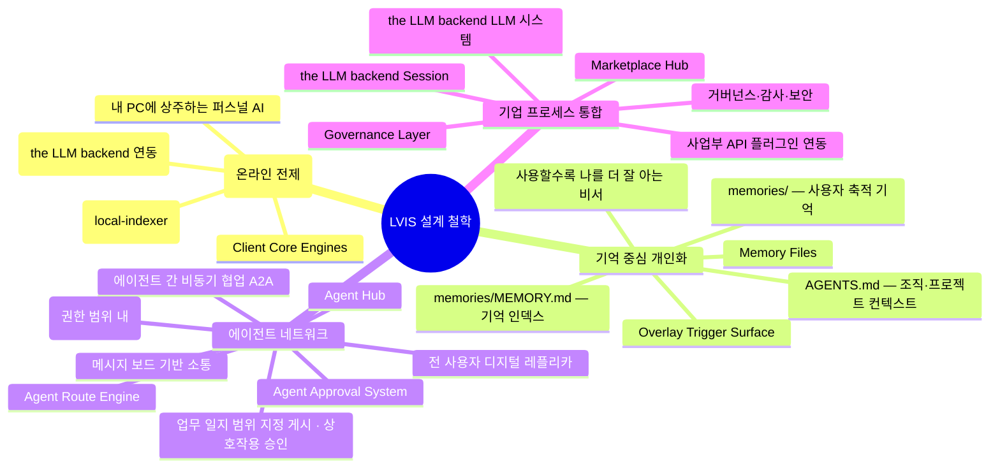

| 철학 원칙              | 아키텍처 구현체                                    | 철학이 구조가 되는 이유                                                      |
| ---------------------- | -------------------------------------------------- | ---------------------------------------------------------------------------- |
| **설치형·로컬 기반**   | Client Core Engines + Local Index                  | J.A.R.V.I.S.처럼 내 PC에 상주. 선배 5명에게 물어보던 것을 로컬에서 즉시 검색 |
| **기억 중심 개인화**   | Memory Files (AGENTS.md + MEMORY.md + memories/) + Overlay Trigger Surface | 사용자가 수락한 플러그인 제안을 main chat 의 정상 권한 경로로 가져온다. 기억이 쌓일수록 맞춤도 ↑      |
| **에이전트 네트워크**  | Agent Hub (Message Board) + A2A                    | "이영희님 이거 확인해주세요" → 본인 부재 중에도 레플리카가 대응              |
| **기업 프로세스 통합** | the LLM backend + Marketplace + Governance                  | 50~60장 문서 대신 "필수 조항·승인 단계"만 추출. 회사 허용 경로만 사용        |

---

## 2. High-Level Design (HLD)

### 2.1 System Overview — 전체 조감도

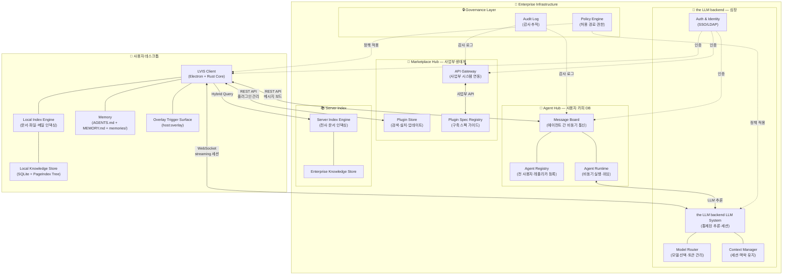

### 2.2 Five Pillars

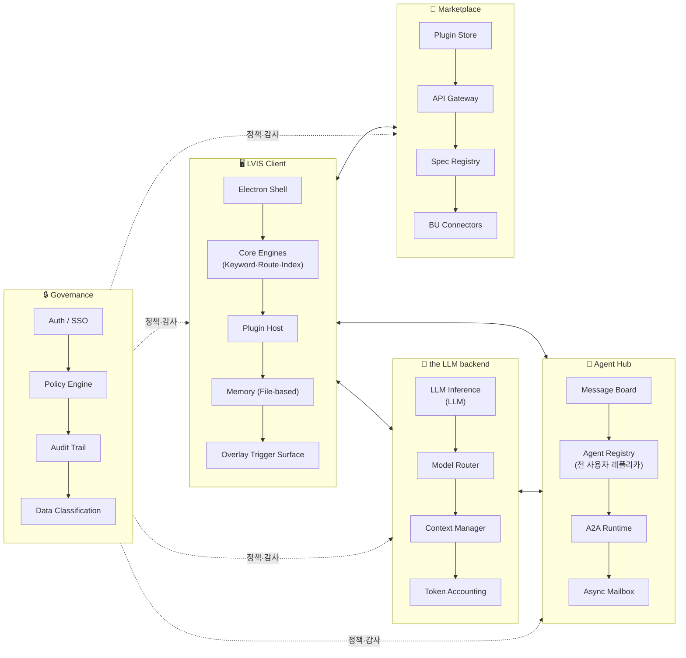

---

## 3. System Layer Map — 5-Layer Architecture

philosophy.md에서 제안한 4개 층(사용자·단말 / 실행·추론 / 연동 / 거버넌스)을 기반으로, 클라이언트 인텔리전스 레이어를 분리하여 5개 레이어로 구성한다.

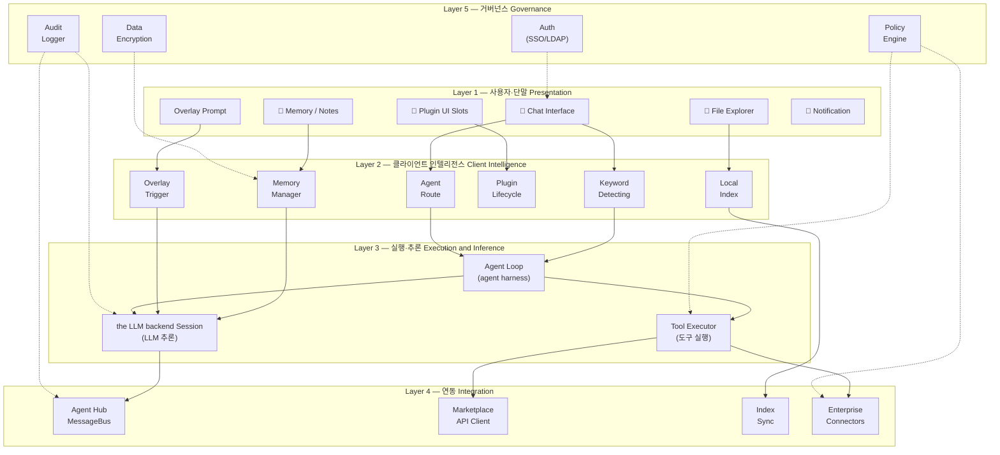

### Layer 역할 요약

| Layer  | 이름                  | philosophy.md 대응 | 핵심 역할                                                                     |
| ------ | --------------------- | ------------------ | ----------------------------------------------------------------------------- |
| **L1** | 사용자·단말           | 사용자·단말 층     | Electron UI + Plugin Slots. 사용자가 보고 만지는 모든 것                      |
| **L2** | 클라이언트 인텔리전스 | 사용자·단말 내부   | 로컬에서 돌아가는 지능. 키워드 감지, 에이전트 라우팅, 인덱싱, 기억, overlay trigger |
| **L3** | 실행·추론             | 실행·추론 층       | **the LLM backend(LLM)** 세션 + agent harness 기반 Agent Loop + Tool 실행          |
| **L4** | 연동                  | 연동 층            | Agent Hub, Marketplace, 서버 인덱스, enterprise 시스템 커넥터                       |
| **L5** | 거버넌스              | 거버넌스 층        | 인증, 정책, 감사, 암호화. 회사가 허용한 경로만 사용                           |

---

## 4. Low-Level Design (LLD)

### 4.1 Client Architecture (Electron + Rust Native)

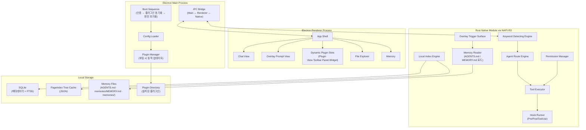

### 4.2 Boot Sequence — 부팅 시 동적 업데이트

> **Phase 1 갱신 (2026-04-13)**: Python Runtime Bootstrap 추가.
> **Runtime ownership 갱신 (2026-05-20)**: 앱 installer 는 OS별 host-owned runtime asset(`uv`, native binding)을 포함하고 검증하지만, 앱 부트는 `uv` materialize 나 Python dependency sync 를 수행하지 않는다. host-managed Python dependency install/venv sync 는 플러그인 start 전 `PluginRuntime.preparePluginStart` 가 비동기로 수행하되, venv 는 플러그인 id 별이 아니라 lockfile content + OS/arch 별 공유 env 로 관리한다. 준비 중 신규 플러그인은 `loadStatus=preparing` 으로 호출을 방어한다.
> **모듈 분리 정렬 (2026-05-11)**: 세부 로직은 `src/boot/*.ts` 모듈로 분리되어 있으며 (`services.ts`, `plugins.ts`, `conversation.ts`, `tools.ts`, `types.ts`), overlay trigger 는 별도 background engine 이 아니다. `host:overlay` capability 를 가진 플러그인이 `hostApi.triggerConversation()` 으로 overlay item staging 을 요청하고, 사용자가 CTA 를 수락한 뒤에만 main chat 으로 import 된다. PostTurnHookChain 은 세션 저장, memory extraction, title/checkpoint, audit, idle-poke 를 처리하며 overlay prompt 를 자동 생성하지 않는다.

**런타임 준비 경계:**

| 단계 | 책임 | 비고 |
| --- | --- | --- |
| App packaging | OS별 packaged `uv` archive + license + host native asset 검증 | 누락은 build/package gate 에서 fail-closed |
| App boot | runtime coordinator 인스턴스 주입 | `uv` materialize, Python install, dependency sync 를 기다리지 않는다 |
| Plugin install/start | plugin manifest 의 host-managed Python 선언 확인 | `python.managedBy === "lvis-app"` 또는 `requirementsLock` |
| Plugin prepare | packaged `uv` lazy materialize 후 `~/.lvis/runtime/python-envs/<os-arch-py-lockHash>/venv` 생성/sync | lockfile 이 같으면 공유, 성공 후 plugin-specific `pythonExecutable` 주입 |
| Plugin ready | `start()` 완료 후 tool/UI refresh | 실패 시 install-result failure 와 rollback |

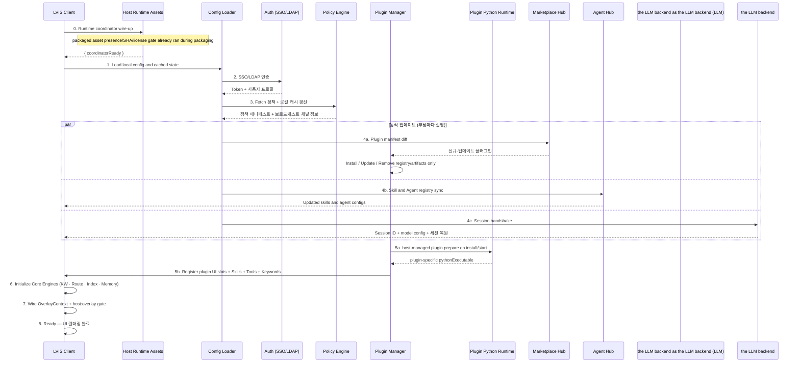

### 4.3 Input Classification & Routing — 대화 루프 진입 전 단계

이 섹션은 **사용자 입력을 어떤 실행 경로로 보낼지**를 다룬다. Keyword Detecting은 대화가 루프 본문에 들어가기 전에 수행되는 가장 빠른 사전 판단 단계이며, 빌트인 규칙과 플러그인 키워드 그룹을 함께 본다. 실제 턴 내부의 reasoning → tool → assistant 핑퐁은 **§4.5 Conversation Query Loop**를 단일 canonical 경로로 삼는다.

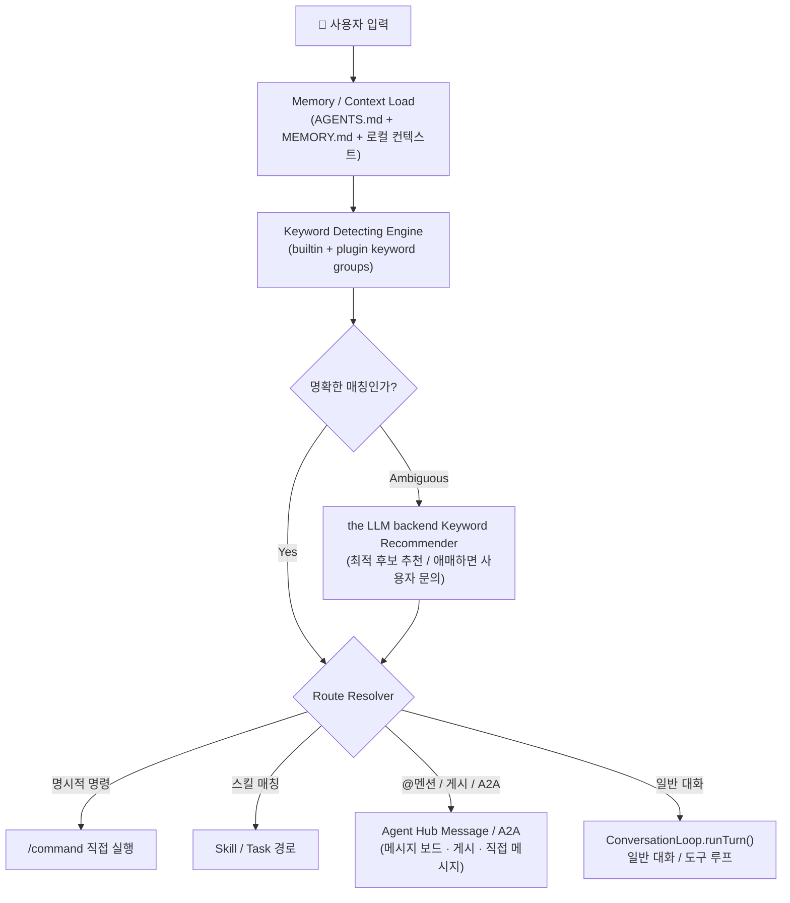

| 분류 결과 | 진입 지점 | 설명 |
| --- | --- | --- |
| **명령 실행** | Command executor | `/new`, `/compact`, `/load` 같은 즉시 명령 |
| **스킬/태스크** | Skill / orchestrator | 플러그인 키워드 그룹과 워크플로우를 기준으로 실행 경로 선택 |
| **에이전트 상호작용** | Agent Hub message board / A2A | 다른 에이전트에게 메시지·게시물·요청을 전달하는 경로. 백그라운드 자율 수행 서버를 뜻하지 않음 |
| **일반 대화** | `ConversationLoop.runTurn()` | 본 문서의 상세 턴 사이클은 §4.5에 정의 |

**설계 노트**

- 플러그인은 설치/활성화 시 **키워드 그룹**을 동적으로 등록한다.
- 동일 입력이 여러 그룹에 걸리면 the LLM backend가 가장 적합한 후보를 추천하고, 확신이 낮으면 사용자에게 확인을 요청한다.
- Agent Hub는 paperclip의 board와 유사한 **비동기 메시지 보드**이며, 에이전트가 백그라운드에서 자율 실행되는 서버를 의미하지 않는다.

### 4.4 Local Index Engine — 로컬 검색 엔진 LLD

로컬 PC의 데이터를 최대한 활용하는 핵심 엔진. the LLM backend와 상시 연동하여 LLM 추론 기반 인덱싱·검색을 수행한다.

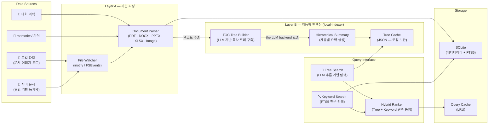

**2계층 인덱싱 아키텍처:**

```
Layer A — 기본 파싱 (텍스트 추출)
  File Watcher → Document Parser → 원문 텍스트 + 메타데이터

Layer B — 지능형 인덱싱 (local-indexer)
  원문 텍스트 → LLM 기반 목차 트리 구축 → 계층적 요약 → 추론 기반 검색
```

> [PageIndex](https://github.com/ken-jo/PageIndex.git)는 전통적 벡터 임베딩 대신 **LLM 추론 기반 트리 검색**을 채택한 인덱싱 엔진이다. 문서를 목차(TOC) 트리로 구조화한 뒤, 에이전트가 트리를 탐색하며 관련 페이지를 추론으로 찾는다. 벡터 유사도가 놓치는 문맥적 관련성을 잡아낼 수 있어 장문 문서(규정집, 보고서 등)에 강점이 있다.

| 구성 요소 | 기술 (Phase 1) | 설명 |
|-----------|------|------|
| **File Watcher** | chokidar (FSEvents / inotify / ReadDirectoryChanges) | 파일 변경 실시간 감지 → FolderAutoIndexer → IdleScheduler P0 enqueue |
| **Document Parser** | PDF: `pymupdf4llm` · DOCX/PPTX/XLSX/HTML: Microsoft `markitdown` · TXT/MD: 직접 읽기 | 포맷별 텍스트 추출 + 마크다운 변환. `kiwipiepy` 기반 한국어 형태소 토큰화 보강 |
| **PageIndex 트리 인덱서** | `pageindex==0.2.8` | TOC 트리 구조화. `search()` 메서드가 없으므로 LVIS가 `document_structure` / `document_page_content` 도구로 agentic 트리 탐색 수행 |
| **SQLite + FTS5** | SQLite FTS5 `unicode61` + `kiwipiepy` 사전 토큰화 (`content_ko`) | 한국어 BM25 (패턴 B): 형태소 추출 → 공백 결합 → FTS5 MATCH |
| **Vector Store** | OpenAI `text-embedding-3-small` (1536 dim) + `lancedb` 로컬 ANN | 100 chunks / batch, 400 RPM throttle, 지수 백오프 |
| **Hybrid Ranker** | `HybridRetriever` (TypeScript) — RRF `k=60`, `{bm25:0.5, vec:0.5, cloud:0.0}` | BM25 + vector + cloud adapter 결과를 가중 융합 |
| **Cloud Adapter** | `MockCloudIndexAdapter` | Phase 1은 빈 결과 반환, Phase 2에서 enterprise Elasticsearch + Milvus/Qdrant 실연결 |
| **Query Cache** | LRU Cache (in-memory, structure/content) | 재인덱싱 시 자동 무효화 |

**PageIndex 활용 시 고려사항 (Phase 1):**

| 항목 | Phase 1 현황 | 대응 방안 |
|------|------|-----------|
| 지원 포맷 | PDF · DOCX · PPTX · XLSX · HTML · MD · TXT | `pymupdf4llm`(PDF) + `markitdown`(Office / HTML) + 직접 읽기(텍스트). PPTX / XLSX 이미지 OCR은 Phase 2 Vision |
| LLM 의존성 | 임베딩은 OpenAI `text-embedding-3-small` 사용 | Phase 1은 OpenAI API key 필요. Phase 2는 BAAI / bge-m3 또는 the LLM backend 후속 경로 검토 |
| 온라인 전제 | 인덱싱 시 임베딩 API 호출 필요 | Phase 1은 외부 임베딩 경로, Phase 2는 로컬 / enterprise 임베딩으로 오프라인화 목표 |
| Python 런타임 | plugin start-scoped packaged `uv` lazy materialize + shared venv prepare | 앱 부트는 `uv` materialize/dependency sync 를 기다리지 않는다. host-managed Python 플러그인이 install/start 될 때 lockfile content + OS/arch keyed shared venv 를 준비하고 `pythonExecutable` 을 주입한다 |

#### 4.4.1 Phase 1 Production Upgrade — 완료 (2026-04-13)

Phase 1에서 §4.4 Layer A·B 명세를 production 수준으로 끌어올리는 구현이 완료되었다. 핵심 보강은 아래와 같다.

| 항목 | Phase 1 변경 |
| --- | --- |
| **Python 런타임 준비 경계** | 앱 installer 는 host-owned `uv` runtime asset 과 license 만 포함한다. `uv` materialize 와 Python interpreter/venv dependency sync 는 plugin manifest 의 host-managed Python 선언을 기준으로 plugin install/start 전 lazy 수행하며, venv 는 `~/.lvis/runtime/python-envs/<os-arch-py-lockHash>/venv` 로 공유한다 |
| **Layer A 파서** | PDF는 `pymupdf4llm`, DOCX / PPTX / XLSX / HTML은 Microsoft `markitdown` 단일 API 사용 |
| **PageIndex 통합** | `pageindex==0.2.8`은 검색 메서드가 없으므로 LVIS가 function calling으로 `document_structure` + `document_page_content`를 도구 노출해 agentic 탐색을 직접 구현 |
| **한국어 BM25** | `kiwipiepy 0.23.1` 형태소 추출 → `content_ko` 컬럼 → SQLite FTS5 `unicode61` 패턴으로 한국어 recall 보강 |
| **벡터 검색** | OpenAI `text-embedding-3-small` → `lancedb` 로컬 ANN. 100 chunks / request, 400 RPM throttle, 지수 백오프 |
| **Hybrid Ranker** | `lvis-app/src/main/hybrid-retriever.ts`가 worker BM25 / vector / cloud adapter 결과를 RRF(k=60)로 결합 |
| **Idle-aware 인덱싱** | `lvis-app/src/main/idle-scheduler.ts` 5-state 머신으로 유휴 시점에 우선순위 큐 처리 |
| **Cloud 어댑터** | `lvis-app/src/main/cloud-index-adapter.ts`는 Phase 1에서 mock 인터페이스만 제공 |
| **검색 도구** | builtin tool 4종 — `knowledge_search`, `document_list`, `document_structure`, `document_page_content` |
| **거버넌스 보강** | `lvis-app/src/tools/executor.ts` Step 2.5 Bash AST pre-validator, `lvis-app/src/main/audit-service.ts`, `lvis-app/src/hooks/post-turn-hook-chain.ts` 연계 |
| **Out-of-Scope** | LightRAG knowledge graph, 로컬 임베딩, the LLM backend 기반 인덱싱, enterprise cloud index 실연결, PPTX / XLSX OCR은 후속 단계 |

**Phase 1 완료 메트릭 (lvis-app 기준):**

| 지표 | 결과 |
| --- | --- |
| 신규 파일 | 25개 (TS 14 + Python 7 + 기타 4) |
| 변경 파일 | 11개 |
| TypeScript TSC | 0 errors |
| 회귀 테스트 | 86 / 86 PASS |
| 한국어 BM25 recall | 8 / 8 hit |

#### 4.4.2 Korean BM25 — 패턴 B (`kiwipiepy` + FTS5 `unicode61`)

한국어 형태소 분석을 FTS5에 연결하는 우회 패턴이다. FTS5 `unicode61` 단독은 한국어 recall이 급격히 낮아질 수 있으므로, 색인과 검색 양쪽에 동일한 형태소 파이프라인을 적용한다.

```
인덱싱:
  원문 텍스트
    → kiwipiepy.tokenize() — 형태소 + POS 필터 (N, V, MA, SL)
    → 공백 결합 → content_ko 컬럼에 저장
    → FTS5 unicode61 인덱스 (content_ko)

검색:
  쿼리 문자열
    → kiwipiepy.tokenize() — 동일 파이프라인
    → FTS5 MATCH 'tok1 tok2 ...'
    → BM25(FTS5) score 반환
```

**검증 결과 (R4):**

| 쿼리 | 기대 | 결과 |
| --- | --- | --- |
| `regulation` | hit | PASS |
| `규정` | hit | PASS |
| `규정집` | hit | PASS |
| `규정은` | hit | PASS |
| `규정한다` | hit | PASS |
| `support` | hit | PASS |
| `지원` | hit | PASS |
| `품의` | hit | PASS |

구현 위치: `lvis-plugin-local-indexer/worker/korean_tokenizer.py`

#### 4.4.3 HybridRetriever — RRF `k=60`

TypeScript 구현은 `lvis-app/src/main/hybrid-retriever.ts`에 있다. Python worker의 `/search/bm25`, `/search/vector`와 `MockCloudIndexAdapter` 결과를 Reciprocal Rank Fusion으로 통합한다.

**RRF 공식:**

```
score(d) = Σ_r weight_r × (1 / (k + rank_r + 1))
```

- `k = 60` — 순위 격차 완화 상수
- `rank_r` — 0-based rank (최상위 = 0)
- `+1` — 0-based rank 보정

**Phase 1 가중치:**

| Retriever | Weight | 비고 |
| --- | --- | --- |
| BM25 (FTS5) | 0.5 | Python worker `/search/bm25` |
| Vector (`lancedb`) | 0.5 | Python worker `/search/vector` |
| Cloud (Mock) | 0.0 | Phase 2에서 실연결 시 `{bm25:0.35, vec:0.35, cloud:0.3}` 재정규화 |

Phase 1.5에서 LightRAG를 도입하면 `{bm25:0.35, vec:0.35, lightrag:0.3}` 재조정 가능하다.

#### 4.4.4 IdleScheduler — 5-state 머신

`lvis-app/src/main/idle-scheduler.ts`는 사용자 PC 유휴 상태를 감지해 백그라운드 인덱싱을 스케줄링한다. Electron `powerMonitor` 추상화를 사용해 테스트 환경에서도 동일하게 검증 가능하다.

```
RUNNING ──── idle≥60s + CPU<40% + battery>50% OR AC ──→ IDLE_SCAN
IDLE_SCAN ─── keystroke ──→ THROTTLED (500ms 이내 반응)
IDLE_SCAN ─── suspend/thermal-critical ──→ PAUSED
THROTTLED ─── 2000ms cooldown ──→ RUNNING
PAUSED ──── resume ──→ RESUME_DELAY (90초 대기)
RESUME_DELAY ──── 90s elapsed ──→ RUNNING
```

**IDLE_SCAN 진입 조건 (모두 충족):**

| 조건 | 값 |
| --- | --- |
| 시스템 유휴 시간 | ≥ 60초 |
| CPU 5분 EMA | < 40% |
| 마지막 대화 경과 | ≥ 30초 |
| 전원 | AC 연결 OR 배터리 > 50% |

**우선순위 큐:**

| Priority | 용도 | 처리 모드 |
| --- | --- | --- |
| P0 | 방금 열린 파일 | real-time |
| P1 | 최근 7일 접근 | real-time |
| P2 | 중요 태그 / 변경 감지 | 기본 |
| P3 | 배경 변경 감지 | 배경 |
| P4 | orphan cleanup | batch |

#### 4.4.5 LLM Agentic 검색 — function calling (depth ≤ 3)

`pageindex==0.2.8`에 `search()` 메서드가 없으므로 LVIS는 4개 builtin 도구를 노출해 LLM이 트리를 직접 탐색하도록 한다. 현재 구현 도구 정의는 `lvis-app/src/tools/knowledge-search.ts`, depth cap enforcement는 `lvis-app/src/engine/conversation-loop.ts`에 있다.

| Tool | 동작 |
| --- | --- |
| `knowledge_search(query, topK?)` | `HybridRetriever` 호출 → RRF top 결과 반환 |
| `document_list()` | 인덱싱된 문서 목록 (`docId`, `docName`, `type`, `pageCount`) |
| `document_structure(docId)` | PageIndex TOC 트리 (agentic 탐색용) |
| `document_page_content(docId, pages)` | 특정 페이지 범위 본문 (`5`, `5-7`, `1,3,5-7`) |

`KNOWLEDGE_DEPTH_CAP = 3` 규칙으로 한 턴 내 `knowledge_search` 도구 호출 횟수를 제한해 agentic 루프의 토큰 폭주를 방지한다.

#### 4.4.6 CloudIndexAdapter — Mock 인터페이스 (Phase 1)

`lvis-app/src/main/cloud-index-adapter.ts`는 Phase 1에서 항상 빈 결과를 반환하는 mock 구현만 제공한다. 따라서 HybridRetriever의 cloud weight는 `0.0`이며 현재 결과 순위에는 영향을 주지 않는다.

**Phase 2 마이그레이션 경로:**

1. `CloudIndexAdapter` 인터페이스를 구현하는 실제 클라이언트 작성
2. enterprise Elasticsearch (BM25) + Milvus / Qdrant (벡터) 연결
3. weights를 `{bm25:0.35, vec:0.35, cloud:0.3}`으로 재정규화
4. `settings.indexing.cloudEnabled` feature flag로 제어

---

### 4.5 Conversation Query Loop — 대화 처리 핵심 사이클

> **Design Note**: 이 섹션은 LVIS 내부 요구사항에서 도출한 provider-neutral turn loop 이다. 구현 근거는 공개 표준 인터페이스와 LVIS 자체 코드 계약으로 제한한다.
> §4.3 Input Classification & Routing이 **입력 분류·라우팅** 구조라면, 이 섹션은 **한 턴(turn)이 내부에서 어떻게 실행되는지** — 메시지 생성부터 스트리밍 렌더링, 도구 실행, 컨텍스트 관리까지 — 상세 사이클을 기술한다.

#### 4.5.1 Core Cycle 개요

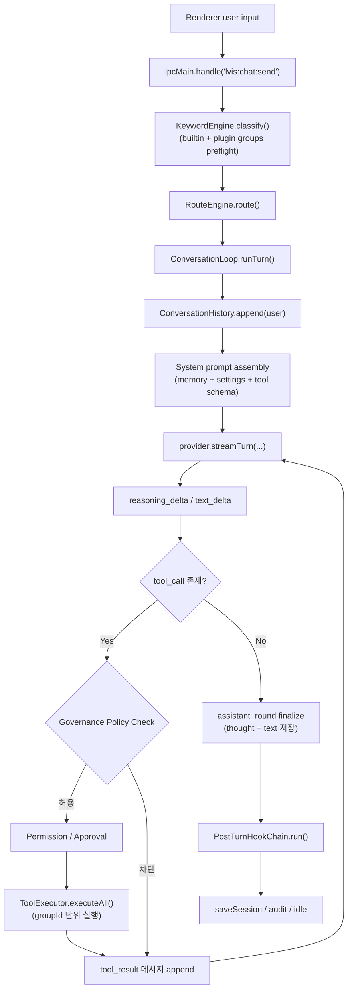

> **문서 원칙**: 이 섹션은 `ConversationLoop`의 현재 구현을 기준으로 설명하되, 아직 미구현인 목표 설계(Keyword disambiguation, Governance sync, richer session history)도 함께 유지한다.
> `GovernancePolicy`는 도구 호출이 생길 때마다 **루프 내부에서 반드시 통과하는 필수 게이트**이며, 바깥에서 한 번만 거르는 보조 체크가 아니다.

#### 4.5.2 메시지 라이프사이클 — 한 턴의 상세 단계

| 단계 | 함수 / 컴포넌트 | 설명 | 비고 |
| --- | --- | --- | --- |
| **1. 요청 진입** | `window.lvis.chat.send()` → `ipcMain.handle("lvis:chat:send")` | renderer 입력을 main process로 전달 | 채팅 UI의 단일 진입점 |
| **2. 조기 키워드 감지** | `KeywordEngine.classify()` | 대화 루프 본문에 들어가기 전에 명령/스킬/@멘션/일반 대화를 판단 | 플러그인 keyword group 동적 등록 지원. 다중 후보일 때 the LLM backend 추천/사용자 확인은 목표 설계 |
| **3. 실행 경로 결정** | `RouteEngine.route()` | `command` / `skill` / `agent-hub` / `llm` 중 하나로 경로 확정 | Agent Hub 경로는 메시지 보드/A2A 상호작용 경로 |
| **4. 턴 오케스트레이션** | `ConversationLoop.runTurn()` | 한 턴 전체를 관리하고 provider/tool/post-turn 훅을 묶는다 | 턴 경계의 canonical 구현 |
| **5. 히스토리 적재** | `ConversationHistory.append()` | user 메시지를 인메모리 히스토리에 추가 | assistant/tool_result도 동일 히스토리에 누적 |
| **6. 프롬프트 조립** | system prompt assembly | AGENTS.md, memories/MEMORY.md, 설정, 도구 스키마, 환경 정보를 합쳐 provider 입력 생성 | 매 턴 재조립 |
| **7. LLM 스트리밍** | `provider.streamTurn(...)` | provider가 `text_delta`, `reasoning_delta`, `tool_call`, `done` 이벤트를 순차 발생 | Claude / Gemini / OpenAI 공통 인터페이스 |
| **8. reasoning 누적** | `reasoning_delta` | 중간 생각은 별도 스트림 이벤트로 누적되고, assistant round와 분리해 UI에 표시 | OpenAI reasoning 모델도 replay 지원 |
| **9. 거버넌스/도구 실행** | `GovernancePolicy` → `PermissionManager` → `ToolExecutor.executeAll()` | 도구 호출 전 정책 차단, 승인 판단, 실행을 순서대로 수행 | GovernancePolicy는 로컬 정책 캐시를 보고, 상위 동기화 서버 broadcast로 갱신되는 설계를 유지 |
| **10. 라운드 확정** | `onAssistantRound` callback | tool 호출 전후의 assistant 텍스트/생각을 라운드 단위로 확정 | `thought` 필드로 세션에 저장 |
| **11. 렌더링 반영** | `ipc-bridge.ts` → `ui/renderer/App.tsx` (composition root) | reasoning, tool_start/tool_end, assistant_round를 UI 타임라인으로 변환 | 도구 묶음은 시각적으로만 병합 가능 |
| **12. 턴 후처리** | `PostTurnHookChain.run()` | auto-compact, saveSession, memory extraction, title/checkpoint, audit, idle-poke 조율 | **B4**: `runTurn(input, callbacks, abortSignal?)` — Ctrl/Cmd+C IPC → AbortSignal 전파로 스트리밍 중단 지원 (PR #129). **B1**: `manualCompact()` / `resetAndResume(sessionId)` IPC 구현 (PR #125). |

#### 4.5.3 스트리밍 아키텍처

사용자는 전체 응답 완료를 기다리지 않고 **keyword preflight → reasoning → tool group → reasoning → assistant** 순서를 스트림으로 확인한다. provider별 내부 transport는 다를 수 있지만, renderer가 받는 표준 이벤트는 `reasoning_delta`, `text_delta`, `tool_start`, `tool_end`, `assistant_round`, `done`이다.

```mermaid
sequenceDiagram
    participant UI as Renderer
    participant IPC as IPC Bridge
    participant KW as Keyword Engine
    participant ROUTE as Route Engine
    participant LOOP as ConversationLoop
    participant GOV as GovernancePolicy
    participant LLM as Provider
    participant TOOLS as ToolExecutor

    UI->>IPC: send(input)
    IPC->>KW: classify(input)
    KW-->>ROUTE: classification
    ROUTE-->>LOOP: route
    LOOP->>LLM: streamTurn(messages, systemPrompt)

    loop provider stream
        LLM-->>LOOP: reasoning_delta / text_delta
        LOOP-->>IPC: stream event
        IPC-->>UI: timeline update
    end

    alt tool_call detected
        LLM-->>LOOP: tool_call[]
        LOOP->>GOV: policyCheck(toolName, args)
        alt policy allow
            GOV-->>LOOP: allow / policy snapshot
            LOOP->>TOOLS: executeAll(toolUses)
            TOOLS-->>IPC: tool_start / tool_end
            IPC-->>UI: grouped tool card update
            TOOLS-->>LOOP: tool_result[]
            LOOP->>LLM: streamTurn(...tool results...)
        else policy deny
            GOV-->>LOOP: deny + reason
            LOOP->>LLM: blocked tool_result / error
        end
    else assistant round completed
        LOOP-->>IPC: assistant_round
        IPC-->>UI: finalize reasoning/tool/assistant entries
    end

    LOOP->>LOOP: PostTurnHookChain.run()
    IPC-->>UI: done
```

**핵심 구현 포인트**

| 항목 | 설명 |
| --- | --- |
| **초기 사전판단** | Keyword Detecting은 `runTurn()` 초입에서 수행되며, plugin keyword group도 함께 반영된다. |
| **First-class reasoning** | reasoning은 `text_delta`의 부가 플래그가 아니라 별도 이벤트다. 그래서 도구 묶음 사이에 중간 생각을 독립 카드로 배치할 수 있다. |
| **Round boundary 보존** | `assistant_round` 이벤트로 tool 호출 전/후의 assistant 응답을 안정적으로 끊는다. |
| **시각적 도구 병합** | renderer는 assistant 텍스트가 끼지 않은 인접 tool round만 한 묶음으로 합친다. query loop ID를 억지로 재사용하지 않는다. |
| **오류 국소화** | 실패는 개별 tool item에만 귀속되고, 같은 group의 다른 도구와 다음 assistant round는 계속 진행될 수 있다. |
| **지속성** | assistant `thought`는 히스토리에 저장되어 tool round-trip 후에도 reasoning 모델의 문맥이 유지된다. |
| **거버넌스 동기화** | 대화 루프는 로컬 GovernancePolicy를 조회하고, 상위 정책 동기화 서버의 broadcast로 갱신되는 설계를 전제로 한다. |

#### 4.5.4 컨텍스트 관리 — Auto-Compact

LVIS 는 라이선스와 출처가 확인된 공개 OSS/공식 문서에서 관찰 가능한 컨텍스트 관리 패턴과 자체 요구사항을 합성한 compact pipeline 을 채택한다. 토큰 preflight 가 임계치를 넘으면 LLM 호출을 잠시 차단하고, *현재 세션 안에서* tool-result stubbing 과 LLM compact 를 실행해 실제 토큰을 줄인다.

**사용자 contract**: compact 는 어떤 input shape (단일 200K 메시지 / 다수 중간 메시지 누적 / 깊은 tool chain) 에서도 reduce 보장. 수동 메시지 삭제 없이 항상 성공해야 함.

**Tool-Result Stubbing (preventive, marker-only)**: 매 post-turn 마다 실행. `markStaleToolResults()` 가 오래된 `tool_result` 메시지에 `meta.compactedAt` 단일 마커만 set — 메모리상의 content 는 *verbatim 보존* 된다. 마커가 있는 메시지는 `wire-serialize.ts:stubMarkedToolResults` 가 provider 호출 직전 + `saveSession` 직전에 stub 으로 변환. 최근 N개 (기본 8) raw 유지, 200자 미만 제외 (LVIS noise-floor policy), `toolUseId` 참조 무결성 보존 (`src/engine/auto-compact.ts:114-124`).

**LLM Compact with Boundary (threshold-gated, 4-status pipeline)**: token preflight 가 `estimateMessagesTokens(history) ≥ getModelPreflightThreshold(vendor, model)` 을 hit 하면 LLM 호출 차단 + `compactWithBoundary()` (`src/engine/structured-compact.ts`) 동기 실행. 결과는 4 상태 중 하나 (`src/shared/compact-status.ts:CompressionStatus`):

- `NOOP` — history 가 이미 작음. boundary 없이 반환.
- `CONTENT_TRUNCATED` — per-message truncation 만으로 충분히 reduce. LLM 호출 skip. 원본은 `~/.lvis/sessions/<id>/truncated/` 에 격리.
- `SUMMARIZED` — 정상 LLM 요약 경로. boundary stub + recentVerbatim 으로 history 교체.
- `REDUCED_INSUFFICIENT_FORCED` — 위 모두 후에도 over-budget. last-resort 로 protected recent turn 바깥의 toPreserve oldest 50% 강제 drop + archive.

내부 sub-stage (`compactWithBoundary` 안):

- **Per-message truncation** — 단일 메시지가 30K tokens 초과 시 원본을 archive 파일로 격리한다.
- **History-wide reverse-budget truncation** — per-message truncation 이후 toCompact 총 토큰이 LLM input budget (preflight × 0.9) 초과 시 oldest 부터 drop & archive 한다. O(N) 구현 — running token total 유지.
- **Boundary split** — `splitForBoundary` 로 toCompact / toPreserve 분리. preserveRecentTokens 는 ceiling 이지만 최근 5개 user turn(+ compact 직전 pending user question)은 token budget 과 별개로 verbatim 보존한다. tool_use/tool_result pair 안전: `adjustToToolBoundary` (bounded 3-step backward) + `adjustForwardToToolBoundary` (unbounded forward, leading tool_result 만 skip) — 모든 surviving[0] 이 orphan tool_result 가 되지 않음 보장.
- **Structured summary** — 12-section structured LLM summary (`SUMMARY_TEMPLATE_PROMPT_V1`) + freezeBoundary (P7 invariant).
- **Forced archive** — post-compact estimatedAfter > preflight × 0.8 시 protected recent turn 바깥의 toPreserve oldest 50% drop. `adjustForwardToToolBoundary` 로 surviving 시작이 orphan tool_result 안 되게 보호.

Auto-compact trigger:

- `estimateMessagesTokens(history) ≥ getModelPreflightThreshold(vendor, model)`
- `getModelPreflightThreshold` 는 모델별 usable context budget 의 80%
- message count 기반 자동 압축/eviction 없음. 같은 `sessionId` 안에서 checkpoint compact 만 수행

Adaptive `preserveRecentTokens` (runPreflightGuard 가 결정):

- usagePct < 80%: `preflight × 0.4` (정상)
- usagePct in [80, 100): `preflight × 0.2` (orange zone)
- usagePct ≥ 100%: `0` (red zone — 단, 최근 5 user turn 보존 invariant 는 유지)

CONTENT_TRUNCATED / REDUCED_INSUFFICIENT_FORCED 경로의 `truncatedDir` 은 `onCompactOccurred` 콜백 → IPC `compact_notice` → renderer `CheckpointDivider` 의 footnote 까지 plumb. 사용자가 archive 위치를 가시 확인 가능.

`compactNum` 은 NOOP 외 모든 경로에서 증가하여 view/branch action 의 anchor 역할.

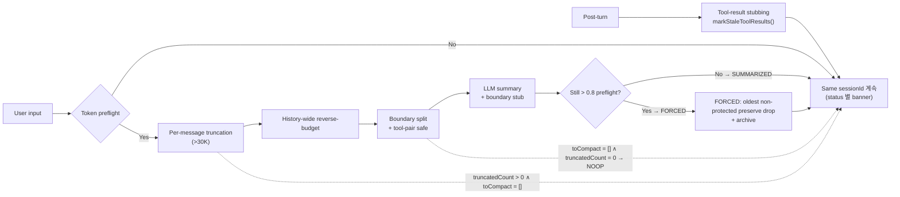

| 항목 | Tool-result stubbing | LLM compact (4-status) |
| --- | --- | --- |
| 트리거 | 매 post-turn (항상) | token preflight hit |
| 함수 | `markStaleToolResults()` | `compactWithBoundary()` |
| 결과 | wire/disk 토큰 절감 | 4 status (NOOP / CONTENT_TRUNCATED / SUMMARIZED / REDUCED_INSUFFICIENT_FORCED) |
| 보존 규칙 | 최근 8 raw + 200자 미만 제외 | 최근 5 user turn verbatim + adaptive `preserveRecentTokens`: 0.4/0.2/0 × preflight (usagePct 별) |
| 수동 트리거 | (자동만) | `/compact` 슬래시 명령어 |
| 원본 보존 | content verbatim (in-memory) | `~/.lvis/sessions/<id>/truncated/` archive (CONTENT_TRUNCATED, FORCED 경로) |

#### 4.5.5 Post-Turn Hooks

매 assistant 턴 완료 후 실행되는 후처리 파이프라인이다. 현재 구현은 세션 저장, memory extraction, title/checkpoint, audit, idle-poke 를 순차 처리한다. Overlay trigger 는 이 chain 에서 자동 생성되지 않고, 플러그인이 `hostApi.triggerConversation()` 으로 명시 요청한 overlay item 만 사용자 수락 후 main chat 으로 들어온다.

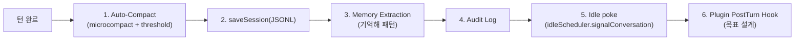

| Hook | 목표 설계 | 현재 구현 단계 |
| --- | --- | --- |
| **Auto-Compact** | 사용률 40% 기본값 + 20% 단위 설정 기반 자동 압축 | `chat.autoCompact` + 80k token threshold. microcompact(항상) + full compact(임계치) 2-stage 구현 |
| **saveSession** | 매 턴 세션 히스토리 저장 및 복구 포인트 생성 | `~/.lvis/sessions/<id>.jsonl`에 저장 |
| **Memory Extraction** | 대화/도구 결과에서 기억할 내용을 구조화 저장 | `"기억해"`류 요청을 memories/로 저장하고 MEMORY.md 인덱스 갱신 |
| **Audit Log** | 대화·도구·정책 차단·승인 이력을 기록 | 구현됨 |
| **Idle poke** | 다음 입력 대기 전 상태 갱신과 조용한 heartbeat 보조 신호 | idle scheduler 신호 전달 구현 |
| **Plugin PostTurn** | 활성 플러그인의 후처리 훅 실행 | 문서상 목표 설계 유지 |

#### 4.5.6 도구 실행 파이프라인 상세

`ToolExecutor`는 모든 도구 호출의 single choke point다. 상세 보안 모델은 `tool-governance.md`를 따르며, 여기서는 **현재 구현 순서**와 **유지되어야 할 Governance 정책 경계**를 함께 요약한다.

```mermaid
sequenceDiagram
    participant LOOP as ConversationLoop
    participant REG as ToolRegistry
    participant HOOK as HookRunner
    participant AST as BashAstValidator
    participant GOV as GovernancePolicy
    participant PERM as PermissionManager
    participant APPROVAL as ApprovalGate
    participant LIMIT as RateLimiter
    participant EXEC as ToolExecutor
    participant AUDIT as AuditLogger

    LOOP->>REG: findByName(toolName)
    REG-->>LOOP: tool
    LOOP->>HOOK: runPreHooks(input)
    LOOP->>AST: validate(bash input)
    LOOP->>GOV: policyCheck(name, source, args)

    alt policy deny
        GOV-->>LOOP: deny + reason
        LOOP->>AUDIT: log(BLOCKED, reason)
    else policy allow
        GOV-->>PERM: allow / policy snapshot
        LOOP->>PERM: checkDetailed(name, source, category)

        alt ask decision
            PERM-->>APPROVAL: requestAndWait(...)
            APPROVAL-->>LOOP: allow / deny
        end

        LOOP->>LIMIT: check(name, trust)
        LOOP->>EXEC: tool.execute(finalInput)
        EXEC-->>LOOP: result / error
        LOOP->>HOOK: runPostHooks(result)
        LOOP->>AUDIT: logToolCall(...)
    end
```

| 순서 | 단계 | 설명 |
| --- | --- | --- |
| **1** | Lookup | `ToolRegistry.findByName()` + source/trust 계산 |
| **2** | PreToolUse Hook | 외부 훅이 입력을 차단/수정할 수 있음 |
| **2.5** | Bash AST Validator | bash 입력은 별도 AST 검증을 거침 |
| **3** | Governance Policy Check | 로컬 정책 캐시 기준으로 도구 차단/허용을 먼저 판단 |
| **4** | Permission / Approval | `deny` / `ask` / `allow` 결정 후 필요 시 UI 승인 |
| **5** | Hook override 반영 | 수정된 입력을 최종 실행 인자로 확정 |
| **6** | Rate limit | trust 수준별 호출 빈도 제한 |
| **7** | Execute | 실제 도구 실행 |
| **8** | PostToolUse Hook | 결과 후처리 및 차단 |
| **9** | Audit + tool_result | 감사 로그 기록 후 LLM loop에 결과 반환 |

> **Governance 설계 노트**: `GovernancePolicy`는 로컬 정책 캐시에서 평가되고, 상위 **거버넌스 정책 동기화 서버**가 브로드캐스팅하는 delta를 받아 갱신되는 구조를 목표로 한다. 따라서 대화 루프는 매 호출마다 네트워크 왕복이 아니라 **최신 로컬 정책 스냅샷**을 조회한다.

#### 4.5.7 대화 세션 관리

| 항목 | 목표 설계 | 현재 구현 단계 |
| --- | --- | --- |
| **세션 생성** | 앱 실행 시 또는 `/new` 명령 시 새 세션 생성 | 구현됨 (세션 ID = UUID v4) |
| **세션 히스토리 보관** | 타 채팅 앱처럼 최근 대화 목록·복구 가능해야 함 | `MemoryManager.saveSession()`이 JSONL 파일로 저장 |
| **세션 조회** | 최근 세션 목록 + 제목/미리보기/검색까지 확장 | `listSessions()`와 IPC `lvis:chat:sessions`가 최근 목록 제공 |
| **세션 이어가기** | UI에서 명시 선택한 세션만 히스토리 복원 → 컨텍스트 재조립 | `/load` 및 `chatSessionResume(sessionId)` 경로 |
| **멀티 세션 UX** | 현재 세션 중심 + 사용자가 선택한 세션 전환 UX | main active state는 `.active-session.json`으로 관리, routine session은 `sessionKind="routine"`으로 분리 |
| **세션 삭제/정리** | 보존 정책과 사용자 삭제 UI 확장 | JSONL, metadata, session sidecar, checkpoint snapshot 디렉토리까지 함께 삭제 |
| **메시지 스키마** | `user` / `assistant` / `tool_result` + assistant `thought` 유지, 추후 preview 메타데이터 확장 | reasoning을 별도 persistent message type으로 늘리지는 않음 |

#### 4.5.8 대화 루프 구현 매핑

| Provider-neutral turn loop 단계 | LVIS 대응 구현 | LVIS 차별점 |
| --- | --- | --- |
| User message creation | renderer input → `ipcMain.handle("lvis:chat:send")` | Electron IPC + 조기 keyword preflight |
| Append to conversation history | `ConversationHistory.append()` | + assistant `thought` 보존 |
| Build system prompt | system prompt assembly | + AGENTS.md · MEMORY.md · 조직 컨텍스트 · tool schema · overlay trigger context |
| Stream to active provider | `provider.streamTurn(...)` | provider 공통 인터페이스로 Claude/Gemini/OpenAI 수용 |
| `findToolByName()` | `ToolRegistry.findByName()` | + Plugin · MCP 동적 등록 통합 레지스트리 |
| `canUseTool()` | `GovernancePolicy` + `PermissionManager.checkDetailed()` | + source/trust aware approval gate + 정책 동기화 전제 |
| `StreamingToolExecutor` | `ToolExecutor.executeAll()` | + groupId, displayOrder, bash validator, rate limit |
| Post-sampling hooks | `PostTurnHookChain.run()` | 현재: compact(2-stage) + saveSession + memory extraction + title/checkpoint + audit + idle-poke. 목표: plugin post-turn 확장 |
| Auto-compact | `AutoCompact` | 목표: 40% 기본값/20% 단위 설정, 현재: 80k token threshold + on/off |
| Wait for next input | renderer idle state | + reasoning/tool/assistant 타임라인 유지 |

#### 4.5.9 System Prompt 조립 상세 — 12개 소스

> **Design Note**: 시스템 프롬프트 조립은 LVIS가 필요한 정적/동적 입력을 명시적으로 합성하는 내부 계약이다.
> the LLM backend에 전송되는 시스템 프롬프트는 매 턴마다 아래 12개 소스에서 조립된다.

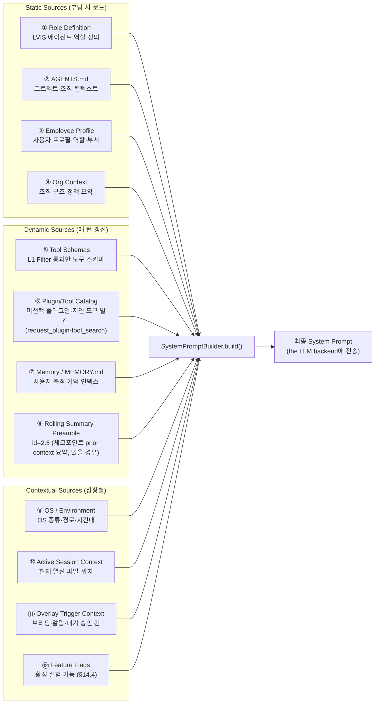

| # | 소스 | 갱신 주기 | 토큰 예상 | 설명 |
| --- | --- | --- | --- | --- |
| ① | Role Definition | 부팅 시 (정적) | 1~2K | LVIS 에이전트의 기본 역할·행동 원칙 정의 |
| ② | AGENTS.md | 파일 변경 시 | 2~5K | 프로젝트·조직 레벨 컨텍스트 (사용자 편집 가능) |
| ③ | Employee Profile | 부팅 시 | 0.5~1K | 사용자 이름·직급·부서·역할 |
| ④ | Org Context | 부팅 시 | 1~2K | 조직 구조 요약, 팀원 목록, 보고 라인 |
| ⑤ | Tool Schemas | 매 턴 | 3~8K | L1 Filter 통과 후 the LLM backend에 노출할 도구 JSON 스키마 |
| ⑥ | Plugin/Tool Catalog | 매 턴 (조건부) | 0.5~2K | 현재 턴에 아직 선택되지 않은 enabled 플러그인 카탈로그 + 대형 도구 표면용 지연 도구 카탈로그 (`tool_search`, `EAGER_TOOL_EXPOSURE_CEILING`). 사용자 비활성 플러그인은 카탈로그에서 제외된다. 활성 플러그인 도구 스키마는 200개 미만에서는 ⑤에 eager 포함, 200개 이상에서는 선택 로드 |
| ⑦ | MEMORY.md | 파일 변경 시 | 1~3K | 사용자 축적 기억 인덱스 — 선호, 루틴, 프로젝트 정보 |
| ⑧ | Rolling Summary Preamble (id=2.5) | on-change | 2~5K | 체크포인트에서 이어받은 prior context summary. `summaryPreamble` 가 set 된 모든 턴에서 주입. |
| ⑨ | OS / Environment | 부팅 시 | 0.3~0.5K | OS 종류, 홈 디렉터리, 시간대, 현재 시각 |
| ⑩ | Session Context | 매 턴 | 0.5~1K | 현재 열린 파일, 작업 디렉터리 등 |
| ⑪ | Overlay Trigger Context | 매 턴 (조건부) | 0.5~2K | 대기 중인 승인 건수, 임박 일정, 브리핑 요약 |
| ⑫ | Feature Flags | 부팅 시 | 0.2~0.5K | 활성 실험 기능 목록 (§14.4 Feature Flag 참조) |

**총 토큰 예산**: 약 15~35K tokens (the LLM backend 컨텍스트 윈도우의 3~7%)

---

#### 4.5.10 Tool Call Presentation — grouped card + drill-down

도구 호출은 **한 번의 tool round = 하나의 group card**로 먼저 보여주고, 사용자가 펼칠 때만 하위 도구와 입력/결과를 드러낸다. renderer는 assistant 텍스트가 끼지 않은 인접 group만 시각적으로 병합해, 사용자가 자연스러운 `생각 → 도구 → 생각 → 도구 → 응답` 흐름을 볼 수 있게 한다.

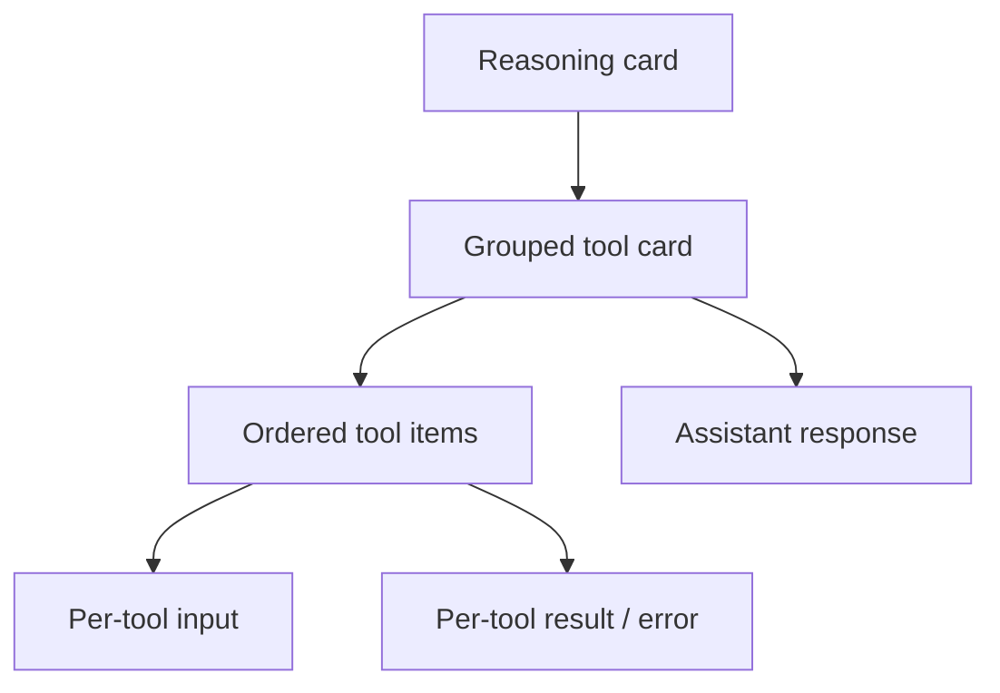

**표현 규칙**

| 레벨 | 표시 방식 | 클릭 시 |
| --- | --- | --- |
| **Reasoning** | 진행 중 생각/정리 카드를 별도 entry로 표시 | 도구 묶음 사이에도 독립적으로 남음 |
| **Tool group** | 사용된 도구 개수와 상태를 요약한 접힘 카드 | 하위 tool item 목록을 펼침 |
| **Tool item** | 도구명 + 실행 순서 + 성공/실패 | 입력/결과 상세를 각각 펼침 |
| **Input panel** | tool input JSON/raw input | 필요할 때만 노출 |
| **Result panel** | 도구 결과 또는 오류 메시지 | 실패는 해당 item에만 국한 |

**현재 구현 상태 규칙**

- `tool_start`가 오면 group card가 먼저 생성되고, assistant 본문보다 앞에 보일 수 있다.
- 각 도구는 `toolUseId`, `displayOrder`를 가지므로 하위 목록 순서가 안정적이다.
- 한 사용자 turn 안의 최종 assistant answer 이전 항목은 하나의 WorkGroup 으로 묶는다. 대상은 `reasoning`, `tool_group`, mid-turn `assistant_round` 텍스트 전체다.
- WorkGroup 은 intermediate 항목이 1개뿐이어도 생략하지 않는다. 단일 단계 예외는 이전 작업 로그가 다시 본문에 노출되는 원인이 된다.
- 최종 assistant answer 만 standalone 으로 노출하고 `TurnActionBar` 를 갖는다. 이 원칙이 사용자가 읽어야 할 결론과 내부 작업 로그를 분리하는 canonical UI 계약이다.
- WorkGroup 안에서도 연속 multi-tool 호출은 기존 tool group card 를 유지한다. 다만 단일 tool 호출은 별도 group wrapper 없이 tool row 로 표시한다. 즉 turn-level WorkGroup 은 항상 하나지만, 그 안의 multi-tool batch 는 `도구 사용 결과 N개` 로 접힐 수 있다.
- 완료된 도구 묶음은 접힘 상태로 유지되고, 필요 시에만 펼친다.
- `spawn sh ENOENT` 같은 실행 실패는 그룹 전체가 아니라 해당 tool item 실패로만 표시한다.

**레퍼런스 처리 방식**

| 시스템 | 관찰된 처리 방식 | LVIS 반영 |
| --- | --- | --- |
| **Provider-neutral event stream** | tool_use / tool_result를 순서 있는 스트림 이벤트로 유지 | group card는 UI 표현 계층에서만 형성 |
| **OpenHarness** | 실행 run 단위를 구조화해 추적 | LVIS도 tool round를 `groupId` 단위로 추적 |
| **Paperclip / PaperclipAI** | thinking, tool call, tool result, assistant를 분리 기록 | reasoning card와 assistant round를 분리 유지 |

Chat은 단일 `ChatView` 컴포넌트를 통해 렌더링된다 (issue #547). PR #473에서 도입된 `StackedChatView` 컴포넌트는 제거되었으며 — Kakao-style 연속 스트림, day separator, token chip, WorkGroup 등 설계 의도는 `ChatView`에 직접 흡수되었다. 태그 `v1-chat` (`24191323`)이 회귀 경계로 유지된다 — chat 동작은 해당 지점 이전으로 회귀해서는 안 된다.

#### 4.5.11 Same-Session Compact Checkpointing

현재 compact 모델은 자동 세션 분리 없이 같은 sessionId 안에서 컨텍스트를 줄이고,
checkpoint anchor 를 남긴다. 사용자 명시 fork 를 제외하면 compact 경로는 항상
sessionId 를 유지한다.

**Token Preflight (blocking)**: `runPreflightGuard` 가 매 user 입력 직후 호출된다.
`estimateMessagesTokens(history) ≥ getModelPreflightThreshold(vendor, model)` 이 hit 하면
LLM 호출을 차단하고 `compactWithBoundary` 를 동기 실행한 뒤 같은 sessionId 그대로
진행한다. Threshold 는 model context window 의 보수적 비율이며 semantic/time 휴리스틱이
아니라 *토큰* 만 측정한다.

**LLM Compact (boundary-marked)**: `compactWithBoundary` 는 rolling summary 를 생성해
다음 턴의 system prompt 에 preamble 로 prepend 한다. 같은 sessionId 안에서
`kind: "checkpoint"` ChatEntry 가 history 에 append 되어 checkpoint anchor 역할을 한다.
`compactNum` 은 sessionId 안에서 monotonically increasing 하며 후속 view/branch action 의
anchor 가 된다.

**Same-Session Checkpoint Chain**: 한 sessionId 안에 여러 compact checkpoint 가 연속 append 된다.
사용자는 두 가지 액션으로 시점 탐색이 가능하다. "📖 이 시점 보기" 는 같은 sessionId 의
message slice 만 표시하는 readonly view-mode 에 진입하고, "↩ 여기부터 다시 시작" 은
해당 compactNum 위치에서 *명시적으로* 새 세션을 fork 한다. 자동 fork 는 일어나지 않는다.

**Renderer 표면**: LLM compact 가 완료되면 `compact_notice` IPC event 가 `trigger` + `summary` + `compactNum` 을 carry 한다. `kind: "checkpoint"` 구조화 ChatEntry 가 chat stream 에 삽입되고, `CheckpointDivider` 컴포넌트가 trigger 별 라벨/아이콘/색상 (`auto-compact` → 📌 자동 정리 / `--action-compact` blue, `manual` → ✋ 수동 정리 / `--muted-foreground` slate) 으로 horizontal divider 를 렌더링. `compactNum` 이 있을 때 두 액션 버튼 — "📖 이 시점 보기" (view-mode 진입, `--action-view` violet) + "↩ 여기부터 다시 시작" (해당 시점에서 새 세션 fork, `--action-branch` orange) — 을 함께 노출. `kind: "session_resume"` 은 fork 된 child session 의 첫 진입 시 prepend 되어 "이전 대화 이어서 시작 (요약 N자 적용)" 마커로 표시.

**Prompt-injection fence**: rolling summary preamble 을 system prompt 에 주입할 때 `<prior-context-summary>` 블록을 *명령 해석 금지* fence 로 wrap (system-prompt-builder Section 8). 이전 컨텍스트의 사용자 입력이 요약을 거쳐 다음 턴 / fork 된 자식 세션의 system prompt 로 흘러들어가는 vector 차단.

**세션 로드/복원 기준**: [`session-model-v2.md`](./session-model-v2.md) 가 canonical 이다.
채팅 화면은 현재 세션만 렌더링한다. chronological session 자동 로드, upward-scroll preview,
latest-today/day-boundary resume 은 구현 기준에서 제외한다.

---

### 4.6 Source Tree Layout & Module Boundaries — Phase 3

Phase 3 리팩터 기준 `lvis-app/src/` 모듈 경계다. Phase 1~2의 `src/agent/` / `src/core/` 과부하를 해소하고, OpenHarness 비교 연구 결과를 반영한 **단일 관심사 디렉터리** 원칙을 적용한다.

#### 4.6.1 Canonical Directory Map

```
lvis-app/src/
├── main.ts, boot.ts, preload.ts, ipc-bridge.ts,
│   plugin-ui-host.tsx                                        # 엔트리 / 브릿지
│
├── renderer.tsx   # minimal entry — mounts ui/renderer/App.tsx
├── ui/renderer/   # Renderer composition root (Phase 1~4.6 split 완료)
│   ├── App.tsx                  # composition root
│   ├── ChatView.tsx, SettingsDialog.tsx, MainToolbar.tsx
│   ├── context/                 # ChatContext (state provider for ChatView subtree)
│   ├── hooks/                   # 14 domain hooks (settings, chat-state, briefing,
│   │                            #  approval, search, context-budget, cost-estimate,
│   │                            #  sessions, starred, plugin-marketplace, role-presets,
│   │                            #  app-bootstrap, indexed-docs, marketplace-updates)
│   ├── components/              # BriefingCard, AssistantCard, UserMessageEditor,
│   │                            #  ReasoningCard, ToolApprovalDialog, ToolGroupCard,
│   │                            #  UnifiedSearchPanel, Sparkline, UsageDashboard,
│   │                            #  HtmlPreview, StarredView,
│   │                            #  MarketplaceUpdateBanner
│   ├── dialogs/                 # ApprovalDialog, PluginInstallDialog,
│   │                            #  PluginUninstallDialog, CommandPaletteDialog
│   ├── tabs/                    # LlmTab, AppearanceTab, ChatTab, WebTab,
│   │                            #  PrivacyTab, PermissionsTab,
│   │                            #  RolesTab, AuditTab, PluginPerfTab,
│   │                            #  McpTab, PluginConfigTab, MarketplaceTab
│   │                            #  (RoutinePanel → components/ as built-in view)
│   ├── utils/                   # cost-format, html-preview, history, compose
│   └── types.ts, constants.ts, api-client.ts
│
├── engine/        # 에이전트 루프 + LLM 프로바이더
│   ├── conversation-loop.ts, conversation-history.ts, auto-compact.ts
│   └── llm/       # claude / openai / gemini provider + factory
│
├── tools/         # 1-file-per-tool
│   ├── base.ts
│   ├── executor.ts
│   ├── knowledge-search.ts
│   ├── bash.ts
│   └── untrusted-banner.ts
│
├── prompts/       # 시스템 프롬프트 조립
│
├── hooks/         # Script hook + post-turn 인터셉트
│   ├── hook-runner.ts
│   ├── post-turn-hook-chain.ts
│   ├── script-hook-types.ts
│   ├── script-hook-runner.ts
│   ├── script-hook-manager.ts
│   ├── hook-discovery.ts
│   └── hook-trust-commands.ts
│
├── permissions/   # 권한 스택
│   ├── permission-manager.ts, permissions-store.ts, policy-store.ts,
│   │   approval-gate.ts, agent-action-requester.ts,
│   │   sensitive-paths.ts
│
├── sandbox/       # 파일 경계 강제
│   └── path-validator.ts
│
├── memory/        # §5 파일 기반 기억
│
├── audit/         # 감사 로그 / DLP 필터
│   └── audit-logger.ts, dlp-filter.ts
│
├── core/          # 남은 cross-cutting
│   ├── keyword-engine.ts, route-engine.ts,
│   │   tool-registry.ts
│   └── network-guard.ts
│
├── mcp/           # Model Context Protocol 클라이언트
│
├── plugins/       # 플러그인 런타임
│   └── runtime.ts, registry.ts, marketplace.ts, deployment-guard.ts, types.ts
│
├── data/, main/, lib/, components/ui/, ui/, __tests__/
```

#### 4.6.2 Module Boundary Rules

| 디렉터리 | 허용되는 의존 | 금지 |
| --- | --- | --- |
| `engine/` | `permissions/`, `hooks/`, `prompts/`, `tools/`, `audit/`, `memory/`, `mcp/`, `core/`, `plugins/`, `engine/llm/` | DOM, `renderer.tsx`, `components/` |
| `tools/` | `permissions/`, `sandbox/`, `core/network-guard.ts`, `hooks/` | `engine/`, `renderer.tsx` |
| `prompts/` | `memory/`, `data/` | `engine/`, `renderer.tsx` |
| `hooks/` | `permissions/`, `audit/`, `core/network-guard.ts` | `engine/` (hooks are called by engine) |
| `permissions/` | `data/settings-store.ts`, `audit/` | `engine/`, `tools/`, `renderer.tsx` |
| `sandbox/` | Node stdlib only (leaf) | 모든 상위 |
| `memory/` | `data/` | `engine/`, `tools/` |
| `audit/` | `data/` | `engine/`, `tools/` |
| `core/` | `permissions/`, `memory/`, `tools/`, `plugins/` | `engine/`, `renderer.tsx` |
| `plugins/` | `permissions/`, `hooks/`, `data/`, `mcp/` | `engine/` 직접 호출 (HostApi 경유) |
| `main/` | Node stdlib + Electron main API | renderer 프로세스 코드 |
| `mcp/` | `permissions/`, `core/network-guard.ts` | `renderer.tsx` |

**원칙**

1. **하향 의존만** — 각 모듈은 더 작은 책임 방향으로만 의존한다.
2. **`engine/` 는 조립자** — tools / prompts / hooks / permissions를 호출하되, 그 반대는 금지한다.
3. **`sandbox/`, `permissions/`, `memory/`, `audit/` 는 leaf 성격** — business 모듈 import를 받지 않는다.
4. **`renderer.tsx` 는 IPC만 사용** — main-process 모듈 직접 import 금지.

#### 4.6.3 관련 청사진

- `docs/blueprints/openharness-selective-borrow-plan.md` — OpenHarness MIT 재사용/출처 근거
- `docs/blueprints/phase3-folder-refactor-plan.md` — file-by-file migration map

#### 4.6.4 불변 사항 (리팩터가 바꾸지 않는 것)

- 모든 public API / 함수 시그니처
- Tool 이름 (underscore 규약)
- IPC 채널
- 플러그인 manifest 형식 (`plugin.json`)
- 파일 기반 상태 (`~/.lvis/*`)
- 기존 테스트 통과 수

---

## 5. Memory — 경량 기억 구조

LVIS 는 **파일 기반 경량 메모리** 모델을 따른다. 복잡한 다계층 기억 관리가 아니라, 사용자가 직접 읽고 편집할 수 있는 투명한 구조로 유지한다.

### 5.1 설계 원칙

- **단순함 우선** — 기억은 마크다운 파일과 세션 컨텍스트로 충분하다. 별도의 기억 엔진·승격·만료 로직을 두지 않는다.
- **사용자 제어** — 기억은 사용자가 직접 확인·편집·삭제할 수 있어야 한다.
- **세션 독립** — 세션 간 공유되는 기억은 파일로, 세션 내 휘발성 맥락은 인메모리로 분리한다.

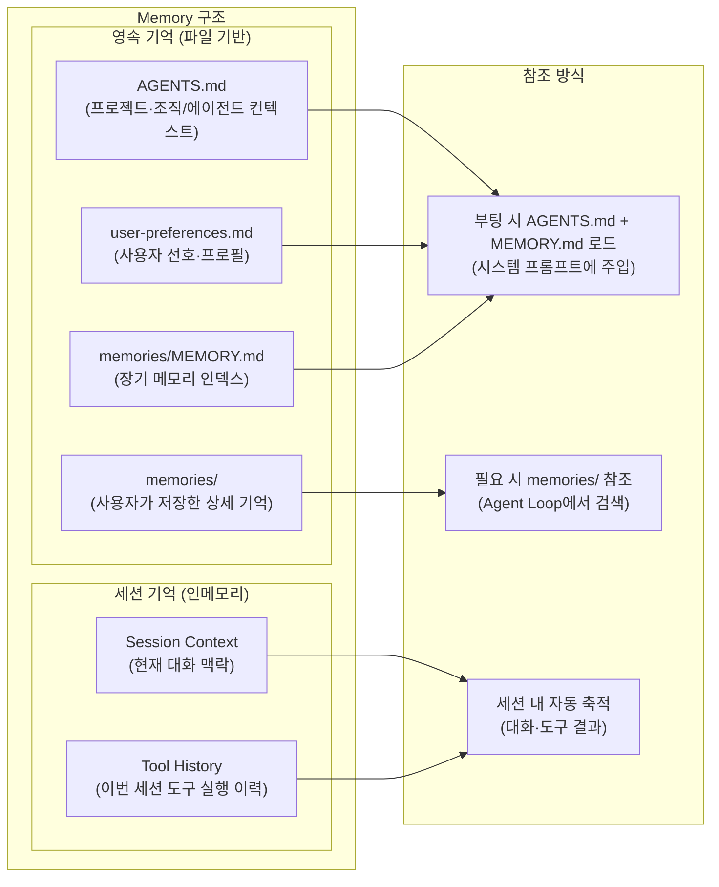

### 5.2 Memory 파일 구조

`~/.lvis/` 가 사용자 제어 데이터의 단일 root 다. 호스트 모듈은 각 topic 폴더로
분리되고, 플러그인은 `~/.lvis/plugins/<id>/` 자기 디렉토리 안에서 install
artifact 와 save data 를 함께 보관한다 (호스트 root 에 끼어들지 않음).

```
~/.lvis/
├── AGENTS.md            # 프로젝트·팀·조직/에이전트 컨텍스트 (관리자 배포 가능)
├── agents/              # 사용자 정의 sub-agent profile
│   ├── reviewer.md      # flat profile
│   └── explorer/AGENTS.md
├── skills/              # on-demand skill packages
│   └── report/SKILL.md
├── user-preferences.md  # 사용자 개인 선호 (보고 스타일, 자주 쓰는 도구 등)
├── memories/            # 호스트 기억 ("이거 기억해" 명령)
│   ├── MEMORY.md        # 부팅 시 읽는 장기 메모리 인덱스
│   ├── 출장-절차.md     # 개별 기억 파일
│   └── 분기-보고서-템플릿.md
├── plugins/<id>/notes/  # 플러그인 자체 메모는 자기 디렉토리에 격리
├── sessions/            # LVIS session history
│   └── <session-id>.jsonl
├── audit/               # AuditLogger (회전·retention)
├── traces/              # FileTracer 디버그 trace
├── certs/               # corporate CA 캐시
├── governance/          # MCP / 플러그인 admin 정책
├── mcp/                 # MCP servers config + install dir
│   ├── servers.json
│   └── <slug>/          # marketplace install
└── plugins/             # 모든 플러그인 (user / managed 구분 없이 flat)
    ├── registry.json
    └── <plugin-id>/     # install artifact + plugin save data
```

| 구분                    | 저장소    | 수명             | 제어 주체                |
| ----------------------- | --------- | ---------------- | ------------------------ |
| **AGENTS.md**           | 로컬 파일 | 영구 (수동 관리) | 관리자 + 사용자          |
| **user-preferences.md** | 로컬 파일 | 영구 (수동 관리) | 사용자                   |
| **memories/MEMORY.md**  | 로컬 파일 | 영구 (자동+수동) | 호스트 + 사용자          |
| **memories/**           | 로컬 파일 | 영구 (수동 관리) | 사용자 ("기억해" 명령)   |
| **agents/**             | 로컬 파일 | 영구 (수동 관리) | 사용자                   |
| **skills/**             | 로컬 파일 | 영구 (수동 관리) | 사용자                   |
| **Session Context**     | In-memory | 현재 세션        | 자동 (대화 종료 시 소멸) |

> **v2 대비 변경 이유**: v2의 4계층 기억(Session→Working→Episodic→Semantic)과 자동 승격·만료·연결 로직은 현 단계에서 과도한 복잡도를 유발한다. LVIS 는 사용자가 직접 확인할 수 있는 AGENTS.md / MEMORY.md 파일 기반으로 시작하고, 필요가 검증되면 점진적으로 확장한다.

---

## 6. Client Core Engines

### 6.1 Keyword Detecting Engine

사용자 입력에서 의도·키워드·엔티티를 감지하는 첫 번째 관문. **Conversation Loop 본문보다 먼저** 실행되며, 빌트인 규칙과 플러그인이 등록한 keyword group을 함께 본다.

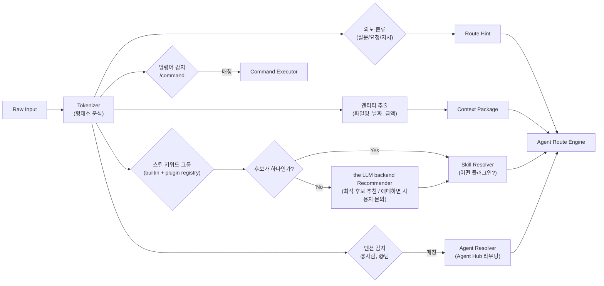

**감지 우선순위:**

| 순위 | 유형          | 예시 입력               | 처리                              |
| ---- | ------------- | ----------------------- | --------------------------------- |
| 1    | 명시적 명령어 | `/meeting start`        | Command Executor 직접 실행        |
| 2    | 스킬 키워드   | "회의록 작성해줘"       | Skill Resolver → 플러그인 활성화  |
| 3    | 에이전트 멘션 | "@이영희 이거 확인해줘" | Agent Hub 메시지 라우팅           |
| 4    | 의도 + 엔티티 | "출장 품의 작성해줘"    | Route Engine → the LLM backend + 관련 도구 |
| 5    | 일반 대화     | "안녕하세요"            | the LLM backend 직접 세션                  |

**확장 설계 노트**

- 플러그인은 manifest/skill 등록 시 **keyword group** 을 동적으로 추가한다.
- 동일 입력이 여러 스킬 그룹에 걸리면 the LLM backend가 가장 적합한 후보를 추천한다.
- 추천 confidence가 낮으면 사용자가 명시적으로 선택하도록 묻는다.

### 6.2 Agent Route Engine

감지된 의도를 올바른 실행 경로로 전달하는 라우터.

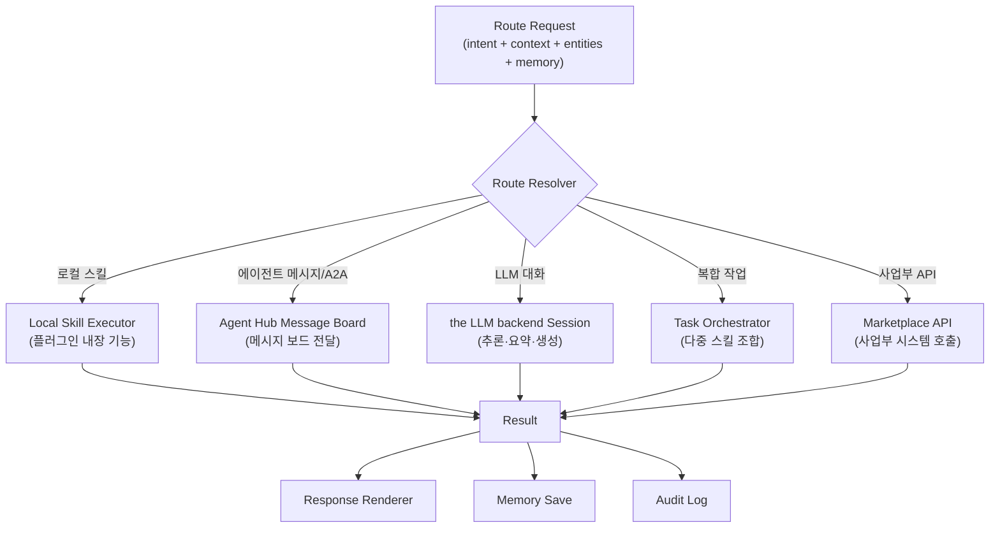

**Route Resolution 우선순위:**

```
1. Governance Policy Check   → 거버넌스 정책 위반 시 즉시 차단
2. Permission Check          → 사용자 권한 확인
3. Local Skill Match         → 설치된 플러그인 스킬 매칭
4. Agent Hub Routing         → @멘션 또는 메시지 보드/A2A 상호작용
5. Marketplace API           → 사업부 API 호출 필요 시
6. the LLM backend Fallback           → 위 모두 해당 없으면 LLM 직접 대화
```

### 6.3 Tool Permission Model — 10-Layer Pipeline

> **Reference**: `docs/architecture/permission-policy-design.md` v2.2
> (full spec — 10-layer evaluation, multi-agent reviewed). This section
> is the architecture-level summary; defer to the spec for the
> exhaustive layer detail, decision matrix, and binding decisions.
>
> §8 Agent Approval System은 **에이전트 행위 승인** (자율 게시 / 외부
> 송신 / 업무 일지 공개 범위) 을 다룬다. 본 §6.3 은 **개별 도구 호출
> 권한** 을 다룬다. permission policy Layer 3 의 `network = ask + endpoint` 결정은
> §8 ApprovalGate 의 입력으로 흐른다 — 두 섹션을 *중복 승인 단계* 로
> 오해하지 말 것 (single-decision, single-prompt).

#### 6.3.0 — Current implementation posture

Permission Policy 현재 구현은 **strict single path** 이다. 레거시 호환 fallback 이나
plugin-specific app branch 를 두지 않는다.

| Surface | Current posture | Future direction |
| --- | --- | --- |
| Plugin categories | SDK manifest schema 의 per-tool `category/pathFields` 가 plugin tool authority SOT 이다. Host 는 SDK schema 를 그대로 검증하고, category 가 없는 plugin tool 은 hard-fail 한다. `meta` 및 향후 host-only category 는 plugin contract 로 자동 확장되지 않는다. | 추가 plugin 도입 시 SDK schema category/pathFields 선언과 plugin sanity test 를 PR merge gate 로 유지 |
| Runtime modes | 사용자-facing 정책은 `default`(read 허용), `strict`(read 포함 전체 ask), `auto`(권한 리뷰어 기반 자동 검증 — 자동/헤드리스 + 대화형 채팅 양 lane), `allow`(하드 차단 밖 전체 허용) 4개다. | allow mode 는 Layer 0/1/deny/overlay-trigger guard 를 우회하지 않는 opt-in 으로 유지 |
| Permission IPC | `PERMISSIONS` 가 main / preload / sender-guard test 의 단일 channel SOT. | 새 permission channel 은 반드시 `src/shared/ipc-channels.ts` 에 먼저 추가 |
| Reviewer | `disabled/rule/llm/strict` 4-mode (issue #664 normalization). `disabled` 는 reviewer 레인 pass-through (LOW), `strict` 는 fail-closed (defer-all) — 둘 다 카테고리 매트릭스/허용 디렉토리는 그대로 적용. `llm` wiring 실패는 silent downgrade 없이 fail-fast. | cost/quality telemetry 로 model default 조정 가능, fallback 은 `deny|rule` 만 |
| Deferred queue | Headless MED/HIGH verdict 는 사용자가 큐 버튼을 열 때 approve/reject, resolution 은 permission audit chain 에 기록. | §8 approval timeline 과 통합 표시 |
| Hooks | `hooks.json` command/http executor 제거. `~/.config/lvis/hooks/{pre,post,perm}-*.sh` + strict-deny quarantine + typed trust registration 만 허용. | signed hooks follow-up 전까지 `modify` action 금지 |
| Audit | HMAC chain + daily seal. Recent view 는 tail-scan. | key rotation / archive policy 는 follow-up |

#### 6.3.1 — 10-layer evaluation pipeline (overview)

호출 흐름은 input origin classification → numeric-order short-circuit
→ collected `denyReasons[]`. 각 layer 는 단일 책임을 가지며,
선행 layer 가 deny 를 반환하면 후속 layer 는 평가하지 않는다 (단
forensics 용 `denyReasons` 는 plural shape 으로 정의되어 향후 dual-deny
모드 호환).

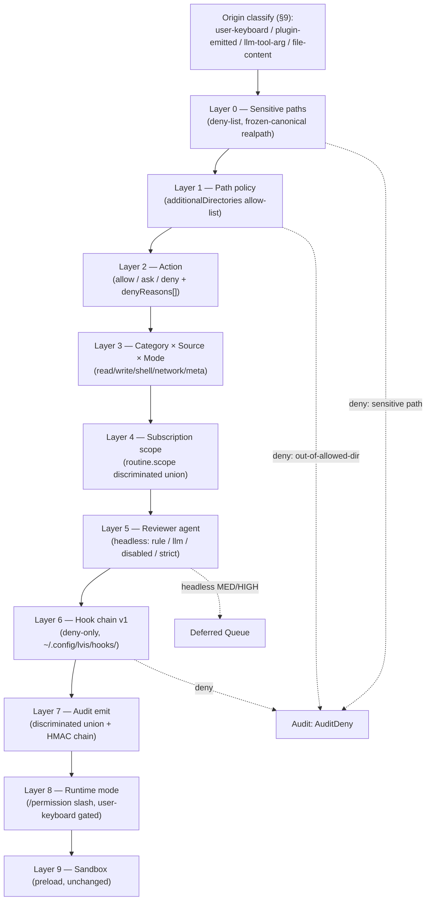

#### 6.3.2 — Layer reference

| Layer | 책임 | Spec § | 주요 산출물 |
| --- | --- | --- | --- |
| 0 | OS / 사용자 자격증명 / LVIS 자체 보호 경로 deny-list. realpath 기반 frozen-canonical (TOCTOU 차단). | §3 Layer 0 | `src/permissions/sensitive-paths.ts` |
| 1 | `additionalDirectories` allow-list + auto-suggest (leaf parent only, re-typed confirm, adjacency warning). | §3 Layer 1 | `src/permissions/allowed-directories.ts` |
| 2 | Action 결정 (`allow / ask / deny`) + `denyReasons[]` 수집. `confirm` 은 `ask` 의 sub-variant — auto mode 도 silent skip 금지. | §3 Layer 2 | `PermissionCheckResult.denyReasons` |
| 3 | 5-axis category × source × mode 매트릭스. Open-Closed `ToolCategoryRegistry`. | §3 Layer 3 | `src/permissions/category-registry.ts` |
| 4 | Routine 의 `scope.pluginIds` discriminated union (`deny-all` / `allow` / `inherit`). Boot 시 `inherit` 은 active set 으로 normalize. | §3 Layer 4 | `routine.scope.*` |
| 5 | Reviewer agent (multi-vendor) — foreground auto-review LOW allow / MED-HIGH tool-output block + exact user-authorized retry, headless MED-HIGH defer. `final = max(rule, llm)`. | §3 Layer 5 | `src/permissions/reviewer/*` |
| 6 | Hook chain v1 (deny-only). `~/.config/lvis/hooks/{pre,post,perm}-*.sh`. Strict-deny quarantine lockfile + DLP-redacted stdin. | §3 Layer 6 | `src/hooks/script-hook-*` |
| 7 | Discriminated-union audit (`AuditAllow`/`AuditAsk`/`AuditDeny`/`AuditDeferred`/`AuditModeChange`/`AuditManifestViolation`) + HMAC chain + daily seal. | §3 Layer 7 | `src/audit/audit-schema.ts`, `src/audit/hmac-chain.ts` |
| 8 | `/permission` 슬래시 + user-keyboard origin gate + `--durable` modal confirm. Modes: `default`, `strict`, `auto`, `allow`. Mode change emits `AuditModeChange`. | §3 Layer 8 | `src/permissions/permission-slash.ts` |
| 9 | Electron preload / contextBridge 기존 sandbox — permission policy 변경 없음. | §3 Layer 9 | `src/preload.ts` |

#### 6.3.3 — Trust origin classification

모든 input 에 4-tier origin 부여. 전파 경로: ToolUseEnvelope → Layer 6
hook stdin → Layer 7 audit → Layer 8 slash dispatcher.

| Origin | 출처 | Slash dispatch | 비고 |
| --- | --- | --- | --- |
| `user-keyboard` | 사용자가 chat 입력에 직접 타이핑 | ✅ accepted | Layer 8 의 유일한 신뢰 origin |
| `plugin-emitted` | `triggerConversation.pendingPrompt`, plugin event | ❌ rejected | leading `/` stripped 후 plain text 처리 |
| `llm-tool-arg` | LLM 가 채운 tool input | ❌ rejected | 동상 |
| `file-content` | `read_file` 결과를 LLM 이 다시 사용 | ❌ rejected | 동상 |

전체 spec: `docs/architecture/permission-policy-design.md` §9.

#### 6.3.4 — Reviewer agent (multi-vendor)

Foreground auto-review 및 headless write/shell/network/read-out-of-dir 호출에 대한 risk
classifier. 4-mode (`disabled` / `rule` / `llm` / `strict`) + multi-vendor adapter
(default OpenAI gpt-4o-mini, Anthropic / Google 도 swap 가능). 항상
rule classifier 가 baseline 으로 함께 실행되며 `final = max(rule, llm)`
(LLM downgrade 불가). Foreground auto-review 는 LOW 만 allow + audit 하고
MED/HIGH 는 approval modal 을 열지 않는다. 대신 reviewer 판정 사유를 tool
output error 로 main LLM 에 반환한다. Main LLM 이 사용자에게 확인하고,
사용자가 chat 에서 명시 승인하면 executor 는 직전 reviewer-blocked exact tuple
(`sessionId`, tool, source, canonical args, trust origin, approval cache key) 에
한해 1회 재시도를 허용한다. Headless reviewer 는 LOW 만 실행하고 MED/HIGH 는
deferred queue 에 append 되어 사용자가 큐 버튼을 열 때 surface 된다.

**Mode semantics (post issue #664 normalization):**

- `disabled` — reviewer 레인 pass-through. 모든 dispatch 는 LOW 로 평가됨.
  Layer 1-4 의 카테고리 × source × trust 매트릭스 + 디렉토리/sensitive-path
  체크는 그대로 적용. 사용자가 LLM/rule-based risk 분류 자체를 끄고 싶을
  때 선택. **Migration warning:** pre-#664 에서 `disabled` 는 "defer-all-HIGH"
  semantic 이었고 이 의미는 `strict` 로 이전됨. settings.json 에 `mode:"disabled"`
  를 가진 사용자는 boot-time 에 자동 `strict` 로 마이그레이션되며 warn 로그가
  발행됨.
- `rule` — deterministic 36-rule heuristic. LLM 호출 없음.
- `llm` — multi-vendor LLM classifier + rule composition (`final = max(rule, llm)`).
- `strict` — fail-closed. 모든 dispatch 는 HIGH 로 평가되어 deferred queue 로
  routing 됨. Pre-#664 의 `disabled` semantic 과 동일하지만 honest name. 사용자가
  모든 headless plugin/MCP 변경을 직접 승인하고 싶은 hardened deployments 용.

**Sandbox-write self-attestation (issue #664 P1):** plugin manifest 의
`toolSchemas[*].writesToOwnSandbox?: boolean` 필드를 통해 plugin 이
"내 sandbox 안에만 write 한다" 고 선언할 수 있다. runtime 은 path field
값이 실제로 `~/.lvis/plugins/<pluginId>/` 안에 있는지 검증한 뒤 LOW 로
auto-resolve. 검증 실패 시 일반 write 규칙으로 폴백 (sound-by-construction).

**선택 surface:** `/permission reviewer mode disabled|rule|llm|strict`,
`/permission reviewer fallback deny|rule`,
`/permission reviewer interactive off|low`. Reviewer provider/model 은
별도 slash surface 가 아니며 지능 설정의 active LLM provider/model 을 따른다.
`permissions.reviewer.provider/model` 은 이전 버전 호환용 persisted field 이고
사용자-facing SOT 가 아니다. 변경은 settings.json 에 persist + selective
verdict-cache invalidation.

**Cost optimization:** `~/.lvis/permissions/reviewer-cache.jsonl` —
`sha256(toolName+source+category+trustOrigin+approvalCacheKey+canonicalInputIdentity)`
기반. `shell` / `network` / `read` / `write` 는 command literal, host,
path 값이 deterministic risk 를 바꾸므로 sorted literal JSON 을 identity 로
사용하고, 값에 의존하지 않는 category 만 canonical shape 를 사용한다. HIGH 도
cache (반복 deny 비용 절감). cache 는 동작 정책을 대체하지 않으며, quota 소진
시 `fallbackOnError ∈ {deny, rule}` 정책만 적용한다.

전체 spec: §3 Layer 5 + §11 v2.1 binding decisions.

**Files:** `src/permissions/reviewer/risk-classifier.ts`,
`verdict-cache.ts`, `deferred-queue.ts`,
`src/ui/renderer/components/permissions/DeferredQueuePanel.tsx`.

#### 6.3.5 — Hook chain (v1 deny-only)

`~/.config/lvis/hooks/` (deliberately outside `~/.lvis/` — plugin 의
default allowed dir 안에 hook 디렉토리 두지 않기 위해).
세 prefix 가 각각 PreToolUse / PostToolUse / PermissionRequest 를
gate.

| Prefix | Fires when | Output |
| --- | --- | --- |
| `pre-*.sh` | 도구 실행 전 | `{action: "allow" \| "deny", reason}` |
| `post-*.sh` | 도구 실행 후 (v1 observe-only) | same |
| `perm-*.sh` | 승인 게이트가 사용자에게 묻기 직전 | same |

**Wire contract:** stdin/stdout JSON. `trustOrigin` 포함 (origin 별
hook 정책 가능). DLP-redacted input — secrets / credentials / PII 가
remote SIEM 으로 새지 않도록 `redactForLLM` 적용.

**Deny-only v1:** `modify` action 은 hook-signing follow-up
이후로 deferred. v1 의 `allow` 는 *additional approval signal* — Layer
0/1/2/3 deny 를 upgrade 하지 못함.

**Fail-safe:** exit !=0 / malformed stdout JSON / >5s timeout → deny.
Hook trust lockfile (`.lockfile.json`) — boot 시 hash 비교 + 변경/new hook 은
strict-deny 로 `.disabled/` 이동. Renderer 승인 prompt/modal 은 없다. 사용자가
`/permission hooks list` 로 확인하고 `/permission hooks accept <name>` 을
직접 입력한 경우에만 lockfile 에 등록되어 다음 실행부터 trusted hook 으로
동작한다. 이 typed command 가 명시적 신뢰 등록 표면이다. Boot-time quarantine
은 HMAC-chained `AuditDeny` 로 남으며, general telemetry `AuditLogger.log`
에도 전환기 관측용 `input.kind = "hook.quarantined"` 를 double-write 한다.
Permissions tab 은 `PERMISSIONS.hookTrustList` 를 통해 비차단 알림을 표시한다.

**v1 binding decision (§11 v2.1):** 빈 디렉토리만 ship. Sample hook
없음 — attack surface 0 부터 시작.

**Files:** `src/hooks/script-hook-types.ts`, `script-hook-runner.ts`,
`script-hook-manager.ts`, `hook-discovery.ts`,
`src/boot/steps/hook-system-wiring.ts`.

#### 6.3.6 — Manifest integrity proxy

SDK manifest schema 는 plugin `toolSchemas[].category/pathFields` 를
정의한다. 따라서 host 는 SDK manifest authority 를 그대로 Tool Registry 에
등록하고, app-local authority extension 이나 tool-name inference 없이
SDK schema 를 SOT 로 사용한다. Host→plugin fs boundary 에서
`ManifestIntegrityViolation` 이 발생하면 fail-closed 로 처리한다:

1. plugin id → process-wide `manifestIntegrityState.disabledPluginIds`.
2. `AuditManifestViolation` audit entry 발행 (`pluginId`, `toolName`,
   `attemptedOperation`).
3. `PERMISSIONS.manifestViolation` IPC → 사용자에게 reinstall
   prompt.
4. Disabled plugin 의 후속 tool 호출 fail-deny.

SDK schema/types 와 active plugin manifests 는 `category/pathFields` 를
선언한다. read-declared plugin tool 은 이 manifest authority 로 등록하고,
향후 sandboxed runtime 에서 fs proxy 를 더 강하게 적용한다.
호환 shim 이나 boot-warn grace 를 두지 않는다.

**Trade-off:** plugin 이 standard `node:fs` 직접 import 시 우회 가능
— sandboxed plugin runtime (V8 isolated context) 도입 전까지는 partial
guard. 사용자 docs 에 명시.

**Files:** `src/permissions/manifest-integrity.ts`,
`src/plugins/plugin-tool-adapter.ts`. Spec: §3.5.

#### 6.3.7 — Audit schema (discriminated union + HMAC chain)

Discriminated union per `decision` field:

```typescript
type PermissionAuditEntry =
  | AuditAllow         // 허용 (layer + 사유)
  | AuditAsk           // 사용자 컨펌 요청
  | AuditDeny          // 거부 (denyReasons[])
  | AuditDeferred      // Layer 5 MED/HIGH → deferred queue
  | AuditDeferredResolve // user-opened queue resolution
  | AuditModeChange    // /permission mode 변경
  | AuditManifestViolation; // §3.5 위반
```

모든 entry 는 `AuditCommon` (`ts`, `auditId`, `trustOrigin`,
`prevHash`) 를 공유한다. `prevHash = HMAC(secret, prevSerializedLine)`
chain — line N 변조 시 line N+1 의 prevHash 가 mismatch (forensics
로 첫 broken index 식별 가능). 첫 entry 는 `genesis` marker 에 binding.

**Daily seal:** `audit-seal-YYYY-MM-DD` 키로 system keychain 에
저장. forensics 가 일자별 로 chain + seal 비교 → 변조 시점 좁힘.

**Path protection:** `~/.lvis/audit*` 자체가 Layer 0 sensitive
(write 차단). compromised tool 이 *새 entry* 추가는 막지만 기존 log
rewrite 불가능.

**Tool-call channel:** executor hot path 는 tool allow/deny 결정을
HMAC-chained channel 에 기록한다. General telemetry `AuditLogger.log`
tool_call 은 renderer/ops parity 검증이 끝날 때까지 유지한다.

**Atomic cutover (No-Fallback):** keychain 미사용 환경 (Electron
`safeStorage` 미가용) 에서는 0o600 file secret store 만 허용. boot 시
secret 영구 저장 실패 → 감사 chain 미시작 + 사용자 actionable 에러
(silent downgrade 금지).

**Files:** `src/audit/audit-schema.ts`, `src/audit/hmac-chain.ts`,
`src/audit/audit-logger.ts` (`appendPermissionAuditEntry` + `setupPermissionAuditChain`),
`src/permissions/permission-audit-runner.ts` (show + verify 백엔드).

#### 6.3.8 — `/permission` 슬래시 인터페이스

Spec §3 Layer 8 grammar (final, Phase 5):

```
/permission                                # show current
/permission mode strict|default|auto|allow [--durable]
/permission dir allow <path> [--session]
/permission dir deny <path>
/permission dir list
/permission rules list
/permission audit show [--last=N]
/permission audit verify
/permission reviewer mode disabled|rule|llm
/permission reviewer fallback deny|rule
/permission reviewer interactive off|low
/permission hooks list
/permission hooks accept <name>
/permission hooks disable <name>
/permission hooks reject <name>
```

**Trust origin gate (security C2):** `dispatchPermissionSlash` 가
`trustOrigin === "user-keyboard"` 가 아닌 입력은 reject — 호출자는
leading `/` 를 strip 후 plain text 로 처리 (chat 에 slash hint 로
오인되지 않도록).

**Hook trust mutations:** `hooks accept|disable|reject` 는 typed
user-keyboard command 자체가 approval surface 이다. Renderer fallback
prompt/modal 은 만들지 않는다.

**Directory UI parity:** Permissions tab exposes CRUD for
`permissions.additionalDirectories` through the same `/permission dir`
dispatcher IPC path, so slash and settings UI share one mutation path.

**Audit panel UX:** `/permission audit show` 가 side-panel
(`AuditPanel.tsx`) 을 연다. 마지막 N entries (default 50, max 1000),
decision-type / tool-name 필터, 행 클릭 시 full discriminated-union
shape expand. 상단 tamper-evidence 배너 — green check (chain ok +
seal 일치) / yellow warn (seal 미생성) / red warn (chain broken — 첫
broken file + line 표시). `/permission audit verify` 는 keychain 의
`audit-seal-YYYY-MM-DD` 와 chain 을 함께 검증한다.

**Files:** `src/permissions/permission-slash.ts`
(`dispatchPermissionSlash`, `parsePermission*Command`),
`src/permissions/permission-audit-runner.ts` (read-only 백엔드),
`src/ipc/domains/permissions.ts` (IPC handlers),
`src/ui/renderer/components/permissions/AuditPanel.tsx`,
`src/ui/renderer/components/permissions/PermissionModeBadge.tsx`.


#### 6.3.9 — OS 실행 샌드박스 (ASRT)

Layer 0–8 의 permission policy 는 *어떤 도구 호출을 허용/거부* 하는지를
결정하지만, 허용된 shell/도구 spawn 을 OS 수준에서 물리적으로 격리하지는
않는다. OS 실행 샌드박스가 그 격리를 담당하며, 백엔드는
**ASRT (`@anthropic-ai/sandbox-runtime`)** 이다 — 레거시 per-OS 러너 레지스트리
(bubblewrap / sandbox-exec / AppContainer 를 host 가 직접 호출하던 구조) 는
제거되었고 ASRT 어댑터(`src/permissions/asrt-sandbox.ts`)가 단일 경로다.

- **백엔드**: macOS 는 Seatbelt 프로파일, Linux 는 bwrap+seccomp — 둘 다
  capability SOT 에서 단일 `kind: "asrt"` 로 보고된다.
- **Spawn 모델**: ASRT 는 워크로드를 직접 spawn 하지 않는다. `wrapToolCommand`
  가 OS-confined wrapper 의 `{ argv, env }` 를 반환하고 host(`tools/bash.ts`)
  가 `shell: false` 로 직접 spawn 한다.
- **Filesystem jail (per-wrap)**: write-jail 은 owner plugin sandbox root ∪
  허용 디렉토리로 canonicalize 한 union (bare cwd 아님). read-jail 은
  `denyRead: [$HOME]` 후 cwd + write paths 만 re-allow 한다.
- **Network floor (shared, deny-by-default)**: ASRT 0.0.59 의
  `filterNetworkRequest` 는 *모듈-레벨 SHARED config* 만 읽으므로, egress 는
  boot 에서 `strictAllowlist: true` + 모든 로드된 plugin manifest 의
  `networkAccess.allowedDomains` UNION 을 SHARED config 로 설정해 강제한다
  (loopback proxy 가 strict-union 바닥). 이는 *per-worker* 격리가 아니라
  UNION allow-list 다 — sandboxed process 는 *임의의* 로드된 plugin 이 선언한
  도메인에 도달할 수 있다. LVIS 1st-party plugin 신뢰 모델 하에서 허용되며,
  true per-worker 격리는 per-process proxy 를 갖춘 future ASRT 가 필요하다.
- **Gate**: `osToolSandbox` feature flag (Settings → 권한) 또는
  `LVIS_SANDBOX_ENABLED=1`. **DEFAULT OFF** — 명시적 opt-in 전까지 도구는
  isolation=none 으로 실행된다. Gate 는 boot 에서 *정확히 한 번* 결정되며
  runtime 변경 채널은 없다.
- **Windows**: **fail-closed**. ASRT 의 win32 경로(srt-win.exe)는 network-only
  half-sandbox (fs 격리 없음 + UAC 설치/재로그인 요구) 이므로 채택하지 않는다.
  별도 `LVIS_SANDBOX_WINDOWS=1` opt-in (기본 off) 없이는 초기화하지 않으며,
  현행 win32 동작은 isolation=none 이다.
- **Linux deps-missing**: gate ON 인데 `bwrap`/`socat`/`ripgrep` 가 없으면
  no-fallback 룰에 따라 boot 를 fail-closed 로 abort 한다 (unsandboxed plain
  spawn 으로 silently drop 하지 않는다).
- **Capability SOT**: boot 에서 ASRT init 성공 시
  `setActiveSandboxCapability({ kind: "asrt", confidence: "verified",
  confines: { filesystem, process, network }, … })` 로 발행한다 (`confines` 는
  machine-checkable 격리 표면 — network honesty 감사 + 향후 substrate 별 강제용).
  Gate OFF / Windows / Linux deps-missing 에서는 발행하지 않으므로 SOT 는
  `kind: "none"` 으로 남는다.
- **Substrate-aware reviewer capability (필수 불변식)**: process-global
  `detectSandboxCapability()` 의 `asrt` 는 **ASRT-wrapped host-shell substrate**
  (`wrapToolCommand` → `spawnWithSandbox` 를 타는 `bash`/`powershell` builtin)
  에만 해당한다. plugin/MCP 도구의 side-effect 는 ASRT 로 감싸지지 않은 long-lived
  worker (isolation=none) 에서, 기타 in-process builtin 은 host 프로세스 내에서
  실행되므로 둘 다 OS 격리가 없다. 따라서 reviewer/risk-classifier 에 공급하는
  capability 는 `resolveReviewerSandboxCapability(source, toolName)` 로 **그 호출의
  실행 substrate** 를 반영한다: host-shell 경로만 genuine `detectSandboxCapability()`
  (gate ON 시 `asrt`) 를 받고, 나머지는 강제 `kind: "none"` 을 받아
  `isWeakSandbox` 가 weak 으로 판정한다. 이로써 LLM reviewer 는 unsandboxed effect
  에 대해 MEDIUM/HIGH → LOW downgrade (auto-approve) 를 할 수 없다 — host 샌드박스
  ON 이 비격리 plugin/MCP 도구의 승인 게이트를 *완화* 하던 역효과를 차단한다.
  동일 resolver 가 verdict-cache scope 와 audit 에도 쓰여 substrate 간 verdict
  교차 재사용을 막는다.
- **알려진 follow-up**: long-lived worker(lge-api / local-indexer 의 Python
  워커)의 egress 는 아직 이 shared floor 로 완전히 수렴되지 않은 문서화된
  후속 작업이다 (§9 plugin egress 참조).

**Files:** `src/permissions/asrt-sandbox.ts` (어댑터 + NETWORK ENFORCEMENT
MODEL 헤더), `src/permissions/sandbox-capability.ts` (capability SOT +
`setActiveSandboxCapability` / `isWeakSandbox` / `resolveReviewerSandboxCapability`),
`src/permissions/permission-manager.ts` (dispatchReviewer 가 substrate-aware
capability 를 reviewer/cache/audit 에 공급), `src/permissions/sandbox-write-jail.ts`,
`src/tools/bash.ts` (ASRT-wrapped spawn 경로), `src/boot.ts` (gate 결정 + capability 발행).


### 6.4 Tool Registry & Taxonomy — 빌트인 도구 카탈로그

> the LLM backend가 호출할 수 있는 **빌트인 도구**와 **플러그인 도구**를 구분하고, 카테고리별로 분류한다.

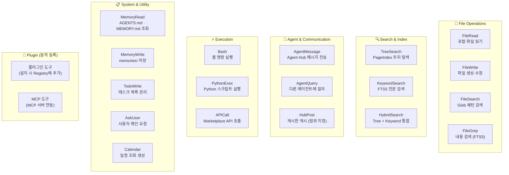

| 카테고리 | 빌트인 도구 | 설명 | Permission 기본값 |
| --- | --- | --- | --- |
| **File Operations** | FileRead, FileWrite, FileSearch, FileGrep | 로컬 파일 CRUD + 검색 | FileRead: allow / FileWrite: ask |
| **Search & Index** | TreeSearch, KeywordSearch, HybridSearch | PageIndex + FTS5 검색 | allow (읽기 전용) |
| **Agent & Comm** | AgentMessage, AgentQuery, HubPost | Agent Hub 통신 | AgentQuery: allow / HubPost: ask (§8 승인) |
| **Execution** | Bash, PythonExec, APICall | 명령·스크립트·API 실행 | Bash: ask / APICall: ask |
| **System & Utility** | MemoryRead/Write, TodoWrite, AskUser, Calendar | 메모리·태스크·일정 | MemoryRead: allow / MemoryWrite: allow |
| **Plugin (동적)** | 플러그인·MCP 설치 시 추가 | 매니페스트 기반 동적 등록 | 플러그인별 매니페스트에 정의 |
| **Feature-gated** | (Feature Flag로 제어) | 실험적 도구 — §14.4 참조 | Feature Flag 활성 시에만 Registry에 등록 |

**§6.4.X Tool Category — 5-axis taxonomy:**

도구의 **policy axis** 는 5축으로 분리되며 `ToolCategoryRegistry` (Open-Closed pattern) 가 카테고리별 decision lane 을 제공한다. 자세한 의사결정 매트릭스는 `docs/architecture/permission-policy-design.md` §3 Layer 3 참조.

| Category | 의미 | 의사결정 (default mode) | 헤들리스 (routine) | 비고 |
| --- | --- | --- | --- | --- |
| `read` | 조회/검색 (자료를 변경하지 않음) | builtin: allow / plugin: scope-checked | allow | strict mode → ask |
| `write` | 사용자 데이터 변경 | ask (auto → reviewer LOW allow + audit / MED-HIGH tool-output block, exact user-authorized retry, allow → allow + audit) | reviewer agent unless allow mode | reviewer 미배치 시 fail-closed or user ask |
| `shell` | 셸 명령 실행 (Bash 등) | ask + Bash AST 검증 (auto → reviewer LOW allow + AST + audit / MED-HIGH tool-output block, exact user-authorized retry, allow → allow + AST) | reviewer unless allow mode | AST 검증은 executor-owned gate |
| `network` | 외부 네트워크 호출 | ask + endpoint surface (auto → reviewer LOW allow + audit / MED-HIGH tool-output block, exact user-authorized retry, allow → allow + audit) | reviewer unless allow mode | endpoint 추출은 executor-owned surface |
| `meta` | 제어 흐름 / UI 프리미티브 | `decisionOverride` 따름 | 동일 | host builtin 전용; plugin 사용 금지 |

`strict` 는 mode-first 정책이다. Headless 여부와 무관하게 `read` 포함 모든 도구가 ask 로 승격되며, reviewer routing 은 default/auto 의 mutation category 에만 적용된다.

**`decisionOverride` (meta 전용):** `always-allow-with-audit` (예: `ask_user_question` — 사용자에게 질문하는 도구 자체를 한번 더 승인 모달에 거는 중복 UX 차단) / `ask` (예: `agent_spawn` — `meta` 이지만 사용자 컨펌 필요).

**Migration map:** v4 의 `dangerous` 단일 카테고리는 v5 에서 폐지됨. `bash` → `shell`, `agent_spawn` / `ask_user_question` → `meta`. Plugin `toolSchemas[*].category/pathFields` 는 SDK manifest schema 의 authority metadata 이며, host plugin tools 는 이 metadata 없이는 등록되지 않는다.

**Tool Registry 동작:**

| 시점 | 동작 |
| --- | --- |
| **부팅 시** | `registerStandardCategories()` → 빌트인 도구 등록 → Plugin 도구 등록 → MCP 도구 등록 → Feature Flag 평가 |
| **플러그인 설치/제거** | Registry 동적 업데이트 (Hot-reload) |
| **매 턴** | L1 Registry Filter 적용 → the LLM backend에 전달할 도구 스키마 확정 |

### 6.5 Command Safety — 명령어 안전 분석

> **Design Note**: 이 안전 분석은 LVIS 로컬 명령 실행 위협 모델에서 도출한 내부 정책이다.
> LVIS 에이전트가 사용자 PC에서 셸 명령을 실행할 수 있으므로, **실행 전 AST 레벨 안전 분석**이 필수다.

```mermaid
flowchart LR
    CMD_IN["Bash 도구 호출<br/>(명령어 문자열)"]

    CMD_IN --> AST_PARSE["Shell AST Parser<br/>(명령어 구문 분석)"]

    AST_PARSE --> PATTERN_CHK{"위험 패턴<br/>감지?"}

    PATTERN_CHK -->|"감지"| BLOCK["🚫 즉시 차단<br/>+ Audit Log"]
    PATTERN_CHK -->|"안전"| PERM_CHK["Permission Check<br/>(Layer 2)"]

    PERM_CHK --> EXEC["명령 실행"]

    subgraph "감지 대상 위험 패턴"
        P1["rm -rf / (재귀 삭제)"]
        P2["Fork bomb :()\u007b :|:& \u007d;:"]
        P3["curl|bash (원격 실행)"]
        P4["sudo escalation"]
        P5["tty injection"]
        P6["history manipulation"]
        P7["chmod 777 (과도한 권한)"]
        P8["> /dev/sda (디스크 덮어쓰기)"]
    end
```

| 위험 등급 | 패턴 예시 | 조치 |
| --- | --- | --- |
| **Critical** | `rm -rf /`, Fork bomb, `> /dev/sda`, `mkfs` | 즉시 차단 — 사용자 승인 불가 |
| **High** | `sudo *`, `curl\|bash`, `chmod 777`, `chown root` | 차단 + 사유 표시. 사용자가 명시적으로 해제 가능 |
| **Medium** | `rm -rf (상대경로)`, `kill -9`, pipe to `sh` | 사용자 승인 필요 (L3 Prompt) |
| **Low** | `git push --force`, `npm install -g` | 기본 허용, 설정에서 승인 요구 가능 |

**Phase 1 구현: `BashAstValidator` (`lvis-app/src/main/bash-ast-validator.ts`)**

7개 차단 패턴과 `warn` / `deny` 모드를 분리해 `lvis-app/src/tools/executor.ts` Step 2.5에서 실행한다.

| Pattern ID | 정규식 패턴 | 차단 사유 |
| --- | --- | --- |
| `rm-rf-root` | `\brm\s+(-[rfRF]+\s+)+(\/\|~\|\$HOME\|\*)` | `rm -rf` 위험 경로 (`/`, `~`, `$HOME`, `*`) |
| `curl-pipe-sh` | `\b(curl\|wget\|fetch)\b[^|]*\|\s*(sh\|bash\|zsh\|fish)` | 원격 스크립트 직접 실행 |
| `sudo-escalation` | `\b(sudo\|su\|doas)\b` | 권한 상승 시도 |
| `fork-bomb` | `:\(\)\s*\{\s*:\|:\s*&\s*\}\s*;\s*:` | fork bomb |
| `eval-untrusted` | `\beval\s+\$?\{?[^}]*\}?` | `eval` 기반 위험 실행 |
| `tty-injection` | `echo\s+-[ne]+\s+["'].*\\033` | TTY escape sequence injection |
| `subst-pipe-shell` | `\$\([^)]+\)\s*\|\s*(sh\|bash)` | command substitution → shell pipe |

**warn / deny 모드**

| 모드 | 동작 | 설정 |
| --- | --- | --- |
| `deny` (기본) | 패턴 매칭 시 실행 차단, `ValidationResult.decision = "deny"` | `settings.governance.bashValidationMode: "deny"` |
| `warn` | 패턴 매칭 시 경고만 남기고 실행은 허용 | `settings.governance.bashValidationMode: "warn"` |

**AST 분석이 L2 Permission Check보다 먼저 실행되는 이유**: Permission 규칙에 `allow: ["Bash(*)"]`로 전체 허용이 설정되어 있더라도, Critical/High 패턴은 AST 분석에서 차단한다. 이 계층은 Governance Policy와 동급의 불변 안전 경계이다.

**Windows shell 주의사항**: `Bash` 도구는 내부적으로 POSIX shell을 기대하므로, Windows에서 `sh` shim이 없으면 `spawn sh ENOENT`가 발생할 수 있다. 이 경우 전체 대화를 실패로 만들지 말고, 해당 tool item만 실패 처리하고 플랫폼 불일치 힌트를 함께 노출한다.

---

## 6.6 Observability & Audit — 운영 가시성

Observability 컴포넌트 (PR #113–#116) 에서 추가된 4개의 운영 가시성 컴포넌트를 정의한다. 모두 `src/ui/renderer/` Settings 탭 체계로 노출되며, 데이터는 로컬 파일(`~/.lvis/audit/audit.ndjson`, 인메모리 stats)에서 읽는다.

### 6.6.1 Audit Log Search UI (PR #113)

**진입**: Settings → 감사 탭 (`AuditTab.tsx`)

| 기능 | 구현 |
| --- | --- |
| 날짜 범위 필터 | `dateFrom` / `dateTo` ISO 문자열 → `AuditLogger.search()` |
| 타입 필터 | `tool_call` / `permission_decision` / `bash_validation` / `compact` / `error` / `dlp` |
| 텍스트 검색 | NDJSON 라인 스캔 — toolName · result · message 필드 포함 |
| 결과 테이블 | 클릭 시 raw JSON 드릴다운, 페이지네이션 |
| 상단 통계 바 | 전체 건수 · 차단 건수 · DLP 히트 수 |

**IPC 채널**: `lvis:audit:search` (query params → `AuditEntry[]`) · `lvis:audit:stats` (집계 수치)

**데이터 소스**: `src/audit/audit-logger.ts` — append-only NDJSON, 동기 write. §13.3 Audit Data Flow 참조.

### 6.6.2 Plugin Performance Dashboard (PR #114)

**진입**: Settings → 플러그인 성능 탭 (`PluginPerfTab.tsx`)

인메모리 stats — 앱 재시작 시 초기화된다. 장기 추이가 필요한 경우 별도 영속화 설계 필요.

| 컬럼 | 의미 |
| --- | --- |
| startup (ms) | 플러그인 첫 로드 소요 시간 |
| calls | 세션 내 도구 호출 총 횟수 |
| errors | 호출 중 예외 발생 횟수 |
| avg (ms) | `totalDuration / calls` |
| last call | 마지막 호출 UTC timestamp |
| error rate | `errors / calls` — 녹색 <1% · 황색 1–5% · 적색 >5% |

SVG 바 차트로 플러그인별 avg exec time 비교.

**수집 위치**: `src/plugins/runtime.ts` `PluginRuntime.call()` — 호출 전후 `Date.now()` 차분.

**IPC 채널**: `lvis:plugins:perf-stats` → `Record<pluginId, PluginPerfStats>`

### 6.6.3 LLM Cost Monitor (PR #116)

**진입**: Settings → 사용량 탭 (`UsageDashboard.tsx` — 기존 컴포넌트 확장)

| 기능 | 구현 |
| --- | --- |
| 날짜 범위 프리셋 | 7d / 30d / 90d / all / custom |
| 세션 breakdown | Top-5 세션 비용 테이블 |
| 월간 추정 | `computeMonthlyProjection(usedDays, totalCost)` — 당월 남은 일수 비례 외삽 |
| CSV 내보내기 | `lvis:usage:export-csv` IPC — 브라우저 download 트리거 |

**요금 출처**: `src/engine/usage-stats.ts` 내 vendor별 단가 상수. 모델 요금 변경 시 이 파일만 업데이트한다.

**IPC 채널**: `lvis:usage:range` (dateFrom · dateTo → `UsageEntry[]`) · `lvis:usage:export-csv`

### 6.6.4 DLP Hit Statistics (PR #115)

**진입**: Settings → 개인정보 탭 (`PrivacyTab.tsx`) — DLP 토글 + 통계 패널

DLP 통계는 audit NDJSON에서 `type = "dlp"` 엔트리만 집계한다.

| 필드 | 의미 |
| --- | --- |
| `totalHits` | N일 내 DLP 차단 총 건수 |
| `byKind` | 패턴 종류별 히트 수 (예: `pii`, `secret`, `credential`) |
| `byDay` | 일별 히트 수 — sparkline 렌더링용 |
| `topPatterns` | 상위 5개 정규식 패턴 + 히트 수 |

**집계 로직**: `src/audit/dlp-stats.ts` `getDlpStats(days)` — NDJSON 스트림 순회, `days` 파라미터로 집계 기간 제어.

**DLP 감사 주입**: `src/audit/dlp-filter.ts` `redactForLLM()` — 리댁션 발생 시 `auditLogger.log({ type: "dlp", ... })` 호출. `initDlpAudit(auditLogger)` 로 주입 (boot.ts).

**IPC 채널**: `lvis:dlp:stats` (days → `DlpStats`)

### 6.6.5 HtmlPreview 보안 — partition 격리 (A5 PR #124)

`HtmlPreview` 컴포넌트(`src/ui/renderer/components/HtmlPreview.tsx`)는 플러그인이 생성한 HTML을 전용 `BrowserWindow` 로 연다. A5 에서 구현된 네트워크 차단 계약은 window 전환 후에도 유지한다:

- **파티션**: `webPreferences.partition = "lvis-render-html"` — 전용 세션 컨텍스트로 격리.
- **webRequest 블록**: `installHtmlPreviewPartitionBlock()` (`src/main/html-preview-partition.ts`) 가 앱 `ready` 후 `session.fromPartition("lvis-render-html").webRequest.onBeforeRequest()` 로 **모든 http/https/file/ftp 요청을 차단** 한다. `data:`, `blob:`, `about:` 만 허용한다.
- **CSP + toolbar shell**: main IPC handler 는 renderer payload 를 그대로 로드하지 않고 `src/shared/render-html-preview.ts` 의 CSP-first host shell 로 재구성한 뒤 `data:` URL 로 로드한다. host shell 은 상단 toolbar 와 JavaScript 허용 토글만 소유하고, LLM HTML 은 sandboxed `iframe srcdoc` 안에 넣는다. 토글은 iframe sandbox 의 `allow-scripts` 와 CSP 문서를 재로딩할 뿐 parent/window 권한을 열지 않는다.
- **테마 토큰 주입**: renderer 는 현재 `--background`, `--foreground`, `--primary`, `--muted`, `--border` 등 LVIS theme token 을 preview payload 에 싣고, shell 은 같은 token 을 host toolbar 와 iframe 문서 앞부분에 주입한다.
- **효과**: 악성 플러그인 HTML 이 외부 서버로 데이터를 유출하거나 원격 스크립트를 로드하는 것을 OS 네트워크 계층에서 차단한다.

### 6.6.6 Playwright-Electron E2E 테스트 인프라 (E4 PR #135)

`e2e/` 디렉터리(프로젝트 루트 기준)에 Playwright-electron 기반 UI E2E 인프라가 추가되었다. Electron 프로세스를 실제로 실행해 preload 로드 경로, IPC 라운드트립, renderer 마운트를 물리적으로 검증한다. CI workflow 는 opt-in (`E2E=1`) 으로 실행한다.

### 6.6.7 공통 설계 원칙

- **로컬 우선**: 모든 통계는 `~/.lvis/` 로컬 파일 기반. 서버 전송 없음.
- **탭 분리**: `src/ui/renderer/tabs/` 아래 각 탭이 독립 컴포넌트. `SettingsDialog.tsx`는 탭 등록만 담당.
- **IPC 명명**: `lvis:<domain>:<action>` 패턴 (예: `lvis:audit:search`, `lvis:dlp:stats`).
- **인메모리 stats 한계**: Plugin Perf stats는 세션 범위. 히스토리 추이가 필요하면 `~/.lvis/perf/` 영속화를 별도 스프린트에서 설계한다.

---

## 6.7 Theme & Design Tokens (PR #336)

LVIS 호스트 렌더러는 단일 **semantic-token** 테마 시스템을 사용한다. 컴포넌트는
색상·간격·radius를 하드코딩하지 않고, `bg-background`, `text-foreground`,
`text-muted-foreground`, `bg-primary`, `bg-destructive`, `border-border` 같은
**시멘틱 토큰**만 소비한다. 각 테마 변형은 CSS 레벨에서 토큰을 다른 primitive로
재매핑하므로, 테마 추가/교체에 컴포넌트 변경이 필요 없다.

```
Components ─► Semantic tokens (--background, --primary, --destructive)
              ─► Primitive tokens (--p-blue-500, --p-slate-50)
```

- **토큰 정의**: `src/styles.css` (`:root` primitive + `[data-theme-bundle="<id>"]` semantic)
- **Provider**: `src/ui/renderer/theme/` (`ThemeProvider`, OS `prefers-color-scheme`
  추적, `~/.lvis/settings.json#appearance.schemaVersion=2` + `appearance.bundleId`
  영속화)
- **번들**: `src/shared/theme-bundles.ts` 의 `BUNDLE_IDS` 가 SOT이며 기본값은
  `tokyo-night`. `followSystem`은 별도 boolean이고 violet light/dark pair에만
  OS `prefers-color-scheme`을 반영한다.
- **사용 가이드**: 새 컴포넌트는 Tailwind utility (`bg-background`,
  `text-destructive`, `border-border`) 만 사용. 임의의 `bg-red-500`,
  `text-neutral-700` 같은 팔레트 직접 참조는 dark/high-contrast에서
  대비 깨짐을 유발하므로 금지. (위반 사례: `installPolicyChip`,
  marketplace `chip.tsx` install-policy 변형 — 2026-04-30 audit에서 시멘틱
  토큰으로 교체.)

상세 토큰 표·마이그레이션 가이드는 [`docs/development/theme-system.md`](../development/theme-system.md)
참조.

### 6.7.1 플러그인 webview 테마 전파 (PR #489)

호스트 렌더러의 active theme bundle 변경을 모든 plugin webview 로 fan-out 한다.
플러그인은 호스트와 동일한 시각 컨텍스트 안에서 자체 UI 를 그릴 수 있고,
폴링/관찰 코드를 별도로 짜지 않아도 된다. v2 payload 는
`{ bundleId, shell, tokens }` 이며 legacy v1 payload 는 더 이상 SOT 가 아니다.

```
ThemeProvider.tsx (renderer)
  ├─ activeBundle 변경 useEffect
  └─ bundleToPluginTokens(activeBundle)              ← computed --lvis-* 값
      └─ api.notifyPluginTheme({bundleId, shell, tokens})
          └─ IPC: lvis:host:plugin-theme-notify       (renderer → main)
              ├─ validateSender(e)                     ← 호스트 main frame 만 통과
              ├─ validateThemePayload(payload)         ← key/value 이중 검증
              └─ for (wcId of pluginWebviewRegistry):
                  └─ webContents.fromId(wcId).send("lvis:plugin:event",
                       "host.theme.changed", safe)     ← main → plugin webview fan-out
                      └─ plugin SDK useTheme()
                          └─ applyThemeTokens(payload.tokens)
                              └─ document.documentElement
                                  · setAttribute("data-theme-bundle", …)
                                  · setAttribute("data-shell", …)
                                  · style.setProperty("--lvis-*", …)
```

**코드 경로**:
- 트리거: `src/ui/renderer/theme/ThemeProvider.tsx` (테마축 useEffect → notify)
- 호스트 IPC bridge: `src/preload.ts` (`notifyPluginTheme` 노출)
- main 핸들러: `src/ipc/domains/plugins.ts` (`lvis:host:plugin-theme-notify` —
  validateSender, payload 검증, registry fan-out)
- plugin webview registry: `pluginWebviewRegistry` (`lvis:plugin:register-webview`
  로 채워지는 webContentsId ↔ pluginId 맵)
- plugin SDK 소비: `useTheme()` → `applyThemeTokens()` (host.theme.changed
  이벤트 listen → CSS variable + `data-theme-bundle` / `data-shell` 동기 적용)

**보안 게이트**:
- `validateSender` — 호스트 메인 webContents 만 broadcast 트리거 가능. plugin
  webview 가 위장 호출 시 `auditUnauthorized` 로 감사 로그 남기고 reject
- payload key/value 검증 — `--lvis-*` prefix + HSL/색상 값 화이트리스트.
  임의 CSS 주입 차단 (자세한 검증은 `validateThemePayload`)
- registry 외 webContents 로 누출 없음 — `pluginWebviewRegistry` 등록된
  webContentsId 만 순회

**초기 상태 — pull-on-load (1차 메커니즘)**: plugin-ui-shell 이 plugin 모듈
dynamic-import 직전에 `await window.lvisPlugin.getTheme()` 으로 호스트의 캐시된
payload (`lastThemePayload`) 를 *명시적으로 요청*. 받은 토큰을
`documentElement` 의 inline `style` 에 즉시 적용 → 첫 React commit 부터 올바른
색으로 paint.

```
plugin-ui-shell.html
  ├─ await getEntryUrl()
  ├─ await getTheme()        ← 새 IPC: lvis:plugin:get-theme
  │   └─ apply tokens to <html style="--lvis-*: ...">
  └─ dynamic import(entry) → plugin React mounts → useTheme listens for changes
```

Pull 모델인 이유:
- **Race-free** — request/response 라 timing 무관. preload listener 가 언제
  설치됐든 main 은 항상 응답할 수 있음
- **Flash-free** — 토큰이 첫 paint 전에 inline style 로 적용 → SDK fallback
  CSS 의 dark 값과 host 의 light 값이 충돌해서 첫 프레임이 잘못 그려지는
  케이스가 원천 차단
- **단일 layer 보장** — host 가 plugin-ui-shell 을 소유하므로 모든 플러그인이
  자동 혜택 (각 플러그인이 별도 opt-in 필요 없음)

**변경 알림 — push (`host.theme.changed`)**: 호스트 테마가 *변할 때*는 기존
broadcast 흐름 (`lvis:host:plugin-theme-notify` → wc.send → preload listener →
useTheme) 그대로. plugin-ui-shell 에서 한 번 pull 한 후 useTheme 가 후속
broadcast 만 처리.

**Race window = 0 — main 캐시를 BrowserWindow 생성 시점 inject (PR-1)**:
detached BrowserWindow 가 cold mount 될 때 host renderer 의 ThemeProvider 가
`api.getSettings()` 를 async hydrate 하는 동안, 그 안의 plugin webview 가
먼저 attach 되면 renderer 의 첫 `notifyPluginTheme` broadcast 를 놓쳐
잘못된 토큰으로 paint 됐다. 정공법은 main process 가 이미 들고 있는
`lastThemePayload` 를 BrowserWindow 생성 시점에 동기 inject:

```
main.ts:initialThemeArgs()
  └─ getLastThemePayload()
  └─ ["--lvis-initial-theme=" + JSON.stringify(payload)]
                                          ↓
   BrowserWindow.create({ webPreferences.additionalArguments })
                                          ↓
   src/preload.ts (document-start)
     ├─ readInitialThemeArg() — parse process.argv
     ├─ documentElement.setAttribute("data-theme-bundle"|"data-shell")
     ├─ documentElement.style.setProperty("--lvis-*", value)  ← frame 0 paint
     └─ contextBridge.exposeInMainWorld("__lvisInitialTheme", payload)
                                          ↓
   ThemeProvider (renderer)
     └─ useState(initialBundleId ?? readGlobalInitialBundleId() ?? DEFAULT)
                                          ↓
     첫 render 가 main 캐시와 일치 — async hydrate window = 0
```

- 호스트 main window 와 모든 detached window 가 같은 경로. plugin webview
  의 register-webview replay 도 항상 정확한 payload 를 받게 됨.
- 적용 범위: `lastThemePayload` 가 비어 있으면 (true 첫 cold boot)
  `additionalArguments` 가 빈 배열 → 기존 async hydrate 경로로 1 프레임만
  fallback. 이후 main → detached 흐름은 항상 race-free.
- `WindowManager` 는 `getInitialThemeArgs: () => string[]` 콜백을 받아
  `openDetachedTab` 내부에서 호출 — main 의 캐시는 BrowserWindow 생성
  시점에 stale 하지 않음.

**Defense-in-depth (보조 layer, 머지된 상태 유지)**:
- `register-webview` 시점 replay (`replayThemeToWebview`) — pull 이 어떤
  이유로 실패해도 wc.send 로 한번 더 시도. preload listener 가 늦게
  등록되면 sticky buffer 가 흡수
- preload sticky buffer (`STICKY_EVENT_TYPES.has("host.theme.changed")`) —
  late-binding `bridge.onEvent` 에 대한 보호. pull 이 정상이면 buffer 는
  단순히 redundant

**Removed (lvis-app#667, SDK v5.4.0)** — `lvis-plugin-sdk` 의
`lvis-tokens-fallback` `<style>` / `_FALLBACK_CSS` / `fallback-dark.json` /
`lvis-tokens.css` artifact 4 종은 모두 제거되었다. `initialThemeArgs`
(commit `1696f92`) 가 모든 BrowserWindow 에 primed token payload 를
실어보내므로 SDK fallback 이 보호하던 cold-boot race window 가 닫혀
fallback 자체가 dead code 였다. 플러그인은 `primeTheme(bridge, opts?)`
로 live broadcast 에 가입하면 충분하다.

캐시 (`lastThemePayload`) 는 다음과 같이 동작한다:
- `recordValidatedTheme(payload)` 가 validation 통과 시에만 갱신, 실패 시 기존 값
  유지 (잘못된 broadcast 가 캐시를 오염시키지 않음)
- 호스트 부팅 직후 ThemeProvider 가 처음 broadcast 하기 전에 pull 하면 `null`
  반환. 이 경우 BrowserWindow 가 이미 `additionalArguments` 의 primed payload
  로 페인트 중이므로 추가 처리 없이 ThemeProvider mount-time push 를 기다린다
- 같은 키/값 화이트리스트 검증을 거치므로 pull / replay / broadcast 모두
  동일한 보안 게이트 통과
- 캐시는 host process lifetime 동안 유지되고 종료 시 자동 소멸 — payload 자체가
  plugin-agnostic (UI 토큰 + 테마 enum) 이라 plugin install/uninstall/hot-reload
  시 따로 invalidate 할 필요가 없다

**Plugin-side API 표준 (Decision 2026-05-12)** — SDK `primeTheme(bridge, opts?)`
한 헬퍼가 `getTheme()` pull + `applyThemeFromHostEvent` paint + `host.theme.changed`
구독 3 경로 모두를 캡슐화한다. React 측 `useTheme(bridge, opts?)` 는 `primeTheme`
위의 얇은 wrapper로 재구현되고, `opts.target` 으로 detached BrowserWindow / scoped
sidebar 의 별도 document/element 를 가리킬 수 있다. `opts.onPayload` 콜백이 sidebar
custom 토큰 매핑 같은 use-case 를 흡수해, 같은 `host.theme.changed` 를 두 번
구독할 필요가 사라진다. 모든 플러그인의 `mount()` contract 는 **첫 await 가
`primeTheme(bridge, opts?)`** 호출이다 (`docs/references/plugin-tool-schema-design.md`
§2.6 참조).

Token SoT 는 host 의 ThemeBundle (`src/ui/renderer/theme/bundles/`) 단일
출처다. `bundleToPluginTokens(bundle)` 가 active bundle 에서 17 개
`--lvis-*` 토큰을 derive 하고, validated payload 가 `additionalArguments`
+ `host.theme.changed` broadcast 두 경로로 plugin webview 에 도달한다.
SDK 가 보조 fallback artifact 를 들고 있지 않으므로 lockstep 부담도
사라진다.

### 6.7.2 Token SoT 표

플러그인 webview 에 전파되는 디자인 토큰의 단일 출처.

| Artifact | 위치 | 역할 | 갱신 방식 |
|---|---|---|---|
| **SoT** ThemeBundle | `lvis-app/src/ui/renderer/theme/bundles/*.ts` | `--lvis-*` 토큰 값의 단일 출처. 디자인 팔레트가 바뀌면 **여기만** 수정 | 손-편집 |
| Host `_INVARIANT` | `lvis-app/src/ui/renderer/theme/plugin-token-map.ts` | 번들 무관 invariant 토큰 16 개 (radius/text/weight/space/motion) | 손-편집 |
| `bundleToPluginTokens` | `lvis-app/src/ui/renderer/theme/plugin-token-map.ts` | active bundle + `_INVARIANT` → 전체 `--lvis-*` token map (invariant 16 + bundle-derived 20) derive | 함수 호출 (`ThemeProvider`, `getInitialThemeArgs`) |
| `additionalArguments` priming | `lvis-app/src/main.ts:initialThemeArgs` (`1696f92`) | 모든 BrowserWindow webPreferences 에 primed token payload 주입 | `WindowManager.openDetachedTab` 콜백 |
| `host.theme.changed` broadcast | `EventBus` (`channels.ts`) | 런타임 테마 변경시 plugin webview 에 live payload 전파 | `ThemeProvider` 가 bundle 변경시 호출 |

SDK 에는 fallback artifact (JSON / CSS / TS const) 가 없으며, plugin 은
`primeTheme(bridge, opts?)` 로 위 두 경로의 payload 를 받는다. 토큰
화이트리스트 `LVIS_TOKEN_NAMES` / host `PLUGIN_TOKEN_NAMES` 동기화는 별개
트랙 — `docs/references/plugin-tool-schema-design.md` §2.6 "SoT 동기화 정책"
참조.

---

## 6.8 Floating Question Panel (PR #334)

`ask_user_question` 도구가 발생시키는 사용자 질문은 메시지 스트림 안에서 스크롤에
파묻히기 쉬웠다. **FloatingQuestionPanel** 은 이 문제를 해결하기 위해 ChatScroll
**위쪽**(메시지 영역 상단, ScrollArea viewport 바깥)에 anchor 되는 floating
오버레이로, 항상 즉시 보이도록 설계되었다.

- **위치**: `src/ui/renderer/components/FloatingQuestionPanel.tsx`
- **렌더 트리**: `App.tsx` → `ChatView.tsx` 안에서 `SessionTodoPanel`의 sibling
  으로 배치. `ChatScroll` 위, `MessageInput` 아래 영역에 absolute positioning.
  부모는 `position: relative` (ChatView 외곽 div가 이미 그렇다).
- **큐 시멘틱**: 최대 3장(`MAX_VISIBLE`) 카드를 stack으로 표시. 초과분은 마지막
  카드의 `+N more` 칩으로 표시. 각 카드는 독립 dismiss.
- **반응형**: `< 480px`에서는 bottom-sheet 모드로 전환되어 메시지 입력을 가리지
  않는다.
- **데이터 경로**: ChatView의 기존 `askQuestions` / `dismissAskQuestion` / `api`
  props를 그대로 받는다. 새 IPC 채널 없음. 내부 `AskUserQuestionCard` 가
  `respondAskUserQuestion` 을 처리하고 본 컴포넌트는 visibility/animation만 관리.
- **접근성**: 외곽 wrapper `role="region" aria-label="질문 대기열"
  aria-live="polite"`, focus trap, Esc dismiss(부분 입력 시 confirm),
  `prefers-reduced-motion` 시 translate 제거.

테스트는 `src/ui/renderer/components/__tests__/FloatingQuestionPanel.test.tsx`
+ snapshot.

---

## 6.9 Settings Dialog — Tab Layout (PR #342 기준)

`SettingsDialog.tsx`는 탭 등록 허브 역할만 한다. 각 탭은 `src/ui/renderer/tabs/`
아래 독립 컴포넌트로 존재하며, `use-settings-orchestration` 훅이 상태를 총괄한다.

### 현행 탭 구성 (2026-04-30 기준)

| 탭 값 | 표시 이름 | 컴포넌트 | 주요 기능 |
|-------|-----------|----------|-----------|
| `llm` | 지능 (LLM) | `LlmTab.tsx` | 벤더·API 키·모델 선택·Extended Thinking·**Model Fallback Chain** (PR #342 이관) |
| `appearance` | 테마 | `AppearanceTab.tsx` | 테마 선택 (dark / light / high-contrast / system) |
| `chat` | 채팅 | `ChatTab.tsx` | 자동 컴팩트 토글·**Stream Smoothing** (PR #342 이관) |
| `web` | 검색 (Web) | `WebTab.tsx` | 웹 검색 공급자·API 키 |
| `privacy` | 프라이버시 | `PrivacyTab.tsx` | DLP(PII) 리댁션 토글 + 통계 |
| `permissions` | 권한 | `PermissionsTab.tsx` | 도구 권한 정책 |
| `roles` | 역할 | `RolesTab.tsx` | Role Preset 편집 (이름·systemPromptAdd·effort) |
| `usage` | 사용량 | `UsageDashboard.tsx` | LLM 비용 모니터 |
| `audit` | 감사 | `AuditTab.tsx` | 감사 로그 검색 |
| `plugin-perf` | 플러그인 성능 | `PluginPerfTab.tsx` | 플러그인 성능 대시보드 |
| `mcp` | MCP 서버 | `McpTab.tsx` | MCP 서버 등록 관리 |
| `plugin-config` | 플러그인 설정 | `PluginConfigTab.tsx` | 플러그인별 설정 (configSchema 기반 폼 또는 raw key-value) |
| `marketplace` | 마켓플레이스 | `MarketplaceTab.tsx` | 마켓플레이스 URL·API 키·private network 허용 |

> **Note (Routine v2):** `RoutinePanel.tsx` 는 SettingsDialog 탭이 **아니다**. Routine v2 도입 이후 RoutinePanel 은 상단 액션바 햄버거 메뉴의 `루틴` 항목에서 여는 내장 메인 뷰로 동작한다. SettingsDialog 에는 더 이상 routine 탭이 존재하지 않는다.

### PR #342 재배치 요약

| 항목 | 이전 위치 | 현재 위치 |
|------|-----------|-----------|
| Stream Smoothing | 고급 (Advanced) 탭 | **채팅** 탭 |
| Model Fallback Chain | 고급 (Advanced) 탭 | **지능 (LLM)** 탭 |
| temperature / seed / maxOutputTokens / responseFormat / stopSequences | 고급 (Advanced) 탭 | **삭제** (프론티어 모델 자동 처리) |
| 채팅 언어 선택기 (langLock) | ChatView 툴바 | **삭제** (LLM 자동 감지) |
| 고급 (Advanced) 탭 | 존재 | **탭 전체 삭제** |

---

## 7. Overlay Trigger Surface

Overlay Trigger Surface 는 **사용자가 직접 입력하지 않은 플러그인 제안**을 main chat 에 넣기 전, 호스트가 반드시 사용자에게 보여주고 수락을 받는 staging surface 다. 플러그인은 대화를 직접 시작하지 않는다. `host:overlay` capability 를 가진 플러그인이 `hostApi.triggerConversation(spec)` 으로 overlay item 생성을 요청하고, 호스트는 source / prompt / dedupe / rate-limit / capability gate 를 통과한 항목만 renderer overlay 에 올린다.

사용자가 overlay CTA 를 수락하기 전까지 ConversationHistory 는 변경되지 않는다. 수락 후 host 는 pending prompt 를 `<imported-from-proactive source="overlay:...">` envelope 로 감싸 main chat 의 다음 user turn 으로 삽입한다. 이 envelope tag 이름은 기존 플러그인 작성 계약 때문에 유지하지만, source namespace 의 SOT 는 `overlay:*` 하나다. 이후 도구 호출은 일반 `ConversationLoop.runTurn()` → `ToolExecutor` → `PermissionManager` 경로를 통과하며, mutating tool 은 overlay-trigger origin guard 에 의해 사용자 확인을 다시 요구한다.

```mermaid
flowchart TB
    PLUGIN["Overlay-capable plugin<br/>observes its own signal"]
    HOST_API["hostApi.triggerConversation(spec)"]
    GATE{"Host gate<br/>host:overlay + source + prompt + dedupe + rate"}
    OVERLAY["Renderer overlay item"]
    USER{"User accepts CTA?"}
    CHAT["Main chat user turn<br/>&lt;imported-from-proactive source=&quot;overlay:*&quot;&gt;"]
    PERMISSION["Single permission path<br/>ToolExecutor -> PermissionManager"]

    PLUGIN --> HOST_API --> GATE
    GATE -->|"allow"| OVERLAY --> USER
    GATE -->|"deny"| AUDIT["Audit deny"]
    USER -->|"accept"| CHAT --> PERMISSION
    USER -->|"dismiss"| END["Overlay removed"]
```

| 계약 | 값 |
| --- | --- |
| Runtime capability | `host:overlay` only |
| Source pattern | `^overlay:[a-z][a-z0-9-]*$` |
| Plugin role | Overlay item staging 요청자. 직접 chat 시작 없음 |
| Host role | Gate, dedupe, rate-limit, overlay staging, import envelope 생성 |
| User role | Overlay CTA 수락/거절 |
| Permission path | Native / MCP / plugin tool 모두 단일 ToolExecutor + PermissionManager 경로 |
| Forbidden | non-`overlay:*` source namespace, background engine 자동 생성, post-turn 자동 overlay 생성, plugin-specific app reverse reference |

**Detector lifecycle (reactive registration).** overlay-capable plugin 내부 detector 는 `requires?: string[]` 로 의존하는 provider id 또는 capability 를 선언할 수 있다. Plugin 은 boot 시 + `hostApi.onPluginsChanged()` 발생 시마다 현재 설치 snapshot 을 기준으로 satisfied detector 만 자기 내부 event handler 로 등록한다. provider 미설치 시 해당 detector 는 조용히 비활성화되고, 사용자가 provider 를 설치하면 host 재시작 없이 detector 가 활성화된다. audit 채널은 plugin-owned namespace 로 `{active, missing, sources}` 를 기록해 "왜 이 detector 가 조용한가" 를 추적한다.

### 7.X Routine v2 (PR #626)

- **Storage**: `~/.lvis/routines.json` (mode 0o600, dir 0o700, cap 50)
- **Scheduler**: 30s polling (RoutinesScheduler), cron minute-key dedup via `lastFiredMinuteUTC`
- **Execution modes**: `llm-session` (RoutineEngine 호출, prePrompt 로 conversation 시작) / `notification-only` (OS notification, conversation 영향 0)
- **Repeat kinds**: `none / daily / weekly / monthly / interval / cron` — monthly day-of-month clamping
- **LLM tool**: `routine_schedule` (자연어 입력 → struct payload, 4 vendor 호환)
- **UI**: 단일 RoutinePanel 의 통합 list (Reminder 흡수), execution mode badge, 3-tab 입력 모달 (form / cron / 자연어)
- **Reminder 폐지**: PR #626 atomic cutover 로 `RemindersStore`, `RemindersScheduler`, `remind_at` tool, `RemindersList` 컴포넌트 모두 제거

---

## 8. Agent Approval System — 에이전트 요청 승인

> **§6.3 Permission Policy 와의 분리:** §6.3 은 *개별 도구 호출* 에 대한
> Layer 0–9 평가 (sensitive paths, allowed dirs, category × source ×
> mode, reviewer agent, hook chain) 를 다룬다. 본 §8 은 *에이전트
> 행위 전체* 에 대한 사용자 승인 모델 (자율 게시 / 외부 송신 / 업무
> 일지 공개 범위) 을 다룬다. permission policy Layer 3 의 `network = ask + endpoint`
> 결정은 §8 ApprovalGate 의 입력으로 흐르므로 두 섹션이 *중복 승인
> 단계* 처럼 보일 수 있으나 실제로는 **single-decision /
> single-prompt** — permission policy 가 결정하면 §8 ApprovalGate 가 그 결정을 그대로
> render 한다 (별도 prompt 없음).

### 8.1 설계 원칙

> **기본값: 승인 필요.** 에이전트가 외부와 상호작용하는 대부분의 행위는 사용자의 명시적 승인을 거친다. 내 에이전트가 내 이름으로 무언가를 건네거나 응답하기 전에, 나의 허락을 받는 것이 원칙이다.

**업무 일지 — 공개 범위 승인 후 게시.** 업무 일지는 에이전트가 자동 생성하되, 게시 전에 **공개 범위를 사용자이 승인**한다. 전사 공개가 기본이 아니라, 팀 레벨부터 시작하여 사용자이 범위를 결정한다.

```
기본 원칙:
  에이전트 행위         → 대부분 승인 필요 (파일 전송, 상호작용, 문서 공유 등)
  업무 일지 게시        → 내용 공개 범위 승인 후 게시 (개인/팀/상위조직/전체)
  상태 업데이트(온라인) → 자율 (메타정보 수준)
```

**업무 일지 공개 범위:**

| 레벨 | 범위 | 열람 가능 에이전트 | 예시 |
|------|------|-------------------|------|
| 🔒 **개인 보관** | 나만 | 없음 (내 에이전트만) | 개인 기록 성격의 일지 |
| 👥 **팀 레벨** (기본값) | 소속 팀 | 같은 팀 에이전트 | 일상 업무 보고 |
| 🏢 **상위 조직** | 실/본부 단위 | 상위 조직 소속 에이전트 | 크로스팀 프로젝트 공유 |
| 🌐 **전체 공개** | 전사 | 모든 에이전트 | 전사 차원 인사이트·팁 |

| 구분 | 품의 결재 | 에이전트 요청 승인 |
|------|----------|-------------------|
| **주체** | 사용자 본인 → 상위 결재자 | 에이전트 → 에이전트 소유자(사용자) |
| **대상** | 예산·인사·구매 등 공식 프로세스 | **파일 전송** · **상호작용 허용** · **문서 공유** · **일지 공개 범위** 등 |
| **시스템** | 전자결재 시스템 (기존 internal) | LVIS Agent Approval (클라이언트 내장) |
| **흐름** | 사용자 → 팀장 → 실장 → ... | 타인 에이전트 → 내 에이전트 → **나에게 승인 요청** → 승인/거부 |

### 8.2 자율 행위 vs 승인 필요 행위

> 기본값이 "승인 필요"이므로, 자율 행위 목록은 **최소한으로 제한**한다.

```mermaid
flowchart LR
    subgraph AUTO["자율 (메타정보 수준만)"]
        STATUS_UPDATE["🟢 상태 업데이트<br/>(온라인·작업중 등)"]
    end

    subgraph SCOPE_APPROVAL["공개 범위 승인 후 게시"]
        WORK_LOG["📋 업무 일지<br/>(공개 범위 선택:<br/>개인/팀/상위조직/전체)"]
        TIP_SHARE["💡 팁·인사이트<br/>(공개 범위 선택)"]
    end

    subgraph APPROVAL["승인 필요 (기본값)"]
        FILE_SEND["📄 파일 전송<br/>(내 문서를 타인 에이전트에게)"]
        INTERACTION["🤝 상호작용 허용<br/>(타 에이전트 요청에 응답)"]
        DOC_SHARE["📑 문서 공유<br/>(1:1 또는 채널로 공유)"]
        TASK_ACCEPT["✋ 위임 수락<br/>(타 에이전트 업무 대행)"]
        EXTERNAL_API["🌐 외부 API 호출<br/>(Marketplace 플러그인 실행)"]
    end

    style AUTO fill:#e8f5e9,stroke:#4caf50
    style SCOPE_APPROVAL fill:#e3f2fd,stroke:#2196f3
    style APPROVAL fill:#fff3e0,stroke:#ff9800
```

Agent Hub에 게시된 정보는 **설정된 공개 범위 내의 에이전트**만 열람할 수 있다. 팀 레벨로 게시된 일지는 같은 팀 에이전트가, 전체 공개 팁은 모든 에이전트가 수시로 열람하며 인사이트를 수집한다.

**업무 일지 게시 흐름:**

```mermaid
sequenceDiagram
    participant Agent as 내 에이전트
    participant User as 사용자 (나)
    participant Hub as Agent Hub

    Agent->>Agent: 오늘의 업무 이력 자동 수집·정리
    Agent->>User: 📋 업무 일지 초안 + 공개 범위 승인 요청
    Note over User: 내용 검토 + 공개 범위 선택<br/>(🔒개인 / 👥팀 / 🏢상위조직 / 🌐전체)
    User->>Agent: ✅ "팀 레벨로 게시"
    Agent->>Hub: 업무 일지 게시 (scope: team)
    Hub->>Hub: 같은 팀 에이전트만 열람 가능
```

### 8.3 승인 흐름

```mermaid
sequenceDiagram
    participant AgentB as 이영희 Agent
    participant Hub as Agent Hub
    participant AgentA as 김철수 Agent
    participant Approval as Approval Queue
    participant UserA as 김철수 (사용자)
    participant ApprovalPanel as Approval Panel

    AgentB->>Hub: "김철수님 분기 보고서 공유 요청"
    Hub->>AgentA: Direct Message 수신

    AgentA->>AgentA: 승인 필요 행위 판단<br/>(파일 공유 = 승인 대상)
    AgentA->>Approval: 승인 요청 생성

    alt 김철수 온라인 (클라이언트 활성)
        Approval->>UserA: 🔔 실시간 알림<br/>"이영희 Agent가 분기 보고서 공유를 요청합니다"
        UserA->>Approval: ✅ 승인 (또는 ❌ 거부)
    else 김철수 오프라인
        Approval->>Approval: 대기열에 보관
        Note over ApprovalPanel: 다음 실행 시
        Approval->>ApprovalPanel: 대기 중인 승인 건수 표시
        ApprovalPanel->>UserA: 승인 큐에 표시
        UserA->>Approval: ✅ 승인 (또는 ❌ 거부)
    end

    alt 승인됨
        Approval->>AgentA: 승인 확인
        AgentA->>Hub: 분기 보고서 파일 전달
        Hub->>AgentB: 파일 수신 완료
    else 거부됨
        Approval->>AgentA: 거부 사유
        AgentA->>Hub: "공유가 거부되었습니다"
        Hub->>AgentB: 거부 응답
    end
```

### 8.4 승인 큐 UI

에이전트 요청 승인은 별도의 **Approval Queue** UI에서 관리된다.

```mermaid
graph TB
    subgraph "Approval Queue 화면 구조"
        HEADER["에이전트 요청 승인 (2건 대기)"]

        subgraph "요청 1"
            REQ1_FROM["요청자: 이영희 Agent"]
            REQ1_ACTION["행위: 📄 파일 공유"]
    REQ1_TARGET["대상: 분기-마케팅-보고서.pptx"]
            REQ1_REASON["사유: 김철수님이 요청한 보고서입니다"]
            REQ1_BTN["✅ 승인  |  ❌ 거부  |  👁️ 미리보기"]
        end

        subgraph "요청 2"
            REQ2_FROM["요청자: 박민수 Agent"]
            REQ2_ACTION["행위: 🤝 상호작용 허용"]
            REQ2_TARGET["대상: 코드리뷰 결과 요약 전달 요청에 응답"]
            REQ2_REASON["사유: PR #342에 대한 리뷰 완료 — 결과 공유 승인 필요"]
            REQ2_BTN["✅ 승인  |  ❌ 거부  |  👁️ 미리보기"]
        end
    end
```

### 8.5 자동 승인 정책 (선택적)

반복되는 승인 패턴에 대해 사용자가 자동 승인 규칙을 설정할 수 있다. 이 규칙 자체도 사용자가 명시적으로 생성해야 한다.

| 규칙 예시                                           | 설명                       |
| --------------------------------------------------- | -------------------------- |
| "이영희 Agent의 파일 공유 요청은 자동 승인"         | 특정 에이전트에 대한 신뢰  |
| "같은 팀 에이전트의 상호작용 요청은 자동 승인"      | 팀 내 협업 간소화          |
| "기밀 등급 문서 관련 요청은 항상 수동 승인"         | 보안 정책 강제             |
| "외부 API(Marketplace) 호출은 자동 승인 불가"       | 외부 연동 엄격 통제        |
| "업무 일지 기본 공개 범위를 👥팀으로 자동 설정"      | 매번 범위 선택 생략 가능   |

> ⚠️ 자동 승인 정책은 **기본값을 미리 설정**하는 것이지, 승인 절차 자체를 건너뛰는 것이 아니다. 예: "업무 일지는 항상 팀 레벨로 게시" 설정 시, 범위가 👥팀으로 **자동 선택**되어 게시되지만, 사용자은 언제든 개별 일지의 범위를 변경하거나 게시를 보류할 수 있다.

---

## 9. Plugin System & UI Extension

### 9.1 Plugin Architecture

```mermaid
graph TB
    subgraph "Plugin Package .lvis-plugin"
        MANIFEST["manifest.json<br/>(메타·의존성·권한·키워드)"]
        SKILLS["skills/<br/>(스킬 정의)"]
        UI_COMP["ui/<br/>(React 컴포넌트)"]
        TOOLS["tools/<br/>(도구 실행 스크립트)"]
        HOOKS["hooks/<br/>(Pre/PostToolUse)"]
        ASSETS["assets/<br/>(아이콘·리소스)"]
    end

    subgraph "Plugin Lifecycle 부팅 시 자동"
        DISCOVER["Discover<br/>(Marketplace 조회)"]
        DIFF["Version Diff<br/>(신규·업데이트 판별)"]
        DOWNLOAD["Download"]
        VALIDATE["Validate<br/>(서명·권한·정책 확인)"]
        INSTALL["Install<br/>(파일 배치·의존성 해결)"]
        ACTIVATE["Activate<br/>(스킬·도구·UI·Hook·키워드 등록)"]

        DISCOVER --> DIFF --> DOWNLOAD --> VALIDATE --> INSTALL --> ACTIVATE
    end

    subgraph "Runtime Registration"
        SKILL_REG["Skill Registry"]
        TOOL_REG["Tool Registry<br/>(GlobalToolRegistry)"]
        UI_MOUNT["UI Slot Mount"]
        HOOK_REG["Hook Runner"]
        KW_REG["Keyword Registry"]
        EVENT_REG["Event Emitter<br/>(Overlay Trigger Surface 연동)"]
    end

    ACTIVATE --> SKILL_REG
    ACTIVATE --> TOOL_REG
    ACTIVATE --> UI_MOUNT
    ACTIVATE --> HOOK_REG
    ACTIVATE --> KW_REG
    ACTIVATE --> EVENT_REG
```

**Plugin 실행 격리 — OS 샌드박스 (ASRT)**

Plugin 도구/워커 spawn 도 §6.3.9 의 OS 실행 샌드박스(ASRT) 경로로 격리된다.
샌드박스가 켜지면(gate, DEFAULT-OFF) host 가 spawn 하는 child argv 를 ASRT
wrapper(macOS Seatbelt / Linux bwrap)로 감싼다.

- **Network egress floor**: deny-by-default. egress 허용 도메인은 boot 에서
  로드된 *모든* plugin manifest 의 `networkAccess.allowedDomains` UNION 으로
  계산되어 ASRT SHARED config 에 `strictAllowlist: true` 와 함께 설정된다
  (loopback proxy strict-union 바닥). manifest 에 도메인을 선언하지 않은
  plugin 의 sandboxed 자식은 네트워크 egress 가 없다. 단 이는 *per-worker*
  격리가 아니라 UNION 이므로, sandboxed 자식은 임의의 로드된 plugin 이 선언한
  도메인에 도달 가능하다 (LVIS 1st-party 신뢰 모델 하에서 허용; per-worker
  격리는 future ASRT 필요).
- **Windows fail-closed**: §6.3.9 와 동일 — 채택하지 않음.
- **알려진 follow-up**: long-lived worker (예: `lvis-plugin-lge-api` /
  `lvis-plugin-local-indexer` 의 Python 워커) 의 egress 를 이 shared floor 로
  완전히 수렴시키는 것은 문서화된 후속 작업이다. 현행 plugin egress 의 일부는
  여전히 HostApi `hostFetch` chokepoint (Tier A NetworkGuard) 를 경유한다.
- **Apache attribution / 라이선스**: ASRT (`@anthropic-ai/sandbox-runtime`) 는
  Apache-2.0 이며 attribution 은 repo 루트의 `THIRD-PARTY-NOTICES.md` 에 유지한다;
  LVIS 자체 라이선스는 MIT 로 변동 없다.

### 9.2 Plugin Manifest Spec

현행 매니페스트 스키마는 `@lvis/plugin-sdk/schemas/plugin-manifest.schema.json` (AJV strict, `additionalProperties: false`) 이 단일 진실 소스다. 호스트는 SDK 패키지의 스키마를 런타임에 resolve 하며 app-local schema extension, tool-name inference, compatibility grace 를 두지 않는다. 검증 플로우·에러 포맷·capability taxonomy·uiCallable 보안 경계 등 상세 규격은 `docs/references/plugin-tool-schema-design.md` (v4) 에 정의되어 있으며, 아래는 호스트-측 구조와 필드 관계 요약이다.

```json
{
  "id": "meeting",
  "name": "LVIS Meeting",
  "version": "0.3.2",
  "description": "회의 녹음·음성 전사(STT)·요약 생성 플러그인.",
  "entry": "dist/hostPlugin.js",
  "publisher": "example-publisher",
  "installPolicy": "user",
  "startupTimeoutMs": 8000,

  "tools": ["meeting_start", "meeting_push_chunk", "meeting_stop", "meeting_transcript", "meeting_sessions"],
  "uiCallable": ["meeting_transcript", "meeting_sessions"],
  "capabilities": ["meeting-recorder"],

  "eventSubscriptions": ["calendar.event.started"],
  "notificationEvents": [
    { "event": "meeting.summary.created", "titleField": "title", "bodyField": "summary" }
  ],

  "keywords": [
    { "keyword": "회의록", "skillId": "meeting" },
    { "keyword": "녹음",   "skillId": "meeting" }
  ],

  "toolSchemas": {
    "meeting_start": {
      "description": "회의 녹음 세션을 시작한다. 이후 meeting_push_chunk 로 오디오를 push 하고 meeting_stop 으로 종료한다.",
      "category": "write",
      "inputSchema": {
        "type": "object",
        "required": ["sessionId"],
        "properties": {
          "sessionId": { "type": "string" }
        }
      }
    },
    "meeting_push_chunk": {
      "description": "PCM16LE 오디오 청크를 세션에 추가. STT는 비동기 처리.",
      "category": "write",
      "inputSchema": {
        "type": "object",
        "required": ["sessionId", "chunk"],
        "properties": {
          "sessionId": { "type": "string" },
          "chunk": { "type": "object" }
        }
      }
    },
    "meeting_stop": {
      "description": "회의 녹음 세션을 종료하고 최종 전사 요약 생성을 요청한다.",
      "category": "write",
      "inputSchema": {
        "type": "object",
        "required": ["sessionId"],
        "properties": {
          "sessionId": { "type": "string" }
        }
      }
    },
    "meeting_transcript": {
      "description": "저장된 회의 세션의 전사 텍스트를 조회한다.",
      "category": "read",
      "inputSchema": {
        "type": "object",
        "required": ["sessionId"],
        "properties": {
          "sessionId": { "type": "string" }
        }
      }
    },
    "meeting_sessions": {
      "description": "사용 가능한 회의 세션 목록을 조회한다.",
      "category": "read",
      "inputSchema": {
        "type": "object",
        "properties": {}
      }
    }
  },

  "ui": [
    { "id": "plugin-panel", "slot": "sidebar", "kind": "embedded-module",
      "title": "플러그인 패널", "entry": "ui/panel.js", "exportName": "PluginPanel" }
  ]
}
```

**필드 요약:**

| 필드 | 타입 | 역할 |
|------|------|------|
| `id` | string (`^[a-zA-Z][a-zA-Z0-9._-]*$`, 3~128자) | 플러그인 식별자. **flat form 권장** (번들 플러그인은 모두 flat); dot form 허용. |
| `name`, `version`, `entry`, `description` | string | 메타데이터. `description` ≤ 280자, `version` anchored semver. |
| `tools` | **`string[]` (flat 이름 배열, snake_case 강제)** | LLM 에 노출되는 tool name. `^[a-zA-Z_][a-zA-Z0-9_]*$` — 도트·하이픈 금지. 호스트는 이 배열을 그대로 Tool Registry 에 등록한다 (런타임 변환 없음). |
| `toolSchemas` | **`Record<string, { description, category, pathFields?, inputSchema, $schema? }>` (map form)** | LLM 파라미터 추론용 JSON Schema draft-07 + 권한 정책 authority metadata. `description` minLength 10, `category ∈ read/write/shell/network` 필수, `pathFields[]` 는 dotted selector 를 허용한다. `inputSchema.type` const `"object"` 필수. 런타임 payload 재검증은 수행하지 않는다. |
| `uiCallable` | `string[]` (subset of `tools[]`) | Renderer `lvis:plugins:call` IPC 허용 allowlist. 구조적 `⊂ tools[]` 제약을 먼저 강제한 뒤, 실제 호출은 ToolRegistry → ToolExecutor → PermissionManager/ApprovalGate 단일 경로로 위임된다. 플러그인은 별도 IPC 채널이나 직접 handler 호출 경로를 선언할 수 없다. |
| `capabilities` | **closed enum** (`src/plugins/capabilities.ts`) | `mail-source` / `calendar-source` / `meeting-recorder` / `knowledge-index` (emit namespace 게이트), `host:overlay` (HostApi `triggerConversation` 게이트) 는 enforced. `ms-graph-consumer`, `background-watcher`, `worker-client` 는 advisory/self-identification label. |
| `deployment` | `"managed" \| "user"` | managed 는 ed25519 서명 필수 (fail-closed); user 는 warn-on-missing. |
| `startupTimeoutMs` | integer (1~60000) | `Promise.race` 기반 start() 하드 타임아웃. 초과 시 fail-soft drop. |
| `eventSubscriptions` | `string[]` | 호스트 이벤트 구독 대상. `memory.private.*` / `settings.apiKey.*` / `audit.*` / `dlp.*` (`PLUGIN_PRIVATE_NAMESPACES`) 는 **거부**. public namespace (`meeting` / `calendar` / `email` / `index`) 는 허용, 그 외는 warn. (2026-05-11: `task` 는 host owner 폐기로 retire. 플러그인-소유 namespace 는 host 가 의도적으로 알지 않으므로 신규 추가 안 함 — open-source-readiness 룰.) |
| `notificationEvents` | `Array<{ event, titleField?, bodyField? }>` | `registerPluginNotifications()` 가 manifest 만 읽어 OS 알림 핸들러를 자동 배선. |
| `keywords` | `Array<{ keyword, skillId }>` | boot 시 KeywordEngine 에 등록. |
| `ui` | `PluginUiExtension[]` | UI slot 마운트 명세. manifest slot key 는 현재 historical `"sidebar"` 값을 사용하지만, 렌더링 표면은 플러그인 뷰/분리 창 경로가 담당한다. |
| `publisher` | string | 감사 로그·마켓플레이스 표시. |
| `configSchema` | `PluginConfigSchema` (선택) | **§9.2 Track B** — VSCode-style 선언형 설정 스키마. JSON Schema draft-07 subset (`toolSchemas` 와 동일 dialect) 으로 `properties` map 을 선언하면 호스트가 `PluginConfigTab` 에 typed form (string / number / boolean / enum / string[] ) 을 자동 렌더링한다. 미선언 시 기존 raw key/value 편집기로 fallback (legacy plugin back-compat 보장). UI 라우팅 hint 는 `format: "secret"` 한 종류 — `setSecret` (Electron `safeStorage` 암호화) 로 라우팅되어 cleartext `settings.json` 에 저장되지 **않는다**. `customPanel` (entry/exportName) 은 escape hatch — schema 필드로 표현하기 어려운 expressive UI 를 plugin 이 자체 React 컴포넌트로 마운트할 수 있다 (UI Slot System §9.3 호환). 상세: `docs/references/plugin-tool-schema-design.md` (track B). |

> **Deprecated (Phase 1 스키마에서 제거됨):** `additionalProperties: false` 적용 (Phase 1 결정) 이후 아래 legacy 필드는 매니페스트에 포함하면 로드 거부된다: top-level `permissions[]` 문자열 배열 (host 미사용, Phase 1 제거), `eventPublishes[]` (`emittedEvents`로 교체), nested 객체 형태의 `tools[{ name, entry, description }]`, `skills[]`, 객체 형태의 `ui`, `hooks`, `events`, `dependencies`. `description` 은 Phase 1 이후 MUST 필드로 승격되었다. 이전 설계 초안은 git history (pre-Sprint-3-B) 에서만 확인 가능하다.

> **`dependencies[]` — declarative preflight metadata only (issue #92, 2026-05).** Host는 manifest 의 `dependencies[]` 에 선언된 다른 플러그인을 **절대 auto-install 하지 않는다**. 마켓플레이스 install 시:
> - `required: true` (default — `required` 누락 object 와 legacy string-form `"<id>"` 모두 `normalizeDependencies` 가 동일 의미로 정규화): 해당 plugin 이 installed registry 에 없으면 install 거부 + `MissingPluginDependenciesError`. 사용자가 직접 dep 을 먼저 설치해야 함.
> - `required: false`: install 진행. **컨슈머 플러그인은 dep-absent 케이스를 runtime degrade** (detector idle / tool envelope `{status:'<dep>_unavailable'}` 등) 해야 한다 — host 는 강제하지 않는다.
>
> 회귀 사례 (issue #92): pre-fix 호스트가 `dependencies[]` 를 recursive auto-install 시도하던 시절, `work-assistant` (user policy) 가 `ms-graph` (admin policy) 를 `required: false` 로 선언했음에도 user actor 로 ms-graph install 이 cascade 되어 admin-guard 가 차단 → user 가 work-assistant 를 설치 못 함. Fix 는 cascade install 자체를 제거하고 hard-required 미설치만 명확한 preflight 로 거부하도록 단순화. Plugin System CI 의 invariant: marketplace install path 는 declared `dependencies[]` 를 **재귀적으로 install 하지 않는다**.

**마켓플레이스 검증:** 플러그인 repo는 sidecar signature를 만들지 않는다. Marketplace upload API가 zip/manifest/schema/version/policy/dependency/access를 검증하고 최종 artifact envelope에 서명한다. Host는 설치 시 envelope를 검증하고 install receipt를 저장한다.

**검증 플로우:** marketplace envelope verification → install receipt file-hash verification → JSON.parse → AJV (`@lvis/plugin-sdk/schemas/plugin-manifest.schema.json`) → cross-field (tool-name regex, `uiCallable ⊂ tools`, `startupTimeoutMs > 0`) → capability enforcement → entry import. 각 단계 실패 시 해당 플러그인 fail-soft drop. 에러 포맷 상세는 `docs/references/plugin-tool-schema-design.md` §2.5.

규칙:
- top-level `"type": "object"` 필수 (OpenAI / Claude / Gemini 공통 요구사항)
- JSON Schema draft-07
- 플러그인 저자가 수기 작성 — zod 자동추출 금지
- 호스트는 이 스키마를 LLM system prompt의 tool schema로 삽입. 런타임 검증은 수행하지 않음.
- 상세 작성 가이드: `docs/references/plugin-tool-schema-design.md` §3

**`toolSchemas` 도입 경위 — LLM 파라미터 추론 관찰**

번들 플러그인 4개를 운영하면서 두 가지 패턴에서 LLM 파라미터 추론 실패가 반복 관찰되었다:

1. **바이너리/배열 데이터** (`meeting_push_chunk.chunk.pcm16leMono`): LLM이 `number[]` 대신 base64 string을 시도.
2. **nested required + 배열 항목** (`msgraph_calendar_create.attendees`): LLM이 `string[]` 대신 단일 문자열 전달.

기존 generic schema(`{ payload: object }`)는 LLM에 파라미터 구조를 전달하지 않아 이 문제를 해결할 수 없었다. `toolSchemas`를 선택적 필드로 도입하면 기존 플러그인에 하위 호환성을 유지하면서 필요한 메서드만 점진적으로 명세를 추가할 수 있다.

### 9.3 UI Slot System

```mermaid
graph TB
    subgraph "LVIS Client UI Layout"
        subgraph "Title Bar"
            TOOLBAR_SLOT["🧩 Toolbar Slot<br/>(플러그인 버튼)"]
        end

        subgraph "Main Area"
            direction LR
            subgraph "Plugin Views"
                NAV["Plugin Grid / Menu"]
                SIDEBAR_SLOT["🧩 Plugin View Slot"]
            end
            subgraph "Center Content"
                OVERLAY_AREA["Overlay Prompt"]
                CHAT_AREA["💬 Chat Area"]
                CHAT_WIDGET_SLOT["🧩 Chat Widget Slot"]
            end
            subgraph "Right Panel"
                PANEL_SLOT["🧩 Panel Slot"]
            end
        end

        subgraph "Bottom"
            STATUS_SLOT["🧩 Status Bar Slot"]
        end
    end

    subgraph "회의록 플러그인 설치 후"
        PLUGIN_TOOLBAR["플러그인 액션<br/>→ Toolbar Slot"]
        PLUGIN_PANEL["플러그인 패널<br/>→ Plugin View Slot"]
        PLUGIN_WIDGET["실시간 상태<br/>→ Chat Widget Slot"]
    end

    PLUGIN_TOOLBAR -.-> TOOLBAR_SLOT
    PLUGIN_PANEL -.-> SIDEBAR_SLOT
    PLUGIN_WIDGET -.-> CHAT_WIDGET_SLOT
```

### 9.3a Plugin Runtime — Startup 정책 (현행)

boot 시 `PluginRuntime.startAll()`은 로드된 플러그인을 순차 `await`하며 개별 실패를 try/catch로 격리한다. 실패한 플러그인은 `toolMap`에서 제거되고 나머지는 정상 동작한다. 타임아웃/병렬화는 아직 없다.

**현행:** `PluginRuntime.startAll`은 `Promise.allSettled` 병렬 실행, 5초 초과 시 slow-plugin warn 로깅, `manifest.startupTimeoutMs` 선언 시 `Promise.race` 기반 하드 타임아웃 적용(실제 플러그인 작업은 cancellation되지 않으며, 호스트가 해당 플러그인을 drop하고 계속 진행한다). 실패한 플러그인은 fail-soft로 drop되며 나머지는 계속 로드된다.

**Lifecycle callback — `onDisable` / `onEnable` / `onActiveStateChange`:** `PluginRuntime`은 `PluginRuntimeOptions`로 host-provided lifecycle 콜백을 받는다.

- `onDisable(pluginId)` — 플러그인의 tear-down 직후 발화한다. 호스트는 이 콜백으로 `keywordEngine.unregisterByPlugin` / `toolRegistry.unregisterByPlugin` / `conversationLoop.onPluginDisabled`를 호출해 transient host state를 정리한다. 발화 지점: `restartPlugin` stop phase, `restartAll` stop phase (per plugin), `disable`, `removePlugin`, `reloadPlugin` stop phase.
- `onEnable(pluginId)` — 플러그인이 "loaded + started" 상태에 도달한 직후 발화한다(`onDisable`과 대칭). 호스트는 이 콜백으로 `syncPluginToolRegistryForPlugin(pluginRuntime, toolRegistry, pluginId)`를 호출해 `onDisable`이 비운 해당 플러그인의 ToolRegistry 항목만 다시 채운다. 발화 지점: `restartPlugin` start 성공, `restartAll` start 성공 (per plugin), `addPlugin` fresh-load branch의 `instantiateAndStartSinglePlugin` start 성공, `reloadPlugin` start 성공.
- `onActiveStateChange(pluginId, enabled)` — 사용자 활성/비활성 토글에서만 발화하며 runtime unload가 아니다. 비활성화 시 호스트는 keyword와 ConversationLoop transient scope만 정리하고 ToolRegistry는 유지한다. 따라서 auth/config/UI 호출은 계속 runtime 도구를 실행할 수 있고, 모델 노출만 ConversationLoop tool scope에서 차단된다. 재활성화 시 manifest keyword만 필요 시 재등록한다.

이 lifecycle 계약은 "post-boot lifecycle event ⇒ ToolRegistry 자동 재동기화"를 보장한다. 따라서 `hostApi.config.set` wrapper / IPC `lvis:plugins:config:set` / dev-reload watcher / managed-marketplace `restartAll` 등 모든 외부 caller는 별도의 `syncPluginToolRegistry` 호출이 필요 없다. 호출자 측에서 sync를 잊으면 `onDisable`이 ToolRegistry에서 도구를 지운 직후 그대로 비어 있는 상태가 되어 chat-surface가 `도구를 찾을 수 없습니다: <tool>` 에러를 노출하는 회귀(PR #760)가 발생하는데, `onEnable` 콜백이 이를 contract-level에서 닫는다.

부트 초기 1회는 예외다. `startAll()` 직후 boot는 `syncPluginToolRegistry(pluginRuntime, toolRegistry)`로 ToolRegistry를 일괄 채우므로 `startAll`이 매 플러그인마다 `onEnable`을 발화하지 않는다. `plugin.installed` 호스트 이벤트 listener는 partition policy 설치 책임만 유지하고 ToolRegistry sync는 더 이상 호출하지 않는다 (`onEnable`이 cover). `plugin.uninstalled` listener는 `onEnable`이 cover하지 못하는 ghost-tool sweep 책임(설치 해제 후 stale 항목 제거)을 위해 full `syncPluginToolRegistry`를 유지한다.

### 9.3b Plugin Webview Registration Protocol (#237 Option B)

Plugin UI 슬롯에 마운트되는 플러그인 UI는 Electron `<webview>` 안에서 실행된다 (contextIsolation=yes, nodeIntegration=no, sandbox=yes). 플러그인 코드는 `window.lvisPlugin` 브릿지(`plugin-preload.ts`)만 접근할 수 있으며, `window.lvisApi`는 미노출이다.

**등록 흐름 (register-before-attach, #447)**

```
Host Renderer                     Main Process                 Plugin Webview
─────────────────────────────────────────────────────────────────────────────
1. webview 마운트 (src="")
   ─── did-attach event ──►
2. registerPluginWebview IPC ─────►
   (webContentsId, pluginId, entryUrl)
                                  pluginWebviewRegistry.set(id, binding)
                                  ◄─────────────── { ok: true }
3. setShellSrcBinding → src = plugin-ui-shell.html
                                                  4. shell 로드
                                                  5. getEntryUrl() IPC ──►
                                                     ◄── { ok: true, entryUrl }
                                                  6. import(entryUrl)
                                                  7. mount({ root, bridge })
```

**불변식**: `did-attach`는 Electron webview의 navigation 시작 이전에 발화한다. 호스트 렌더러가 이 이벤트에서 `registerPluginWebview` IPC 완료를 `await`한 뒤 `src`를 설정하므로, shell의 `getEntryUrl()` IPC가 도착할 때 `pluginWebviewRegistry`에 해당 binding이 항상 존재한다. wait queue 및 retry loop가 필요 없다.

**보안 경계**:
- `lvis:plugin:register-webview` — `validateSender`(호스트 렌더러 전용). plugin frame은 직접 호출 불가.
- `lvis:plugin:get-entry-url` / `call-tool` / `emit-event` — `validatePluginFrame`(shell 프레임 전용). 호스트 렌더러는 이 채널에 접근하지 않는다.
- `pluginId`는 main-authoritative: renderer가 `webContentsId`를 전달하면 main이 `pluginWebviewRegistry.get(sender.id)`로 해석. renderer가 pluginId를 위조할 방법이 없다.

### 9.4 Plugin Scenario — 회의록 플러그인

```mermaid
stateDiagram-v2
    state "설치 전: 기본 클라이언트" as BEFORE {
        [*] --> Chat
        Chat --> the LLM backend_Chat: 메시지 전송
        the LLM backend_Chat --> Chat: 응답
        Chat --> FileExplorer: 파일 탐색
        Chat --> MemoryVault: 기억 조회
    }

    state "설치 후: 회의록 기능 추가" as AFTER {
        [*] --> Chat2

        state "채팅 트리거" as ChatTrigger {
            Chat2 --> KWDetect: 회의록 작성해줘
            KWDetect --> SkillActivate: 키워드 매칭
        }

        state "UI 트리거" as UITrigger {
            Chat2 --> RecordBtn: 🎙️ 버튼 클릭
        }

        state "회의록 모드" as MeetingMode {
            [*] --> STT_Recording: 녹음 시작
            STT_Recording --> RealTimeCaption: 실시간 STT
            RealTimeCaption --> MidSummary: 중간 요약 via the LLM backend
            MidSummary --> STT_Recording: 계속 녹음
            MidSummary --> FinalSummary: 회의 종료
        }

        SkillActivate --> MeetingMode
        RecordBtn --> MeetingMode

        FinalSummary --> TranslationCheck: 번역 필요?
        TranslationCheck --> Translate: 번역 플러그인 호출
        TranslationCheck --> ShareToHub: 완료
        Translate --> ShareToHub

        ShareToHub --> AgentHub: 참석자 에이전트에 공유
        ShareToHub --> HostEvent: 태스크 이벤트 발행
    end

    BEFORE --> AFTER: 플러그인 설치
```

### 9.4a HostApi — 플러그인 ↔ 호스트 계약

`PluginHostApi` 인터페이스 (`src/plugins/types.ts`). 플러그인이 호스트 서비스에 접근하는 유일한 경로이며, 이 인터페이스 자체가 capability gate 역할을 한다.

| 메서드 | 설명 | 소비 플러그인 |
|--------|------|--------------|
| `registerKeywords(keywords)` | KeywordEngine에 트리거 키워드 등록 (boot 시 1회) | 전체 |
| `emitEvent(name, payload)` | 다른 플러그인·호스트 이벤트 버스에 이벤트 발행 | 전체 |
| `onEvent(name, handler)` | 이벤트 구독 | 전체 |
| ~~`addTask(task)`~~ | **(2026-05-05 Phase 4 제거)** host `TaskService` + SQLite 경로 삭제. task 소유권은 agent-hub 플러그인으로 완전 이전 (Phase 1–4). `agent_hub.notification.surfaced` 이벤트가 일반 알림 채널 역할, `meeting.summary.created.actionItems` 가 액션아이템 캐리어. | 제거됨 |
| `saveNote(title, content)` | 플러그인 자기 dir 안에 메모리 항목 저장 (`~/.lvis/plugins/<id>/notes/`) | 전체 |
| `getSecret(key)` | 암호화된 API 키 조회 | 인증/외부 API 플러그인 |
| `logEvent(level, message, data?)` | **[Phase 2]** 호스트 감사 로그에 플러그인 이벤트 기록. `level`: `"info"\|"warn"\|"error"` | 전체 |
| `onShutdown(handler)` | **[Phase 2]** Electron `before-quit` 체인에 정리 핸들러 등록. 5s timeout. | 전체 |
| `triggerConversation(spec)` | 관찰 신호로부터 host overlay 에 plugin-authored prompt 를 staged 하는 surface. 런타임 게이트는 `host:overlay` 단일 capability 이다. 자세한 사양: [`overlay-trigger.md`](../references/overlay-trigger.md). | `host:overlay` 보유 plugin |
| `getInstalledPluginIds()` | 현재 로드된 plugin id snapshot (caller 자기 자신 제외, load order). 플러그인 의존성 체크용. 무게이트 — 향후 capability-filtered 변종 (`getProvidersFor(capability)`) 으로 진화 예정. | dependency-aware plugin |
| `onPluginsChanged(handler)` | 플러그인 install/uninstall 이벤트 구독. handler 는 `PluginLifecycleEvent` 받음 (`{type: "installed", pluginId, source: "marketplace"\|"local-dev"} \| {type: "uninstalled", pluginId} \| { type: "_future"; readonly __exhaustive: never }`). Self-event 자동 필터. P0 는 `installed`/`uninstalled` 만 — `updated` 는 별도 spec. `_future` sentinel 은 type-level only (런타임에 발생 안 함) — exhaustive `switch` 를 강제하기 위한 forward-compat 가드. | lifecycle subscriber plugin |

**`plugin.*` host-only event namespace (lifecycle 이벤트 spoof 차단)**

`plugin.installed` / `plugin.uninstalled` 두 이벤트는 호스트가 발행자다. plugin 측에서 spoof emit 하지 못하도록 `plugin.*` namespace 가 **host-only** 로 예약되어 있다 (`src/plugins/capabilities.ts` 의 `HOST_ONLY_EMIT_NAMESPACES`).

- **호스트 emit (허용)**: `boot/types.ts:emitEvent` — install/uninstall 처리 끝난 직후 `ipc/domains/plugins.ts` (`lvis:plugins:install`, `lvis:plugins:uninstall`, `lvis:plugins:install-local`) 와 `main.ts` (`lvis://` deep-link install) 에서 발행. 게이트 우회는 의도된 호스트 권한.
- **plugin emit (거부)**: `hostApi.emitEvent("plugin.installed", …)` 는 `boot/steps/plugin-runtime.ts` 의 `canEmitEvent` 가 호스트-only namespace 매칭 시 발행 무시 + warn. plugin webview 의 IPC bridge (`lvis:plugin:emit-event`) 도 동일 set 을 체크해서 `host-only-namespace:plugin` 으로 reject.
- **subscriber**: 일반 plugin 은 `hostApi.onPluginsChanged(handler)` 로만 구독. handler 는 self-event (자기 자신이 subject 인 경우) 가 자동 필터된 상태로 받는다. consumer 는 host 에 등록된 plugin id 를 역참조하지 않고 capability/manifest 계약만 사용한다.
- **`source` discriminator**: install 시 `marketplace` / `local-dev` 구분. production consumer 는 `local-dev` 무시 권장 — 개발자의 로컬 테스트 플러그인이 downstream cascade 를 trigger 하지 않도록.

**(2026-05-05 Phase 4)** `task.*` namespace 는 host-side owner 삭제로 함께 폐기됨. `TaskService`, `TaskDeadlinePoller`, `TaskView`, Tasks 탭, `lvis:tasks:*` IPC 채널, preload bridge 메서드 전체 제거 완료. tasks-plugin-split 은 COMPLETE (host out, agent-hub in).

**(2026-05-11 follow-up)** `task.*` 는 `PUBLIC_EVENT_NAMESPACES` 에서도 제거되었다. 후속 task-도메인 시그널 (마감 임박 등) 은 플러그인 측 plugin-bus 이벤트로 발행되어 다른 플러그인 (예: brain detector) 이 소비한다. 플러그인-소유 namespace 는 host 가 의도적으로 모르므로 (`open-source-readiness` — 회사/벤더 specifics 는 host source 가 아닌 플러그인/매니페스트에) `PUBLIC_EVENT_NAMESPACES` 에 별도 등록하지 않는다. 구독 측 플러그인은 load-time 에 `namespace drift` warn 한 줄을 받는데, 이는 기능 결함이 아니라 의도된 "host 가 이 namespace 를 별도로 보증하지 않는다" 신호이다 (HostApi pluginId 식별로 emit 측 cross-plugin spoof 는 별도로 차단됨 — `boot/steps/plugin-runtime.ts` 의 emitEvent).

**Plugin-Owned OAuth Authentication (PR 3 — 신 정책)**

PR 3 에서 Microsoft Graph 인증이 호스트에서 플러그인으로 이전되었다. 이는 §9.4a 의 일반 정책 — *플러그인은 HostApi 만으로 호스트 자원 접근* — 에 대한 정당한 예외이며, 이후 다른 OAuth-기반 플러그인 (Slack / Notion / Google 등) 도 동일 패턴을 따른다.

**원칙**
- OAuth 흐름이 필요한 플러그인은 자체적으로 다음을 소유할 수 있다:
  - MSAL / OAuth 라이브러리 인스턴스
  - 시스템 브라우저 호출 (`shell.openExternal`)
  - loopback HTTP redirect 또는 custom protocol 핸들러
  - `safeStorage` 토큰 캐시 (플러그인 namespace 안)
  - 자체 settings UI (host `PluginConfigTab` 의 key-value 또는 plugin-view embedded module)
- 플러그인 manifest 에 `capabilities` 자기-식별 라벨을 선언한다 (예: `ms-graph-consumer`). 이 capability 는 PR 3 이후 advisory — host 측 게이트가 아니라 플러그인 분류·문서화 목적.
- 호스트는 **OAuth-specific 코드를 포함하지 않는다**. MS Graph / Slack / Notion 등 외부 ID provider 는 모두 해당 플러그인이 소유.

**근거**
1. **OSS 친화성**: 호스트가 enterprise tenant ID / client ID 를 소스에 두지 않고, 플러그인이 자기 config 에 둔다. 호스트 코드 자체는 어떤 외부 서비스도 모름.
2. **플러그인 자율성**: 새 OAuth 플러그인을 추가할 때마다 호스트 PR 이 필요했던 종속을 끊는다.
3. **보안 표면 최소화**: 호스트의 신뢰 경계가 좁아지고, OAuth 누수/오염은 해당 플러그인 안에서 격리.

**보안 계약** — OAuth 권한을 가진 플러그인은 코드 리뷰에서 다음을 점검:
- redirect URI 검증 (loopback `127.0.0.1:<random>` + state CSRF)
- scope 최소화 (over-permissioning 금지)
- 토큰을 plugin namespace 밖으로 (host root 또는 다른 plugin 디렉토리) 쓰지 않음
- MSAL/OAuth 라이브러리 버전 SBOM 등록
- 토큰 노출 경로 (logs, telemetry, error messages) 스크럽

**ms-graph 플러그인 (현행 reference)** — `lvis-plugin-ms-graph`:
- `src/auth/config.ts` — Azure AD app registration (external + corporate tenant)
- `src/auth/msal-client.ts` — `@azure/msal-node` 래퍼, silentRefresh + interactive auth + envEpoch race guard
- `src/auth/token-store.ts` — Electron `safeStorage` 암호화, `<hostRoot>/plugins/ms-graph/tokens/token-{env}.json`
- `src/auth/migrator.ts` — 구 host `~/.lvis/ms-graph-token-{env}.json` 1회 자동 이전 (PR 3b 호환 유틸)
- 환경 (external / corporate) 선택은 PluginConfigTab 의 `pluginConfigs["ms-graph"].environment` key
- v0.1.30 부터 embedded-module UI (`msgraph-calendar-control` / `msgraph-email-control`) 제거 — settings 는 host `PluginConfigTab` 단독, embedded 모듈 reference 는 플러그인 소유 UI 로 이전. 이 결정은 CLAUDE.md 의 "dumb pipe" identity (LLM-free fetch + 폴링 + 이벤트 발행만) 와 align.

**ms-graph 한정 escape hatch — `loginInExternalBrowser` 토글 (v0.1.29 +)**: 기본은 in-app `BrowserWindow` (PR #44, agent-hub mirror) 이지만, 사용자가 configSchema 로 `loginInExternalBrowser=true` 를 설정하면 `shell.openExternal` 로 시스템 기본 브라우저에 IdP 페이지를 띄우는 옛 흐름으로 전환할 수 있다 — corp-CA / WebView2 GPO / SSO 쿠키 격리 같은 환경 회귀의 안전망. MSAL loopback redirect 가 양쪽 모드에서 동일하게 동작하기 때문에 가능한 우연이며, **다른 OAuth 플러그인이 일반화하지 말 것** (Slack/Notion/Google 등은 redirect 메커니즘이 다를 수 있음). default off 라 §9.4a "agent-hub mirror" 정책은 그대로 유효.

**Capability 네이밍**: `ms-graph-consumer` 는 kebab-case capability 네이밍 컨벤션을 따르며, 동일 컨벤션으로 `mail-source`, `calendar-source`, `meeting-recorder`, `background-watcher`, `worker-client`, `knowledge-index` 가 사용된다. HostApi overlay gate 는 reserved host namespace 인 `host:overlay` 를 사용한다.

**Overlay Trigger — `host:overlay` capability:** plugin 이 신호 관찰 후 host overlay 에 plugin-authored prompt 를 staged 하도록 요청하는 surface. `hostApi.triggerConversation()` 호출 권한은 `host:overlay` 로만 부여한다. 일반 plugin 에 `host:overlay` 를 부여하지 말 것 — 사용자가 입력하지 않은 prompt 를 사용자에게 보여주고 확인 시 main chat 에 삽입할 수 있는 권한이므로. 안전 계약 / spec / gate 는 [`overlay-trigger.md`](../references/overlay-trigger.md) 참조.

**HostApi 확장 원칙 ("3+ 플러그인 규칙"):** 새 메서드는 3개 이상의 플러그인이 동일 기능을 필요로 하거나, 보안·감사 제어가 필요한 경우에만 추가한다. 상세: `docs/references/plugin-tool-schema-design.md` §6

**Plugin-Owned OAuth — Host UI Surface (PR #399 후속)**

플러그인이 자체 OAuth 를 소유한다는 원칙은 유지하되, **인증 상태와 로그인 트리거는 호스트가 일관된 surface 로 노출**한다 — 사용자가 매번 플러그인 사이드바 패널까지 들어가지 않고 Settings → 플러그인 설정 목록에서 한눈에 미인증 여부를 보고, 거기서 로그인을 시작할 수 있게.

호스트는 OAuth 코드를 모르며 다만 manifest 의 *선언*에 따라 plugin tool 을 dispatch 하고 standardized event 를 listen 한다.

**Manifest 선언 (`@lvis/plugin-sdk/schemas/plugin-manifest.schema.json`)**

```jsonc
{
  "auth": {
    "label": "Microsoft 계정",      // optional; 기본은 manifest.name
    "statusTool": "msgraph_status",  // 필수, uiCallable[] 안
    "loginTool": "msgraph_auth",     // 필수, uiCallable[] 안
    "logoutTool": "msgraph_signout", // optional, uiCallable[] 안 (있으면)
    "partitionDomains": [             // optional — `openAuthPartitionViewer` 호출 시만 필수
      "outlook.office.com",
      "login.microsoftonline.com"
    ]
  }
}
```

세 tool 이름은 **모두 `uiCallable[]` 의 부분집합**이어야 하며, `manifest-validation.ts` 의 hand-rolled cross-field validator 가 load-time 에 강제한다 (AJV 단독으로는 cross-array membership 표현 불가).

`partitionDomains[]` 는 `hostApi.openAuthPartitionViewer()` 의 dot-boundary suffix-match allow-list — 자세한 거부 패턴 / 3-layer defense / ms-graph 예시는 [`plugin-tool-schema-design.md` §2.4.1](../references/plugin-tool-schema-design.md) 참조.

**StatusTool 반환 형 (recommended)**

```ts
interface PluginAuthStatusResult {
  authenticated: boolean;
  account?: string;  // human-readable 식별자 (이메일, 로그인 ID 등)
}
```

호스트는 defensive parse — 추가 필드는 무시. `outputSchema` 강제 검증은 toolSchemas 전반의 별 작업으로 deferred.

**Auth-changed 이벤트 계약**

플러그인은 인증 상태 전이 (로그인 성공 / 로그아웃 / refresh 실패) 시 다음 이벤트를 emit 한다:

```ts
hostApi.emitEvent(`${pluginId}.auth.changed`);  // 예: "ms-graph.auth.changed"
```

- `manifest.emittedEvents[]` 에 같은 이름을 등록해야 호스트 event-bridge 가 renderer 로 전달 (`boot/steps/ipc-bridge.ts`).
- **이름의 `${pluginId}` 부분은 manifest `id` 필드를 그대로 사용** — `_`↔`-` 변환/정규화 없음. 호스트 hook (`use-plugin-auth-status.ts`) 이 `${manifest.id}.auth.changed` 로 strict subscribe 하므로 plugin 이 `agent_hub.auth.changed` (underscore) 로 emit 하면 manifest id `agent-hub` (dash) 와 mismatch 되어 badge refresh 가 안 걸린다 (lvis-plugin-agent-hub#131 회귀 사례).
- `manifest-validation.ts` 의 cross-field check 가 `auth` 선언 시 `emittedEvents[]` 에 `${id}.auth.changed` 가 빠져있으면 load-time `log.warn` 발행 — drift 신호 (soft warn, hard fail 은 grace 후 별 PR 에서 전환 검토).
- 네임스페이스는 plugin id prefix 라 `classifySubscription` 에서 `neutral` 로 떨어지지만 (private 아님), `boot/steps/ipc-bridge.ts` 가 neutral / public 둘 다 forward.
- 호스트 `usePluginAuthStatuses` 훅이 이벤트를 받아 statusTool 를 재호출 → 뱃지 갱신. **폴링 안 함** — 폐기된 `onMsGraphAuthChange` host-callback 안티패턴 회귀 방지.

**호스트 UI surface**

`PluginConfigTab` (Settings → 플러그인 설정):

1. **목록 (왼쪽)** — auth 선언 + statusTool 결과 `unauthed` 인 row 에 `🔒 미인증` 빨간 뱃지. happy path (authed) 는 시각적으로 quiet.
2. **상세 패널 (오른쪽)** — manifest 가 `auth` 선언한 플러그인 선택 시 `PluginAuthSection` 렌더:
   - 미인증: `🔒 미인증` 빨간 뱃지 + "로그인" 버튼 → `loginTool` 호출
   - 인증됨: `✓ 인증됨` 초록 뱃지 + 계정명 + (logoutTool 있을 때만) "로그아웃" 버튼 → `logoutTool` 호출
   - 로딩 / 오류 상태도 명시적 시각 피드백.

**플러그인 PR 연결 (host-plugin-contract-sync)**

호스트 PR landing 후 다음을 같은 sync 사이클에 맞춤:
- `lvis-plugin-ms-graph`: `auth: { statusTool: "msgraph_status", loginTool: "msgraph_auth", logoutTool: "msgraph_signout" }` + `emittedEvents` 에 `"ms-graph.auth.changed"` + MSAL 상태 전이에서 emit
- `lvis-plugin-ms-graph`: `auth: { statusTool: "ms_graph_status", loginTool: "ms_graph_login" }` + `emittedEvents` 에 `"ms-graph.auth.changed"` + 쿠키 auth 흐름에서 emit
- auth 를 선언하지 않는 플러그인: manifest 변경 없음.

**의도적으로 deferred 된 항목** — 별 PR 로 추적:
- `auth.statusTool` 의 `outputSchema` 강제 검증 (toolSchemas 전체 outputSchema 인프라 큰 작업)
- `agent-hub` 의 connection-status 까지 흡수하는 generic `statusBadge` 일반화 (3+ consumer 룰 — 현재는 ms-graph + ms-graph 둘만 auth)
- LayoutGrid 아이콘 자체에 미인증 점 뱃지 (Settings 외 발견성 강화)
- `registry.json` 캐시 (현재 event-driven refresh 로 충분 — 풀고 싶은 flicker 문제 없음)

### 9.4b IPC/RPC 범위 — 플러그인 통신 경계

> **상세:** `docs/references/plugin-tool-schema-design.md` §4.5

LVIS는 IPC/RPC를 **시스템 레벨 전용**으로 확정한다. 플러그인은 IPC/RPC 개념을 알 필요가 없다.

**시스템 레벨 IPC (호스트만 사용):**

| 영역 | 채널/프로토콜 | 용도 |
|------|---------------|------|
| Host ↔ Renderer | Electron `ipcMain.handle()` (`lvis:settings:*`, `lvis:chat:*` 등) | UI ↔ 메인 프로세스 상태 동기화 |
| Marketplace / Governance | HTTPS REST | 플러그인 카탈로그·정책·감사 업로드 |
| MCP | stdio/HTTP | 외부 MCP 서버 통신 |
| **Plugin Webview Bridge** | `lvis:plugin:register-webview` | 호스트 렌더러 → main: webContentsId↔pluginId 바인딩 등록 (validateSender) |
| Plugin Webview Bridge | `lvis:plugin:get-entry-url` | plugin shell → main: 검증된 entryUrl 동기 조회 (validatePluginFrame) |
| Plugin Webview Bridge | `lvis:plugin:call-tool` | plugin shell → main: 플러그인 자신의 tool 호출 (validatePluginFrame, 교차 플러그인 차단) |
| Plugin Webview Bridge | `lvis:plugin:emit-event` | plugin shell → main: 이벤트 버스 발행 (validatePluginFrame, capability-gate) |
| Plugin Webview Bridge | `lvis:host:plugin-theme-notify` | 호스트 렌더러 → main → 등록된 모든 plugin webview: `{ bundleId, shell, tokens }` + computed `--lvis-*` token 값 (validateSender, key/value 이중 검증). 플러그인 SDK `useTheme()` → `applyThemeTokens()` 경로로 소비. |

**플러그인 통신 경계 (tool 레벨만):**

- LLM → plugin tool: `ToolRegistry` 경유. IPC 채널 없음.
- Renderer UI → plugin tool: 호스트 generic 핸들러 `lvis:plugins:call(toolName, payload)` 단 하나. 플러그인이 채널 직접 선언 불가.
- Plugin → host service: `PluginHostApi` 메서드 직접 호출 (in-process). IPC 미사용.
- Plugin → plugin: 이벤트 버스(`emitEvent` / `onEvent`)만. 직접 호출 불가.

매니페스트에 IPC 바인딩 필드는 없으며, 플러그인 번들에서 `ipcRenderer`/`ipcMain` 직접 사용은 금지된다.
모든 플러그인 tool 호출은 **ToolRegistry → PermissionManager → ApprovalGate** 단일 경로로 흐른다.

### 9.5 MCP Protocol Architecture — 외부 도구 연동 프로토콜

> **Design Note**: MCP 연동은 공개 Model Context Protocol 사양과 LVIS ToolRegistry/PermissionManager 계약을 기준으로 한다.
> MCP(Model Context Protocol)는 외부 도구·리소스를 LVIS에 연결하는 표준 프로토콜이다. 플러그인이 **UI 확장**이라면 MCP는 **도구·데이터 확장**이다.

```mermaid
graph TB
    subgraph "LVIS Client"
        MCP_CLIENT["MCP Client<br/>(프로토콜 핸들러)"]
        TRANSPORT_MGR["Transport Manager<br/>(멀티 프로토콜)"]
        CAPABILITY["Capability Negotiator<br/>(서버 기능 협상)"]
        TOOL_MERGE["Tool Schema Merger<br/>(→ Tool Registry 통합)"]
    end

    subgraph "Transport Layer"
        STDIO["stdio<br/>(로컬 subprocess)"]
        SSE["SSE<br/>(HTTP 스트리밍)"]
        WS["WebSocket<br/>(양방향)"]
    end

    subgraph "MCP Servers (외부)"
        FS_SERVER["Filesystem Server<br/>(파일 접근)"]
        DB_SERVER["Database Server<br/>(internal DB 조회)"]
        API_SERVER["API Server<br/>(사업부 REST API)"]
        CUSTOM["Custom Server<br/>(internal 시스템)"]
    end

    MCP_CLIENT --> TRANSPORT_MGR
    TRANSPORT_MGR --> STDIO
    TRANSPORT_MGR --> SSE
    TRANSPORT_MGR --> WS

    STDIO --> FS_SERVER
    SSE --> API_SERVER
    WS --> DB_SERVER
    WS --> CUSTOM

    MCP_CLIENT --> CAPABILITY
    CAPABILITY --> TOOL_MERGE
    TOOL_MERGE -->|"동적 등록"| REGISTRY["Tool Registry<br/>(§6.4)"]
```

**MCP 기능 세 축:**

| Capability | 설명 | LVIS 활용 |
| --- | --- | --- |
| **Tools** | 서버가 제공하는 도구 (함수) | the LLM backend가 호출 가능한 도구로 Tool Registry에 등록 |
| **Resources** | 서버가 제공하는 데이터 소스 | 파일 목록, DB 스키마, API 응답 등을 컨텍스트로 활용 |
| **Prompts** | 서버가 제공하는 프롬프트 템플릿 | 특정 작업에 최적화된 시스템 프롬프트 확장 |

**Transport 선택 기준:**

| Transport | 프로토콜 | 적합 시나리오 | 비고 |
| --- | --- | --- | --- |
| **stdio** | subprocess stdin/stdout | 로컬 도구 (파일 시스템, git 등) | 가장 단순·안정적 |
| **http (Streamable HTTP 2025-03-26)** | 단일 POST → `application/json` 또는 `text/event-stream` | 원격 MCP 서버 (internal API, SaaS) | 현행 권장 원격 transport. NetworkGuard(Tier A2) + `fetchPublicHttpResponse` 경유 — DNS rebinding/SSRF 방어, 매 요청·매 redirect hop DNS 재검증. `redirect: "manual"`, `allowPrivateNetworks` 옵트인은 거버넌스 admin 플래그(`globalRules.allowPrivateNetworks` 또는 승인 레벨) 동의 필수. |
| **sse** | HTTP Server-Sent Events (legacy dual-endpoint) | — | **governance-only, legacy** — 런타임 client 미구현. 신규 서버는 `http` 로 이전. |
| **websocket** | 양방향 소켓 | — | **governance-only, legacy** — 런타임 client 미구현. 실시간 요구 사항은 `http` SSE response 로 우선 검토. |

**MCP 서버 설정 예시:**

```json
{
  "mcpServers": {
    "filesystem": {
      "command": "lvis-mcp-fs",
      "args": ["--root", "/home/user/projects"],
      "transport": "stdio"
    },
    "hr-system": {
      "url": "https://hr-api.your-corp.example/mcp",
      "transport": "sse",
      "auth": "sso"
    },
    "erp-realtime": {
      "url": "wss://erp.your-corp.example/mcp",
      "transport": "websocket",
      "auth": "sso"
    }
  }
}
```

**MCP 연결 라이프사이클:**

```mermaid
sequenceDiagram
    participant CLIENT as LVIS MCP Client
    participant SERVER as MCP Server

    CLIENT->>SERVER: initialize (protocol version, capabilities)
    SERVER-->>CLIENT: initialize response (server capabilities)

    CLIENT->>SERVER: tools/list
    SERVER-->>CLIENT: 도구 스키마 목록

    CLIENT->>SERVER: resources/list (optional)
    SERVER-->>CLIENT: 리소스 목록

    Note over CLIENT: Tool Registry에 도구 등록<br/>System Prompt에 스키마 반영

    loop 대화 중 도구 호출
        CLIENT->>SERVER: tools/call (toolName, args)
        SERVER-->>CLIENT: tool result
    end

    CLIENT->>SERVER: shutdown (세션 종료)
```

### 9.6 Plugin Deployment Model — Managed vs User-Installed

상세 설계는 `docs/architecture/plugin-deployment-model.md`를 따른다. 동일한 Plugin System 위에서 동작하지만 **lifecycle, 권한, UI, 감사**가 모두 다른 두 deployment 모드를 구분한다.

```mermaid
graph TB
    subgraph "managed (회사 배포)"
        M1["IT Admin API<br/>(enterprise marketplace)"]
        M2["Managed Policy<br/>(서명된 JSON)"]
        M3["ensureManagedInstalled<br/>(boot 시 auto-sync)"]
        M4["~/.lvis/plugins/&lt;id&gt;/<br/>(installedBy=admin, 사용자 삭제 불가)"]
        M1 --> M2 --> M3 --> M4
    end

    subgraph "user (자율 설치)"
        U1["User 명시 액션<br/>(설치 UI / URL)"]
        U2["Policy allowlist<br/>/ denylist 검증"]
        U3["PluginMarketplaceService<br/>(수동 install)"]
        U4["~/.lvis/plugins/&lt;id&gt;/<br/>(installedBy=user, 사용자 자유 관리)"]
        U1 --> U2 --> U3 --> U4
    end

    subgraph "PluginRuntime"
        GUARD["PluginDeploymentGuard<br/>(uninstall / disable 정책 체크)"]
    end

    M4 --> GUARD
    U4 --> GUARD
    GUARD --> RUN["공통 runtime<br/>(HostApi 동일)"]
```

**핵심 구분**

| 항목 | managed | user |
| --- | --- | --- |
| **소스** | enterprise marketplace API (mTLS + SSO) | 사용자 직접 (URL, local file, enterprise store의 자율 항목) |
| **설치 시점** | LVIS boot 시 Managed Policy Sync에서 자동 | 사용자 명시 액션 |
| **삭제 권한** | 회사만 (`PluginDeploymentGuard.canUninstall()` = false) | 사용자 자유 |
| **업데이트** | 정책 push 시 강제 | 사용자 opt-in |
| **서명 검증** | **[Phase 3 계획]** corporate Root CA 필수 (실패 시 load 거부). 현 스키마는 서명 필드 미지원. | **[Phase 3 계획]** 정책에 따라 `warn` / `require` / `off` |
| **Directory** | `~/.lvis/plugins/<id>/` (단일 root, `installedBy=admin` 메타데이터로 분류) | `~/.lvis/plugins/<id>/` (단일 root, `installedBy=user` 메타데이터로 분류) |
| **Manifest 필드** | `deployment: "managed"`, `publisher` | `deployment: "user"` |
| **Settings UI** | lock icon + "회사 배포" 표시, 제거 / 비활성화 버튼 잠금 | 정상 토글 |
| **차단 시나리오** | 정책 `deny_list` 발행 → 다음 boot 시 자동 제거 | 정책 매치 시 즉시 비활성화 |
| **감사 로깅** | managed sync 이벤트는 enterprise 감사 endpoint push 대상 | 로컬 audit log 중심 |
| **오프라인** | 최근 정책 cache (TTL 7일), 30일 초과 시 보수 모드 | 항상 사용 가능 |

**Manifest 확장 (§9.2 보강)**

```json
{
  "id": "lvis-plugin-docs",
  "name": "LVIS Docs Plugin",
  "version": "0.2.0",
  "entry": "dist/index.js",
  "tools": ["document_scan", "document_search", "..."],
  "description": "Document processing and semantic search plugin.",
  "installPolicy": "admin",
  "publisher": "example-publisher"
}
```

> `tools[]` 는 lower snake_case LLM tool name이며 (`msgraph_calendar_today`, `msgraph_email_start_watcher` 등), boot/runtime/keyword registration 경로에서도 동일한 이름이 그대로 전달된다. dotted form은 이벤트 이름에만 사용한다.

**Phase 3 계획 (미구현):** managed 매니페스트에 서명/게시 메타데이터를 추가한다. 구체적으로는 `publisherId`, `publishedAt` (ISO 8601), `signature` (base64 ECDSA-P256-SHA256), `signatureAlgorithm`, `minAppVersion`/`maxAppVersion`. 현재 스키마는 이 필드를 수용하지 않으며, runtime이 서명을 검증하지도 않는다.

**Boot Sequence 확장 (§4.2 보강)**

```
Step 0:    Runtime Coordinator Wire-up                    [Phase 1 완료]
           └─ host-owned runtime coordinator 인스턴스만 주입
Step 0.5:  Managed Policy Sync                            [Phase 1.5 설계]
           ├─ ssoToken 확보 (§14.2 Auth)
           ├─ fetchPolicy(sso) from IT Admin API
           ├─ verifyPolicySignature() — corporate CA 공개키
           ├─ policy cache 갱신 (7일 TTL)
           └─ offline fallback: last-valid cache
Step 0.6:  Managed Plugin Installer                       [Phase 1.5 설계]
           ├─ diff: installed/managed vs policy.enforcements
           ├─ install / update / remove
           ├─ hash + signature 검증 → 파일 무결성
           └─ 실패 시 기존 버전 유지 + 사용자 알림
Step 1-8:  기존 boot sequence
```

`uv` materialize 와 Python dependency sync 는 앱 부팅 Step 0 이 아니라, plugin
install/start 경계에서 해당 플러그인의 `python-requirements.lock` content +
OS/arch key 기반 공유 venv 로 준비한다. 따라서 managed/user plugin 설치 정책은
host asset 배포와 plugin-owned runtime dependency 준비를 분리해서 다룬다.

**Runtime 제약**: `PluginRuntime.uninstall(id)` 및 `disable(id)`는 `PluginDeploymentGuard` 통과 후만 실행된다. managed 플러그인은 기본적으로 uninstall / disable 요청을 거부한다.

**User Install Policy**는 다섯 가지 중 하나를 선언한다.

- `allow` — 모든 user 설치 허용
- `deny` — 모든 user 설치 차단 (kiosk 모드)
- `allowlist` — 지정 id만 허용
- `denylist` — 지정 id 제외 모두 허용
- `ask` — 사용자 승인 + IT 알림

**정책 파일 구조** (`~/.lvis/governance/managed-policy.json`)

```json
{
  "version": "2026-04-13T21:00:00Z",
  "signer": "example-ca",
  "signature": "base64(ECDSA(policy_body))",
  "enforcements": {
    "managedPlugins": [
      {
        "id": "lvis-plugin-local-indexer",
        "version": "0.2.0",
        "source": "https://internal.your-corp.example/lvis/marketplace/api/v1/plugins/lvis-plugin-local-indexer/0.2.0",
        "sha256": "...",
        "forceInstall": true,
        "autoUpdate": true
      }
    ],
    "userInstallPolicy": "allowlist",
    "userAllowlist": ["mcp-notion", "mcp-jira", "personal-habit-tracker"],
    "requireUserSignature": false
  },
  "denyList": [
    { "id": "compromised-plugin", "reason": "CVE-2026-xxxx", "revokedAt": "2026-04-13T20:00:00Z" }
  ],
  "nextCheckAt": "2026-04-14T21:00:00Z"
}
```

**Phase 분리**

- **Phase 1.5**: deployment mode 타입 + manifest 확장 + `PluginDeploymentGuard` 경량 구현 + UI 잠금 표시
- **Phase 2**: Managed Policy Sync + Installer + IT Admin API 실연결 + SSO 토큰 경로
- **Phase 3**: ECDSA 서명 검증 + corporate CA 체인 + 오프라인 cache TTL + enterprise 감사 endpoint 연동

### 9.7 Plugin UI bridge namespaces (added in v0.x)

Plugins mounted via `plugin-ui-host.tsx` receive a `MountContext.bridge`
extended with `config` and `storage` namespaces:

- `bridge.config.get<T>(key): Promise<T | undefined>` — read plugin's
  configSchema-declared values from `~/.lvis/plugins/<id>/settings.json`
- `bridge.config.set<T>(key, value): Promise<void>` — write (server-side
  strips `format: "secret"` fields before persisting)
- `bridge.storage.get<T>(key): Promise<T | undefined>` — read JSON blob
  from `<pluginDataDir>/ui-storage/<key>.json`
- `bridge.storage.set<T>(key, value): Promise<void>` — write JSON blob

IPC channels: `lvis:plugin:config:get/set`, `lvis:plugin:storage:get/set`.
PluginId resolved server-side via `event.sender.id` — cross-plugin
spoofing structurally impossible. Storage keys sanitized to `^[A-Za-z0-9._-]+$`
to block path traversal. See `src/ipc/domains/plugins.ts:868-1067`.

Reference: agent-hub plugin v0.2.0 SettingsPanel uses these namespaces;
prior PR #60 attempt to misuse `bridge.callTool("hostApi.config.get")`
(dotted name violating tool naming convention) was reverted — `asPanelBridge`
guard in agent-hub-panel-v3.tsx throws if host omits the namespaces.

---

## 10. Agent Hub — 사용자 레플리카 메시지 보드 및 업무 보드

**2026-05-02 Review**: Agent Hub는 최종 목표로는 범위 지정 게시, 메시지 라우팅, 승인 체계, A2A 런타임을 갖춘 전체 엔터프라이즈 협업 플랫폼이다. 현재 구현은 **Work Board Pilot** 위에 최소 **Approval + Direct Message Board POC**가 추가된 상태다. 팀·조직·전체 공개 게시, 팀 채널, 정책 엔진, A2A 위임은 아직 안전하지 않다.

### 10.0 Readiness Status: Work Board Pilot + Approval/DM POC (2026-05-02)

**현재 구현 범위 (작동 상태):**
- ✅ **개인 업무 일지 조회** (Read-only): `lvis-agent-hub` Work Board API와 `lvis-plugin-agent-hub` bridge를 통해 사용자 자신의 일지·일정·할일 조회 가능
- ✅ **팀 업무 요약 조회** (Read-only): `lvis-agent-hub` Work Board API와 `lvis-plugin-agent-hub` bridge를 통해 팀원 일지 통계 조회 가능
- ✅ **웹 대시보드**: `lvis-agent-hub/web` Work Board 페이지로 live 데이터 소비 가능
- ✅ **플러그인 UI 패널**: 사이드바·detached 창에서 mock-free 실데이터 렌더링
- ✅ **Direct Message POC**: `lvis-agent-hub`의 기존 `/api/v1/messages` Direct 1:1 메시지 API를 `lvis-plugin-agent-hub` bridge가 호출
- ✅ **First-class Approval POC**: `lvis-agent-hub`의 `approval_requests` 테이블 + `pending → approved/rejected` 상태 전이를 `lvis-plugin-agent-hub` bridge가 호출
- ✅ **Approval notification/audit**: 승인 요청/결정은 Agent Hub backend에 저장되고 `notifications(kind=approval)` 및 `audit_log`에 기록됨
- ~~✅ **Host Task 호환성**: `hostApi.addTask()` 호환 경로~~ **(2026-05-05 Phase 4 제거)** `addTask` + `TaskService` 전체 삭제. task 소유권 agent-hub 플러그인으로 완전 이전.

**아직 미구현 (Full Agent Hub 선행 조건):**
- ❌ 팀/조직/전체 범위 게시 — 범위별 승인 정책 + UI 없음
- ❌ 팀 채널/Knowledge Board 라우팅 — Direct 1:1 POC만 존재
- ❌ Approval Queue UI — backend 상태 머신은 있으나 Briefing/panel 의사결정 UI 없음
- ❌ Approval Policy Engine — 자동 승인/금지 범위/조직 정책 없음
- ❌ A2A Runtime — 에이전트 간 비동기 위임·합의·결과 전달
- ❌ Agent Registry — 에이전트 정보·역할·전문분야 중앙 관리
- ❌ Run Transcript — 승인 audit row는 있으나 전체 작업 실행 트랜스크립트는 없음

### 10.0.1 Phased Maturity Model

```mermaid
graph LR
    WBP["🔵 Work Board Pilot<br/>(개인/팀 Read)<br/>2026-05-02 ✓"]
    MBP["🟢 Message Board Pilot POC<br/>(Direct 1:1)"]
    AGV["🟡 Approval/Governance POC<br/>(Verdict State + Audit)"]
    A2A["🔴 A2A Runtime<br/>(Task Delegation + Consensus)"]
    ENT["🟣 Enterprise Rollout<br/>(Registry + Audit + SLA)"]

    WBP -->|Phase 3| MBP
    MBP -->|Phase 4| AGV
    AGV -->|Phase 5| A2A
    A2A -->|Phase 6| ENT

    style WBP fill:#c8e6c9
    style MBP fill:#c8e6c9
    style AGV fill:#ffe0b2
    style A2A fill:#ffab91
    style ENT fill:#d1c4e9
```

**각 단계별 의존 요소:**

| 단계 | 핵심 기능 | 공개 비교 참고 |
|------|---------|------------|
| **Work Board Pilot** | Read-only my/team work view + 호스트 Task 호환 | Warp 작업 추적, 기본 필드 정렬 |
| **Message Board Pilot** | Direct 1:1 메시지 POC 완료, 팀 채널/수신 정책은 후속 | PaperclipAI 메시지 분류, 코드 컨텍스트 UX |
| **Approval/Governance** | `approval_requests` verdict 상태 POC 완료, UI/정책 엔진은 후속 | PaperclipAI 워크플로우, Warp run transcript |
| **A2A Runtime** | 에이전트 레지스트리 + 위임 proto + 합의 프로토콜 | peer agent model, A2A task lifecycle |
| **Enterprise Rollout** | 감사 로그, SLA 추적, 롤아웃 정책, 조직 관리 | PaperclipAI 예산/감사, Warp 트리거 |

### 10.0.2 Public Comparison Inputs

현재 산업 구현은 UX/API 동작 비교 참고로만 사용한다. LVIS 구현은 내부 요구사항, 보안 검토, 공개 사양을 기준으로 독립 작성한다.

**PaperclipAI / Paperclip** (공개 agent control-plane UX/API 비교; 구현 출처 아님):
- Org/task workflow 승인 게이트
- Durable audit & activity history
- Budget/cost tracking for agent work
- Routines & scheduled tasks
- **참고 가능**: 승인 상태 머신, 감사 로그 구조, 정책 판별 플로우

**OpenCode** (공개 코드 컨텍스트 및 권한 UX/API 비교):
- Per-tool allow/ask/deny permission hierarchy
- Context/config layer management (repo → file → line)
- Undo/redo & session state persistence
- **참고 가능**: Tool-level 범위 정책, 메시지 컨텍스트 계층

**Warp/Oz** (작업 생명주기 & 관리 뷰):
- Task lifecycle (blocked/running/completed)
- Persistent transcript & run history
- Management view with status, integrations, codebase context
- Trigger/integration & team collaboration
- **참고 가능**: Work 상태 추적, 트랜스크립트 저장, 팀 볼 수 있는 관리 패널

이 비교 항목들은 우리 실제 요구사항(범위 공개, 승인, 감사)과 겹치는 부분이 많으며, 각 phase 설계 시 공개 동작 수준에서만 참고한다.

### 10.0.3 Direction Update (2026-06-16): Host-Integrated Agentic Work Board

**결정**: Work Board를 **server-backed plugin POC** (`lvis-agent-hub` 서버 + `lvis-plugin-agent-hub` bridge) 에서 **호스트 1급 도메인 (host-integrated agentic work orchestrator)** 으로 전환한다. 이는 아래 §10.1 Roadmap 이 명시한 미구현 갭 — *"승인 후 실제 행위 실행은 아직 연결하지 않는다"* — 을 실현하는 작업이다.

**Why host, not plugin (권한 모델 정합):**
- agentic 오케스트레이터는 본질적으로 (a) 서브에이전트 spawn, (b) §8 ApprovalGate 구동, (c) **타 플러그인 툴(mail/calendar/meeting) 오케스트레이션** 이 필요하다.
- LVIS 권한 모델의 핵심은 **"플러그인은 다른 플러그인을 호출할 수 없다"** (§6.3 Layer 4, §9 plugin isolation). 오케스트레이터를 플러그인으로 두면 이 핵심 제약을 깨는 HostApi 구멍(`runAgentTask`/`spawnSubAgent` 등)을 다수 뚫어야 한다.
- ∴ 오케스트레이터 = **호스트 자신**. 호스트는 `SubAgentRunner`(engine/subagent-runner.ts), `RoutineEngine`+`RoutinesScheduler`, §8 `ApprovalGate`, 전체 `ToolRegistry`(scoped view) 에 **격리 위반 없이 네이티브 접근**한다. chat sessions / routine / audit 처럼 본질적으로 호스트 권능이 필요한 도메인을 호스트 레벨로 승격하는 것이며, "host MUST NOT contain plugin-specific code" 원칙 위반이 아니다 (Work Board 는 도메인이지 특정 플러그인이 아님).

**실행 모델 (plan → approve → execute):**
1. 사용자가 Work Item 등록 → Skill(agent profile `~/.lvis/agents/<name>.md`: 리서치/초안/정리/일정조율) 선택.
2. **PLAN**: host 가 plan-mode 서브에이전트(`SubAgentRunner`, mode=plan)를 띄워 실행 계획 수립.
3. **APPROVE**: 계획을 §8 ApprovalGate 로 사용자 승인 (verdict → 실제 실행 연결; §10.1 갭 해소).
4. **EXECUTE**: execute-mode 서브에이전트가 scoped ToolRegistry(타 플러그인 툴 포함)로 자율 실행. 실행 중 외부 쓰기(메일 발송 등)는 §8 게이트 재통과.
5. 보드 상태: `진행 중` = 에이전트 라이브 작업(`runningStarted` 이벤트), `완료` = 산출물(노트/카드 첨부) + run transcript.

**Agent Hub(A2A) 와의 구분:** §10 의 Agent Hub(A2A message board)는 *에이전트 간 비동기 메시징*(이영희 레플리카에게 전달)이고, Work Board(본 절)는 *사용자 자신의 작업을 자신의 서브에이전트가 자율 실행* 하는 축이다. 두 축은 §10 우산 아래 공존한다.

**Hermes 차용:** Skills = agent profile, Memory = `~/.lvis/work-board/memories/{USER,MEMORY}.md` (업무 흐름 학습), Crons = RoutinesScheduler 연동 예약 실행, Self-improvement = run 결과로 skill/memory 보정.

**Supersedes:** `lvis-agent-hub` 서버 + `lvis-plugin-agent-hub` 플러그인은 Work Board 기능에 대해 디커미션(서버 2026-06-15 셧다운). 저장소 `~/.lvis/plugins/agent-hub/board.json` → `~/.lvis/work-board/board.json` (부팅 1회 마이그레이션). `work_item.due_soon {itemId,title,notifiedAt}` 계약은 호스트가 계속 emit (work-assistant 소비 보존).

**Phased delivery:** P1 도메인 스켈레톤(`src/work-board/`, `~/.lvis/work-board/`) + WorkItem 포팅 + 프로페셔널 칸반 UI(host renderer `activeView='work-board'`). P2 네이티브 plan→approve→execute 오케스트레이션. P3 Skills/Memory/일일·주간 reports + due_soon 계약. P4 플러그인 디커미션 + 데이터 마이그레이션 + 샘플 데이터.

### 10.1 Roadmap to Full Agent Hub

Agent Hub는 모든 사용자 레플리카 에이전트가 모인 비동기 메시지 보드이다. 두 가지 축으로 작동한다:

1. **범위 지정 게시** (Future) — 업무 일지·팁·인사이트는 사용자이 **공개 범위를 승인**한 뒤 게시된다 (개인 보관 / 팀 / 상위 조직 / 전체). 기본값은 팀 레벨이다.
2. **수시 열람** (Partial: read-only) — 에이전트는 자기 권한 범위 내의 게시물(팀 채널, Knowledge Board 등)을 **수시로 탐색**하며, 자기 사용자에게 유용한 인사이트를 능동적으로 수집한다. 현재는 개인/팀 읽기만 가능하며, 사용자가 수락한 overlay 제안에 "오늘 우리 팀에서 이런 일이 있었습니다"가 포함되는 근거이다.

> 1:1 Direct Message는 현재 POC로 존재하지만, 파일 첨부·위임 수락·외부 API 실행 같은 **민감 행위**는 Section 8의 승인 원칙을 따른다. 현재 구현된 승인 POC는 verdict 기록까지이며, 승인 후 실제 행위 실행은 아직 연결하지 않는다.

### 10.1.1 Architecture (Full Agent Hub Target)

**주의**: 다음 다이어그램은 **최종 목표** 상태(Phase 6 Enterprise Rollout)를 나타낸다. 현재 구현은 Work Board 읽기, Direct 1:1 메시지 POC, ApprovalRequest verdict POC 만 포함한다. (host Task 호환 경로는 2026-05-05 Phase 4 에서 제거됨)

```mermaid
graph TB
    subgraph "Agent Hub Server"
        MSG_BOARD["📋 Message Board<br/>(비동기 메시지 보드)"]

        subgraph "Agent Registry 사용자 카피 DB"
            REG["에이전트 등록/관리"]
            PROFILE_DB["Agent Profile<br/>(사용자 정보·역할·전문분야·기억)"]
            STATUS["Agent Status<br/>(온라인/오프라인/작업중)"]
            CAPABILITY["Capability Map<br/>(각 에이전트가 할 수 있는 일)"]
        end

        subgraph "Message Routing"
            DIRECT["1:1 Direct Message<br/>(1:1 에이전트 간)"]
            CHANNEL["Team/Dept Channel<br/>(팀/부서 단위)"]
            BOARD["Knowledge Board<br/>(전사 지식 공유 - 어떤 작업을 했다던가, 이런 팁이 있다던가, 타 에이전트가 참고해서 인사이트를 뽑아낼 수 있도록 함)"]
            BROADCAST["전사 Broadcast<br/>(전사 공지)"]
        end

        subgraph "A2A Runtime"
            TASK_DELEGATE["Task Delegation<br/>(업무 위임)"]
            CONSENSUS["Consensus Protocol<br/>(합의·확인)"]
            RESULT_RELAY["Result Relay<br/>(결과 전달)"]
        end
    end

    subgraph "Employee Replica Agents"
        A1["🧑 김철수 Agent<br/>(마케팅·출장 전문)"]
        A2["👩 이영희 Agent<br/>(재무·보고서 전문)"]
        A3["🧑 박민수 Agent<br/>(IT·개발 전문)"]
        AN["... 전 사용자 레플리카"]
    end

    A1 <-->|"비동기 메시지"| MSG_BOARD
    A2 <-->|"비동기 메시지"| MSG_BOARD
    A3 <-->|"비동기 메시지"| MSG_BOARD

    MSG_BOARD --> DIRECT
    MSG_BOARD --> CHANNEL
    MSG_BOARD --> BOARD
    MSG_BOARD --> BROADCAST

    DIRECT --> TASK_DELEGATE
    TASK_DELEGATE --> CONSENSUS
    CONSENSUS --> RESULT_RELAY
```

### 10.2 A2A Communication Flow (Full Agent Hub Target — Not Yet Implemented)

**주의**: 다음은 승인 체계 및 A2A 런타임이 완성된 Phase 5 이후 상태이다. 현재 POC는 Direct Message 저장/조회와 ApprovalRequest verdict 상태 전이까지만 제공하며, 에이전트 간 자동 위임·파일 응답·overlay 승인 UI는 아직 없다.

```mermaid
sequenceDiagram
    participant UserA as 김철수 (Client)
    participant AgentA as 김철수 Agent
    participant Hub as Message Board
    participant AgentB as 이영희 Agent
    participant ApprovalB as 이영희 Approval Queue
    participant UserB as 이영희 (Client)
    participant ApprovalPanel as Approval Panel

    UserA->>AgentA: @이영희 분기 마케팅 보고서 공유 가능?
    AgentA->>Hub: Direct Message → 이영희 Agent
    Hub->>AgentB: 메시지 전달

    AgentB->>AgentB: 승인 필요 행위 판단<br/>(파일 공유 = 승인 대상)
    AgentB->>ApprovalB: 승인 요청 생성<br/>"김철수 Agent가 분기 보고서 공유 요청"

    alt 이영희 온라인
        ApprovalB->>UserB: 🔔 실시간 알림
        UserB->>ApprovalB: ✅ 승인
        ApprovalB->>AgentB: 승인 확인
        AgentB->>Hub: 파일 첨부 응답
    else 이영희 오프라인
        ApprovalB->>ApprovalB: 대기열 보관
        Note over ApprovalPanel: 이영희 다음 실행 시
        ApprovalB->>ApprovalPanel: "에이전트 요청 승인 1건"
        ApprovalPanel->>UserB: 승인 큐에 표시
        UserB->>ApprovalB: ✅ 승인
        ApprovalB->>AgentB: 승인 확인
        AgentB->>Hub: 파일 첨부 응답
    end

    Hub->>AgentA: 응답 전달
    AgentA->>UserA: 이영희님이 분기 보고서를 공유했습니다
```

> 에이전트는 사용자을 대리하되, 민감한 행위는 사용자이 최종 결정한다.

### 10.3 Board Types (Target Architecture + Current POC Implementation Note)

**핵심**: 아래 보드 유형은 최종 Full Agent Hub 구조이다. 현재 구현은 **Direct 1:1 Personal Mailbox POC**, **Work Log Board의 개인/팀 읽기**, **ApprovalRequest verdict POC**까지만 제공한다. Team Channel, Project Board, Knowledge Board, Broadcast와 범위별 게시 정책은 후속 phase다.

| 보드 유형            | 용도                       | 접근        | 게시/열람                    | 예시                |
| -------------------- | -------------------------- | ----------- | ---------------------------- | ------------------- |
| **Personal Mailbox** | 1:1 에이전트 비동기 메시지 | 발신·수신자 | **승인 필요**                | "이 문서 검토해줘"  |
| **Team Channel**     | 팀/부서 단위 에이전트 협업 | 팀 소속     | 일지 👥팀 게시 · 열람 자율 · 응답 승인 | "이번 주 이슈 정리" |
| **Project Board**    | 프로젝트별 작업·위임·추적  | 프로젝트원  | 열람 자율 · 위임수락 승인    | "Sprint #12 태스크" |
| **Knowledge Board**  | 전사 지식 공유·Q&A         | 전 사용자     | 🌐전체 범위 게시물 열람 자율 | "출장 절차 가이드"  |
| **Work Log Board**   | 업무 일지 (범위 지정 게시) | 범위별 상이 | **공개 범위 승인 후 게시** (🔒/👥/🏢/🌐) | "오늘 한 일 요약"   |
| **Broadcast**        | 전사 공지·긴급 알림        | 관리자→전체 | **자율 열람**                | "시스템 점검 안내"  |

**현재 POC 제약사항:**
- Personal Mailbox는 Direct 1:1 메시지 저장/조회만 가능하며 채널/지식보드 라우팅은 없음
- Work Log Board는 개인/팀 읽기 중심이며 팀/조직/전체 공개 게시는 아직 범위별 승인 정책이 없어 차단됨
- ApprovalRequest는 backend verdict 기록과 notification/audit까지만 가능하며 승인 후 행위 실행은 연결되지 않음
- ~~hostApi.addTask() TaskService 경로~~ — (2026-05-05 Phase 4 에서 완전 제거됨. agent-hub 플러그인이 task ownership 보유)
- Team Channel, Project Board, Knowledge Board, Broadcast는 구현되지 않음

---

## 11. Marketplace Hub — 사업부 플러그인 생태계

### 11.1 Architecture

```mermaid
graph TB
    subgraph "Marketplace Hub Server"
        STORE["Plugin Store<br/>(검색·설치·버전 관리)"]
        SPEC_REG["Plugin Spec Registry<br/>(구축 가이드·API 문서)"]
        REVIEW["Security Review<br/>(보안 심사·정책 검증)"]
        ANALYTICS["Usage Analytics<br/>(사용 통계·피드백)"]
    end

    subgraph "사업부 플러그인 예시"
        BU_HR["HR Portal Plugin<br/>(인사·출장·품의)"]
        BU_IT["IT Helpdesk Plugin<br/>(IT 지원·SW 도입)"]
        BU_FIN["Finance Plugin<br/>(회계·정산·예산)"]
        BU_MKT["Marketing Plugin<br/>(캠페인·보고)"]
        BU_LEGAL["Legal Plugin<br/>(계약·규정·컴플라이언스)"]
    end

    subgraph "Plugin Development Kit PDK"
        SDK["LVIS Plugin SDK"]
        CLI_TOOL["lvis-plugin-cli<br/>(scaffold·build·test·publish)"]
        TEMPLATE["Project Templates"]
        SANDBOX["Sandbox Environment"]
        DOC["API Reference + 구축 스펙"]
    end

    BU_HR --> REVIEW
    BU_IT --> REVIEW
    BU_FIN --> REVIEW
    BU_MKT --> REVIEW
    BU_LEGAL --> REVIEW
    REVIEW --> STORE

    SDK --> CLI_TOOL --> TEMPLATE
    SPEC_REG --> DOC --> SDK
```

### 11.2 Plugin Build Spec (사업부 가이드)

```mermaid
flowchart LR
    subgraph "사업부 플러그인 구축 프로세스"
        direction TB
        S1["1. 스펙 확인<br/>(Plugin Spec Registry 참고)"]
        S2["2. Scaffold<br/>(lvis-plugin-cli init)"]
        S3["3. API Connector 구현<br/>(사업부 시스템 REST/gRPC)"]
        S4["4. Skill 정의<br/>(트리거 키워드 + 실행 로직)"]
        S5["5. UI 컴포넌트<br/>(React, Slot 기반 — 선택)"]
        S6["6. Event 연동<br/>(Overlay Trigger Surface 이벤트 — 선택)"]
        S7["7. Sandbox 테스트"]
        S8["8. 보안 심사 제출"]
        S9["9. Marketplace 배포"]

        S1 --> S2 --> S3 --> S4 --> S5 --> S6 --> S7 --> S8 --> S9
    end
```

### 11.3 API Gateway Pattern

```mermaid
graph LR
    CLIENT["LVIS Client<br/>(Plugin Tool Call)"] -->|"HTTPS"| GW["API Gateway"]

    GW -->|"Auth + Rate Limit"| AUTH_MW["Auth Middleware<br/>(SSO Token 검증)"]
    AUTH_MW --> POLICY_MW["Policy Middleware<br/>(거버넌스 정책 적용)"]
    POLICY_MW --> ROUTER["Service Router"]

    ROUTER -->|"/hr/*"| HR["HR System"]
    ROUTER -->|"/it/*"| IT["IT Helpdesk"]
    ROUTER -->|"/finance/*"| FIN["Finance System"]
    ROUTER -->|"/legal/*"| LEGAL["Legal System"]

    HR --> AUDIT_LOG["Audit Logger"]
    IT --> AUDIT_LOG
    FIN --> AUDIT_LOG
    LEGAL --> AUDIT_LOG

    AUDIT_LOG --> TRANSFORM["Response Transformer<br/>(Unified JSON)"]
    TRANSFORM --> CLIENT
```

---

## 12. Use Case → Architecture Mapping

philosophy.md에서 제시한 실제 업무 시나리오가 아키텍처의 어떤 경로로 처리되는지 매핑한다.

### 12.1 시나리오 흐름도

```mermaid
flowchart TB
    subgraph "예시 1: 처음 떠나는 출장"
        U1["출장 품의 작성해줘"]
        U1 --> KW1["KW: 출장, 품의"]
        KW1 --> SK1["Skill: HR Plugin<br/>(출장 에이전트)"]
        SK1 --> MEM1["Memory: 사용자 프로필·부서"]
        MEM1 --> IDX1["Local/Server Index:<br/>출장 규정·양식 검색"]
        IDX1 --> LG1["the LLM backend: 품의서 초안 생성"]
        LG1 --> RESULT1["✅ 품의서 초안 + 체크리스트 + 다음 스텝"]
    end

    subgraph "예시 2: 소프트웨어 도구 도입"
        U2["Figma 구매 절차 알려줘"]
        U2 --> KW2["KW: Figma, 구매, 절차"]
        KW2 --> SK2["Skill: IT Plugin<br/>(SW 도입)"]
        SK2 --> IDX2["Index: 50~60장 가이드 검색"]
        IDX2 --> LG2["the LLM backend: 필수 조항·승인 단계 추출"]
        LG2 --> AG2["Agent Hub: 담당자 에이전트 연결"]
        AG2 --> RESULT2["✅ 요약 + 담당자 + 다음 액션"]
    end

    subgraph "예시 3: 조직 관리와 보고"
        U3["이번 달 팀 업무 현황 정리해줘"]
        U3 --> KW3["KW: 팀, 업무, 현황, 정리"]
        KW3 --> MEM3["Memory: 팀원 태스크·진행상황"]
        MEM3 --> HUB3["Agent Hub: 팀원 에이전트 데이터 수집"]
        HUB3 --> LG3["the LLM backend: 보고서 포맷 생성"]
        LG3 --> RESULT3["✅ 업무 현황 보고서 + 시너지 후보 제안"]
    end

    subgraph "예시 4~6: 메일·태스크·overlay 제안"
        U4["플러그인이 업무 신호 감지"]
        U4 --> OVERLAY["hostApi.triggerConversation()"]
        OVERLAY --> CTA["사용자 overlay CTA 수락"]
        CTA --> LG4["the LLM backend: main chat 정상 턴 실행"]
        LG4 --> RESULT4["✅ 제안 검토 + 필요한 도구 권한 확인"]
    end
```

### 12.2 시나리오 → 컴포넌트 매핑 테이블

| 시나리오       | KW Engine | Notes | Local Index | Server Index |   the LLM backend    | Agent Hub |    Plugin     | Overlay Trigger |   Agent Approval    |
| -------------- | :-------: | :---: | :---------: | :----------: | :---------: | :-------: | :-----------: | :---------: | :-----------------: |
| 출장 품의      |    ✅     |  ✅   |   ✅ 양식   |   ✅ 규정    |   ✅ 초안   |     -     |   HR Plugin   |      -      |          -          |
| SW 도입        |    ✅     |   -   |  ✅ 가이드  |  ✅ 가이드   |   ✅ 요약   | ✅ 담당자 |   IT Plugin   |      -      |          -          |
| 팀 보고        |    ✅     |   -   |      -      |      -       |  ✅ 보고서  |  ✅ 팀원  |       -       |      -      | ✅ 데이터 수집 승인 |
| 이메일 처리    |    ✅     |  ✅   |   ✅ 문서   |      -       |   ✅ 답장   |     -     | Email Plugin  |  ✅ 태스크  |          -          |
| 태스크 관리    |     -     |  ✅   |      -      |      -       | ✅ 우선순위 |     -     |       -       | ✅ 리마인더 |          -          |
| Overlay 제안    |     -     |  ✅   |      -      |      -       |   ✅ 판단   |  ✅ 수신  |  이벤트 수집  |   ✅ gate   |   ✅ mutating tool 확인 |
| 회의록         |    ✅     |  ✅   | ✅ 관련문서 |      -       |   ✅ 요약   |  ✅ 공유  | 회의록 Plugin |  ✅ 태스크  |    ✅ 공유 승인     |

---

## 13. Data Flow

### 13.1 End-to-End: 출장 품의 작성해줘

```mermaid
flowchart TB
    USER["👤 출장 품의 작성해줘<br/>다음주 화요일 도쿄"]

    subgraph "Layer 2 — Client Intelligence"
        KW["① Keyword Engine<br/>출장 + 품의 감지"]
        ROUTE["② Route Engine<br/>HR Plugin 매칭"]
        MEM["③ Memory Recall<br/>사용자 프로필·과거 출장"]
        IDX["④ Local + Server Index<br/>출장 규정·양식 검색"]
    end

    subgraph "Layer 3 — Execution"
        TOOL["⑤ Tool: HR API Connector<br/>양식 데이터 준비"]
        LLM_BACKEND_CALL["⑥ the LLM backend 추론<br/>품의서 초안 생성"]
    end

    subgraph "Layer 5 — Governance"
        POLICY_CHECK["⑦ Policy Check<br/>출장 한도·규정 확인"]
        AUDIT_WRITE["⑧ Audit Log<br/>품의 이력 기록"]
    end

    subgraph "Layer 1 — Presentation"
        RENDER["⑨ UI 렌더링<br/>품의서 초안 + 체크리스트"]
        ACTION["⑩ 사용자 확인 → 결재 제출"]
    end

    USER --> KW --> ROUTE --> MEM --> IDX
    IDX --> TOOL --> LLM_BACKEND_CALL
    LLM_BACKEND_CALL --> POLICY_CHECK --> AUDIT_WRITE
    AUDIT_WRITE --> RENDER --> ACTION
```

### 13.2 Local + Server Indexing

```mermaid
flowchart LR
    subgraph "Local Sources"
        L1["로컬 파일<br/>(문서·이미지·코드)"]
        L2["대화 이력"]
        L3["기억 저장소"]
    end

    subgraph "Server Sources"
        S1["전사 문서 서버"]
        S2["지식 베이스<br/>(internal 위키)"]
        S3["이메일 아카이브"]
    end

    subgraph "Local Index Engine (local-indexer 기반)"
        L_WATCH["File Watcher"]
        L_PARSE["Parser<br/>(PDF·DOCX·PPTX·XLSX·Image)"]
        L_TREE["PageIndex Tree Builder<br/>(the LLM backend 연동)"]
        L_STORE["SQLite FTS5 + Tree Cache (JSON)"]
    end

    subgraph "Server Index Engine"
        S_CRAWL["Crawler"]
        S_PARSE["Parser"]
        S_EMBED["Embedder"]
        S_STORE["Elasticsearch<br/>+ Milvus/Qdrant"]
    end

    subgraph "Unified Query"
        HYBRID["Hybrid Search<br/>(Tree Search + FTS5 + Server)"]
        RANKER["Hybrid Ranker"]
        RESULT["검색 결과"]
    end

    L1 --> L_WATCH
    L2 --> L_WATCH
    L3 --> L_WATCH
    L_WATCH --> L_PARSE --> L_TREE --> L_STORE

    S1 --> S_CRAWL
    S2 --> S_CRAWL
    S3 --> S_CRAWL
    S_CRAWL --> S_PARSE --> S_EMBED --> S_STORE

    L_STORE --> HYBRID
    S_STORE --> HYBRID
    HYBRID --> RANKER --> RESULT
```

### 13.3 Audit Data Flow — Phase 1

Phase 1 감사 로깅은 두 컴포넌트가 병렬로 운용된다.

| 컴포넌트 | 파일 | 방식 | 용도 |
| --- | --- | --- | --- |
| `AuditLogger` (sync) | `lvis-app/src/audit/audit-logger.ts` | 동기 write — tool execution 경로에서 즉시 기록 | 도구 실행 / 정책 차단 즉시 감사 |
| `AuditService` (async) | `lvis-app/src/main/audit-service.ts` | 비동기 큐 → 주기 flush | 대용량 이벤트 수집, I/O 부담 분리 |

**AuditService 상세**

- append-only NDJSON (`~/.lvis/audit/audit.ndjson`)
- 1초 주기 flush
- 50MB rotation (파일 크기 초과 시 `.YYYYMMDD-HHMMSS.ndjson`으로 rename)
- 큐 최대 10,000 이벤트 — 초과 시 oldest drop
- 이벤트 타입: `tool_call` | `permission_decision` | `bash_validation` | `compact` | `error`

`AuditLogger`와 `AuditService`는 대체 관계가 아니다. 전자는 동기 경로에서 즉시 기록하고, 후자는 post-turn / background 감사 이벤트를 비동기로 수집한다.

---

## 14. Deployment & Governance

### 14.1 Deployment Topology

```mermaid
graph TB
    subgraph "사용자 PC"
        ELECTRON["LVIS Client (Electron)"]
        RUST_CORE["Rust Native Module<br/>(Core Engines)"]
        LOCAL_DATA["Local Store<br/>(SQLite + PageIndex Tree + Memory Files)"]
        PLUGINS["Installed Plugins"]

        ELECTRON --- RUST_CORE --- LOCAL_DATA
        ELECTRON --- PLUGINS
    end

    subgraph "On-Premise / Private Cloud"
        subgraph "the LLM backend Cluster"
            LLM_LB["LB"] --> LLM_1["Node 1"]
            LLM_LB --> LLM_2["Node 2"]
            LLM_LB --> LLM_N["Node N"]
        end

        subgraph "Agent Hub Cluster"
            AH_LB["LB"] --> AH_APP["App Server"]
            AH_APP --> AH_DB["PostgreSQL"]
            AH_APP --> AH_MQ["Redis/NATS"]
        end

        subgraph "Marketplace Cluster"
            MK_LB["LB"] --> MK_APP["App Server"]
            MK_APP --> MK_STORE["Object Storage"]
            MK_APP --> MK_DB["PostgreSQL"]
        end

        subgraph "Server Index Cluster"
            IDX_APP["Index Service"]
            IDX_APP --> IDX_VEC["Milvus/Qdrant"]
            IDX_APP --> IDX_ES["Elasticsearch"]
        end

        subgraph "Governance Services"
            GOV_AUTH["Auth (SSO/LDAP)"]
            GOV_POLICY["Policy Engine"]
            GOV_AUDIT["Audit Service"]
        end
    end

    ELECTRON <-->|"WSS"| LLM_LB
    ELECTRON <-->|"HTTPS"| AH_LB
    ELECTRON <-->|"HTTPS"| MK_LB
    RUST_CORE <-->|"HTTPS"| IDX_APP
    GOV_AUTH -.-> ELECTRON
    GOV_POLICY -.-> AH_APP
    GOV_POLICY -.-> MK_APP
    GOV_AUDIT -.-> AH_APP
    GOV_AUDIT -.-> MK_APP
    GOV_AUDIT -.-> LLM_LB
```

### 14.2 Governance Layer 상세

```mermaid
graph TB
    subgraph "Governance Layer"
        AUTH["Authentication<br/>(SSO/LDAP 통합 인증)"]
        AUTHZ["Authorization<br/>(역할 기반 접근 제어 RBAC)"]
        POLICY_ENG["Policy Engine<br/>(허용 API·도구·데이터 범위)"]
        AUDIT_SVC["Audit Trail<br/>(전체 행위 감사 로그)"]
        DLP["Data Loss Prevention<br/>(기밀 데이터 유출 방지)"]
        ENCRYPT["Encryption<br/>(저장·전송 암호화)"]
    end

    subgraph "적용 대상"
        C_CLIENT["Client<br/>(인증·정책·암호화)"]
        C_LLM_BACKEND["the LLM backend<br/>(세션 감사·DLP)"]
        C_HUB["Agent Hub<br/>(RBAC·감사)"]
        C_MARKET["Marketplace<br/>(플러그인 보안 심사)"]
    end

    AUTH --> C_CLIENT
    AUTH --> C_HUB
    AUTH --> C_MARKET
    AUTHZ --> C_CLIENT
    AUTHZ --> C_HUB
    POLICY_ENG --> C_CLIENT
    POLICY_ENG --> C_LLM_BACKEND
    POLICY_ENG --> C_MARKET
    AUDIT_SVC --> C_LLM_BACKEND
    AUDIT_SVC --> C_HUB
    AUDIT_SVC --> C_MARKET
    DLP --> C_LLM_BACKEND
    DLP --> C_CLIENT
    ENCRYPT --> C_CLIENT
```

### 14.3 Technology Stack

| Layer          | Component        | Technology                  | 선정 이유                         |
| -------------- | ---------------- | --------------------------- | --------------------------------- |
| **Client**     | App Shell        | Electron + React            | 크로스 플랫폼 + 웹 기반 UI 확장   |
| **Client**     | Core Engines     | Rust (NAPI-RS)              | KW 감지·인덱싱 성능 + 메모리 안전 |
| **Client**     | Local Store      | SQLite + FTS5               | 로컬 경량 DB + 전문 검색          |
| **Client**     | Tree Indexer     | [PageIndex](https://github.com/ken-jo/PageIndex.git) | LLM 추론 기반 목차 트리 인덱싱    |
| **Client**     | Query Cache      | In-memory LRU               | 반복 쿼리 응답 속도 최적화        |
| **Client**     | Memory Files     | Markdown (.md)              | 투명·편집 가능한 사용자 기억 저장 |
| **Client**     | Plugin Sandbox   | V8 Isolate / WASM           | 플러그인 격리 보안                |
| **Client**     | Doc Parser       | PDF(PyMUPDF)·DOCX·PPTX·XLSX·Image(OCR) | MS Office + 이미지 계열 enterprise 문서 커버 |
| **Server**     | the LLM backend           | LLM 인프라             | 통제된 추론 환경                  |
| **Server**     | Agent Hub        | Go/Rust + PostgreSQL + NATS | 고성능 메시지 라우팅              |
| **Server**     | Marketplace      | Node.js/Go + S3             | 플러그인 스토어                   |
| **Server**     | Server Index     | Elasticsearch + Milvus      | 전사 문서 하이브리드 검색         |
| **Comm**       | Streaming        | WebSocket (WSS)             | the LLM backend 실시간 스트리밍            |
| **Comm**       | Structured       | gRPC / REST                 | 구조화된 API 호출                 |
| **Governance** | Auth             | SSO/LDAP                    | 기존 enterprise 인증 통합               |
| **Governance** | Policy Engine    | OPA / Custom Rules          | 선언적 정책 평가                  |
| **Governance** | Audit            | Elasticsearch + Kibana      | 감사 로그 검색·시각화             |
| **Governance** | Encryption       | AES-256 (rest) + TLS 1.3    | 저장·전송 데이터 암호화           |
| **Governance** | Feature Flag     | 원격 Feature Flag 서비스     | 부서별·사업부별 점진 롤아웃       |

### 14.4 Feature Flag & Gradual Rollout — 점진적 기능 배포

> **Design Note**: Feature Flag 시스템은 엔터프라이즈 점진 배포 요구사항에서 도출한 LVIS 내부 설계다.
> 기업 환경에서 모든 사용자에게 동시에 새 기능을 배포하는 것은 리스크가 크다. Feature Flag 시스템으로 부서별·사업부별·역할별 점진 롤아웃을 제어한다.

```mermaid
flowchart TB
    subgraph "Feature Flag Service (Server)"
        FLAG_DB["Flag Database<br/>(기능별 활성 규칙)"]
        TARGETING["Targeting Engine<br/>(부서·사업부·역할·%비율)"]
        API["Flag API<br/>(/v1/flags)"]
    end

    subgraph "LVIS Client (부팅 시)"
        FETCH["Flag Fetch<br/>(비동기 요청)"]
        EVALUATE["Flag Evaluator<br/>(로컬 평가)"]
        CACHE["Flag Cache<br/>(오프라인 폴백)"]
    end

    subgraph "적용 대상"
        TOOL_REG["Tool Registry<br/>(Feature-gated 도구 활성/비활성)"]
        UI_FEATURE["UI Feature<br/>(실험 UI 요소 토글)"]
        ENGINE_BEHAVIOR["Engine Behavior<br/>(엔진 동작 변경)"]
        PLUGIN_GATE["Plugin Gate<br/>(특정 플러그인 활성 제한)"]
    end

    FLAG_DB --> TARGETING
    TARGETING --> API
    API --> FETCH
    FETCH --> EVALUATE
    FETCH --> CACHE
    EVALUATE --> TOOL_REG
    EVALUATE --> UI_FEATURE
    EVALUATE --> ENGINE_BEHAVIOR
    EVALUATE --> PLUGIN_GATE
```

**Feature Flag 활용 시나리오:**

| 시나리오 | Flag 규칙 | 효과 |
| --- | --- | --- |
| **신규 도구 베타 테스트** | `tool.python_exec: enabled for 부서=AI연구소` | Python 실행 도구를 AI연구소만 먼저 사용 |
| **플러그인 점진 롤아웃** | `plugin.erp_connector: 10% → 50% → 100%` | 비율 기반 점진 확대 |
| **위험 기능 킬 스위치** | `feature.auto_email: enabled=false` | 문제 발생 시 즉시 전사 비활성화 |
| **A/B 테스트** | `ui.briefing_layout: variant A (50%) / B (50%)` | 브리핑 UI 레이아웃 실험 |
| **사업부별 기능 차별화** | `feature.marketplace_v2: enabled for 사업부=TV` | TV 사업부만 신규 마켓 기능 |

**Flag 평가 흐름:**

| 단계 | 시점 | 동작 |
| --- | --- | --- |
| **1. Fetch** | 부팅 시 (비동기) | Flag Service에서 최신 규칙 다운로드. 실패 시 로컬 캐시 사용 |
| **2. Evaluate** | 부팅 시 + 매 턴 (변경 감지 시) | 사용자 프로필(부서·역할·ID)을 기준으로 각 flag 평가 |
| **3. Apply** | Tool Registry 빌드 시 | Feature-gated 도구는 flag가 true일 때만 Registry에 등록 |
| **4. Sync** | 주기적 (30분) | 백그라운드에서 flag 변경 확인 → Hot-reload |

**Governance 연동**: Feature Flag 변경 이력은 Audit Log에 기록된다. 누가 어떤 flag를 언제 변경했는지 추적 가능하다.

---

## 15. Security Hardening — 구현 완료 항목

### 15.1 Host 기반 마켓플레이스 trust anchor

마켓플레이스 artifact envelope 검증에 사용되는 Ed25519 공개 키는 host runtime이 소유한다. `@lvis/plugin-sdk`는 플러그인 authoring type contract만 제공하며 trust anchor를 포함하지 않는다.

**파일**: `src/plugins/publisher-keys.ts`

| 항목 | 내용 |
|------|------|
| 키 형식 | Ed25519 원시 32바이트 (base64) |
| 소스 | `MARKETPLACE_PUBLIC_KEYS` from `src/plugins/marketplace-keys.ts` |
| 실패 정책 | Envelope 검증 실패 또는 install receipt hash mismatch 시 로드 거부 (fail-closed) |
| 로테이션 | Host release가 새 trust anchor를 포함. 장기적으로 signed key metadata/TUF-style rotation 도입 가능 |

```typescript
// src/plugins/publisher-keys.ts (요약)
import { MARKETPLACE_PUBLIC_KEYS } from "./marketplace-keys.js";

export function getBundledPublicKeys(): Record<string, Buffer>  // raw ed25519 키
```

**Install receipt schema (v2)**: `PluginInstallReceipt` (schemaVersion 2) 는 `installSource: "marketplace" | "local-dev"` 필드로 설치 경로를 구분한다. `local-dev` 영수증은 `isDevModeUnlocked()` 게이트가 false 인 환경(packaged 빌드 또는 LVIS_DEV 미설정)에서 `verifyReceiptAndDevGuard` 가 로드를 거부한다. v1 영수증(PR #421 이전 설치분)은 `verifyInstallReceipt` 가 read-time 으로 v2 로 정규화하며, `signerKeyId` 가 `"dev:"` prefix 이면 `local-dev`, 아니면 `marketplace` 로 분류된다.

**Install receipt scope**: 호스트가 verify 하는 receipt 는 `plugin.json` + `dist/**` 만 커버한다. 플러그인의 `node_modules/` 런타임 의존성은 **integrity 추적 대상이 아니다** — bundling 가정 (esbuild/tsup 으로 hostPlugin.js 가 stand-alone) 또는 dev-mode 설치 (`installLocal`, `LVIS_DEV=1` 게이트) 에 한해서만 unpacked deps 가 허용된다. 패키지된 빌드의 `installArtifact` 는 zip artifact 가 node_modules 를 포함하지 않는 invariant 로 같은 boundary 를 자연 만족한다. `verifyInstallReceipt` 는 순수 무결성 검사(파일 해시, pluginId 일치, signerKeyId 유무)만 담당하며, 환경 기반 정책 게이트(packaged vs dev)는 호출 스택의 상위(`runtime/index.ts verifyReceiptAndDevGuard`)에서 분리 적용된다.

---

### 15.2 Marketplace Admin CSRF 보호 (F3)

Marketplace FastAPI 서버는 Bearer 토큰 기반 REST API에 대해 `CSRFOriginMiddleware`를 적용한다. 쿠키 세션이 아닌 API 키 인증 환경에서 크로스-오리진 폼/fetch 제출을 차단한다.

**파일**: `lvis-marketplace/server/src/lvis_marketplace/csrf.py`

**설계 원칙**:
- 안전 메서드(GET, HEAD, OPTIONS)는 무조건 통과
- 상태 변경 메서드(POST, PUT, DELETE 등): `Origin` 헤더가 허용 목록에 없으면 **403 거부** (fail-closed)
- `Origin`이 없거나 `"null"`인 경우: `Sec-Fetch-Site`를 폴백으로 확인. `same-origin` / `same-site` / `none`이 아니면 거부
- `cors_origins`가 비어 있으면 미들웨어 등록 자체를 금지 (`ValueError` 발생) — 설정 오류를 시작 시점에 포착

```python
# 등록 조건: cors_origins가 비어 있지 않을 때만
if settings.cors_origins:
    app.add_middleware(CSRFOriginMiddleware, allowed_origins=settings.cors_origins)
```

| 케이스 | 결과 |
|--------|------|
| GET + 임의 Origin | 허용 |
| POST + 허용된 Origin | 허용 |
| POST + 미허용 Origin | 403 |
| POST + Origin 없음 + Sec-Fetch-Site=same-origin | 허용 |
| POST + Origin="null" + Sec-Fetch-Site 없음 | 403 |

---

### 15.3 D6 — 어시스턴트 메시지 피드백 (ThumbsUp/Down)

사용자가 어시스턴트 응답에 엄지 위/아래로 평가할 수 있는 UI. 평가 결과는 감사 로그와 FeedbackStore에 분리 기록된다.

**구현 컴포넌트**:

| 컴포넌트 | 역할 |
|----------|------|
| `AssistantCard.tsx` | 카드 푸터에 ThumbsUp/ThumbsDown 아이콘 버튼. 👍 클릭 시 filled 전환, 👎 클릭 시 최대 200자 이유 입력란 표시 |
| `src/ipc-bridge.ts` | `lvis:feedback:submit` IPC 채널 — sender 검증 후 AuditLogger에 `type="info"` 항목 기록, 👍 시 starredStore 자동 연동 |
| `src/preload.ts` | `submitFeedback()` 브리지 메서드 |
| `src/data/feedback-store.ts` | JSONL 영속 저장소 (§15.4 참조) |

**감사 로그 형식**: `feedback:<rating>:<sessionId>:<messageIndex>[:<reason>]`

**개인정보 분리**: 자유 텍스트 `reason`은 FeedbackStore에만 저장되며 감사 로그에는 포함되지 않음 (GDPR §17).

---

### 15.4 FeedbackStore — JSONL 피드백 영속화 (F2)

**파일**: `src/data/feedback-store.ts`

어시스턴트 메시지에 대한 사용자 평가를 `~/.lvis/feedback.jsonl`에 JSONL 형식으로 저장한다. StarredStore 패턴을 따르며, PII(자유 텍스트 이유)를 감사 인프라와 분리한다.

```typescript
interface FeedbackEntry {
  id: string;          // uuid
  sessionId: string;
  messageIndex: number;
  rating: "up" | "down";
  reason?: string;     // 이 필드만 FeedbackStore에 저장 — 감사 로그 미포함
  timestamp: string;   // ISO
}
```

**보안 특성**:

| 항목 | 내용 |
|------|------|
| 경로 제한 | `resolve(path)` → `~/.lvis/` 외부 경로 시 `Error` 발생 (path confinement) |
| 심링크 방어 | 저장 디렉터리 `lstatSync` 확인 — 심링크이면 `Error` 발생 |
| 파일 권한 | `appendFileSync(..., { mode: 0o600 })` — 소유자 읽기/쓰기 전용 |
| 보존 기간 | 기본 90일. `prune()` 호출(앱 부팅 시)로 오래된 항목 자동 정리 |
| 부팅 연동 | `boot.ts`에서 `FeedbackStore` 인스턴스 생성 후 IPC 브리지에 주입 |

---

### 15.5 D7 — 드래그 앤 드롭 파일 인덱싱 (제거됨)

**상태**: 제거됨. 호스트에 파일 스캔 프로토콜이 구현된 적이 없어 `lvis:file:scan-paths` IPC 핸들러는 항상 `{ ok: false, error: "no-host-file-scan-protocol" }` 를 반환하는 inert surface 였다. 핸들러 / preload 브리지 / 렌더러 타입 / `DropZoneOverlay` 컴포넌트 / i18n fragment 를 end-to-end 로 제거.

드롭한 파일이 윈도우를 해당 `file://` URL 로 navigate 시키는 것을 막던 `preventDefault` 가드만 보존이 필요했고, 이는 `src/ui/renderer/hooks/use-window-file-drop-guard.ts` (`useWindowFileDropGuard`) 로 추출했다. 메인 윈도우의 `will-navigate` 가드(`main.ts`)는 앱 자신이 `file://` 로 `index.html` 을 로드하므로 `file://` 를 의도적으로 허용 → 렌더러 측 드롭 가드가 실제 보호선이다.

---

## Appendix

### A. Agent Harness Design Map

| 일반 agent harness concern       | LVIS 적용             | 차이점                           |
| -------------------------------- | --------------------- | -------------------------------- |
| Turn runtime                     | Agent Loop            | + Memory Recall/Save 전후 추가   |
| Slash command parsing            | KW Engine 명령어 감지 | + 한국어 형태소 분석 추가        |
| Skill invocation resolution      | Skill Resolver        | + Plugin keyword registry 연동   |
| Tool execution boundary          | Tool Executor         | + Governance policy check 추가   |
| Pre/Post tool interceptors       | Hook Runner           | 내부 hook + signed script hook 후속 |
| Global tool registry             | Tool Registry         | + Plugin 동적 등록·해제          |
| Permission policy                | Permission Manager    | + RBAC + Governance Policy 통합  |
| Session persistence              | Session Manager       | + 세션 히스토리 저장·복구 + Memory System 연동 |
| Query loop                       | Conversation Query Loop (§4.5) | + 승인 큐 분기 + Overlay Trigger + Memory Extraction |
| Streaming tool execution         | StreamingToolExecutor | + Governance Policy 차단 + Approval Queue 연동 |
| Auto-compact                     | AutoCompact           | 목표: 40% 기본값/20% 단위 설정, 현재: 80k token threshold + on/off |
| Post-turn hooks                  | Post-Turn Hooks       | 현재 chain 유지 + Plugin PostTurn 목표 설계 병행 |
| Layered permission model         | Tool Permission Model (§6.3) | + L1 Registry Filter (LLM에서 도구 은닉) + Governance 통합 |
| Tool categorization (43 tools)   | Tool Registry & Taxonomy (§6.4) | LVIS 도메인 도구 + 플러그인·MCP 동적 등록 |
| Bash AST safety analysis         | Command Safety (§6.5) | + 위험 등급 4단계 + Governance 불변 경계 |
| System prompt (10+ sources)      | SystemPromptBuilder (§4.5.9) | 12개 소스 — + 조직 컨텍스트·Feature Flag·overlay trigger origin guidance |
| GrowthBook feature flags         | Feature Flag Service (§14.4) | + 부서·사업부·역할 타겟팅 + 킬 스위치 |
| MCP architecture (24 files)      | MCP Protocol Architecture (§9.5) | + enterprise SSO 인증 + Governance 연동 |

### B. v3 → v4 (Final) 변경점

| 항목                        | v3                                     | v4 (Final)                                                   |
| --------------------------- | -------------------------------------- | ------------------------------------------------------------ |
| **Local Index Engine**      | Data Flow(§13)에만 파이프라인 약술     | **§4.4 전용 LLD 섹션 신설** — 데이터 소스·파이프라인·스토리지·쿼리 인터페이스 상세 |
| **Technology Stack**        | 13항목                                 | **19항목** — PageIndex, Query Cache, Memory Files, Doc Parser, Policy Engine, Encryption 추가 |
| **Agent Hub 열람 구조**     | 승인 체계만 기술                       | **범위 지정 게시 + 수시 열람** 체계. 업무 일지 공개 범위 4단계 (개인/팀/상위조직/전체) |
| **승인 체계 프레이밍**      | "자율이 기본, 일부만 승인"             | **"승인이 기본, Hub 공개 게시만 예외적 자율"** 으로 역전      |
| **Approval Queue UI 용어**  | "💬 자동 응답"                          | **"🤝 상호작용 허용"** 으로 통일                              |
| **자동 승인 정책**          | "읽기 전용 요청 자동 승인" 포함        | 삭제, **외부 API 자동 승인 불가** 규칙 추가                   |
| **v1~v3 통합**              | v1/v2 일부 상세 유실                   | 전 버전 크로스체크 후 **LLD 보강 완료**                       |
| **Conversation Query Loop** | 없음 (§4.3 Agent Loop에 라우팅만 기술) | **§4.5 신설** — 메시지 라이프사이클, 스트리밍, 도구 파이프라인, 컨텍스트 관리, Post-Turn Hooks 상세 |
| **Tool Permission Model**   | 없음 (§8 에이전트 승인만 기술)         | **§6.3 신설** — 3계층 도구 권한 (Registry Filter → Per-call → User Prompt) + 실행 모드 3종 |
| **Tool Registry & Taxonomy**| 없음 (도구 카탈로그 부재)              | **§6.4 신설** — 빌트인 6카테고리 + Plugin/MCP 동적 등록 + Feature-gated 도구 |
| **Command Safety**          | 없음                                   | **§6.5 신설** — AST 레벨 셸 명령 안전 분석, 위험 등급 4단계 |
| **System Prompt 조립 상세** | §4.5.4까지만 기술                      | **§4.5.9 신설** — 12개 소스 명세 + 토큰 예산 |
| **MCP Protocol Architecture**| §9 Plugin UI 중심                     | **§9.5 신설** — 3 Transport + Capability 협상 + 설정 예시 + 연결 라이프사이클 |
| **Feature Flag**            | 없음                                   | **§14.4 신설** — 부서·사업부·역할 타겟팅 + 킬 스위치 + A/B 테스트 |

### C. v1 → v2 → v3 → v4 전체 이력

| 항목              | v1           | v2               | v3                   | v4 (Final)              |
| ----------------- | ------------ | ---------------- | -------------------- | ----------------------- |
| 레이어            | 4-Layer      | 5-Layer          | 5-Layer              | 5-Layer (확정)          |
| the LLM backend            | 모호         | 심장 명확화      | 유지                 | 유지                    |
| Memory            | 없음         | 4계층 복잡 구조  | 파일 기반 경량화     | 파일 기반 (확정)        |
| Local Index LLD   | **전용 섹션** | 없음 (Data Flow만) | 없음 (Data Flow만)   | **§4.4 전용 섹션 복원** |
| Query Loop LLD    | 없음         | 없음               | 없음                 | **§4.5 Conversation Query Loop 신설** |
| Tool Permission   | 없음         | 없음               | 없음                 | **§6.3 3계층 도구 권한 모델 신설** |
| Tool Taxonomy     | 없음         | 없음               | 없음                 | **§6.4 빌트인 도구 카탈로그 신설** |
| Command Safety    | 없음         | 없음               | 없음                 | **§6.5 AST 명령어 안전 분석 신설** |
| MCP Protocol      | 없음         | 없음               | 없음                 | **§9.5 MCP 프로토콜 아키텍처 신설** |
| Feature Flag      | 없음         | 없음               | 없음                 | **§14.4 점진적 기능 배포 신설** |
| Briefing          | 없음         | 코어 배치        | + 승인 요청 표시     | 유지                    |
| 거버넌스          | Auth만       | 6종              | 유지                 | + Policy/Encryption 기술 명시 |
| 에이전트 행위     | 제한 없음    | 자율 판단        | 기본 승인 필수       | 기본 승인 필수 (확정)   |
| Agent Hub 열람    | 기본 설명    | 기본 설명        | 승인 분리            | **범위 지정 게시** (개인/팀/상위조직/전체) |
| Use Case          | 없음         | 6개 매핑         | 7개 + Approval 컬럼  | 유지                    |
| Tech Stack        | 18항목       | 13항목           | 13항목               | **18항목**              |

### D. 비전 문장

> _"모든 사용자이 자신만의 AI 비서를 가진다."_
> _"사용자는 판단과 소통에 집중하고, 절차·탐색·정리는 LVIS가 맡는 환경."_
> — philosophy.md

---

### D-v5. v4 (Final) → v5 (2026-04-19) 변경점

v5 는 v4 Final 의 설계를 그대로 유지한 상태에서, **실구현 머지 결과**를 반영한 **덧붙이기 전용** 업데이트이다. 기존 서술은 삭제하지 않으며, 신규 사항은 `§X.Y (신규 v5)` 형태로 해당 장 하위에 추가한다.

| 영역 | v4 (Final) | v5 덧붙이기 |
| --- | --- | --- |
| §4.2 Boot Sequence | 8-step 부팅 | **§4.2.X (신규 v5)** `ensure-submodules` postinstall + dev 모드 플러그인 live-reload 워처 |
| §4.5 Conversation Query Loop | 11-step 메시지 라이프사이클 | **§4.5.X (신규 v5)** `ConversationTracer` + `FileTracer` 11-step 계측 (K4) |
| §4.5 Sub-Agent Harness (`agent_spawn`) | profile `model`/`mode` 는 informational | **§4.5.Z (신규 v5)** Agent Profile Model Resolution (복잡도 tier → 모델, parent fallback) + **§4.5.Z2 (신규 v5)** Mode + Skill Auto-Mapping (posture preamble + 추천 skill, 승인 게이트 보존) |
| §5 Memory — File-based | 파일 기반 경량 구조 | **§5.X (신규 v5)** `proper-lockfile` 크로스프로세스 파일 락 + audit log rotation/retention |
| §6.4 Tool Registry & Taxonomy | 6 카테고리 + 동적 등록 | **§6.4.X (신규 v5)** Tool meta `version` / `deprecatedSince` / `replacedBy` 필드 |
| §7 Marketplace Hub | 플러그인 배포·업데이트 | **§7.X (신규 v5) — S13 승인 워크플로우**, **§7.Y (신규 v5) — S15 카나리 롤아웃** |
| §8 Agent Approval | 승인이 기본 | **§8.X (신규 v5)** HMAC nonce + FIFO queue cap + DLP arg mask + 순서 보존 tool 실행 |
| §9 Plugin System | manifest + UI slots + MCP | **§9.X (신규 v5)** manifest JSON Schema (AJV CI) + HostApi contract CI + tool/event namespace CI |
| §12 Use Case Mapping | 7개 매핑 | **§12.X (신규 v5) — S12+FU1 Client Telemetry** (opt-in, device_uuid, PII scrubber, URL allowlist, install_token header-only) |
| §14 Deployment & Governance | 배포·거버넌스·Feature Flag | **§14.X (신규 v5)** SDK public 분리 + plugin template repo + drift-check nightly + 태그 정책 manual |

---

#### §4.2.X Boot Sequence 보강 (신규 v5)

v4 §4.2 의 8-step 부팅 시퀀스는 그대로 유지된다. v5 에서는 다음 두 가지 운영 보강을 덧붙인다.

1. **Managed plugin bootstrap 검증**: marketplace managed source 와 로컬 개발 설치본은 부팅 전 manifest/schema/build artifact 상태를 검증한다. 활성 플러그인 집합은 marketplace bootstrap source 와 각 플러그인 manifest 가 SOT 이며, host app 은 archived 플러그인 checkout 존재 여부에 의존하지 않는다. 누락·무결성 실패 상태로 부팅하면 플러그인 로드 단계(§4.2 Step 6)에서 해당 플러그인을 fail-closed 로 제외한다.
2. **Dev 모드 플러그인 live-reload**: 개발 환경(`NODE_ENV !== 'production'`)에서 각 플러그인 `dist/` 를 감시하여, 빌드 산출물이 변경되면 PluginManager 에 `reloadPlugin(slug)` 이벤트를 전송한다. 프로덕션 경로는 변경 없음(매니페스트 버전 변경시에만 업데이트, §9 참조).

#### §4.5.X Conversation Trace Logger (K4, 신규 v5)

v4 §4.5 의 11-step 쿼리 루프(`onUserMessage → ... → onTurnComplete`)는 유지된다. v5 는 각 스텝에 관측 가능성을 추가한다.

- **`ConversationTracer` 인터페이스**: `startTurn(turnId)`, `stepEnter(step, meta)`, `stepExit(step, meta)`, `endTurn(turnId, outcome)`. 11 스텝 전부에 `stepEnter` / `stepExit` 호출이 계측된다.
- **`FileTracer` 구현**: `~/.lvis/traces/{yyyy-mm-dd}/{turnId}.jsonl` 에 append-only JSONL 로 기록. 회전/보존 정책은 §5.X 와 동일.
- **Feature flag**: `conversation.trace.enabled`. Default off. 디버깅/QA 전용이며 운영에서는 `opt-in`.
- **PII 보호**: 기록 전 §12.X PII scrubber 를 통과시킨다.

#### §4.5.Z Agent Profile Model Resolution — Sub-Agent 모델 선택 (신규 v5)

`agent_spawn` 으로 띄우는 sub-agent 는 `~/.lvis/agents/<name>.md` 프로필의 `model:` frontmatter 에 따라 child `ConversationLoop` 의 LLM 모델을 선택한다. LVIS 는 멀티벤더(claude / openai / gemini / copilot / azure-foundry / vertex-ai)이므로 프로필에 vendor-specific 모델 ID 를 박지 않고 **복잡도 tier** 로 표현하는 것이 기본이다.

**SOT — `src/shared/model-complexity-map.ts`**

- `MODEL_COMPLEXITY_MAP[vendor][tier]` — `(vendor, "low" | "mid" | "high")` → 구체 모델 ID. vendor 별 tier 매핑이 이 파일에만 존재하는 단일 SOT.
- `resolveModelForComplexity(vendor, tier)` — 매핑 조회. 벤더가 해당 tier 를 갖지 않으면 `null`.
- `findOrphanedComplexityModels()` — 모든 tier 매핑이 `LLM_VENDOR_MODEL_OPTIONS` 에 존재하는지 검증하는 가드(테스트에서 강제). tier 경로가 산출하는 모델 ID 는 항상 selectable option 임이 보장된다.
- `isModelComplexityLevel(value)` — 디스크에서 파싱된 frontmatter(`unknown`)용 런타임 가드.

**해석 순서 — `SubAgentRunner.resolveSubAgentModel(profileModel, activeVendor)`**

1. `undefined` / 공백 → `null` (child 는 부모 모델 유지)
2. 복잡도 tier (`low`/`mid`/`high`) → `MODEL_COMPLEXITY_MAP[vendor][tier]`. 벤더가 해당 tier 를 못 가지면 `null` (design-intent 부모-모델 fallback, audit warn)
3. 명시적 모델 ID → **활성 벤더가 실제 제공 가능한 경우에만** 사용(`isModelAvailableForVendor` 가 `LLM_VENDOR_MODEL_OPTIONS` 와 대조). 제공 불가하면 `null` (부모-모델 fallback, audit warn)

`null` 반환 = "override 없음" → caller 가 `modelOverride` 를 설정하지 않아 `refreshProvider()` 가 벤더 블록의 설정 모델을 사용한다. **non-null 결과는 모두 활성 벤더가 서빙 가능한 모델임이 보장**된다(tier-resolved 또는 option-validated). 따라서 override 가 provider 에 `model_not_found` 를 먹여 hard-fail 시키지 않는다 — `fallback-chain.ts` 의 `isNonRetryable` 가 `model_not_found`/`invalid_model`/4xx 를 fallback 대상에서 제외하므로, 검증 없이 명시 ID 를 통과시키면 sub-agent 가 즉시 죽을 수 있다.

**No Fallback Code 정합**: 부모-모델 fallback 은 *design-intent 안전 경로*(legacy alias 아님)이며, 발생 시 항상 `log.warn` 으로 audit 에 남긴다 — fallback 이 조용히 버그를 가리지 못하도록 강제. 비기술 사용자(총무/회계/인사/기획)가 프로필 `.md` 의 모델 ID 를 오타내도 sub-agent 가 opaque provider 에러로 죽지 않고 부모 모델로 degrade 한다.

**builtin profile model tier**: executor `mid` · researcher `mid` · planner `high` · explorer `low`.

> Out of scope (별도 epic): plugin agent(marketplace 설치)의 model 처리(SDK 변경 필요), cost-aware auto-routing, 사용자 settings UI 의 vendor 별 model list editor.

#### §4.5.Z2 Agent Profile Mode + Skill Auto-Mapping (신규 v5)

`agent_spawn` 의 sub-agent 는 프로필 `mode:` frontmatter 에 따라 **작업 자세(working posture)** preamble + **skill 추천**을 instructions 앞에 prepend 받고, spawn 호출이 `maxTurns` 를 생략했을 때 mode 가 그 기본값을 seed 한다.

**SOT — `src/shared/agent-mode-map.ts`**

- 4 모드(`execute` / `plan` / `research` / `explore`) + inert `default`. 각 모드는 `reasoningHint`(자세 한 줄), `autoSkills`(추천 skill 목록), `maxToolRoundsHint`(turn seed) 보유.
- `resolveAgentMode(mode)` → `{ config, matched, requested }`. 알 수 없거나 없는 mode → `default` (design-intent fallback). `matched=false` 는 비어있지 않은 mode 문자열이 매칭 실패한 경우만 — caller 가 "unknown mode" audit 라인을 남기는 신호.
- builtin profile mode: executor `execute` · researcher `research` · planner `plan` · explorer `explore`.

**Skill auto-mapping SECURITY MODEL (load-bearing)**

LVIS 는 **모든** skill 을 body-hash 승인 게이트(§9 skill-load + skill-approvals-store) 뒤에 둔다. mode 가 `autoSkills` 를 system prompt 에 *force-load* 하면 이 게이트를 **우회** — 보안 회귀. 따라서 `autoSkills` 는 **추천(RECOMMENDATION)이며 force-load 가 아니다**:

- `buildModePreamble(config)` 는 `<lvis-agent-mode-skills>` 텍스트 블록만 emit 하여 "이 작업에 유용한 skill 목록 + `skill_load` 로 직접 로드하라(첫 로드 시 승인 모달)"을 LLM 에게 알린다.
- SubAgentRunner 는 mode 로부터 child SkillOverlay 에 **아무것도 등록하지 않는다**. skill body 는 사용자가 `skill_load` 를 통해 승인한 뒤에만 주입된다 — 수동 요청 skill 과 정확히 동일.
- 결과: body-hash TOFU 게이트가 완전히 보존되며, ergonomic 이득(에이전트 mode 가 적합 skill 을 surface)만 취한다.

**행동 knob 최소주의**: LVIS 는 vendor 별 temperature/sampling 파라미터를 제거(modern frontier 모델이 무시 — `llm-vendor-defaults.ts` CHANGELOG)했으므로 mode 는 temperature 를 갖지 않는다. `reasoningHint`(자세 텍스트) + `maxToolRoundsHint`(turn seed) 만 기존 surface 에 매핑된다.

**maxTurns ceiling 정합**: mode 의 `maxToolRoundsHint`(execute 20 / plan 30 / research 25 / explore 15)는 spawn 호출이 `maxTurns` 를 생략했을 때만 seed 하며, 명시적 `input.maxTurns` 가 항상 우선한다. 모든 경로의 상한은 child loop 의 실제 per-run hard bound 인 `MAX_TOOL_ROUNDS`(30)에 정렬된 `MAX_TURNS_CAP = 30`(SOT, `subagent-runner.ts` export)이다. `agent_spawn` 의 schema `maximum` + clamp 도 이 SOT 를 import 하여 LLM 에게 loop 가 조용히 버리는 라운드(31-60)를 광고하지 않는다.

#### §5.X File-based State 동시성·보존 (신규 v5)

v4 §5 의 `~/.lvis/` 파일 기반 경량 구조는 유지된다. 운영 안정성을 위해 다음을 덧붙인다.

- **Cross-process file lock**: 모든 상태 파일 (`memory/*.md`, `audit.log`, `approval-queue.json`) 쓰기 경로에 `proper-lockfile` 을 적용. 두 Electron 인스턴스 또는 메인/렌더러 레이스 상황에서도 손상 방지.
- **Audit log rotation/retention**: `~/.lvis/audit/audit-YYYY-MM-DD.log` 일 단위 회전. 기본 retention 90일. 사이즈 한계(예: 50MB) 초과 시 그 날짜 내에서 `audit-YYYY-MM-DD.N.log` 로 분할.
- **Write contract**: 락 획득 실패 시 최대 5회, 100ms 백오프 재시도. 최종 실패는 §6.6 Observability 의 Audit sink 로 `state.write.lock_failed` 이벤트를 남긴다.

#### §6.4.X Tool Versioning Meta (신규 v5)

v4 §6.4 빌트인 도구 카탈로그의 ToolMeta 에 아래 필드를 추가한다. 기존 필드는 유지된다.

```ts
interface ToolMeta {
  // ... (v4 필드 유지)
  version: string;              // semver, e.g. "1.2.0"
  deprecatedSince?: string;     // semver, 표기 시 Registry 경고
  replacedBy?: string;          // 후속 도구 이름, 자동 리다이렉트 힌트
}
```

- `deprecatedSince` 가 설정된 도구는 Tool Registry 빌드 시 경고 로그를 남기고, System Prompt 조립(§4.5.9)에서 "deprecated" 마크를 부여한다.
- `replacedBy` 는 에이전트가 구 도구를 호출했을 때 후속 도구 안내를 Prompt에 포함하는 데 사용된다.
- 버전 정책: 도구 스키마(arg 이름/타입) 변경은 **major bump**. 이 경우 구 도구를 한 릴리즈 이상 `deprecatedSince` 로 공존시킨 뒤 제거한다.

#### §6.4.Y Tool Execution Timeout Policy (신규 v5)

§4.5.6 8-step pipeline 의 Step 6(Execute) 은 모든 도구 호출에 *글로벌 마지막 방어선*인 timeout 을 적용한다. 사용자가 무한히 기다리는 상황은 어느 surface 에서도 허용되지 않는다. ceiling 은 `runWithCeiling` (`src/tools/executor-ceiling.ts`) 헬퍼가 AbortController 를 연결해 *tool 의 실제 작업을 중단*시킨다 — Promise.race 가 단순히 결과를 무시하는 패턴과 다르게, abortSignal 을 따르는 tool (built-in shell, MCP adapter, plugin handlers) 은 ceiling fire 시 실제로 stop.

**Policy SOT**: `src/shared/tool-timeout-policy.ts` 의 `TOOL_TIMEOUT_POLICY` 객체. surface 별 의미:

| Surface | 상수 | 값 | 의미 |
|---|---|---|---|
| Built-in shell Zod schema default | `shellDefaultMs` | `60_000` | model 이 `timeoutSeconds` 미명시 시 기본 (Zod schema 가 `/ 1000` 변환해 seconds 노출) |
| Built-in shell Zod schema max | `shellMaxMs` | `120_000` | model 이 input 으로 줄 수 있는 상한 (Zod schema 가 `/ 1000` 변환) |
| Executor 글로벌 ceiling | `globalCeilingMs` | `120_000` | `runWithCeiling` AbortController-linked last-resort cap. `hostApi.callTool` 경로도 invoker 가 executor 거치므로 같은 ceiling 으로 cover (별도 키 없음) |
| Sub-agent ceiling | `subAgentCeilingMs` | `600_000` | `agent_spawn` 처럼 자체 sub-agent loop 를 가진 tool 의 ceiling. globalCeiling 보다 길어야 inner round chain 이 살아남는다 |
| MCP request default | `mcpRequestDefaultMs` | `60_000` | per-server `connectionTimeoutMs` 미선언 시 |
| MCP request max ceiling | `mcpRequestMaxMs` | `120_000` | server 선언 timeout 은 dispatch+ingestion 두 단 모두 이 값으로 clamp/reject. SSE streaming activity reset 도 *absolute wall-clock deadline* 으로 clamp 되어 server 가 chunk 흘리며 영원히 잡고 있을 수 없다 |
| Plugin `instance.start()` default | `pluginStartupDefaultMs` | `10_000` | manifest `startupTimeoutMs` 미선언 시 host 강제 |
| Plugin `instance.start()` max | `pluginStartupMaxMs` | `60_000` | manifest 가 선언한 큰 값도 이 cap 으로 clamp |
| Network fetch default | `networkFetchDefaultMs` | `15_000` | `core/network-guard.ts` `fetchPublicHttpResponse` 의 per-hop timeout |
| Approval gate user wait | `approvalGateUserWaitMs` | `300_000` | 사용자 입력 대기. *runtime hang 이 아니라 사용자가 느린* 케이스 — globalCeiling 의 cap 대상 아님 |

**LLM judging — 연장은 model 자율, 단 cap 안에서**: model 이 long-running (bun install, large build 등) 으로 판단하면 shell tool 의 `timeoutSeconds` 인자에 최대 `shellMaxMs / 1000 = 120` 까지 명시 가능 (SOT 는 ms, Zod schema 가 `/ 1000` 변환해 model 에 노출). cap 위는 어떤 경로로도 허용되지 않으며, 글로벌 ceiling 이 fail-safe 로 동시에 동작한다.

**외부 평균 근거**: 외부 OSS agent runtime 의 산술 평균이 ≈60s, 사용자-facing 최대 cap 으로 120s 합의. LVIS 이전 default 600s(10분) 는 model 이 task 완료 후에도 timeout 인자를 줄이지 않으면 사용자가 10분까지 무한 대기하던 회귀의 원천.

**Invariants** (`src/shared/__tests__/tool-timeout-policy.test.ts` 가 지키는 룰):
- `shellDefaultMs <= shellMaxMs` / `mcpRequestDefaultMs <= mcpRequestMaxMs` / `pluginStartupDefaultMs <= pluginStartupMaxMs`
- 모든 값 finite + positive (Infinity 또는 0 금지)
- `globalCeilingMs >= shellMaxMs` / `>= mcpRequestMaxMs` (last-resort cap 이 per-surface max 보다 작으면 회귀)
- `shellDefaultMs % 1000 === 0` / `shellMaxMs % 1000 === 0` (Zod schema `/ 1000` 변환 후 정수 보장)
- `subAgentCeilingMs > globalCeilingMs` (sub-agent 가 inner 도구들의 ceiling 보다 길어야 함)
- `approvalGateUserWaitMs > globalCeilingMs` (사용자 입력 대기는 tool 실행 cap 과 독립)

#### §7.X Marketplace 승인 워크플로우 — S13 (신규 v5)

v4 §7 의 Marketplace Hub 배포 플로우는 유지된다. v5 는 **publisher 게시 → 관리자 승인 → 카탈로그 노출** 사이에 명시적 게이트를 추가한다.

- **`approval_state` 필드**: manifest 상위 상태로 `draft → pending_review → approved → rejected → withdrawn` 5-state FSM 도입.
- **카탈로그 비공개 규칙**: `pending_review` / `rejected` / `withdrawn` 상태의 플러그인 버전은 클라이언트 카탈로그 API 응답에서 **제외**된다. 오직 `approved` 만 목록/업데이트 후보가 된다.
- **`latest_stable_version` 잠금**: publisher 가 새 버전을 올려도 관리자가 `approved` 처리 전까지 `latest_stable_version` 포인터는 기존 승인 버전에 **잠금** 유지. 카나리(§7.Y) 와 독립적으로 동작.
- **감사 흔적**: 승인/거절 이벤트는 Marketplace 측 audit log 와 클라이언트 사이드 §6.6 Audit sink 양쪽에 동일 `plugin.approval.{state}` 로 기록.

#### §7.Y Marketplace 카나리 롤아웃 — S15 (신규 v5)

승인된(§7.X) 버전이라도 전체 사용자에게 동시 배포되지 않는다. v5 는 결정론적 슬롯 분배로 카나리 대상을 제한한다.

- **`rollout_stage`**: `disabled | canary | ga` 3-stage.
- **`rollout_percent`**: 0~100 정수. `canary` 단계에서만 유효.
- **디바이스 슬롯 계산**: 각 사용자 디바이스는 `slot = sha256(device_uuid || ':' || plugin_slug) % 100` 로 결정론적 슬롯을 가진다. `slot < rollout_percent` 인 디바이스만 해당 버전 업데이트 후보.
- **Stage 전이 운영**: `canary` 는 기본 10% → 50% → 100% 단계적 증대. `ga` 전환 시 `rollout_percent` 는 100 으로 고정된다.
- **클라이언트 동작**: 매니페스트 업데이트 폴링(§9) 은 슬롯 검증 후 대상이 아니면 현재 설치 버전을 유지한다. 이 과정은 사용자에게 불투명(no UI flicker).

#### §8.X Approval System — HMAC/큐/UI/DLP/순서 실행 (신규 v5)

v4 §8 "승인이 기본" 모델을 강화한다.

- **HMAC + nonce**: `ApprovalGate` 가 요청마다 `nonce = randomBytes(16).toString("hex")` 를 만들고, per-gate `sessionKey` 로 `HMAC-SHA256(sessionKey, ${id}|${nonce}|${toolName}|${canonicalArgs})` 를 서명한다. renderer 는 `nonce`/`hmac` 를 그대로 되돌려야 하며, main process 는 pending entry 의 expected HMAC 과 비교한 뒤 불일치 시 `deny-once` 로 강제한다. pending entry 는 결정 또는 5분 timeout 때 제거된다.
- **큐 cap**: Renderer approval FIFO queue 는 `DEFAULT_APPROVAL_QUEUE_MAX = 50` 이며 cap 도달 시 새 push 를 drop-newest 한다. 이미 사용자가 보고 있는 head-of-queue 를 보존하기 위한 DoS 방어다.
- **승인 UI**: 사용자-facing 승인은 한 요청씩 결정한다. `clear` 는 행정적 queue reset 용도이며 unseen request 를 일괄 승인하지 않는다.
- **DLP arg mask**: 승인 화면에 노출되는 인자 중 이메일·전화번호·사번·카드번호 패턴은 `****` 로 마스킹(로그는 원문 암호화 보관). §12.X PII scrubber 규칙 공유.
- **순서 보존 tool 실행**: 같은 assistant 메시지에 들어온 tool 호출 배열은 현행 `ToolExecutor.executeAll()` 경로에서 LLM 이 나열한 순서대로 하나씩 실행된다. 이는 `todo_session_write` 같은 상태/워크플로우 도구가 다음 작업 도구보다 앞에 배치되면 UI 상태가 먼저 갱신된다는 계약을 보장한다. 독립 호출도 같은 메시지에 묶을 수 있지만, host 는 side effect 안정성을 위해 순서 실행한다.

#### §9.X Plugin System — 계약 CI (신규 v5)

v4 §9 의 manifest 스키마 / HostApi / 도구·이벤트 네임스페이스 규칙은 런타임 검증에 의존했다. v5 는 CI 레벨로 끌어올린다.

- **Manifest JSON Schema (AJV)**: `@lvis/plugin-sdk/schemas/plugin-manifest.schema.json` 을 단일 source of truth 로 정의. 앱은 SDK schema 를 resolve/compile 하지 못하면 fail-closed 하고, CI 에서도 같은 SDK schema 로 각 플러그인 `plugin.json` 을 검증한다. 스키마 위반 시 빌드 실패.
- **HostApi contract CI**: 호스트가 내보내는 `HostApi` 타입 정의를 플러그인 repo 들이 `devDependency` 로 import. CI 에서 `tsc --noEmit` 으로 계약 불일치(사라진 메서드 등) 를 조기 검출.
- **Tool namespace CI**: 도구 이름 정규식 `^[a-z][a-z0-9_]*$`, 첫 토큰은 플러그인 slug prefix. 중복/충돌은 CI 거부.
- **Event namespace CI**: 이벤트 이름 `^[a-z][a-z0-9_.]*$`, 최상위 prefix 는 플러그인 slug 또는 `core.`. 외부 플러그인의 `core.*` 발행은 CI 거부.

#### §12.X Client Telemetry — S12+FU1 (신규 v5)

v4 §12 는 Use Case ↔ Architecture 매핑에 집중되어 있었다. v5 는 클라이언트 운영 가시성을 신규 추가한다.

- **Opt-in**: 기본 OFF. 최초 실행 설정에서 사용자이 **명시적으로 허용**해야 전송 시작. 설정은 `~/.lvis/prefs.json` 의 `telemetry.enabled` 로 저장.
- **`device_uuid`**: 첫 실행 시 UUIDv4 1회 생성 후 고정. 사번/이메일은 포함하지 않는다.
- **PII scrubber**: 전송 전 공통 규칙(이메일, 전화, 사번, 카드번호, 경로 내 사용자명) 으로 마스킹. §8.X DLP arg mask 와 규칙 공유.
- **URL allowlist**: 전송 엔드포인트는 빌드 타임에 주입된 화이트리스트(예: `https://telemetry.lvis.internal`) 외에는 거부. 런타임 재지정 불가.
- **Install token — header only**: 플러그인 / 앱 설치 토큰은 HTTP Header (`X-LVIS-Install-Token`) 로만 전송. URL query string 에 절대 포함하지 않는다 (로그 누출 방지).

#### §14.X Governance 운영 보강 (신규 v5)

v4 §14 배포·거버넌스 체계는 유지된다. v5 는 개발 조직 운영상의 다음을 덧붙인다.

- **SDK public 분리**: `lvis-app` 내부에 있던 플러그인 SDK 타입/유틸을 별도 공개 패키지(`@lvis/plugin-sdk`) 로 분리 게시. 외부 사업부는 호스트 내부 코드에 의존하지 않고 SDK 만 사용.
- **Plugin template repo**: `lvis-plugin-template` repo 를 제공. manifest, CI workflow(§9.X), HostApi 계약 테스트, 기본 tool/event 네임스페이스가 사전 구성됨.
- **Drift-check nightly**: 야간 CI 가 `lvis-app` 의 HostApi 타입 / manifest 스키마와 각 플러그인 repo 의 실제 사용 간 드리프트를 점검. 결과는 대시보드 + Slack 알림.
- **Tag policy — manual**: 버전 태그(`vX.Y.Z`) 는 자동 생성하지 않는다. 릴리즈 책임자가 수동으로 태그를 부여하며, 태그 부여는 §7.X Marketplace 승인 상태와 일치해야 한다 (태그 O → `approved` 전제).

---

### E. Key Design Decisions

| 결정                         | 이유                                         | 트레이드오프            |
| ---------------------------- | -------------------------------------------- | ----------------------- |
| Electron 기반 클라이언트     | 크로스 플랫폼 + 웹 기술 기반 UI 확장         | 메모리 사용량 ↑         |
| Rust Native Module (NAPI-RS) | 키워드 감지/인덱싱의 성능 보장               | 개발 복잡도 ↑           |
| PageIndex 트리 인덱싱        | LLM 추론 기반 검색 — 장문 문맥 파악 우수     | the LLM backend 상시 연동 (온라인 전제)            |
| Plugin Sandbox (V8/WASM)     | 플러그인 격리로 보안 확보                    | 플러그인 기능 일부 제한 |
| Message Board 기반 Agent Hub | 비동기 협업, 사용자 부재 시에도 동작           | 실시간성 다소 부족      |
| API Gateway 기반 Marketplace | 사업부별 독립 배포 가능                      | Gateway 단일 장애점     |
| Overlay Trigger Surface을 코어로    | 사용자가 수락한 plugin-authored prompt 만 main chat 으로 import | 코어 gate 유지 필요     |
| **파일 기반 경량 메모리**    | 단순·투명·사용자 제어 가능. 점진적 확장 여지 | 자동 기억 축적 부족     |
| **에이전트 행위 승인 필수**  | 사용자 대리 행위의 신뢰·보안 보장              | 응답 지연 가능성        |
| **SSE 스트리밍 + Agentic Loop** | 체감 응답 속도 극대화 + 복잡 작업 자동 반복 | 네트워크 불안정 시 스트림 끊김 가능 |
| **Auto-Compact 컨텍스트 관리** | 장시간 대화에서도 컨텍스트 유지              | 요약 시 세부 정보 손실 가능 |
| **Post-Turn Hooks 파이프라인** | 메모리 축적·감사·능동 알림 자동화            | 후처리 지연 시 다음 턴 입력 대기 |
| **3계층 도구 권한 모델**       | LLM에서 차단 도구 은닉 + 세밀한 인자 제어   | 규칙 설정 복잡도 ↑ |
| **AST 레벨 명령어 안전 분석** | Governance 동급 불변 안전 경계               | 파서 유지보수 필요 |
| **MCP 3 Transport 지원**       | stdio·SSE·WebSocket으로 다양한 외부 시스템 연동 | Transport별 보안 설정 필요 |
| **Feature Flag 점진 롤아웃**   | 부서별·사업부별 리스크 최소화 배포           | Flag 서비스 인프라 추가 |
| **업무 일지 범위 지정 게시** | 팀 기본 → 사용자이 범위 결정. 전사 무분별 노출 방지 | 게시 전 한 단계 승인 추가 |
| **PageIndex 트리 인덱싱**    | LLM 추론 기반 검색 — 장문 문서 문맥 파악 우수 | the LLM backend 상시 연동 전제 (온라인 온리) |
| **MS Office + Image 파서**   | DOCX·PPTX·XLSX·PDF·Image로 enterprise 문서 커버    | 포맷 추가 시 파서 확장 필요 |

---

> **Next Steps**
>
> - [ ] 각 엔진의 상세 인터페이스 정의 (IDL/Proto)
> - [ ] Plugin SDK 상세 가이드 작성
> - [ ] the LLM backend 세션 프로토콜 상세 정의
> - [ ] Overlay Trigger Surface 이벤트 스펙 정의
> - [ ] 거버넌스 정책 스키마 정의 (OPA rule 포맷)
> - [ ] Agent Approval 정책 스키마 정의
> - [ ] 자동 승인 규칙 DSL 설계
> - [ ] PageIndex the LLM backend 연동 프로토타입 (the LLM backend를 LLM 백엔드로 사용)
> - [ ] Conversation Query Loop 프로토타입 (the LLM backendSession SSE 스트리밍 구현)
> - [ ] StreamingToolExecutor 병렬 실행 + Approval Queue 연동 구현
> - [ ] Auto-Compact 임계치 튜닝 및 요약 품질 검증
> - [ ] Post-Turn Memory Extraction 규칙 정의
> - [ ] Tool Permission 규칙 DSL 설계 (allow/deny 패턴 문법)
> - [ ] Shell AST Parser 위험 패턴 카탈로그 확정
> - [ ] MCP 서버 연동 프로토타입 (enterprise HR API — SSE transport)
> - [ ] Feature Flag 서비스 인프라 선정 및 PoC
> - [ ] 빌트인 도구 API 상세 인터페이스 정의 (§6.4 카탈로그 기반)
> - [ ] PageIndex 핵심 로직 Rust 포팅 타당성 검토 (Phase 2)
> - [ ] philosophy.md 추가 업데이트 시 반영
