# LVIS Architecture Document

> **Version**: 0.1.0-draft  
> **Date**: 2026-04-11  
> **Status**: Architecture Draft  
> **Authors**: LVIS Architecture Team

---

## Table of Contents

1. [Design Philosophy](#1-design-philosophy)
2. [High-Level Design (HLD)](#2-high-level-design-hld)
3. [System Layer Map](#3-system-layer-map)
4. [Low-Level Design (LLD)](#4-low-level-design-lld)
5. [Client Core Engines](#5-client-core-engines)
6. [Plugin System & UI Extension](#6-plugin-system--ui-extension)
7. [Agent Hub](#7-agent-hub)
8. [Marketplace Hub](#8-marketplace-hub)
9. [Data Flow](#9-data-flow)
10. [Deployment Topology](#10-deployment-topology)

---

## 1. Design Philosophy

LVIS의 설계 철학은 세 가지 원칙에 기반한다.

**Local-First Intelligence** — 대부분의 업무를 로컬에서 처리한다. 사용자 PC에 설치된 클라이언트가 로컬 문서 인덱싱, 키워드 감지, 에이전트 라우팅을 자체적으로 수행한다. 서버는 로컬이 할 수 없는 일(LLM 추론, 전사적 동기화)만 담당한다.

**Employee Replica Network** — 전 사원이 자신의 디지털 레플리카(에이전트)를 갖는다. 이 에이전트들은 메시지 보드를 통해 서로 소통하며, 사원이 부재 중에도 비동기적으로 협업할 수 있는 통로가 된다.

**Dynamic Extensibility** — 클라이언트는 최소한의 코어로 시작하여, 플러그인을 통해 기능과 UI를 동적으로 확장한다. 플러그인은 부팅 시 자동 업데이트되며, Electron 클라이언트의 렌더러를 직접 변경할 수 있다.

---

## 2. High-Level Design (HLD)

### 2.1 System Overview

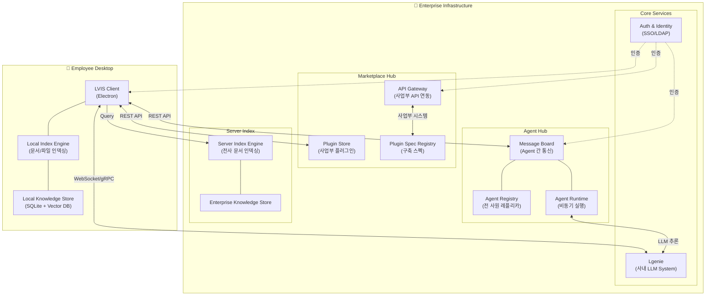

### 2.2 HLD Layer Summary

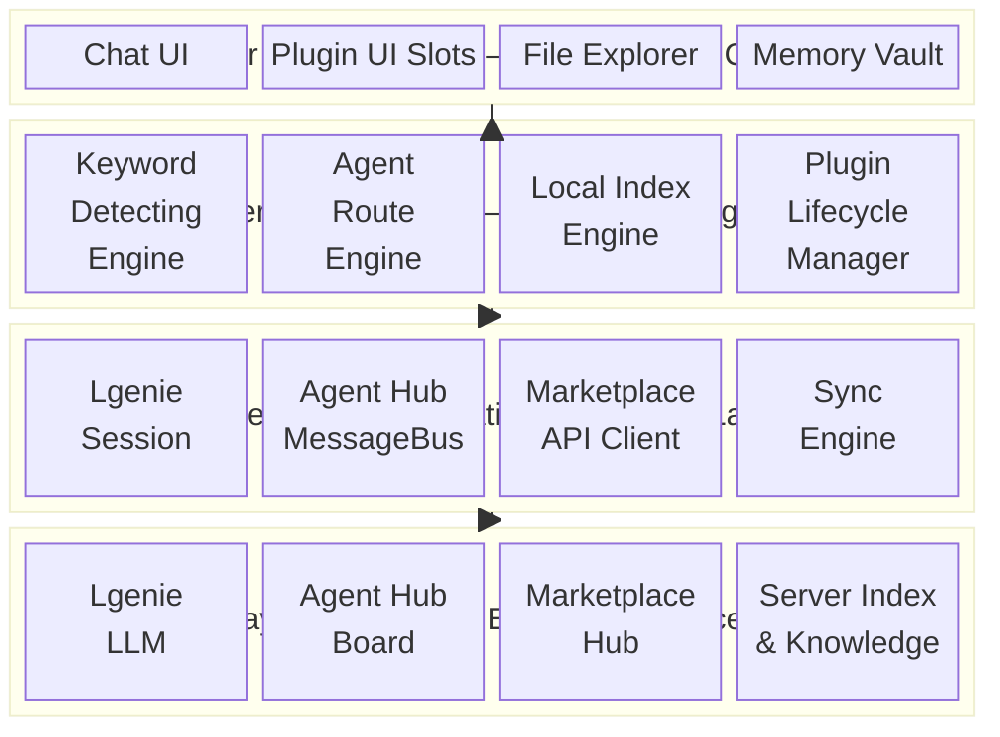

### 2.3 Four Pillars Architecture

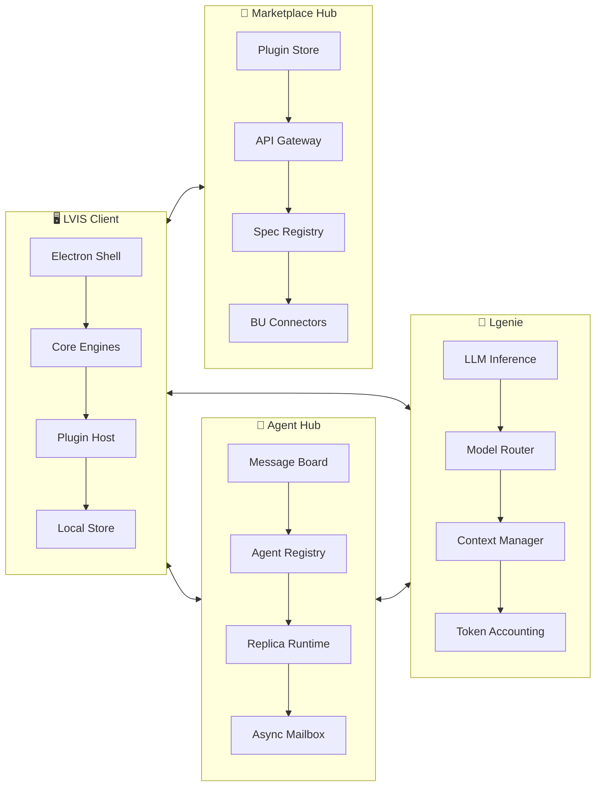

---

## 3. System Layer Map

시스템은 4개의 명확한 레이어로 구성된다. 각 레이어는 하위 레이어에만 의존하며, 상위 레이어를 직접 참조하지 않는다.

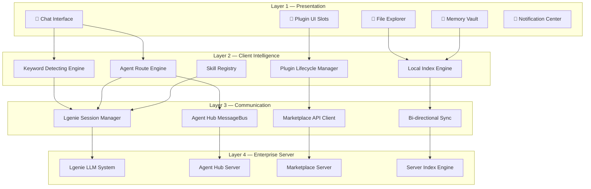

---

## 4. Low-Level Design (LLD)

### 4.1 Client Architecture (Electron)

LVIS 클라이언트는 Electron 기반이며, claw-code 하네스에서 영감받은 에이전트 루프를 내장한다.

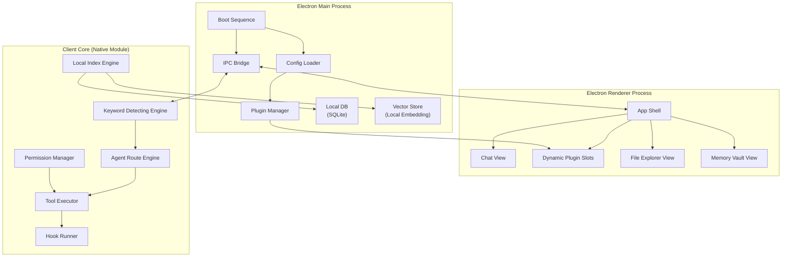

### 4.2 Boot Sequence

클라이언트 부팅 시 스킬과 에이전트가 동적으로 업데이트된다.

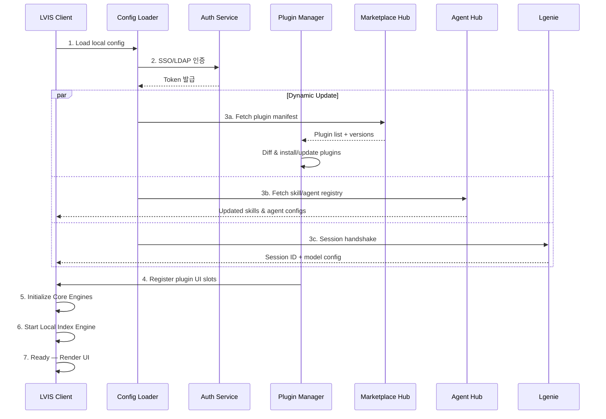

### 4.3 Agent Loop (claw-code Harness 기반)

사용자의 입력이 처리되는 핵심 루프. claw-code의 `ConversationRuntime.run_turn()` 패턴을 차용하되, LVIS의 키워드 감지와 에이전트 라우팅을 앞단에 추가한다.

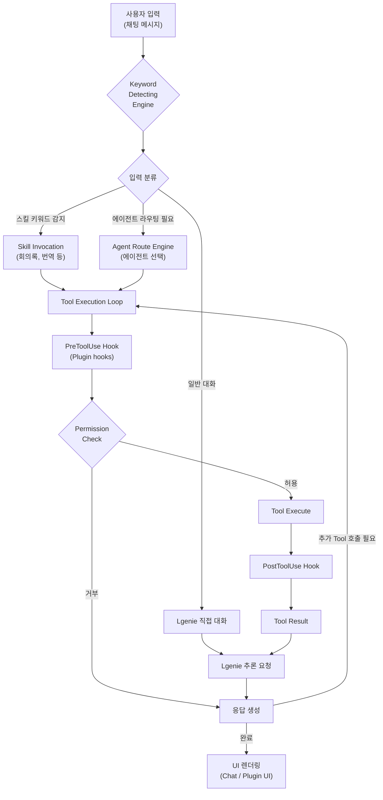

### 4.4 Local Index Engine

로컬 PC의 데이터를 최대한 활용하는 핵심 엔진.

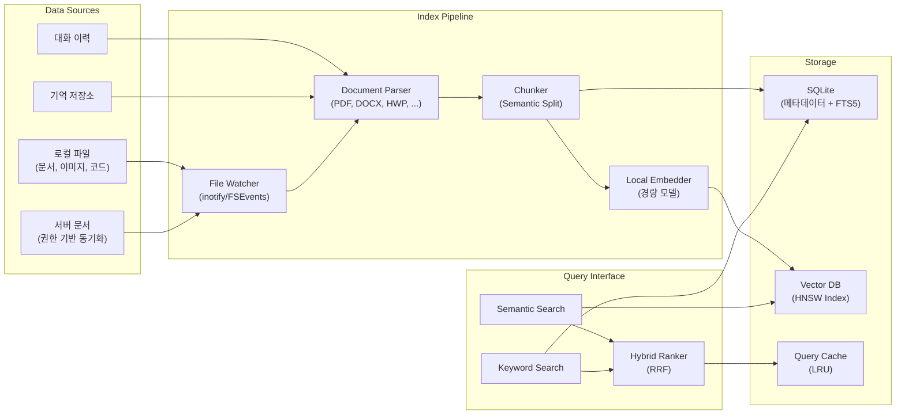

---

## 5. Client Core Engines

### 5.1 Keyword Detecting Engine

사용자 입력에서 의도와 컨텍스트를 감지하는 첫 번째 관문. claw-code의 `SlashCommand::parse()` + `resolve_skill_invocation()` 패턴을 확장한다.

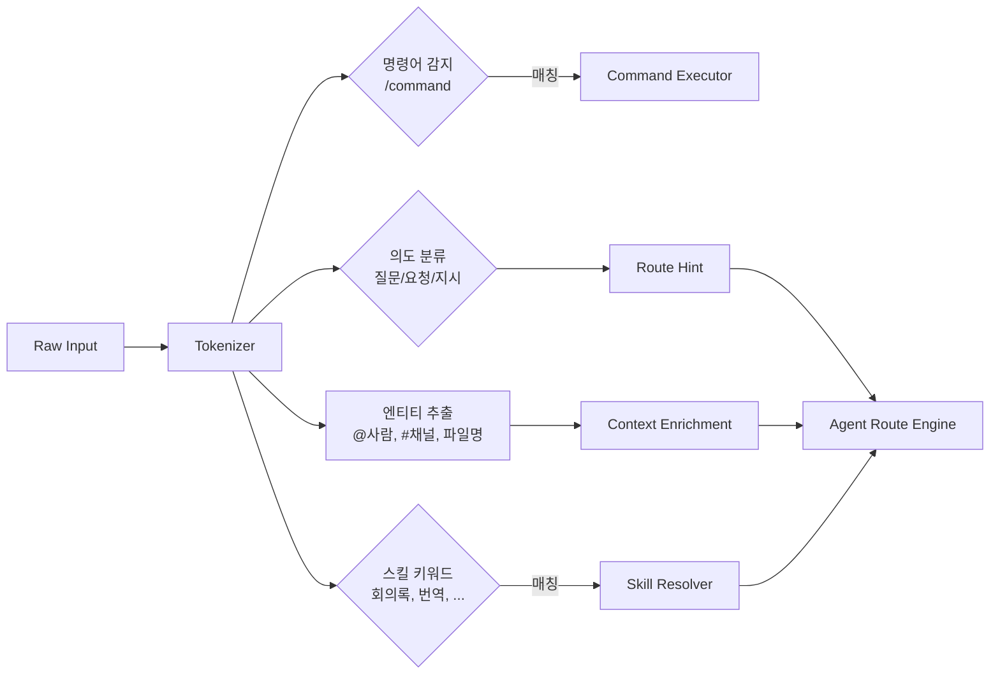

**동작 방식:**

| 우선순위 | 감지 유형 | 예시 | 처리 방식 |
|---------|----------|------|----------|
| 1 | 명시적 명령어 | `/meeting start` | Command Executor 직접 실행 |
| 2 | 스킬 키워드 | "회의록 작성해줘" | Skill Resolver → 해당 플러그인 활성화 |
| 3 | 에이전트 멘션 | "@김철수 이거 확인해줘" | Agent Hub 메시지 라우팅 |
| 4 | 의도 기반 | "이 문서 요약해줘" | Intent → Route Engine → Lgenie |
| 5 | 일반 대화 | "안녕하세요" | Lgenie 직접 세션 |

### 5.2 Agent Route Engine

감지된 의도를 올바른 실행 경로로 전달하는 라우터. claw-code의 `CliToolExecutor` 디스패치 패턴을 채용한다.

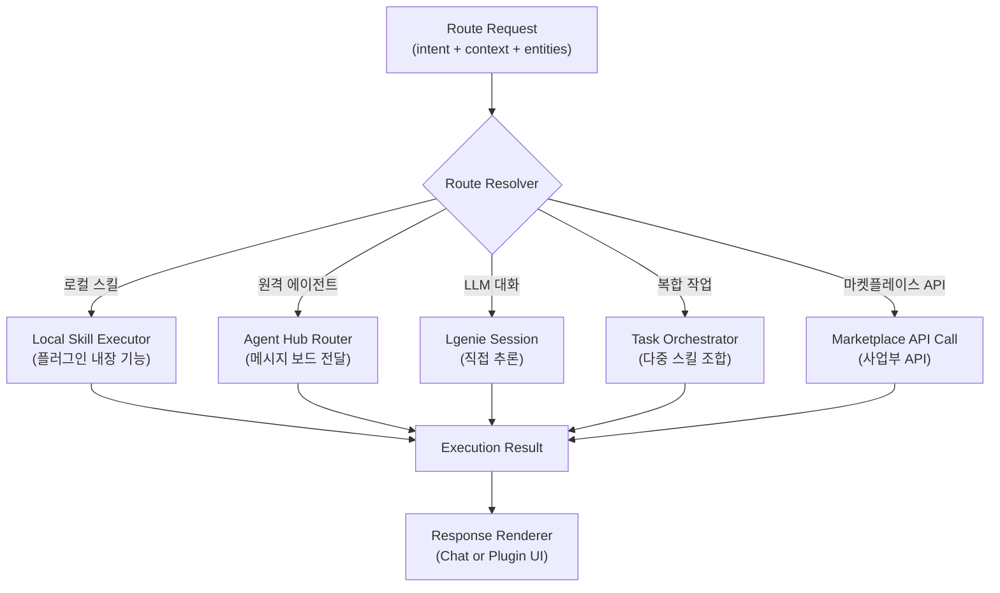

**Route Resolution 우선순위:**

```
1. Permission Check      → 권한이 없으면 즉시 거부
2. Local Skill Match     → 설치된 플러그인에서 스킬 매칭 시도
3. Agent Hub Routing     → @멘션 또는 에이전트 위임이 필요한 경우
4. Marketplace API       → 사업부 API 호출이 필요한 경우
5. Lgenie Fallback       → 위 모두 해당 없으면 LLM 직접 대화
```

---

## 6. Plugin System & UI Extension

### 6.1 Plugin Architecture

플러그인은 LVIS 클라이언트의 핵심 확장 메커니즘이다. Electron 렌더러의 UI를 동적으로 변경할 수 있으며, 새로운 스킬과 도구를 등록한다.

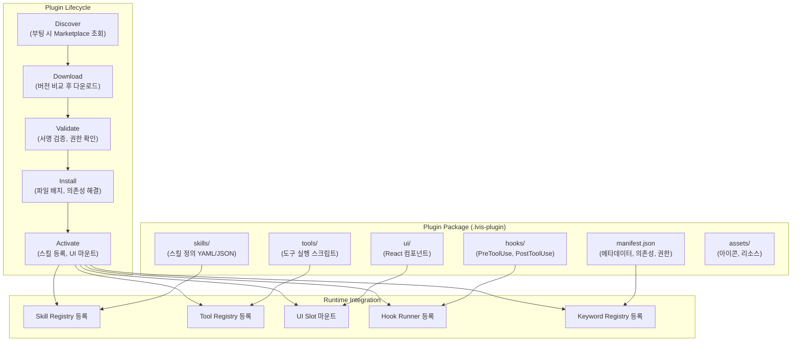

### 6.2 Plugin Manifest Spec

```json
{
  "id": "com.lge.meeting-recorder",
  "name": "회의록 녹음",
  "version": "1.2.0",
  "description": "STT 기반 회의록 자동 작성 플러그인",
  "author": "DX Platform Team",
  "permissions": [
    "microphone",
    "local-storage",
    "lgenie-session",
    "ui-slot:sidebar",
    "ui-slot:toolbar"
  ],
  "keywords": ["회의록", "녹음", "회의", "미팅", "meeting"],
  "skills": [
    {
      "name": "meeting-record",
      "trigger": ["회의록 작성", "회의 녹음", "미팅 기록"],
      "entry": "skills/meeting-record.js"
    }
  ],
  "tools": [
    {
      "name": "stt-transcribe",
      "entry": "tools/stt.js",
      "description": "음성을 텍스트로 변환"
    }
  ],
  "ui": {
    "sidebar": "ui/MeetingSidebar.jsx",
    "toolbar": "ui/MeetingToolbar.jsx",
    "chatWidget": "ui/MeetingChatWidget.jsx"
  },
  "hooks": {
    "PreToolUse": "hooks/pre-meeting.js",
    "PostToolUse": "hooks/post-meeting.js"
  },
  "dependencies": {
    "translation-plugin": ">=1.0.0"
  },
  "lgenie": {
    "requiredModels": ["stt-whisper", "summary-v2"],
    "optionalModels": ["translation-nmt"]
  }
}
```

### 6.3 UI Slot System

Electron 클라이언트는 플러그인이 UI를 주입할 수 있는 사전 정의된 슬롯을 제공한다.

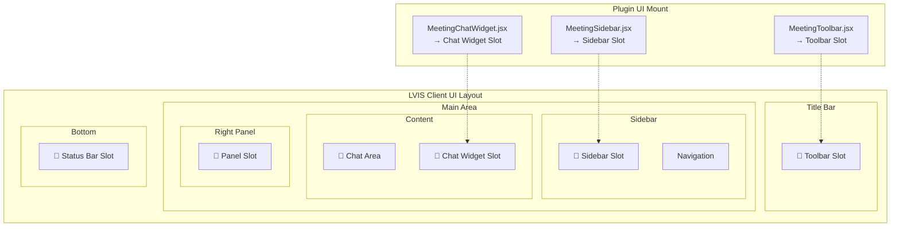

### 6.4 Plugin Example: 회의록 녹음 플러그인

설치 전과 후의 클라이언트 상태 변화를 보여주는 시나리오:

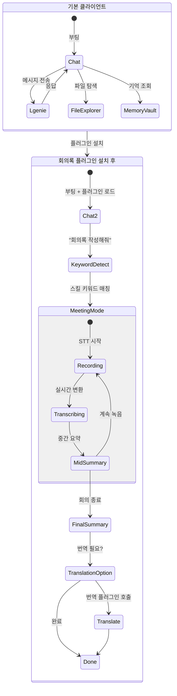

---

## 7. Agent Hub

### 7.1 Agent Hub Architecture

Agent Hub는 전 사원 레플리카 에이전트들의 소통 창구이자 메시지 보드다. 사원 카피 DB의 개념으로, 각 사원의 디지털 트윈이 비동기적으로 협업한다.

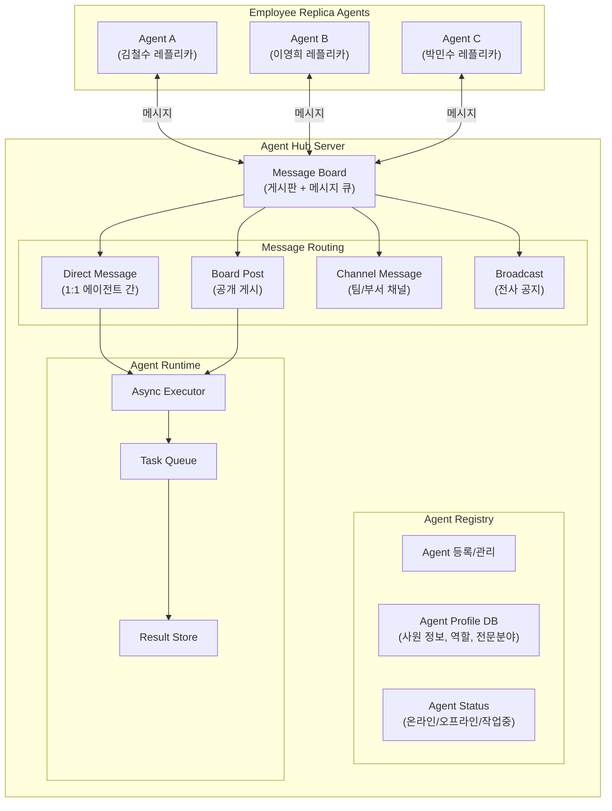

### 7.2 Agent Communication Flow

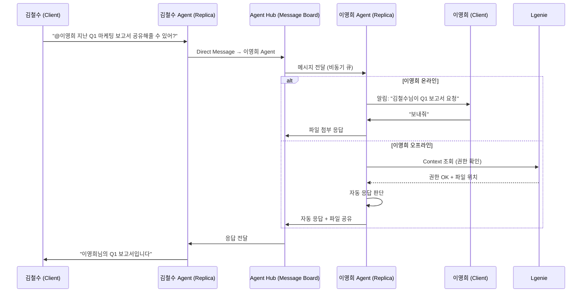

### 7.3 Board Types

| 보드 유형 | 용도 | 접근 권한 | 예시 |
|----------|------|----------|------|
| **Personal Mailbox** | 개인 에이전트 간 1:1 비동기 메시지 | 발신자 + 수신자 | "이 문서 검토해줘" |
| **Team Channel** | 팀/부서 단위 에이전트 협업 | 팀 소속 에이전트 | "이번 주 이슈 정리" |
| **Project Board** | 프로젝트별 작업 추적 및 공유 | 프로젝트 참여자 | "Sprint #12 태스크" |
| **Knowledge Board** | 전사 지식 공유 및 Q&A | 전 사원 에이전트 | "사내 Wi-Fi 설정법" |
| **Broadcast** | 전사 공지, 긴급 알림 | 관리자 발신, 전체 수신 | "시스템 점검 안내" |

---

## 8. Marketplace Hub

### 8.1 Marketplace Architecture

각 사업부가 운영하는 서비스/홈페이지를 API 기반으로 LVIS 클라이언트와 연동하는 플러그인 생태계.

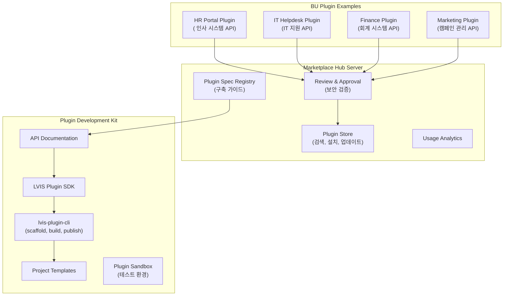

### 8.2 Plugin Development Spec

사업부가 플러그인을 구축할 때 따라야 하는 스펙:

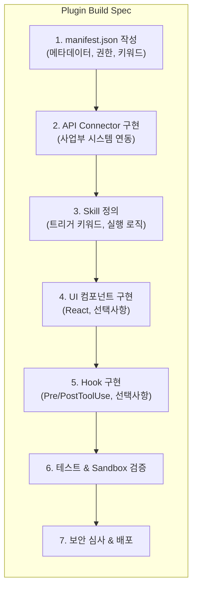

### 8.3 API Gateway Pattern

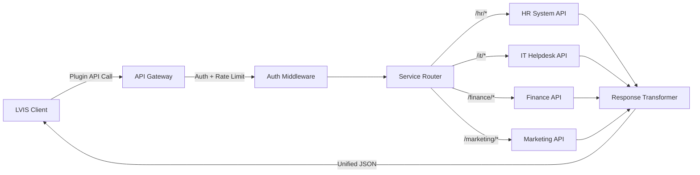

---

## 9. Data Flow

### 9.1 End-to-End Data Flow

사용자의 질의가 시스템 전체를 관통하는 흐름:

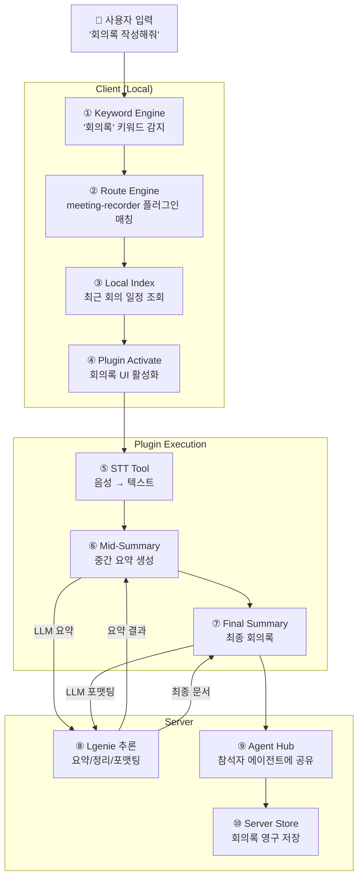

### 9.2 Indexing Data Flow

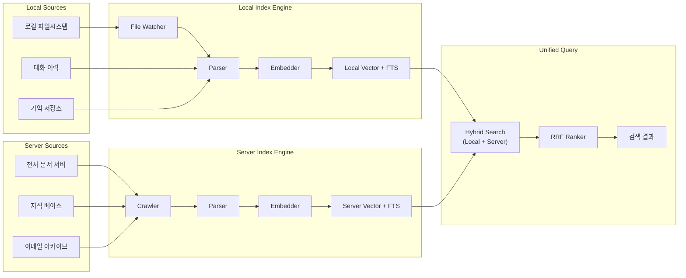

---

## 10. Deployment Topology

### 10.1 Physical Deployment

```mermaid
graph TB
    subgraph "Employee PC (Desktop/Laptop)"
        ELECTRON["LVIS Client (Electron)"]
        LOCAL_ENGINE["Core Engines<br/>(Keyword/Route/Index)"]
        LOCAL_DATA["Local Store<br/>(SQLite + VectorDB)"]
        PLUGINS_LOCAL["Installed Plugins"]

        ELECTRON --- LOCAL_ENGINE
        LOCAL_ENGINE --- LOCAL_DATA
        ELECTRON --- PLUGINS_LOCAL
    end

    subgraph "On-Premise Datacenter"
        subgraph "Lgenie Cluster"
            LLM_LB["Load Balancer"]
            LLM_1["Lgenie Node 1"]
            LLM_2["Lgenie Node 2"]
            LLM_N["Lgenie Node N"]
            LLM_LB --> LLM_1
            LLM_LB --> LLM_2
            LLM_LB --> LLM_N
        end

        subgraph "Agent Hub Cluster"
            AH_LB["Load Balancer"]
            AH_APP["Agent Hub App"]
            AH_DB["Agent DB<br/>(PostgreSQL)"]
            AH_MQ["Message Queue<br/>(Redis/NATS)"]
            AH_LB --> AH_APP
            AH_APP --> AH_DB
            AH_APP --> AH_MQ
        end

        subgraph "Marketplace Cluster"
            MK_LB["Load Balancer"]
            MK_APP["Marketplace App"]
            MK_STORE["Plugin Store<br/>(Object Storage)"]
            MK_DB["Marketplace DB"]
            MK_LB --> MK_APP
            MK_APP --> MK_STORE
            MK_APP --> MK_DB
        end

        subgraph "Server Index Cluster"
            IDX_APP["Index Service"]
            IDX_VEC["Vector Store<br/>(Milvus/Qdrant)"]
            IDX_ES["Search Engine<br/>(Elasticsearch)"]
            IDX_APP --> IDX_VEC
            IDX_APP --> IDX_ES
        end
    end

    ELECTRON <-->|"WSS/gRPC"| LLM_LB
    ELECTRON <-->|"HTTPS"| AH_LB
    ELECTRON <-->|"HTTPS"| MK_LB
    LOCAL_ENGINE <-->|"HTTPS"| IDX_APP
```

### 10.2 Technology Stack Summary

| Layer | Component | Technology |
|-------|-----------|------------|
| **Client** | App Shell | Electron + React |
| **Client** | Core Engines | Rust (Native Module via NAPI-RS) |
| **Client** | Local Store | SQLite + FTS5 |
| **Client** | Local Vector | HNSW (hnswlib) / LanceDB |
| **Client** | Plugin Runtime | Sandboxed V8 / WebAssembly |
| **Server** | Lgenie | 사내 LLM 시스템 (독자 인프라) |
| **Server** | Agent Hub | Go/Rust + PostgreSQL + Redis/NATS |
| **Server** | Marketplace | Node.js/Go + Object Storage |
| **Server** | Server Index | Elasticsearch + Milvus/Qdrant |
| **Comm** | Client↔Server | WebSocket (streaming), gRPC (structured), REST (CRUD) |
| **Auth** | Identity | SSO/LDAP 연동 |

---

## Appendix A: Harness Reference (claw-code)

LVIS 클라이언트 코어의 에이전트 루프는 [claw-code](https://github.com/ultraworkers/claw-code) 하네스에서 다음 패턴을 차용한다:

| claw-code 패턴 | LVIS 적용 |
|---------------|----------|
| `ConversationRuntime.run_turn()` | Agent Loop — 사용자 입력 → 도구 실행 → LLM 추론 반복 루프 |
| `SlashCommand::parse()` | Keyword Detecting Engine의 명령어 감지 |
| `resolve_skill_invocation()` | 스킬 키워드 매칭 및 플러그인 활성화 |
| `CliToolExecutor` trait | Agent Route Engine의 도구 디스패치 인터페이스 |
| `PluginHooks` (Pre/PostToolUse) | Plugin Hook 시스템 — 플러그인이 도구 실행을 가로채거나 보강 |
| `GlobalToolRegistry` | 동적 Tool Registry — 플러그인이 도구를 런타임에 등록 |
| `PermissionPolicy` | 권한 관리 — 도구별, 플러그인별 접근 제어 |
| `Session` persistence | 세션 관리 — 대화 이력 저장 및 재개 |
| `HookRunner` | Hook Runner — 플러그인 훅의 실행 및 결과 머지 |
| Multi-provider `ApiClient` | Lgenie Session — 사내 LLM 엔드포인트 추상화 |

## Appendix B: Key Design Decisions

| 결정 | 이유 | 트레이드오프 |
|------|------|------------|
| Electron 기반 클라이언트 | 크로스 플랫폼 + 웹 기술 기반 UI 확장 | 메모리 사용량 ↑ |
| Rust Native Module (NAPI-RS) | 키워드 감지/인덱싱의 성능 보장 | 개발 복잡도 ↑ |
| 로컬 Vector DB | 네트워크 없이도 의미 검색 가능 | 로컬 스토리지 사용 ↑ |
| Plugin Sandbox (V8/WASM) | 플러그인 격리로 보안 확보 | 플러그인 기능 일부 제한 |
| Message Board 기반 Agent Hub | 비동기 협업, 사원 부재 시에도 동작 | 실시간성 다소 부족 |
| API Gateway 기반 Marketplace | 사업부별 독립 배포 가능 | Gateway 단일 장애점 |

---

> **Next Steps**: philosophy.md 공유 후 철학 섹션 보강, 각 엔진의 상세 인터페이스 정의(IDL/Proto), Plugin SDK 상세 가이드 작성
