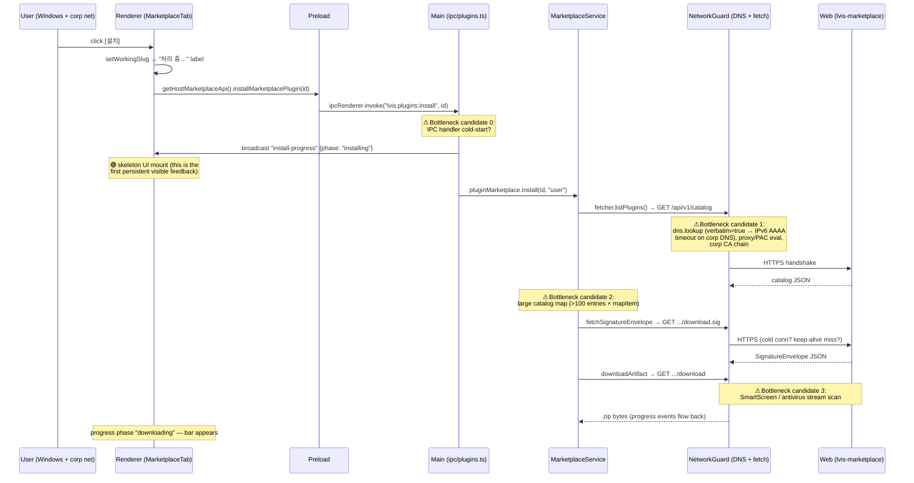

# Issue #683 — Windows 사내망 마켓플레이스 [설치] 7초 지연 audit

> **Scope**: Audit-only. No code change. **Does NOT close #683** — closing
> requires reproduction + measurement + fix in a future sprint.
>
> **Status**: Diagnostic plan + hypothesis ranking + probe blueprint.
>
> **Environment-bound**: 재현 불가 (macOS / 일반 네트워크에서는 즉시).
> Windows + corporate restricted network 조합 의존.

---

## 1. 문제 요약

마켓플레이스 패널에서 임의 플러그인의 **[설치]** 버튼을 클릭한 뒤
사용자에게 시각적 피드백(progress card / "처리 중…" 라벨 / install skeleton)이
보이기까지 **약 7초 무반응 구간**이 발생.

- 환경: Windows + corporate restricted network (proxy / corp CA / SmartScreen)
- macOS / 가정용 네트워크에서는 < 1초
- 사용자 인지: "버튼이 안 눌렸나?" → 재클릭 → 중복 install request 가능

이슈 본문은 *"Electron 의 '설치하시겠습니까?' confirm 다이얼로그"* 라고
표현했지만, 코드 추적 결과 **마켓플레이스 패널의 [설치] 버튼 경로에는
confirm 다이얼로그가 없다**. 사용자가 보는 것은 다음 중 하나일 가능성이 높다:

1. **install progress card / skeleton UI** (`PluginConfigTab`,
   `PluginGridButton`) — 7초 동안 *아무것도* 안 보이는 게 정확함
2. **`lvis://` deep-link 경로의 confirm 다이얼로그**
   (`src/main.ts:717`) — 이 경로는 외부 브라우저에서 `lvis://`
   URL을 통해 들어오는 경우에만 노출

이 audit은 [설치] 버튼 → install progress 표시 사이의 지연을 다룬다.
deep-link 경로도 같은 download/verify chain을 거치므로 동일 가설이 적용된다.

---

## 2. 코드 진입 chain (file:line trace)

[설치] 버튼 클릭부터 첫 사용자-가시 변화까지의 정확한 단계.

| # | 단계 | File:Line | 동기/네트워크 |
|---|---|---|---|
| 1 | `<Button onClick>` → `installPackage(item)` | `src/ui/renderer/tabs/MarketplaceTab.tsx:266` | sync |
| 2 | `setWorkingSlug(item.id)` (renderer state) | `src/ui/renderer/tabs/MarketplaceTab.tsx:68` | sync, **재렌더 1회 — "처리 중…" 라벨 표시** (`tabs/MarketplaceTab.tsx:269`) |
| 3 | `getHostMarketplaceApi().installMarketplacePlugin(id)` | `src/ui/renderer/tabs/MarketplaceTab.tsx:80` | await |
| 4 | `ipcRenderer.invoke("lvis:plugins:install", pluginId)` | `src/preload.ts:1191` | IPC round-trip |
| 5 | main IPC handler entry | `src/ipc/domains/plugins.ts:305` | — |
| 6 | `broadcastPluginLifecycleEvent("...install-progress", { phase: "installing" })` | `src/ipc/domains/plugins.ts:308` | renderer가 skeleton UI 표시 |
| 7 | `pluginMarketplace.install(pluginId, "user", onProgress)` | `src/ipc/domains/plugins.ts:309` | **이 시점부터 사용자에게 phase 신호가 들어옴** |
| 8 | `installWithDependencies` → `await this.fetcher.listPlugins()` | `src/plugins/marketplace.ts:359` | **네트워크 #1 — GET /api/v1/catalog** |
| 9 | `installArtifact` → `downloadVerifiedArtifact` | `src/plugins/marketplace.ts:441`, `src/plugins/plugin-artifact-store.ts:147` | — |
| 10 | `installFromMarketplace` → `fetchSignatureEnvelope` | `src/plugins/marketplace-installer.ts:251` | **네트워크 #2 — GET .../download.sig** |
| 11 | `installFromMarketplace` → `downloadArtifact` | `src/plugins/marketplace-installer.ts:366` | **네트워크 #3 — GET .../download (zip body)** |
| 12 | `verifyEnvelope` (ed25519, sync crypto) | `src/plugins/envelope-verifier.ts` | sync — 일반적으로 < 50ms |
| 13 | `extractZip` (atomic stage swap) | `src/plugins/plugin-artifact-store.ts:182` | disk I/O |

**핵심 관찰**:

- step 2 에서 renderer state 가 갱신되어 [설치] 버튼이 *"처리 중…"* 으로
  바뀌어야 한다 (`MarketplaceTab.tsx:269`). 따라서 단순 버튼 라벨 변화는
  즉시 일어남.
- 하지만 사용자가 "무반응" 으로 느끼는 7초는 **step 6
  `phase: "installing"` 이벤트가 renderer 에 도착해서 skeleton UI 가
  마운트되기 전** + **step 8~11 의 네트워크 round-trip** 사이의
  *visual feedback gap* 으로 추정.
- 더 정확히 보면, step 6 의 broadcast 는 step 5 IPC handler 진입 직후
  발생하므로 **IPC invoke round-trip 시간이 0~수십ms** 라면 skeleton UI 는
  거의 즉시 떠야 정상. 그런데 7초가 걸린다면 main process 가 **step 6
  도달 전에 무언가에 block** 됐을 가능성도 있다 (예: main process 가
  마침 ms-graph plugin 의 `silentTokenAcquire` 같은 별도 작업 중,
  또는 `pluginMarketplace.install` import lazy load).

---

## 3. 진단 chain 시각화



---

## 4. 가설 ranking

각 가설에 *Windows-corp-only* 인지 여부와 7초 budget 기여도 추정치를 표기.

### H1. NetworkGuard DNS preflight (IPv6 AAAA timeout) — **HIGH**

**Likelihood: HIGH** · 추정 기여: 3-5s

`src/core/network-guard.ts:124` 의 `ensurePublicHttpUrl` 는 매 redirect hop
마다 `dns.lookup(host, { all: true, verbatim: true })` 를 호출. `verbatim:
true` 는 IPv4/IPv6 결과를 *DNS 가 반환한 순서 그대로* 전달 — Windows
corporate DNS 가 AAAA 응답을 늦게 주거나 dropping 하면 IPv6 timeout 후
A 레코드로 fall-through 하면서 **~3-5초** 가 소비된다.

**왜 macOS 에선 빠른가**: macOS 의 `getaddrinfo` 는 `mdns` + Bonjour
캐시로 빠르게 처리되고, 일반 가정 DNS 는 AAAA 도 즉시 NODATA 응답.

**Evidence**: `src/core/network-guard.ts:176`. `fetchPublicHttpResponse`
는 모든 fetch 호출(`listPlugins`, `fetchSignatureEnvelope`,
`downloadArtifact`) 에 사용되므로 DNS 비용이 **누적 3번** (catalog +
sig + zip) 일 가능성도 있다 — 단, OS 캐시 hit 면 첫 호출만 비용 부담.

### H2. Corporate proxy / PAC / MITM TLS handshake — **HIGH**

**Likelihood: HIGH** · 추정 기여: 2-4s

Windows enterprise 환경의 일반적 stack:
- WinHTTP / WPAD auto-detect → PAC script eval (per-request)
- Corporate MITM proxy (Zscaler, BlueCoat, Forcepoint) — TLS interception
- corp CA chain validation against Windows certificate store
- NTLM / Kerberos auto-auth handshake

Electron 의 `fetch` 는 Chromium net stack 을 사용 → 위 모든 단계가
첫 connection 에서 수행됨. **keep-alive 가 깨지면 매 request 마다**
이 비용 반복. macOS 의 home network 에는 위 단계 자체가 없다.

**Evidence**: `src/plugins/real-cloud-marketplace-fetcher.ts:272` —
`fetchPublicHttpResponse(url, { timeoutMs: 15000 })`. timeout 15s 안에
끝나기 때문에 error 가 안 나지만 7초 latency 는 budget 안.

### H3. Signature envelope fetch (별도 round-trip) — **MEDIUM**

**Likelihood: MEDIUM** · 추정 기여: 0.5-2s

`fetchSignatureEnvelope` (`src/plugins/marketplace-installer.ts:251`)
은 zip download 직전에 `.sig` 파일을 별도 fetch — H2 의 proxy/TLS 비용을
한 번 더 부담. catalog fetch 와 동일 connection 이 재사용되면 0.5초 이하,
keep-alive 실패면 H2 비용 재반복.

**Evidence**: `src/plugins/real-cloud-marketplace-fetcher.ts:224-230`
별도 `request()` 호출.

### H4. listPlugins 전체 catalog 재fetch — **MEDIUM**

**Likelihood: MEDIUM** · 추정 기여: 0.3-1s

`installWithDependencies` (`src/plugins/marketplace.ts:359`) 는 매 install
마다 `await this.fetcher.listPlugins()` 로 **전체 카탈로그를 다시 가져온다**.
마켓플레이스 패널 열 때 이미 한 번 받았던 데이터를 install 시점에 재fetch
하면서 corp network 의 latency 를 한 번 더 부담.

**왜 macOS 에선 빠른가**: latency 자체가 낮아 무시할 수 있는 비용이
Windows corp 에선 cumulative 비용이 됨.

**Evidence**: `src/plugins/marketplace.ts:359` — `const plugins = await
this.fetcher.listPlugins();` 매 install 시 호출.

### H5. SmartScreen / antivirus zip scan — **MEDIUM**

**Likelihood: MEDIUM** · 추정 기여: 1-3s (zip 크기 의존)

Windows Defender / SmartScreen / 사내 EPP (CrowdStrike, SEP) 가
`%APPDATA%\Local\lvis-app\` 또는 `~/.lvis/plugins/` 에 쓰이는 zip 을
실시간 검사 → `writeFile` / `rename` 호출이 block. `extractZip`
(`src/plugins/plugin-artifact-store.ts:182`) 의 파일별 `writeFile`
loop 가 특히 영향.

다만 이 비용은 *zip download 완료 이후* 에 나타나야 함 — 7초가 **dialog
표출 전** 이라면 H5 는 주요 원인이 아니라 *secondary delay* 로 작용.

**Evidence**: `src/plugins/plugin-artifact-store.ts:208-210` 의 entry-by-
entry `writeFile` loop.

### H6. main process IPC handler cold-start / lazy import — **LOW-MEDIUM**

**Likelihood: LOW-MEDIUM** · 추정 기여: 0.1-0.5s

`src/ipc/domains/plugins.ts:305` 의 handler 자체는 lazy import 가 없지만,
`pluginMarketplace.install` 이 내부적으로 `marketplace-installer.ts` 의
`installFromMarketplace` 를 동적 import 하거나, `publisher-keys.ts` 의
key 로딩이 첫 호출에서 disk I/O 를 일으킬 수 있음.

**Evidence**: `src/plugins/marketplace.ts:226` —
`publicKeys: getBundledPublicKeys()` 호출, 빌드된 키를 메모리에 캐시
하므로 첫 호출만 비용. Windows 의 antivirus 가 read 도 검사하면 비용 증가.

### H7. Telemetry / audit log sync flush — **LOW**

**Likelihood: LOW** · 추정 기여: < 0.1s

코드 상 install 진입 전 sync audit write 가 없는 것으로 확인 — IPC
handler 의 첫 명령은 `broadcastPluginLifecycleEvent` 이고, audit logger
는 `auditUnauthorized` 경로 (validateSender 실패) 에서만 동기 호출
(`src/ipc/domains/plugins.ts:306`). 정상 경로에서 audit 영향 없음.

### H8. Electron `dialog.showMessageBox` cold-start — **N/A**

**Likelihood: N/A** · [설치] 버튼 경로에는 dialog 호출이 없음.

이슈 본문이 "confirm 다이얼로그" 라고 표현했지만 실제 코드에는 없음.
사용자가 본 것은 install skeleton UI 이거나, `lvis://` deep-link 경로
(`src/main.ts:717`) 와 혼동했을 가능성. **이 가설은 audit 결과 제거**.

### 종합 ranking

1. **H1** (DNS preflight) + **H2** (proxy/TLS) — *baseline 3-5초 추가
   비용*, Windows corp 에서만 발생, 가장 가능성 높은 원인
2. **H3** (sig fetch) + **H4** (catalog refetch) — *cumulative round-
   trip 비용*, H1+H2 와 함께 누적
3. **H5** (AV scan) — *post-download 비용*, 7초 budget 의 후반부
4. **H6** (cold-start) — *first-call 비용*, 1번째 install 만 영향

> **가설 융합 시나리오**: H1 (3s) + H2 (2s) + H3+H4 (1s 추가) + H6 (0.3s)
> = **~6.3s** ≈ 보고된 ~7초.

---

## 5. Diagnostic probes (사내망 사용자 실행)

### 5.1 console.time 마커 (코드 추가 — 별도 PR)

다음 위치에 *임시* `console.time` / `console.timeEnd` 마커를 추가하고
`view → Toggle Developer Tools` 의 Console 에 출력. 사용자에게는 별도
빌드 또는 `--enable-logging` 옵션과 함께 배포.

| Phase | 시작점 | 종료점 |
|---|---|---|
| `install:click → ipc-recv` | `MarketplaceTab.tsx:80` (`getHostMarketplaceApi()` 호출 직전) | `plugins.ts:305` (handler 진입) |
| `install:ipc → progress-event` | `plugins.ts:305` | `plugins.ts:308` (`broadcastPluginLifecycleEvent` 후) |
| `install:catalog-fetch` | `marketplace.ts:359` (직전) | `marketplace.ts:359` (직후) |
| `install:sig-fetch` | `marketplace-installer.ts:251` (직전) | `marketplace-installer.ts:251` (직후) |
| `install:zip-download` | `marketplace-installer.ts:366` (직전) | `marketplace-installer.ts:366` (직후) |
| `install:verify` | `marketplace-installer.ts:295` (직전) | `marketplace-installer.ts:295` (직후) |
| `install:extract` | `plugin-artifact-store.ts:182` 진입 | `:236` return 직전 |

→ 어느 phase 가 ~7초의 대부분 차지하는지 즉시 식별 가능.

### 5.2 Electron verbose log

```bash
# Windows cmd
"lvis-app.exe" --enable-logging --log-level=verbose --vmodule="*network*=2"
```

Chromium net 스택의 redirect / TLS handshake / proxy resolve 단계가 stderr
에 기록. 7초 구간의 ETW-level 단계가 보임.

### 5.3 DNS isolation 테스트

corp DNS 사용 vs 공용 DNS (`1.1.1.1`, `8.8.8.8`) 비교:

```cmd
:: 1) corp 기본 상태
ping marketplace.lvisai.xyz
nslookup marketplace.lvisai.xyz
:: 2) IPv6 비활성화 (관리자 cmd) — H1 가설 격리
netsh interface ipv6 set state disabled
:: 3) [설치] 클릭 → 7초 → 1-2초로 떨어지면 H1 확정
```

### 5.4 Proxy bypass 테스트

```cmd
:: 환경 변수 — Chromium 의 system proxy 무시
set ELECTRON_NO_PROXY=1
set no_proxy=marketplace.lvisai.xyz,*.lvisai.xyz
:: 또는 --proxy-bypass-list
"lvis-app.exe" --proxy-bypass-list="*.lvisai.xyz"
```

→ 1-2초로 떨어지면 H2 확정.

### 5.5 Antivirus exclusion

`%APPDATA%\Local\lvis-app\` 와 `%USERPROFILE%\.lvis\plugins\` 를 Windows
Defender / 사내 EPP exclusion list 에 추가. AV scan 비용이 빠지면 H5
확정 — 단, post-download phase 만 영향이므로 dialog 표출 전 7초에 직접
기여는 적을 것으로 예상.

### 5.6 keep-alive / connection reuse 확인

브라우저 DevTools → Network 패널에서 `marketplace.lvisai.xyz` 로 가는
3개 요청 (catalog, sig, download) 의 *Connection ID* 가 동일한지 확인.
재사용되면 H3 비용 낮음. 분리되면 H2 + H3 비용 누적.

---

## 6. Next-step bug-fix sprint 계획

audit-only PR 머지 후, 별도 sprint 로 fix 진행. **3-단계**:

### Step 1: Probe deployment (1 PR, dev-only feature flag)

- `LVIS_PERF_TRACE_INSTALL=1` env 또는 dev settings toggle 도입
- §5.1 의 console.time 마커들을 toggle 뒤에 추가 — release build 에는
  영향 없도록 `if (process.env.LVIS_PERF_TRACE_INSTALL === "1")` guard
- 사내망 운영자가 별도 빌드 또는 settings 켠 채로 클릭 → console 결과
  복사해서 GitHub issue #683 에 첨부

### Step 2: Measurement (data gather, ~1주)

- Windows corp 사용자 ≥ 3명에서 §5.1~5.6 결과 수집
- 각 phase 의 실제 ms 측정값 표로 정리
- 가설 H1~H6 의 실제 기여도 confirm/reject

### Step 3: Fix (가설별 분기 — 측정 결과에 따라)

| 측정 결과 | Fix 방향 |
|---|---|
| H1 (DNS) 가 dominant | `dns.lookup` → `dns.resolve4()` 만 사용하거나, `verbatim: false` (OS default IPv4-first) 로 변경. **트레이드오프**: SSRF guard 의 정확성 vs latency. 별도 review 필요 — `network-guard.ts` 의 보안 가정을 깨면 안 됨. |
| H2 (proxy) 가 dominant | (a) 첫 install 직전 *background warmup* 으로 connection pool 채우기 (`refreshMarketplace` 시점에 HEAD 한 번 보내기) → 두 번째부터는 keep-alive. (b) catalog + sig + zip 을 **순차→병렬** 로 변경 (catalog 는 이미 있고 sig 는 작으므로 zip download 와 동시에). |
| H3 (sig 별도 fetch) 가 dominant | sig 와 zip 을 *concurrent* fetch — `Promise.all([fetchSignatureEnvelope, downloadArtifact])`. zip body 검증은 두 결과가 모두 도착해야 가능하지만 wall-clock 은 max(sig, zip) 으로 압축. |
| H4 (catalog 재fetch) 가 dominant | `installWithDependencies` 가 이미 caller (renderer) 로부터 받은 `pluginId` 와 마지막 catalog cache 를 신뢰하도록 변경. 보안 무결성을 위해 *cached catalog 만 신뢰하고 install 직전 별도 재fetch* 패턴 유지가 필요하면, fetch 와 별도 단계 (verify) 를 분리. |
| H5 (AV) 가 dominant | UX-level: **install progress card 를 click 즉시 (synchronous) 표시** → 사용자에게 "준비 중…" 즉시 보임. 7초가 줄어들지는 않지만 *체감 무반응* 이 사라짐. **이건 root-cause 가 아니라 UX workaround** — 그러나 environment-bound 한 H1~H4 가 fix 불가능한 경우 fallback. |
| H6 (cold-start) | `getBundledPublicKeys()` 등 first-call 비용을 boot 시점에 prewarm. |

### Sprint 우선순위

1. **UX-level workaround** (즉시 click feedback) — 모든 가설 fix 전에
   사용자 인지 개선. 작업량 최소. *별도 PR.*
2. **H1+H2** 측정 후 결정 — 가장 큰 비용. 단 보안 영향 review 필수.
3. **H3 병렬화** — 작업량 적고 보안 영향 작음. low-hanging fruit.
4. **H4 (catalog re-use)** — refactor 비용 있으나 모든 install 에 영향.

---

## 7. 의도적으로 audit 에서 *제외* 한 항목

- **실제 코드 변경** — scope 한계: 오직 진단 문서.
- **Issue close** — 재현 + 측정 + fix 후에야 close 가능.
- **새 UI / feature** — fix sprint 의 *Step 3* 에서 결정.
- **마켓플레이스 서버측 변경** — client-side audit 이므로 서버 latency
  는 H2 의 일부로만 다룸.

---

## 8. 참고 파일

| 역할 | 파일 | 핵심 라인 |
|---|---|---|
| Renderer click handler | `src/ui/renderer/tabs/MarketplaceTab.tsx` | 66-89 |
| Preload IPC bridge | `src/preload.ts` | 1190-1192 |
| Main IPC handler | `src/ipc/domains/plugins.ts` | 305-376 |
| Install orchestrator | `src/plugins/marketplace.ts` | 330-472 |
| Artifact verify | `src/plugins/plugin-artifact-store.ts` | 147-171 |
| Network guard (DNS) | `src/core/network-guard.ts` | 116-178 |
| Cloud fetcher | `src/plugins/real-cloud-marketplace-fetcher.ts` | 118-230 |
| Marketplace installer (sig + zip) | `src/plugins/marketplace-installer.ts` | 174-370 |
| `lvis://` deep-link dialog | `src/main.ts` | 716-725 |

---

## 9. 결론

- **재현 환경 의존** → 코드 변경 없이 audit 으로만 끝낼 수 있는 단계.
- **가장 가능성 높은 원인 셋**: DNS preflight (verbatim=true / IPv6
  AAAA timeout) + corporate proxy/MITM TLS + signature envelope 별도
  fetch round-trip.
- **다음 단계**: dev-only console.time probe 배포 → 사내망 사용자 측정
  데이터 수집 → 측정 기반 fix sprint.
- **즉시 적용 가능한 UX 개선**: [설치] 클릭 시점에 progress card 를
  *synchronous* mount (renderer state 만으로) → 7초가 줄어들지 않더라도
  사용자 인지 무반응이 사라짐. fix-sprint 와 별개 트랙 가능.

이 audit 은 **fix 의 시작점** 이지 *fix 그 자체가 아니다*. issue #683
은 close 하지 않으며, 후속 sprint 에서 측정 + fix 후에 close.
